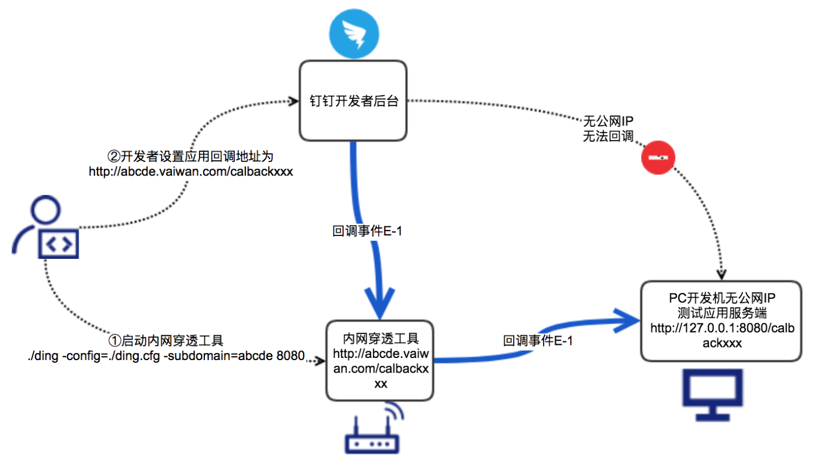

# 内网穿透

## 内网穿透介绍




## 下载工具

鉴于很多开发者在临时体验开发时往往没有公网域名或者公网IP，本工具提供了一个公网代理服务，目的是方便开发测试。


> 注意 

> 本工具不保证稳定性，仅适用于开发测试阶段，禁止当作公网域名使用。如线上应用使用本工具造成稳定性问题，后果由自己承担。如使用本工具传播违法不良信息，钉钉将追究法律责任。

## 内网穿透示意图

## 启动内网穿透

你可以使用以下两种方式启动内网穿透。

### 使用DingTalk Design CLI启动内网穿透

1. 执行以下命令，下载DingTalk Design CLI工具。

   ```
   npm install dingtalk-design-cli@latest -g

   ```

2. 执行以下命令，检测是否成功安装。

   ```
   ding -v

   ```

3. 执行以下命令，启动钉钉内网穿透。

   ```
   ding ngrok --subdomain dingabcde --port 8080

   ```

   执行完该命令后，你访问`http://dingabcde.vaiwan.cn/xxxxx`都会映射到`http://127.0.0.1:8080/xxxxx`。

   关于DingTalk Design CLI更详细介绍请参考[DingTalk Design CLI简介](https://open.dingtalk.com/document/resourcedownload/introduction)。

### 从GitHub下载内网穿透工具

1. 执行以下git命令，下载内网穿透工具。

   ```
   git clone https://github.com/open-dingtalk/dingtalk-pierced-client.git 
   ```

2. 执行以下命令，启动工具。

   - Windows执行以下命令：

     ​

     >  说明 

     Windows需使用cmd工具打开命令行。

     ```
     cd windows_64
     ding -config=ding.cfg -subdomain=abc 8080

     ```

     > MAC执行以下命令：

     ```
     cd mac_64
     chmod 777 ./ding
     ./ding -config=./ding.cfg -subdomain=abc 8080

     ```

   启动后界面如下图所示：

   ​

   启动完客户端后，你访问`http://abc.vaiwan.``cn``/xxxxx`都会映射到`http://127.0.0.1:8080/xxxxx`。

**参数说明：**

| 参数         | 说明                                       |
| ---------- | ---------------------------------------- |
| -config    | 内网穿透的配置文件，按照命令示例固定为钉钉提供的./ding.cfg，无需修改  |
| -subdomain | 您需要使用的域名前缀，该前缀将会匹配到“vaiwan.cn”前面，例如你的subdomain是abcde，启动工具后会将abc.vaiwan.cn映射到本地。 |
| 端口         | 您需要代理的本地服务http-server端口，例如你本地端口为8080等    |


注意

- 若出现http://abc.vaiwan.cn:8082则表示subdomain参数被占用。
- 需要访问的域名是http://abc.vaiwan.cn/xxxxx 而不是http://abc.vaiwan.cn:8080/xxxxx
- 启动命令的subdomain参数有可能被别人占用，尽量不要用常用字符，可以用自己公司名的拼音，例如：alibaba、dingding等。
- 可以在本地起个http-server服务，放置一个index.html文件，然后访问http://abc.vaiwan.cn/index.html测试一下。

## 启动脚本

### mac启动脚本

创建一个文件后缀 .commond

~~~~
#!/bin/sh
 
cd `dirname $0`
echo `pwd`
echo "start dingding"
./ding -config=./ding.cfg -subdomain=liu 4001
~~~~


### Windows启动脚本

创建个一个文件后缀是.bat

~~~~
@echo OFF
color 0a
Title 钉钉内网穿透工具
Mode con cols=109 lines=30
:START
ECHO.
Echo                  ==========================================================================
ECHO.
Echo                                           钉钉内网穿透工具(个人版)
ECHO.
Echo                                               作者: 刘   伟
ECHO.
ECHO.									  
Echo                  ==========================================================================
Echo.
echo.
echo.
:TUNNEL
Echo               输入需要启动的域名前缀，如“aa” ，即分配给你的穿透域名为：“http://aa.vaiwan.com”              
ECHO.
ECHO.
ECHO.
set /p clientid=   请输入域名前缀：
echo.
set /p port=   请输入端口：
ding -config=ding.cfg -subdomain=%clientid% %port%
PAUSE
goto TUNNEL

~~~~

### 下载脚本

- 分享地址

> https://jinlilu.lanzoum.com/igVPy01hwbvi
> 密码:eioh
>
- 脚本运行效果（把脚本放到mac文件夹下，直接双击运行）

  


## 参考资料

参考资料：

[mac双击文件就执行脚本的步骤](https://www.hangge.com/blog/cache/detail_2598.html)

[内网穿透之HTTP穿透](https://open.dingtalk.com/document/resourcedownload/http-intranet-penetration)

