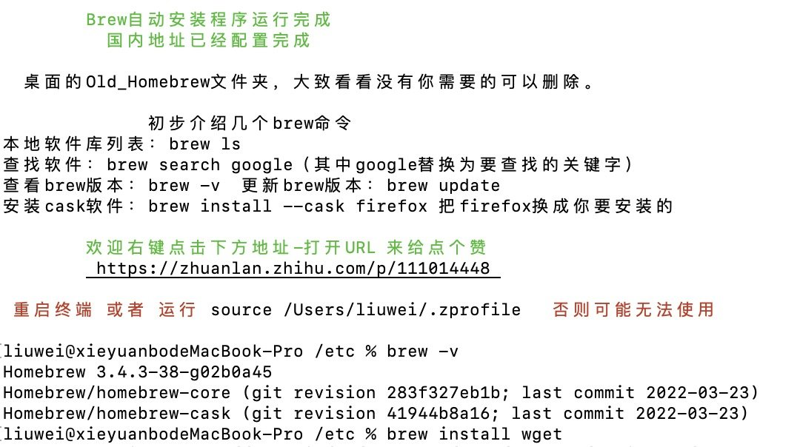

资料来源：

[mac上安装wget的简单方法](https://blog.csdn.net/hyb745250618/article/details/53257294)  

[Mac下homebrew的安装与卸载](https://blog.csdn.net/qq_34156628/article/details/97561194)

## 安装jdk

如果你是第一次配置环境变量，可以使用`touch.bash_profile` 创建一个`.bash_profile`的隐藏配置文件(如果你是为编辑已存在的配置文件，则使用`open -e .bash_profile`命令)：

输入`open -e.bash_profile`命令：

~~~~shell
JAVA_HOME=/Library/Java/JavaVirtualMachines/jdk1.8.0_40.jdk/Contents/Home
PATH=$JAVA_HOME/bin:$PATH:.
CLASSPATH=$JAVA_HOME/lib/tools.jar:$JAVA_HOME/lib/dt.jar:.
export JAVA_HOME
export PATH
export CLASSPATH
~~~~

!>  根据自己的情况，修改配置JAVA_HOME的文件路径，一般只要修改版本号

## 安装maven

maven配置文件

~~~~Shell
export MAVEN_HOME=/Users/liuwei/Documents/java/apache-maven-3.8.4
export PATH=$PATH:$MAVEN_HOME/bin
~~~~

## 安装Homebrew

>  mac os上安装软件常常需要依赖包，但对于新手来说，这是很麻烦的事情。
>
> 自己的安装wget的过程中，偶然间知道了Homebrew这款软件，号称是“macOS 不可或缺的套件管理器”，[Homebrew官网网站链接](http://brew.sh/index_zh-cn.html)。类似于Red hat的yum，Ubuntu的apt-get。

~~~~shell
/usr/bin/ruby -e "$(curl -fsSL https://raw.githubusercontent.com/Homebrew/install/master/install)"

打开终端窗口, 粘贴以上脚本。
脚本会解释它的作用，然后在您的确认下执行安装。
~~~~

如果电脑[安装失败](https://blog.csdn.net/txl910514/article/details/105880125)

可以使用国内源啦  再也不痛苦啦

`/bin/zsh -c "$(curl -fsSL https://gitee.com/cunkai/HomebrewCN/raw/master/Homebrew.sh)"`

\- 安装任意包

`$ brew install `

\- 示例：安装node

`$ brew install node`

\- 卸载任意包

`$ brew uninstall `

\- 示例：卸载git

`$ brew uninstall git`

\- 查询可用包

`$ brew search `

\- 查看已安装包列表

`$ brew list`

\- 查看任意包信息

`$ brew info `

\- 更新Homebrew

`$ brew update`

\- 查看Homebrew版本

`$ brew -v`

\- Homebrew帮助信息

`$ brew -h`

\- 卸载任意安装包

`$ brew uninstall `

原文链接：https://blog.csdn.net/qq_34156628/article/details/97561194

**wget安装举例**

使用非常简单，例如安装wget，在命令行输入以下命令、运行：

~~~~shell
$ brew install wget
~~~~

就可以了，去试一下吧。

另外据说MacPorts也有类似功能，我没有试过，有兴趣的可以看一下这篇文章[Mac OS X中MacPorts安装和使用](http://www.ccvita.com/434.html)

