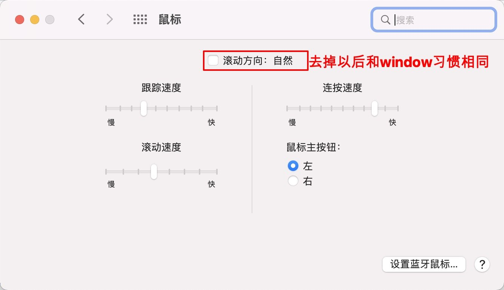

资料来源 

[mac鼠标滚轮反了怎么设置? macOS鼠标滚轮方向相反的两种解决办法](https://www.jb51.net/os/MAC/759501.html) 

## mac鼠标操作

mac鼠标滚轮反了怎么设置？mac系统和windows鼠标滚轮方向相反，用不习惯，想要更改一下鼠标滚轮方向，该怎么设置呢？

系统偏好 —> 鼠标

## 替换control 和command按键

习惯了windows ctrl+c和CtrL+V的复制粘贴，默认的mac是不一样的

系统偏好 —> 键盘 —> 修饰键

