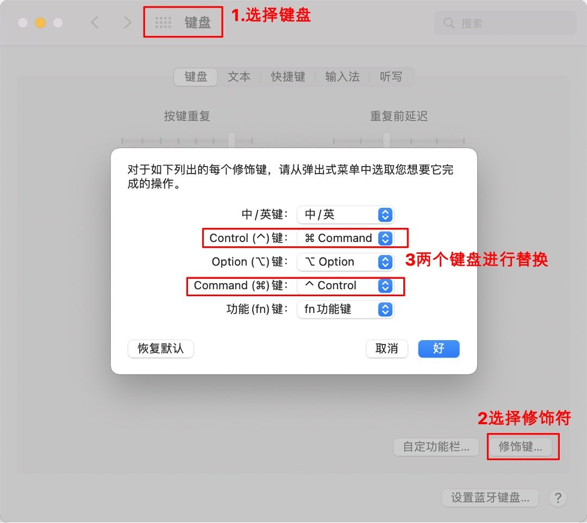

资料来源 

[mac鼠标滚轮反了怎么设置? macOS鼠标滚轮方向相反的两种解决办法](https://www.jb51.net/os/MAC/759501.html) 

[谷歌浏览器访问 https 提示您的连接不是私密连接 - 隐私设置错误](https://www.likecs.com/show-985932.html)

## mac鼠标操作

mac鼠标滚轮反了怎么设置？mac系统和windows鼠标滚轮方向相反，用不习惯，想要更改一下鼠标滚轮方向，该怎么设置呢？

系统偏好 —> 鼠标

## 替换control 和command按键

习惯了windows ctrl+c和CtrL+V的复制粘贴，默认的mac是不一样的

系统偏好 —> 键盘 —> 修饰键

## 谷歌浏览器无法访问

如果访问证书有问题的网站，无法继续访问

在空白出，敲出`thisisunsafe`

搞定解决，复制粘贴是没用的，需要手动键入。快去套路你身边的Mac同学吧。