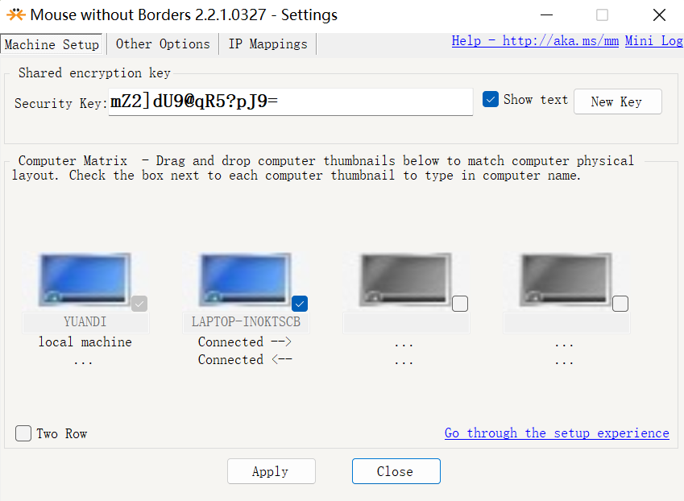

## window 常用的软件

### 截图软件

我喜欢用的fscapture_gr


```java
fscapture_gr.zip
下载:https://jinlilu.lanzoum.com/i24Ba10q2uqb 密码:dscx
```

### gif 软件


直接使用[官网](http://www.redisant.cn/gif)下载

### markdown

typora，但是新的版本收费，推荐老的版本

```c
下载:https://jinlilu.lanzoum.com/iN9bS0ev4ddg 密码:6vm1
```

### ssh 工具

推荐`xftp` 和`Xshell7`

下载:https://jinlilu.lanzoum.com/iok1q0ev4zfa 密码:ek9b

### 数据库访问

推荐`Navicat`破解版

```c
下载:https://jinlilu.lanzoum.com/igQdX0ev528b 密码:d9ij
```

### ip 扫描

```c
下载:https://jinlilu.lanzoum.com/izfVN0xbk9ed 密码:ft7c
```

### 串口虚拟助手

```
下载:https://jinlilu.lanzoum.com/ifTKW0xbjsuh 密码:e56r
```

### 局域网传输软件
LocalSend 是一款免费、开源、跨平台的局域网文件互传工具，无需互联网，无需外部服务器。即开即用，支持 Windows、macOS、Linux，以及 iOS、Android。


### redis 可视化客户端

资料来源：

[redis的客户端连接的可视化管理工具](https://blog.csdn.net/blood_Z/article/details/126248668?utm_medium=distribute.pc_relevant.none-task-blog-2~default~baidujs_utm_term~default-1-126248668-blog-122694022.235^v38^pc_relevant_default_base3&spm=1001.2101.3001.4242.2&utm_relevant_index=4)

**强烈推荐`Another Redis Desktop Manager`**

[官方网站](https://goanother.com/cn/)

[gitee下载地址](https://gitee.com/qishibo/AnotherRedisDesktopManager/releases)

以下是功能展示：

### 一套鼠标键盘，控制多台电脑
一套
下载地址：[官网](https://mouse-without-borders.en.softonic.com/)

连接成功<br/>
