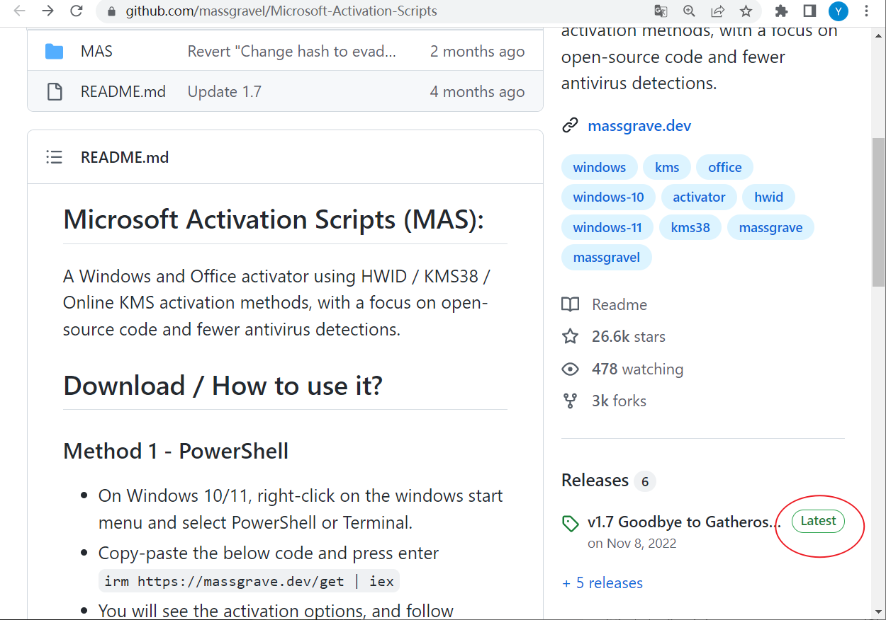
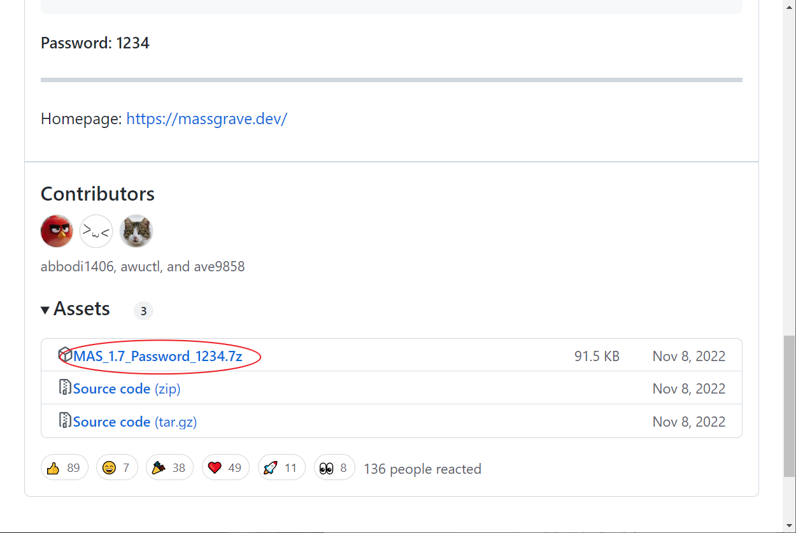
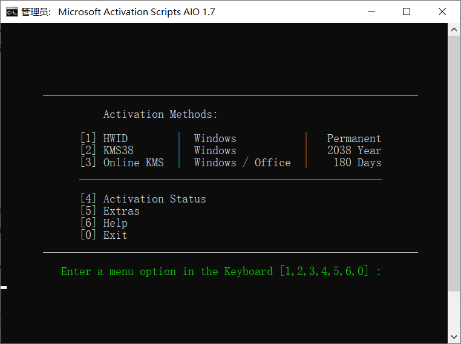

资料来源： 
[github上可激活win10和office的开源、无毒的放心工具](https://www.toutiao.com/article/7206248142433010231/?app=news_article&timestamp=1679838681&use_new_style=1&req_id=20230326215120F96C467D997E51D7C509&group_id=7206248142433010231&share_token=5C349BF4-C0E6-43B6-9739-25F0A16AAE4D&tt_from=weixin&utm_source=weixin&utm_medium=toutiao_ios&utm_campaign=client_share&wxshare_count=2&source=m_redirect)

## github开源激活工具
首先，我是不赞成D版的。但是我不反对通过开源代码学习技术。

[在浏览器地址栏输入](https://github.com/massgravel/Microsoft-Activation-Scripts)`https://github.com/massgravel/Microsoft-Activation-Scripts`就找到了这个开源项目。

点击右边“v1.7 Goodbye to Gatherosstate.exe”处进入下载页面。

这个页面有三个文件可以下载，MAS_1.7_Password_1234.7z 这个是激活工具脚本。另外两个是源代码，zip那个源代码是windows上的工程压缩代码包，tar,gz的是Linux上面的工程压缩代码包。

对于大部分人来说，MAS_1.7_Password_1234.7z是你的最爱。对于爱专研的小伙伴来讲，两个源代码压缩包才是自己的需要。

如果你想在研究源代码之前测试一下，解压MAS_1.7_Password_1234.7z，会生成两个目录，执行“All-In-One-Version”目录下面的“MAS_AIO.cmd”，别忘记右键执行“以管理员权限来运行”，会弹出一个带选项的菜单的界面。

你如果只想对你的win10动刀子，选1，让WIN10永久激活。选2，你的windows可以激活到2038年。

如果想对你的WIN10和office动刀子，就选3。选3是需要一定的时间来执行的，切勿着急，等出按“按任意键退出”就可以了。选3这个测试项，会让你的WIN+OFFICE成教育免费版。180天后，你再执行一次就可以了。

这个工具不像有些网站下载的那些工具，**这是个绿色、无毒、开源的东西，你甚至不需要关闭360、win自带的防火墙。**