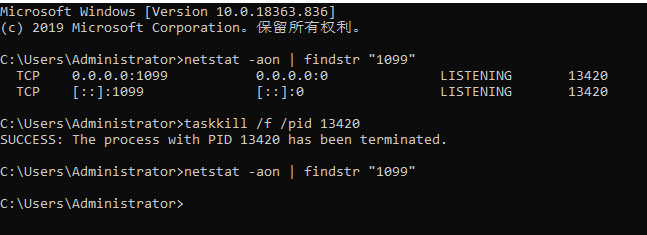

资料来源：<br/>
[windows端口占用关闭指定端口](https://blog.csdn.net/m0_46803792/article/details/128132405)<br/>


## 端口占用

```
C:\Users\Administrator>netstat -aon | findstr "1099"
  TCP    0.0.0.0:1099           0.0.0.0:0              LISTENING       13420
  TCP    [::]:1099              [::]:0                 LISTENING       13420

C:\Users\Administrator>taskkill /f /pid 13420
SUCCESS: The process with PID 13420 has been terminated.

C:\Users\Administrator>netstat -aon | findstr "1099"

C:\Users\Administrator>
```

举例

