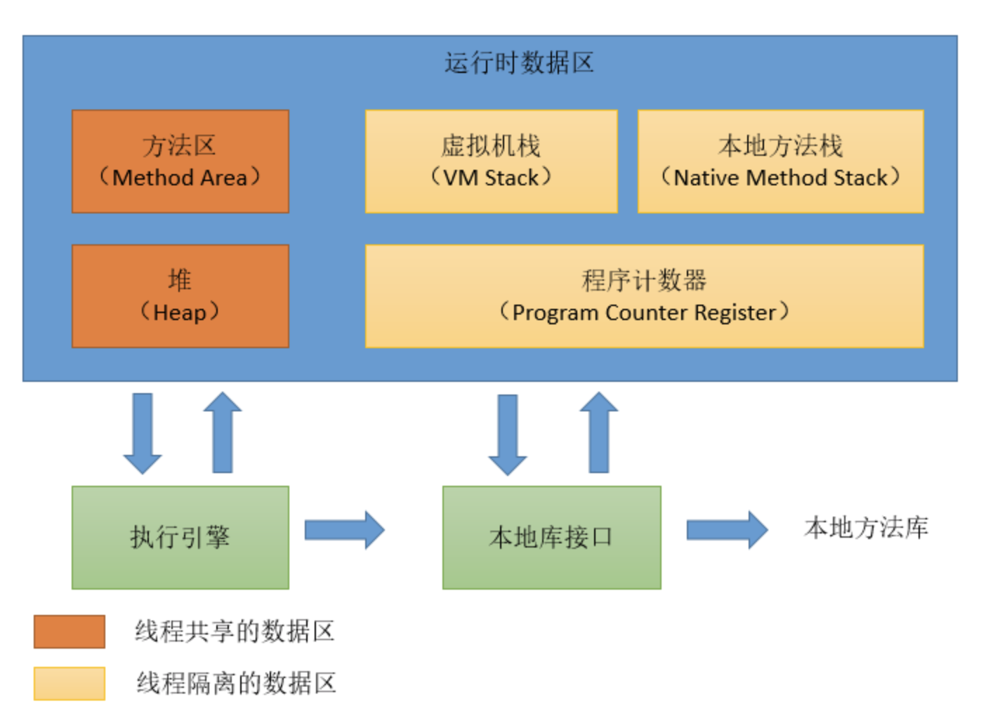
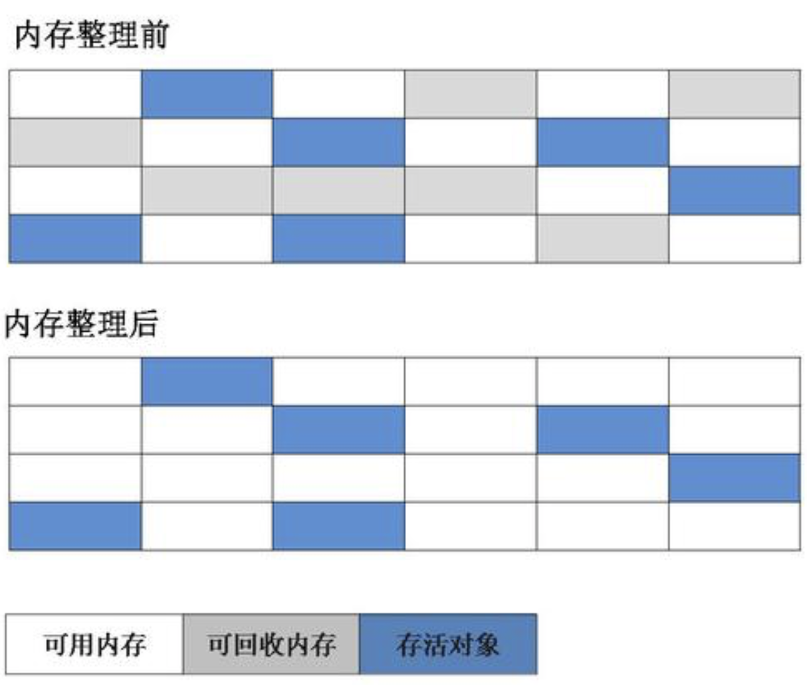
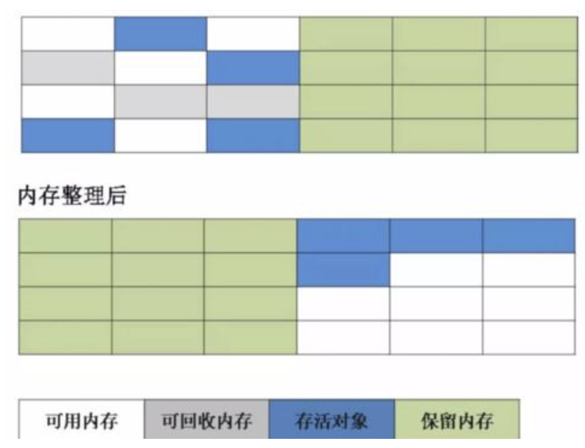
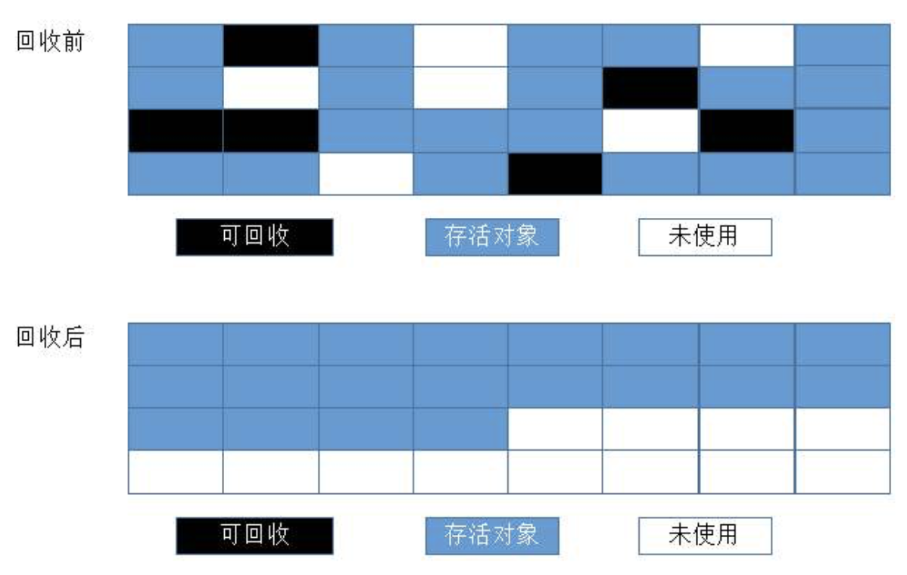
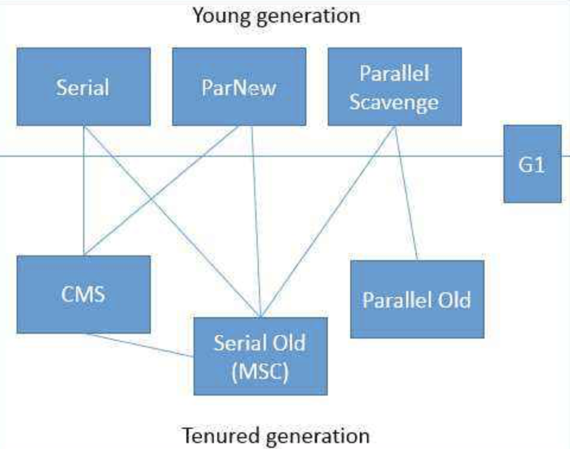

##  JVM


#### 1.JDK、JRE、JVM关系？

Jdk (Java Development Kit)  : java语言的软件开发包。包括Java运行时环境Jre。

Jre （Java Runtime Environment) :Java运行时环境，包括Jvm。

Jvm (Java Virtual Machine) :  

- 一种用于计算机设备的规范。
- Java语言在不同平台上运行时不需要重新编译。Java语言使用Java虚拟机屏蔽了与具体平台相关的信息，使得Java语言编译程序只需生成在Java虚拟机上运行的目标代码（字节码），就可以在多种平台上不加修改地运行。

Jdk包括Jre，Jre包括jvm。

#### 2.启动程序如何查看加载了哪些类，以及加载顺序？

java -XX:+TraceClassLoading  具体类

Java -verbose 具体类

#### 3. class字节码文件10个主要组成部分?

- MagicNumber
- Version
- Constant_pool
- Access_flag
- This_class
- Super_class
- Interfaces
- Fields
- Methods
- Attributes

#### 4.画一下jvm内存结构图？



#### 5.程序计数器

属于线程私有内存。占用一块非常小的空间，它的作用可以看作是当前线程所执行的字节码的行号指示器。字节码解释器工作时就是通过改变这个计数器的值来选取下一条需要执行的指令的字节码，分支、循环、跳转、异常处理、线程恢复等基础功能都依赖这个计数器来完成。

#### 6.Java虚拟机栈

属于线程私有内存。它的生命周期与线程相同，虚拟机栈描述的是Java方法执行内存模型；每个方法被执行的时候都会同时创建一个栈桢用于存储局部变量表、操作栈、动态链接、方法出口信息等。每一个方法被调用直至执行完成的过程，就对应着一个栈帧再虚拟机中从入栈到出栈的过程。

#### 7.本地方法栈

本地方法栈与虚拟机栈所发挥的作用是非常相似的，只不过虚拟机栈对虚拟机执行Java方法服务，而本地栈是为虚拟机使用到Native方法服务。

#### 8.Java堆

是Java虚拟机所管理的内存中最大的一块。Java堆事被所有线程共享的一块内存区域，在虚拟机启动时创建。此内存区域的唯一目的就是存放对象实例，几乎所有的对象实例都在这里分配内存。

Tips：但随着JIT编译器的发展与逃逸分析技术的逐渐成熟，栈上分配、标亮替换优化技术将会导师一些微妙的变化发生，所有的对象都分配在堆上就不那么绝对了。

#### 9.方法区

是各个线程共享的内存区域，它用于存储已被虚拟机加载的类信息、常量、静态变量、即时编译器编译后的代码等数据。

#### 10.运行时常量池？

是方法区的一部分，Class文件中除了有类的版本、字段、方法、接口等描述信息，还有一项是常量池（Constant PoolTable）用于存放编译期生成的各种字面量和符号引用，这部分内容将在类加载后存放道方法区的运行时常量池中。

#### 11.什么时候抛出StackOverflowError?

如果线程请求的栈深度大于虚拟机所允许的深度，则抛出StackOverflowError。

#### 12.Java7和Java8在内存模型上有什么区别？

Java8取消了永久代，用元空间（Metaspace）代替了，元空间是存在本地内存（Native memory)中。

#### 13.程序员最关注的两个内存区域？

堆(Heap)和栈（Stack)，一般大家会把Java内存分为堆内存和栈内存，这是一种比较粗糙的划分方式，但实际上Java内存区域是很复杂的。

#### 14.直接内存是什么？

直接内存并不是虚拟机运行时数据区的一部分，也不是Java虚拟机规范中定义的内存区域，但这部分内存也频繁被实用，也有OutOfMemoryError异常的出现的可能。

Tips:JDK1.4中加入了NIO（new input/output)类，引入了一种基于通道(Channe)与缓冲区（Buffer)的I/O方式，也可以使用Native函数库直接分配堆外内存,然后通过一个存储在Java堆里面的DirectByteBuffer的对象作为这块内存的引用进行操作。

#### 15.除了哪个区域外，虚拟机内存其他运行时区域都会发生OutOfMemoryError？

程序计数器。

#### 16.什么情况下会出现堆内存溢出？

堆内存存储对象实例。我们只要不断地创建对象。并保证gc roots到对象之间有可达路径来避免垃圾回收机制清除这些对象。就会在对象数量到达最大。堆容量限制后，产生内存溢出异常。

#### 17.如何实现一个堆内存溢出？

```java
public class Cat {

    public static void main(String[] args) {
        List list = new ArrayList();
        while (true) {
           list.add(new Cat());
        }
    }
    
}
```


#### 18.空间什么情况下会抛出OutOfMemoryError？

如果虚拟机在扩展栈时无法申请到足够的内存空间，则抛出OutOfMemoryError。 

#### 19.如何实现StrackOverflowError?

```java
 public static void main(String[] args) {
     eat();
 }

 public static void eat () {
     eat();
 }
```

#### 20.如何设置直接内存容量?

通过 -XX:MaxDirectMemorySize指定，如果不指定，则默认与Java堆的最大值一样。

#### 21.Java堆内存组成？


堆大小 = 新生代 + 老年代。如果是Java8则没有Permanent Generation。

其中新生代(Young) 被分为 Eden和S0（from)和S1(to)。

#### 22.Edem : from : to默认比例是?

Edem : from : to = 8 : 1 : 1

此比例可以通过 –XX:SurvivorRatio 来设定 

#### 23.垃圾标记阶段？

在GC执行垃圾回收之前，为了区分对象存活与否，当对象被标记为死亡时，GC才回执行垃圾回收，这个过程就是垃圾标记阶段。

#### 24.引用计数法?

比如对象a,只要任何一个对象引用了a,则a的引用计数器就加1，当引用失效时，引用计数器就减1，当计数器为0时，就可以对其回收。

但是无法解决循环引用的问题。

#### 25.根搜索算法？

跟搜索算法是以跟为起始点，按照从上到下的方式搜索被根对象集合所连接的目标对象是否可达(使用根搜索算法后，内存中 的存活对象都会被根对象集合直接或间接连接着)，如果目标对象不可达，就意味着该对象己经死亡，便可以在 instanceOopDesc的 Mark World 中将其标记为垃圾对象。

在根搜索算法中， 只有能够被根对象集合直接或者间接连接的对象才是存活对象。

#### 26.JVM中三种常见的垃圾收集算法？

标记-清除算法（Mark_Sweep)

复制算法(Copying)

标记-压缩算法（Mark-Compact)

#### 27.标记-清除算法？

首先标记出所有需要回收的对象，在标记完成后统一回收掉所有的被标记对象。



缺点：

- 标记和清除的效率都不高。
- 空间问题，清除后产生大量不连续的内存随便。如果有大对象会出现空间不够的现象从而不得不提前触发另一次垃圾收集动作。

#### 28.复制算法？

 他将可用内存按容量划分为大小相等的两块，每次只使用其中的一块，当这一块内存用完了，就将还存活的对象复制到另外一块上面，然后再把已使用过的内存空间一次清理掉。



优点:

解决了内存碎片问题。

缺点：

将原来的内存缩小为原来的一半，存活对象越多效率越低。

#### 29.标记-整理算法？

先标记出要被回收的对象，然后让所有存活的对象都向一端移动，然后直接清理掉边界以外的内存。解决了复制算法和标记清理算法的问题。



#### 30.分代收集算法？

当前商业虚拟机的垃圾收集都采用“分代手机算法”，其实就根据对象存活周期的不同将内存划分为几块，一般是新老年代。根据各个年代的特点采用最适当的收集算法。

#### 31.垃圾收集器？

如果说垃圾收集算法是方法论，那么垃圾收集器就是具体实现。连线代表可以搭配使用。




#### 32.Stop The World?

进行垃圾收集时，必须暂停其他所有工作线程，Sun将这种事情叫做"Stop The World"。

#### 33.Serial收集器?

单线程收集器，单线程的含义在于它会 stop the world。垃圾回收时需要stop the world ,直到它收集结束。所以这种收集器体验比较差。

#### 34.PartNew收集器?

Serial收集器的多线程版本，除了使用采用并行收回的方式回收内存外，其他行为几乎和Serial没区别。

可以通过选项“-XX:+UseParNewGC”手动指定使用 ParNew收集器执行内存回收任务。

#### 36.Parallel Scavenge?

是一个新生代收集器，也是复制算法的收集器，同时也是多线程并行收集器，与PartNew 不同是，它重点关注的是程序达到一个可控制的吞吐量(Thoughput，CPU 用于运行用户代码 的时间/CPU 总消耗时间，即吞吐量=运行用户代码时间/(运行用户代码时间+垃圾收集时间))， 高吞吐量可以最高效率地利用 CPU 时间，尽快地完成程序的运算任务，主要适用于在后台运算而不需要太多交互的任务。

他可以通过2个参数精确的控制吞吐量,更高效的利用cpu。

分别是: -XX:MaxCcPauseMillis 和 -XX:GCTimeRatio

#### 37.Parallel Old收集器?

Parallel Scavenge收集器的老年代版本，使用多线程和标记-整理算法。JDK 1.6中才开始提供。

#### 38.CMS 收集器?

Concurrent Mar Sweep 收集器是一种以获取最短回收停顿时间为目标的收集器。重视服务的响应速度，希望系统停顿时间最短。采用标记-清除的算法来进行垃圾回收。

#### 39.CMS垃圾回收的步骤?

1. 初始标记 (stop the world)

2. 并发标记

3. 重新标记 (stop the world)

4. 并发清除

   初始标记仅仅只是标记一下GC Roots能直接关联到的对象，速度很快。

   并发标记就是进行Gc Roots Tracing的过程。

   重新标记则是为了修正并发标记期间，因用户程序继续运行而导致的标记产生变动的那一部分对象的标记记录，这个阶段停顿时间一般比初始标记时间长，但是远比并发标记时间短。

   整个过程中并发标记时间最长，但此时可以和用户线程一起工作。

#### 41.CMS收集器优点？缺点？

优点：

并发收集、低停顿

缺点：

- 对cpu资源非常敏感。
- 无法处理浮动垃圾。
- 内存碎片问题。

#### 42.G1收集器?

Garbage First 收集器是当前收集器技术发展的最前沿成果。jdk 1.6_update14中提供了 g1收集器。

 G1收集器是基于标记-整理算法的收集器，它避免了内存碎片的问题。

可以非常精确控制停顿时间，既能让使用者明确指定一个长度为 M毫秒的时间片段内，消耗在垃圾收集上的时间不多超过N毫秒，这几乎已经是实时java(rtsj)的垃圾收集器特征了。

#### 42. G1收集器是如何改进收集方式的？

极力避免全区域垃圾收集，之前的收集器进行收集的范围都是整个新生代或者老年代。而g1将整个Java堆（包括新生代、老年代）划分为多个大小固定的独立区域，并且跟踪这些区域垃圾堆积程度，维护一个优先级李彪，每次根据允许的收集时间，优先回收垃圾最多的区域。从而获得更高的效率。

#### 43.虚拟机进程状况工具？

jps (Jvm process status tool ),他的功能与ps类似。

可以列出正在运行的虚拟机进程，并显示执行主类(Main Class,main()函数所在的类）的名称，以及浙西进程的本地虚拟机的唯一ID。

语法 ： jps [options] [hostid]

-q 主输出lvmid,省略主类的名称

-m 输出虚拟机进程启动时传递给主类main()函数的参数

-l    输出主类全名，如果进程执行是Jar包，输出Jar路径

-v 输出虚拟机进程启动时JVM参数

#### 44.虚拟机统计信息工具？

jstat(JVM Statistics Montoring Tool)是用于监视虚拟机各种运行状态信息命令行工机具。他可以显示本地或远程虚拟机进程中的类装载、内存、垃圾收集、jit编译等运行数据。

jstat [option vmid [interval[s|ms] [count]] ]

interval 查询间隔

count 查询次数

如果不用这两个参数，就默认查询一次。

option代表用户希望查询的虚拟机信息，主要分3类：

- 类装载
- 垃圾收集
- 运行期编译状况

#### 45.jstat 工具主要选项？

-class    监视类装载、卸载数量、总空间及类装载锁消耗的时间

-gc         监视Java堆状况，包括Eden区，2个survivor区、老年代

-gccapacity 监视内容与-gc基本相同，但输出主要关注Java堆各个区域使用的最大和最小空间

-gcutil  监视内容与-gc基本相同，主要关注已经使用空间站空间百分比

-gccause 与-gcutil 功能一样，但是会额外输出导致上一次GC产生的原因

-gcnew  监视新生代的GC的状况

-gcnewcapacity 监视内容与 -gcnew基本相同，输出主要关注使用到的最大最小空间

-gcold  监视老年代的GC情况

-gcoldcapacity  监控内容与 -gcold基本相同，主要关注使用到的最大最小空间

-compiler 输出jit 编译器编译过的方法、耗时等信息

#### 45.配置信息工具?

jinfo(Configuration Info for Java)的作用是实时地查看和调整虚拟机的各项参数。

使用jps 命令的 -v 参数可以查看虚拟机启动时显示指定的参数列表。

jinfo 语法: jinfo [option] pid

#### 46.内存映像工具？

jmap(Memory Map for Java) 命令用于生成堆转储快照（一般称为heapdump或dump文件）。

 语法 ：jmap [option] vmid

它还可以查询finalize执行队列，Java堆和永久代的详细信息，如果空间使用率、当前用的是哪种收集器等。

- -dump 生成Java堆转储快照，其中live自参数说明是否只dump出存活对象
- -finalizerinfo 显示在F -Queue 中等待Finalizer线程执行finalize方法的对象。只在Linux/Solaris平台下有效
- -heap 显示Java堆详细信息，如使用哪种回收器、参数配置、分代状况。
- -histo 显示堆中对象统计信息、包括类、实例数量和合计容量。
- -F 当虚拟机进程对-dump选项没有响应时，可使用这个选项强制生成dump快照。

#### 47.虚拟机堆转存储快照分析工具？

jhat ( JVM Heap Analysis Tool) 用来分析jmap生成的堆转储快照。

#### 48.堆栈跟踪工具？

jstack(Stack Trace for Java) 命令用于生成虚拟机当前时刻的线程快照（一般称为thread dump 或javacore文件）。线程快照就是当前虚拟机内每一条线程正在执行的方法堆栈的集合，生成线程快照的主要目的是定位线程出现长时间停顿的原因。

jstack [option] vmid

-F  当正常输出的请求不被响应时，强制输出线程堆栈

-l  除堆栈外，显示关于锁的附加信息

-m 如果调用本地方法的花，可以显示C/C++ 的堆栈

#### 49.除了命令行，还有什么可视化工具？

JConsole 和 VisualVM，这两个工具是JDK的正式成员。

#### 50.类加载过程?

加载-》验证-》准备-》解析-》初始化-》使用-》卸载

参考：

- 《深入理解JVM & G1 GC》

- 《深入理解Java虚拟机：JVM高级特性与最佳实践》

- 《实战Java虚拟机：JVM故障诊断与性能优化》


