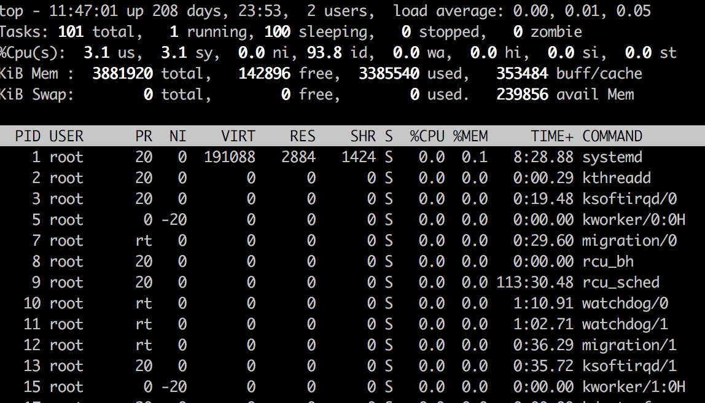
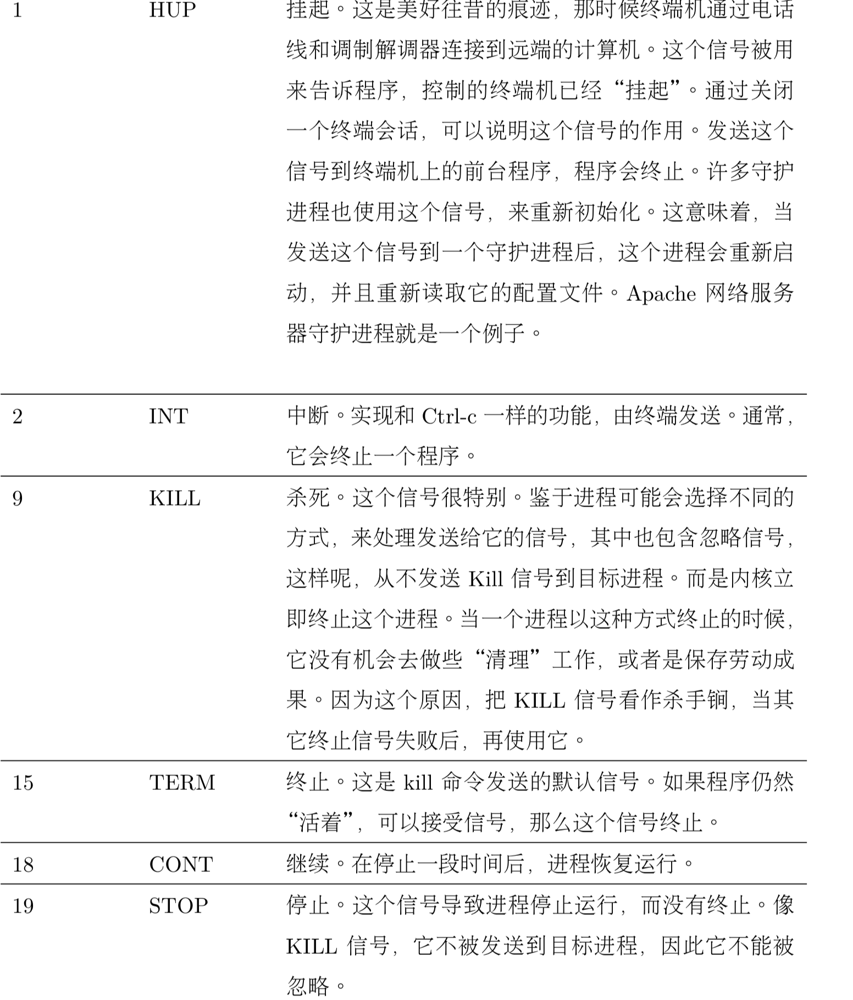

## Linux

#### 1.什么是Linux？

是一套免费使用和自由传播的类UNIX操作系统，其内核由林纳斯·本纳第克特·托瓦兹于1991年第一次释出，它主要受到Minix和Unix思想的启发，是一个基于POSIX和Unix的多用户、多任务、支持多线程和多CPU的操作系统。它能运行主要的Unix工具软件、应用程序和网络协议。它支持32位和64位硬件。

#### 2.Linux内核主要负责哪些功能

- 系统内存管理
- 软件程序管理
- 硬件设备管理
- 文件系统管理

#### 3.交互方式

控制台终端、图形化终端

#### 4.启动shell

GNU bash shell能提供对linux 系统的交互式访问。作为普通程序运行，通常在用户登陆终端时启动。登录时系统启动的shell依赖与用户账户的配置。

#### 5.bash手册

大多数linux发行版自带以查找shell命令及其他GNU工具信息的在线手册。man命令用来访问linux系统上的手册页面。当用man命令查看手册，使用分页的程序来现实的。

#### 6.登陆后你在的位置？

一般登陆后，你的位置位于自己的主目录中。

#### 7.绝对文件路径?相对文件路径？快捷方式？

绝对文件路径：描述了在虚拟目录结构中该目录的确切位置，以虚拟目录跟目录开始，相当于目录全名。

以正斜线(/)开始，比如 /usr/local。

相对文件路径：允许用户执行一个基于当前位置的目标文件路径。

比如:当前在/usr/local

```
➜  local ls
Caskroom   Frameworks bin        go         lib        sbin       var
Cellar     Homebrew   etc        include    opt        share
➜  local cd go
```

快捷方式(在相对路径中使用):

单点符(.) : 表示当前目录; 双点符(..) :  表示当前目录的父目录。

#### 8.迷路，我的当前位置在哪？

pwd 显示当前目录

```
[root@iz2ze76ybn73dvwmdij06zz local]# pwd
/usr/local
```

#### 9.如何切换目录？

语法: cd destination

destination : 相对文件路径或绝对文件路径

可以跳到存在的任意目录。

#### 10.如何查看目录中的文件？区分哪些是文件哪些是目录?递归查?

ls 命令会用最基本的形式显示当前目录下的文件和目录：

```
➜  local ls
Caskroom   Frameworks bin        go         lib        sbin       var
Cellar     Homebrew   etc        include    opt        share
```

可以看出默认是按照字母序展示的

一般来说，ls命令回显示不同的颜色区分不同的文件类型,如果没有安装颜色插件可以用ls -F来区分哪些是目录（目录带/)，哪些是文件（文件不带/)

  ls -R 递归展示出目录下以及子目录的文件，目录越多输出越多

#### 11.创建文件？创建目录？批量创建?

创建文件:touch 文件名

批量创建文件: touch  文件名 文件名 …

```
➜  test touch a
➜  test ls
a
➜  test touch b c
➜  test ls
a b c
```

创建目录：mkdir 目录名

批量创建目录: mkdir 目录名 目录名 …

```
➜  test mkdir aa
➜  test mkdir bb cc
➜  test ls
a  aa b  bb c  cc
➜  test ls -F
a   aa/ b   bb/ c   cc/
```

#### 12.删除文件?强制删除？递归删除?

语法: rm destination

-i 询问是否删除,-r 递归删除，-f 强制删除。

rm不能删除有文件的目录,需要递归删除。

```
➜  xktest rm jdk
rm: jdk: is a directory
➜  xktest rm -r jdk
➜  xktest ls
```

rm -i 询问删除,建议大家平时删除多用 -i，确定一下再删除。

```
➜  xktest touch tomcat
➜  xktest rm -i tomcat
remove tomcat? n
```

rm -rf 会直接删除，没有警告信息，使用必须谨慎**。

#### 13.制表符自动补全？

有的时候文件的名字很长，很容易拼出错即使拼写对了也很浪费时间。

```
➜  xktest ls java*
javaxiaokaxiu
```

   比如操作javaxiaokaxiu这个文件时，输入到java的时候，然后按制表键(tab)就会补全成javaxiaokaxiu,是不是方便多了。

#### 14.复制文件

语法: cp source target

如果target不存在则直接创建，如果存在，默认不会提醒你是否需要覆盖，需要加-i就会询问你是否覆盖,n否y是。

```
➜  xktest cp a c
➜  xktest cp -i a c
overwrite c? (y/n [n]) y
➜  xktest ls
a c
```

#### 15.重新命名文件？移动文件？

语法 ： mv soucre target 

重命名:

```
➜  xktest ls
➜  xktest touch java
➜  xktest ls
java
➜  xktest mv java java1.8
➜  xktest ls
java1.8
```

移动文件:

新建jdk目录把java1.8文件移动到jdk目录下。

```
➜  xktest ls
java1.8
➜  xktest mkdir jdk
➜  xktest mv java1.8 jdk
➜  xktest ls -R
jdk

./jdk:
java1.8
```

#### 16.什么是链接文件？

如过需要在系统上维护同一文件的两份或者多份副本，除了保存多分单独的物理文件副本之外。还可以采用保存一份物理文件副本和多个虚拟副本的方法，这种虚拟的副本就叫做链接。

#### 17.查看文件类型?字符编码？

语法: file destination

```
➜  apache file tomcat
tomcat: ASCII text
```

可以看出，file命令可以显示文件的类型text以及字符编码ASCII

#### 18.查看整个文件？按照有文本显示行号？无文本显示行号？

语法 : cat destination

-n 显示行号，-b 有文本的显示行号。 （默认是不显示行号的)

```
➜  apache cat -n tomcat
     1  text
     2  text
     3
     4  start
     5  stop
     6  restart
     7  end
➜  apache cat -b tomcat
     1  text
     2  text

     3  start
     4  stop
     5  restart
     6  end
```

#### 19.查看部分文件

语法 : tail  destination

默认情况会展示文件的末尾10行。 -n 行数，显示最后n行。

```
➜  apache tail -n 2 tomcat
restart
end
```

语法: head destination 

默认情况会展示文件的开头10行。 -n 行数，显示开头n行。

```
➜  apache head -n 2 tomcat
text
text
```

#### 20.数据排序?对数字进行排序？对月份排序？

默认情况下，文件的数据展示是按照原顺序展示的。sort命令可以对文本文件中的数据进行排序。sort默认会把数据当成字符处理。

语法: sort destination

sort -n 所以排序数字时需要用-n，它的含义是说当前排序是的数字。

sort -M 比如月份Jan、Feb、Mar，如果希望它按照月份排序，加入-M就会按照月份的大小来排序。

#### 21.查找匹配数据？反向搜？

语法: grep [options] pattern [file]

该命令会查找匹配执行模式的字符串的行，并输出。

```
➜  apache grep start tomcat
start
restart
```

-v 反向搜

```
➜  apache grep -v start tomcat
text
text

stop
end
```

-n 显示行号

-c 显示匹配的行数

#### 22.压缩工具有哪些?


#### 23.如何压缩文件？如何解压文件?

比如以.gz的格式举例。

压缩语法: gzip destination

```
➜  apache gzip tomcat
➜  apache ls
tomcat.gz
```

解压语法: gunzip destination

```
➜  apache gunzip tomcat.gz
➜  apache ls
tomcat
```

#### 24.Linux广泛使用的归档数据方法?

虽然zip命令能压缩和解压单个文件，但是更多的时候广泛使用tar命令来做归档。

语法: tar function [options] obj1 obj2


```
➜  apache tar -cvf service.tar service1 service2 // 创建规定文件service.tar
a service1
a service2
➜  apache tar -tf service.tar //查看文件中的目录内容
service1
service2
➜  apache tar zxvf service.tar //解压
x service1
x service2
```

#### 25.如何查看命令历史记录?

   history 命令可以展示你用的命令的历史记录。

```
 4463  touch service1 service2
 4464  ls
 4465  tar -cvf service.tar service1 service2
 4466  tar -tf service.tar
 4467  tar zxvf service
 4468  tar zxvf service.t
 4469  tar zxvf service.tar
 4470  ls
 4471  tar -zxvf  service.tar
 4472  ls
```

#### 26.查看已有别名?建立属于自己的别名?

alias -p 查看当前可用别名

```
[root@iz2ze76ybn73dvwmdij06zz ~]# alias -p
alias cp='cp -i'
alias egrep='egrep —color=auto'
alias fgrep='fgrep —color=auto'
alias grep='grep —color=auto'
alias l.='ls -d .* —color=auto'
alias ll='ls -l —color=auto'
```

alias li = 'ls  -li' 创建别名

#### 27.什么是环境变量？

bash shell用一个叫作环境变量(environment variable)的特性来存储有关shell会话和工作环境的信息。这项特性允许你在内存中存储数据，以便程序或shell中运行的脚本能够轻松访问到它们。这也是存储持久数据的一种简便方法。

在bash shell中，环境变量分为两类: 

 全局变量：对于 shell会话和所有生成的子shell都是可见的。 局部变量： 只对创建他们的shell可见。

#### 28.储存用户的文件是?包括哪些信息？

/etc/passwd存储来一些用户有关的信息。

```
[root@iz2ze76ybn73dvwmdij06zz ~]# cat /etc/passwd
root:x:0:0:root:/root:/bin/bash
bin:x:1:1:bin:/bin:/sbin/nologin
```

文件信息包括如下内容。

- 登录用户名
- 用户密码
- 用户账户的UID(数字形式)
- 用户账户的组ID(GID)(数字形式) 
- 用户账户的文本描述(称为备注字段) 
- 用户HOME目录的位置
- 用户的默认shell

#### 29.账户默认信息？添加账户？删除用户？

```
[root@iz2ze76ybn73dvwmdij06zz ~]# useradd -D//查看系统默认创建用户信息
GROUP=100
HOME=/home
INACTIVE=-1
EXPIRE=
SHELL=/bin/bash
SKEL=/etc/skel
CREATE_MAIL_SPOOL=yes
[root@iz2ze76ybn73dvwmdij06zz ~]# useradd xiaoka//添加用户

[root@iz2ze76ybn73dvwmdij06zz /]# userdel xiaoka//删除用户
```

#### 30.查看组信息？如何创建组？删除组？

```
[root@iz2ze76ybn73dvwmdij06zz ~]# cat /etc/group
root:x:0:
bin:x:1:
daemon:x:2:
sys:x:3:
adm:x:4:
tty:x:5:
disk:x:6:
[root@iz2ze76ybn73dvwmdij06zz ~]# groupadd java //创建组
[root@iz2ze76ybn73dvwmdij06zz ~]# groupdel java //创建组
```

#### 31.文件描述符?每个描述符的含义?

```
[root@iz2ze76ybn73dvwmdij06zz xiaoka]# ls -l
总用量 0
-rw-r—r— 1 root root 0 4月  21 13:17 a
-rw-r—r— 1 root root 0 4月  21 13:17 b
-rw-r—r— 1 root root 0 4月  21 13:17 c
-rw-r—r— 1 root root 0 4月  21 13:17 d
-rw-r—r— 1 root root 0 4月  21 13:17 e
```

1、文件类型:

- -代表文件
- d代表目录
- l代表链接
- c代表字符型设备
- b代表块设备
- n代表网络设备

2、访问权限符号:

- r代表对象是可读的 
- w代表对象是可写的
- x代表对象是可执行的 

若没有某种权限，在该权限位会出现单破折线。

3、这3组权限分别对应对象的3个安全级别:

- 对象的属主
- 对象的属组
- 系统其他用户

#### 31.修改权限?

chmod options mode file

比如给文件附加可以执行权限:

```
[root@xiaoka ~]# chmod +x filename
```

#### 32.如何执行可以执行文件?

```
[root@xiaoka ~]# sh sleep.sh
hello,xiaoka
[root@xiaoka ~]# ./sleep.sh
hello,xiaoka
```

#### 33.列出已经安装的包？安装软件？更新软件？卸载?

列出已经安装的包: yum list installed

安装软件: yum install package_name

更新软件: yum update package_name

卸载软件:yum remove package_name //只删除软件包保留数据文件和配置文件

如果不希望保留数据文件和配置文件

可以执行:yum erase package_name

#### 34.源码安装通常的路子?

```
 tar -zxvf xx.gz //解包
 cd xx
 ./configure
 make
 make install
```

#### 35.vim编辑器几种操作模式？基本操作?

操作模式: 

- 普通模式
- 插入模式

 基础操作:

- h:左移一个字符。
- j:下移一行(文本中的下一行)。 
- k:上移一行(文本中的上一行)。 
- l:右移一个字符。

vim提供了一些能够提高移动速度的命令:

- PageDown(或Ctrl+F):下翻一屏
- PageUp(或Ctrl+B):上翻一屏。
- G:移到缓冲区的最后一行。
- num G:移动到缓冲区中的第num行。 
- gg:移到缓冲区的第一行。

退出vim:

- q:如果未修改缓冲区数据，退出。
- q!:取消所有对缓冲区数据的修改并退出。
- w filename:将文件保存到另一个文件中。
- wq:将缓冲区数据保存到文件中并退出。

#### 36.查看设备还有多少磁盘空间?

df 可以查看所有已挂在磁盘的使用情况。

-m 用兆字节，G代替g字节

```
[root@iz2ze76ybn73dvwmdij06zz ~]# df
文件系统          1K-块    已用     可用 已用% 挂载点
devtmpfs        1931568       0  1931568    0% /dev
tmpfs           1940960       0  1940960    0% /dev/shm
tmpfs           1940960     720  1940240    1% /run
tmpfs           1940960       0  1940960    0% /sys/fs/cgroup
/dev/vda1      41152812 9068544 30180560   24% /
tmpfs            388192       0   388192    0% /run/user/0
```

###### 快速判断某个特定目录是否有超大文件？

默认情况，du会显示当前目录的所有文件、目录、子目录的磁盘使用情况。

```
[root@iz2ze76ybn73dvwmdij06zz src]# du
4 ./debug
4 ./kernels
12
```

#### 37.默认进程信息显示?

ps它能输出运行在系统上的所有程序的许多信息。

默认情况下ps值显示运行在当前控制台下的当前用户的进程。

```
[root@iz2ze76ybn73dvwmdij06zz ~]# ps
  PID TTY          TIME CMD
10102 pts/0    00:00:00 bash
10131 pts/0    00:00:00 ps
```

#### 38.实时监测进程

与ps相比，top可以实时监控进程信息。



平均负载有3个值:最近1分钟的、最近5分钟的和最近15分钟的平均负载。值越大说明系统 的负载越高。由于进程短期的突发性活动，出现最近1分钟的高负载值也很常见，但如果近15分 钟内的平均负载都很高，就说明系统可能有问题。

#### 39.如何中断一个进程?

在一个终端中， Ctrl + c

通过这个命令许多（不是全部）命令行程序都可以被中断。

#### 40.如何把一个进程放到后台运行？

```
[root@iz2ze76ybn73dvwmdij06zz ~]# ./sleep.sh &
```

此时，进程并不能被Ctrl + c 中断。

#### 41.如何停止一个进程?

kill命令被用来给程序发送信号。如果没有指定信号，默认发送TERM(终止）信号。

语法 : kill [-signal] PID …



\#### 

#### 42.验证网络可链接命令是什么？什么原理？

 ping。这个 ping 命令发送一个特殊的网络数据包(叫做 IMCP ECHO REQUEST)到一台指定的主机。大多数接收这个包的网络设备将会回复它，来允许网络连接验证。


一旦启动，ping会持续在特定时间（默认1秒）发送数据包。

#### 43.查看某端口是否被占用?

netstat -ntulp|grep 8080

```
[root@iz2ze76ybn73dvwmdij06zz ~]# netstat -ntulp|grep 8080
tcp        0      0 0.0.0.0:8080            0.0.0.0:*               LISTEN      4517/java
```

参数说明:

- -t (tcp) 仅显示tcp相关选项
- -u (udp)仅显示udp相关选项
- -n 拒绝显示别名，能显示数字的全部转化为数字
- -l 仅列出在Listen(监听)的服务状态
- -p 显示建立相关链接的程序名

#### 44.如何查找匹配的文件？基于文件属性？

 find 程序能基于各种各样的属性，搜索一个给 定目录(以及它的子目录)，来查找文件。

find 命令的最简单使用是，搜索一个或多个目录。

普通查找，按照name查找:

```
[root@iz2ze76ybn73dvwmdij06zz ~]# find -name xiaoka
./xiaoka
```

文件类型查找:

比如,输出我们的家目录文件数量

```
[root@iz2ze76ybn73dvwmdij06zz ~]# find ~|wc -l
17130
```

根据文件类型查:

```
[root@iz2ze76ybn73dvwmdij06zz ~]#  find ~ -type d | wc -l
7340
```

find支持的类型: b 块设备文件、 c 字符设备文件、d 目录、f 普通文件、l 符号链接

#### 45.如何查看当前主机名？如何修改？如何重启后生效？

```
[root@iz2ze76ybn73dvwmdij06zz ~]# hostname//查看当前主机名
iz2ze76ybn73dvwmdij06zz
[root@iz2ze76ybn73dvwmdij06zz ~]# hostname xiaoka//修改当前主机名
[root@iz2ze76ybn73dvwmdij06zz ~]# hostname
xiaoka
```

大家知道一般来讲命令重启就会失效，目前基本上用的centos7的比较多，两种方式可以支持重启生效。

一、命令

```
[root@iz2ze76ybn73dvwmdij06zz ~]# hostnamectl set-hostname xiaoka
[root@iz2ze76ybn73dvwmdij06zz ~]# hostname
xiaoka
[root@xiaoka ~]#
```

 二、修改配置文件:/etc/hostname

```
[root@xiaoka ~]# vim /etc/hostname
```

#### 46.如何写一条规则，拒绝某个ip访问本机8080端口?

```
iptables -I INPUT -s ip -p tcp —dport 8080 -j REJECT
```

#### 47.哪个文件包含了主机名和ip的映射关系?

/etc/hosts

#### 48.如何用sed只打印第5行?删除第一行？替换字符串?

 只打印第5行:

```
➜  apache sed -n "5p" tomcat
stop
```

删除第一行:

```
[root@xiaoka ~]# cat story
Long ago a lion and a bear saw a kid.
They sprang upon it at the same time.
The lion said to the bear, “I caught this kid first, and so this is mine.”
[root@xiaoka ~]# cat story
They sprang upon it at the same time.
The lion said to the bear, “I caught this kid first, and so this is mine.”
```

替换字符串:

```
➜  apache cat story
Long ago a lion and a bear saw a kid.
They sprang upon it at the same time.
The lion said to the bear, “I caught this kid first, and so this is mine.”
➜  apache sed 's#this#that#g' story
Long ago a lion and a bear saw a kid.
They sprang upon it at the same time.
The lion said to the bear, “I caught that kid first, and so that is mine.”
```

#### 49.打印文件第一行到第三行?

​    文件tomcat中内容:

```
➜  apache cat tomcat
text21
text22
text23
start
stop
restart
end
➜ apache head -3 tomcat
text21
text22
text23
➜ apache sed -n '1,3p' tomcat
text21
text22
text23
➜ apache awk 'NR>=1&&NR<=3' tomcat
text21
text22
text23
```

#### 50.如何用awk查看第2行倒数第3个字段?

```
➜  apache awk 'NR==3{print $(NF-2)}' story
this
➜  apache cat story
Long ago a lion and a bear saw a kid.
They sprang upon it at the same time.
The lion said to the bear, “I caught this kid first, and so this is mine.”
```

参考:

- 《鸟哥Linux私房菜》

- 《快乐的命令行》

- 《Linux命令行与shell脚本编程大全(第3版）》

- 《Linux从入门到精通》

- 百度百科

  
