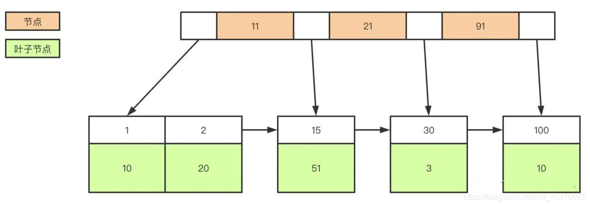
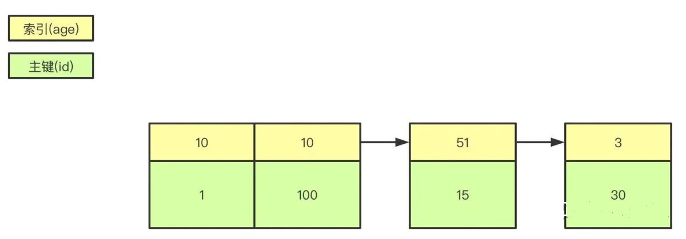
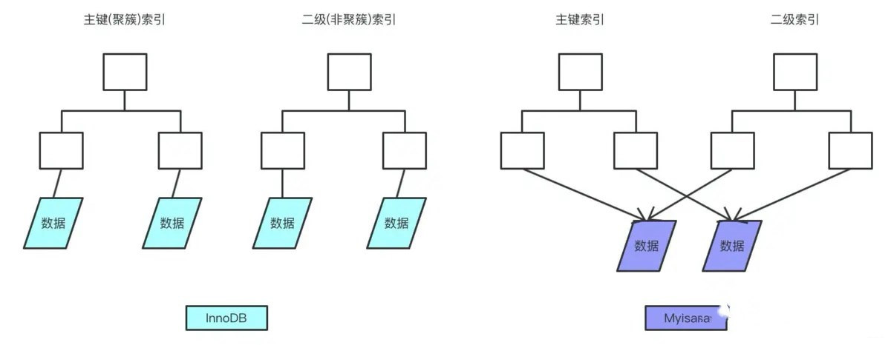
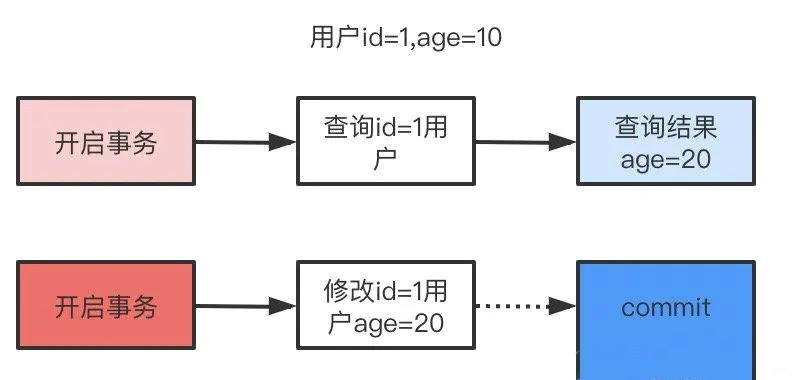
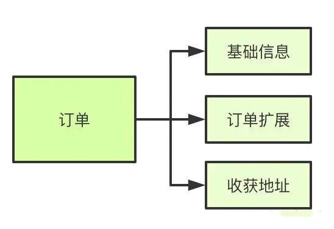
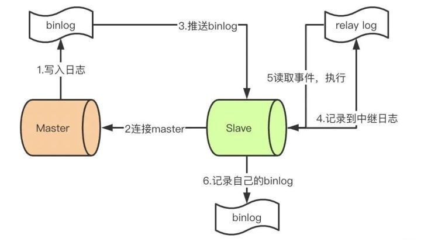

## Mysql(下)

#### 1.能说下myisam 和 innodb的区别吗？

myisam引擎是5.1版本之前的默认引擎，支持全文检索、压缩、空间函数等，但是不支持事务和行级锁，所以一般用于有大量查询少量插入的场景来使用，而且myisam不支持外键，并且索引和数据是分开存储的。

innodb是基于聚簇索引建立的，和myisam相反它支持事务、外键，并且通过MVCC来支持高并发，索引和数据存储在一起。


#### 2.说下mysql的索引有哪些吧，聚簇和非聚簇索引又是什么？

索引按照数据结构来说主要包含 B + 树和 Hash 索引。

假设我们有张表，结构如下：

```
create table user(
id int(11) not null, 
age int(11) not null,
primary key(id), key(age) 
);
```

B + 树是左小右大的顺序存储结构，节点只包含 id 索引列，而叶子节点包含索引列和数据，这种数据和索引在一起存储的索引方式叫做聚簇索引，一张表只能有一个聚簇索引。假设没有定义主键，InnoDB 会选择一个唯一的非空索引代替，如果没有的话则会隐式定义一个主键作为聚簇索引。




这是主键聚簇索引存储的结构，那么非聚簇索引的结构是什么样子呢？非聚簇索引 (二级索引) 保存的是主键 id 值，这一点和 myisam 保存的是数据地址是不同的。




最终，我们一张图看看 InnoDB 和 Myisam 聚簇和非聚簇索引的区别




#### 3.那你知道什么是覆盖索引和回表吗？

覆盖索引指的是在一次查询中，如果一个索引包含或者说覆盖所有需要查询的字段的值，我们就称之为覆盖索引，而不再需要回表查询。

而要确定一个查询是否是覆盖索引，我们只需要 explain sql 语句看 Extra 的结果是否是 “Using index” 即可。

以上面的 user 表来举例，我们再增加一个 name 字段，然后做一些查询试试。

```
explain select * from user where age=1; // 查询的 name 无法从索引数据获取
explain select id,age from user where age=1; // 可以直接从索引获取
```

#### 4、锁的类型有哪些呢

mysql 锁分为共享锁和排他锁，也叫做读锁和写锁。

读锁是共享的，可以通过 lock in share mode 实现，这时候只能读不能写。

写锁是排他的，它会阻塞其他的写锁和读锁。从颗粒度来区分，可以分为表锁和行锁两种。

表锁会锁定整张表并且阻塞其他用户对该表的所有读写操作，比如 alter 修改表结构的时候会锁表。

行锁又可以分为乐观锁和悲观锁，悲观锁可以通过 for update 实现，乐观锁则通过版本号实现。

#### 5、你能说下事务的基本特性和隔离级别吗？

事务基本特性 ACID 分别是：

原子性指的是一个事务中的操作要么全部成功，要么全部失败。

一致性指的是数据库总是从一个一致性的状态转换到另外一个一致性的状态。比如 A 转账给 B100 块钱，假设中间 sql 执行过程中系统崩溃 A 也不会损失 100 块，因为事务没有提交，修改也就不会保存到数据库。

隔离性指的是一个事务的修改在最终提交前，对其他事务是不可见的。

持久性指的是一旦事务提交，所做的修改就会永久保存到数据库中。

而隔离性有 4 个隔离级别，分别是：

read uncommit 读未提交，可能会读到其他事务未提交的数据，也叫做脏读。

用户本来应该读取到 id=1 的用户 age 应该是 10，结果读取到了其他事务还没有提交的事务，结果读取结果 age=20，这就是脏读。




read commit 读已提交，两次读取结果不一致，叫做不可重复读。

不可重复读解决了脏读的问题，他只会读取已经提交的事务。

用户开启事务读取 id=1 用户，查询到 age=10，再次读取发现结果 = 20，在同一个事务里同一个查询读取到不同的结果叫做不可重复读。


repeatable read 可重复复读，这是 mysql 的默认级别，就是每次读取结果都一样，但是有可能产生幻读。

serializable 串行，一般是不会使用的，他会给每一行读取的数据加锁，会导致大量超时和锁竞争的问题。

#### 6、那 ACID 靠什么保证的呢？

A 原子性由 undo log 日志保证，它记录了需要回滚的日志信息，事务回滚时撤销已经执行成功的 sql

C 一致性一般由代码层面来保证

I 隔离性由 MVCC 来保证

D 持久性由内存 + redo log 来保证，mysql 修改数据同时在内存和 redo log 记录这次操作，事务提交的时候通过 redo log 刷盘，宕机的时候可以从 redo log 恢复

#### 7、那你说说什么是幻读，什么是 MVCC？

要说幻读，首先要了解 MVCC，MVCC 叫做多版本并发控制，实际上就是保存了数据在某个时间节点的快照。

我们每行数实际上隐藏了两列，创建时间版本号，过期 (删除) 时间版本号，每开始一个新的事务，版本号都会自动递增。

还是拿上面的 user 表举例子，假设我们插入两条数据，他们实际上应该长这样。

a-draft-type=“table” data-size=“normal” data-row-style=“normal”>
id name create_version delete_version
这时候假设小明去执行查询，此时 current_version=3

select * from user where id<=3; 

同时，小红在这时候开启事务去修改 id=1 的记录，current_version=4

update user set name=‘张三三’ where id=1; 

执行成功后的结果是这样的

a-draft-type=“table” data-size=“normal” data-row-style=“normal”>
id name create_version delete_version
如果这时候还有小黑在删除 id=2 的数据，current_version=5，执行后结果是这样的。

a-draft-type=“table” data-size=“normal” data-row-style=“normal”>
id name create_version delete_version
由于 MVCC 的原理是查找创建版本小于或等于当前事务版本，删除版本为空或者大于当前事务版本，小明的真实的查询应该是这样

select * from user where id<=3 and create_version<=3 and (delete_version>3 or delete_version is null); 

所以小明最后查询到的 id=1 的名字还是’张三’，并且 id=2 的记录也能查询到。这样做是为了保证事务读取的数据是在事务开始前就已经存在的，要么是事务自己插入或者修改的。

明白 MVCC 原理，我们来说什么是幻读就简单多了。举一个常见的场景，用户注册时，我们先查询用户名是否存在，不存在就插入，假定用户名是唯一索引。

小明开启事务 current_version=6 查询名字为’王五’的记录，发现不存在。
小红开启事务 current_version=7 插入一条数据，结果是这样：
a-draft-type=“table” data-size=“normal” data-row-style=“normal”>
id Name create_version delete_version
小明执行插入名字’王五’的记录，发现唯一索引冲突，无法插入，这就是幻读。

#### 8、 那你知道什么是间隙锁吗？

间隙锁是可重复读级别下才会有的锁，结合 MVCC 和间隙锁可以解决幻读的问题。我们还是以 user 举例，假设现在 user 表有几条记录

e data-draft-node=“block” data-draft-type=“table” data-size=“normal” data-row-style=“normal”>
当我们执行：

begin; 

select * from user where age=20 for update;

 begin;

 insert into user(age) values(10); #成功

 insert into user(age) values(11); #失败

 insert into user(age) values(20); #失败 

insert into user(age) values(21); #失败

 insert into user(age) values(30); #失败


只有 10 可以插入成功，那么因为表的间隙 mysql 自动帮我们生成了区间 (左开右闭)

(negative infinity，10],(10,20],(20,30],(30,positive infinity)

由于 20 存在记录，所以 (10,20]，(20,30] 区间都被锁定了无法插入、删除。

如果查询 21 呢？就会根据 21 定位到 (20,30) 的区间(都是开区间)。

需要注意的是唯一索引是不会有间隙索引的。

#### 9、你们数据量级多大？分库分表怎么做的？

首先分库分表分为垂直和水平两个方式，一般来说我们拆分的顺序是先垂直后水平。

**垂直分库**

基于现在微服务拆分来说，都是已经做到了垂直分库了。


**垂直分表**

如果表字段比较多，将不常用的、数据较大的等等做拆分。


**水平分表**

首先根据业务场景来决定使用什么字段作为分表字段 (sharding_key)，比如我们现在日订单 1000 万，我们大部分的场景来源于 C 端，我们可以用 user_id 作为 sharding_key，数据查询支持到最近 3 个月的订单，超过 3 个月的做归档处理，那么 3 个月的数据量就是 9 亿，可以分 1024 张表，那么每张表的数据大概就在 100 万左右。

比如用户 id 为 100，那我们都经过 hash(100)，然后对 1024 取模，就可以落到对应的表上了。

#### 10、那分表后的 ID 怎么保证唯一性的呢？

因为我们主键默认都是自增的，那么分表之后的主键在不同表就肯定会有冲突了。有几个办法考虑：

1. 设定步长，比如 1-1024 张表我们分别设定 1-1024 的基础步长，这样主键落到不同的表就不会冲突了。
2. 分布式 ID，自己实现一套分布式 ID 生成算法或者使用开源的比如雪花算法这种。
3. 分表后不使用主键作为查询依据，而是每张表单独新增一个字段作为唯一主键使用，比如订单表订单号是唯一的，不管最终落在哪张表都基于订单号作为查询依据，更新也一样。

#### 11、 分表后非 sharding_key 的查询怎么处理呢？

1. 可以做一个 mapping 表，比如这时候商家要查询订单列表怎么办呢？不带 user_id 查询的话你总不能扫全表吧？所以我们可以做一个映射关系表，保存商家和用户的关系，查询的时候先通过商家查询到用户列表，再通过 user_id 去查询。
2. 打宽表，一般而言，商户端对数据实时性要求并不是很高，比如查询订单列表，可以把订单表同步到离线（实时）数仓，再基于数仓去做成一张宽表，再基于其他如 es 提供查询服务。
3. 数据量不是很大的话，比如后台的一些查询之类的，也可以通过多线程扫表，然后再聚合结果的方式来做。或者异步的形式也是可以的。

```
List<Callable<List<User>>> taskList = Lists.newArrayList(); for (int shardingIndex = 0; shardingIndex < 1024; shardingIndex++) { taskList.add(() -> (userMapper.getProcessingAccountList(shardingIndex))); } List<ThirdAccountInfo> list = null; try { list = taskExecutor.executeTask(taskList); } catch (Exception e) { //do something } public class TaskExecutor { public <T> List<T> executeTask(Collection<? extends Callable<T>> tasks) throws Exception { List<T> result = Lists.newArrayList(); List<Future<T>> futures = ExecutorUtil.invokeAll(tasks); for (Future<T> future : futures) { result.add(future.get()); } return result; } }
```

#### 12、说说 mysql 主从同步怎么做的吧？

首先先了解 mysql 主从同步的原理

1. master 提交完事务后，写入 binlog

2. slave 连接到 master，获取 binlog

3. master 创建 dump 线程，推送 binglog 到 slave

4. slave 启动一个 IO 线程读取同步过来的 master 的 binlog，记录到 relay log 中继日志中

5. slave 再开启一个 sql 线程读取 relay log 事件并在 slave 执行，完成同步

6. slave 记录自己的 binglog

   

   由于 mysql 默认的复制方式是异步的，主库把日志发送给从库后不关心从库是否已经处理，这样会产生一个问题就是假设主库挂了，从库处理失败了，这时候从库升为主库后，日志就丢失了。由此产生两个概念。

**全同步复制**

主库写入 binlog 后强制同步日志到从库，所有的从库都执行完成后才返回给客户端，但是很显然这个方式的话性能会受到严重影响。

**半同步复制**

和全同步不同的是，半同步复制的逻辑是这样，从库写入日志成功后返回 ACK 确认给主库，主库收到至少一个从库的确认就认为写操作完成。

#### 13、那主从的延迟怎么解决呢？

这个问题貌似真的是个无解的问题，只能是说自己来判断了，需要走主库的强制走主库查询。

#### 14.Mysql中有哪几种锁？

1.表级锁：开销小，加锁快；不会出现死锁；锁定粒度大，发生锁冲突的概率最高，并发度最低。

2.行级锁：开销大，加锁慢；会出现死锁；锁定粒度最小，发生锁冲突的概率最低，并发度也最高。

3.页面锁：开销和加锁时间界于表锁和行锁之间；会出现死锁；锁定粒度界于表锁和行锁之间，并发度一般。

#### 15.主键和候选键有什么区别？

表格的每一行都由主键唯一标识,一个表只有一个主键。

主键也是候选键。按照惯例，候选键可以被指定为主键，并且可以用于任何外键引用。

#### 16.myisamchk是用来做什么的？

它用来压缩MyISAM表，这减少了磁盘或内存使用。

#### 17.MyISAM Static和MyISAM Dynamic有什么区别？

在MyISAM Static上的所有字段有固定宽度。动态MyISAM表将具有像TEXT，BLOB等字段，以适应不同长度的数据类型。

MyISAM Static在受损情况下更容易恢复。

#### 18.如果一个表有一列定义为TIMESTAMP，将发生什么？

每当行被更改时，时间戳字段将获取当前时间戳。

#### 19.列设置为AUTO INCREMENT时，如果在表中达到最大值，会发生什么情况？

它会停止递增，任何进一步的插入都将产生错误，因为密钥已被使用。

#### 20.怎样才能找出最后一次插入时分配了哪个自动增量？

LAST_INSERT_ID将返回由Auto_increment分配的最后一个值，并且不需要指定表名称。

#### 21.你怎么看到为表格定义的所有索引？

索引是通过以下方式为表格定义的：

SHOW INDEX FROM
<tablename>;

#### 22.LIKE声明中的％和_是什么意思？

％对应于0个或更多字符，_只是LIKE语句中的一个字符。

#### 23.如何在Unix和Mysql时间戳之间进行转换？

UNIX_TIMESTAMP是从Mysql时间戳转换为Unix时间戳的命令
FROM_UNIXTIME是从Unix时间戳转换为Mysql时间戳的命令

#### 24.列对比运算符是什么？

在SELECT语句的列比较中使用=，<>，<=，<，> =，>，<<，>>，<=>，AND，OR或LIKE运算符。

#### 25.BLOB和TEXT有什么区别？

BLOB是一个二进制对象，可以容纳可变数量的数据。TEXT是一个不区分大小写的BLOB。

BLOB和TEXT类型之间的唯一区别在于对BLOB值进行排序和比较时区分大小写，对TEXT值不区分大小写。

#### 26.mysql_fetch_array和mysql_fetch_object的区别是什么？

以下是mysql_fetch_array和mysql_fetch_object的区别：

mysql_fetch_array（） – 将结果行作为关联数组或来自数据库的常规数组返回。

mysql_fetch_object – 从数据库返回结果行作为对象。

#### 27.MyISAM表格将在哪里存储，并且还提供其存储格式？

每个MyISAM表格以三种格式存储在磁盘上：

·“.frm”文件存储表定义

·数据文件具有“.MYD”（MYData）扩展名

索引文件具有“.MYI”（MYIndex）扩展名

#### 28.Mysql如何优化DISTINCT？

DISTINCT在所有列上转换为GROUP BY，并与ORDER BY子句结合使用。

1

SELECT DISTINCT t1.a FROM t1,t2 where t1.a=t2.a;

#### 29.如何显示前50行？

在Mysql中，使用以下代码查询显示前50行：

SELECT*FROM

LIMIT 0,50;

#### 30.可以使用多少列创建索引？

任何标准表最多可以创建16个索引列。

#### 31.NOW（）和CURRENT_DATE（）有什么区别？

NOW（）命令用于显示当前年份，月份，日期，小时，分钟和秒。

CURRENT_DATE（）仅显示当前年份，月份和日期。

#### 32.什么是非标准字符串类型？

1. TINYTEXT
2. TEXT
3. MEDIUMTEXT
4. LONGTEXT

#### 33.什么是通用SQL函数？

1. CONCAT(A, B) – 连接两个字符串值以创建单个字符串输出。通常用于将两个或多个字段合并为一个字段。
2. FORMAT(X, D)- 格式化数字X到D有效数字。
3. CURRDATE(), CURRTIME()- 返回当前日期或时间。
4. NOW（） – 将当前日期和时间作为一个值返回。
5. MONTH（），DAY（），YEAR（），WEEK（），WEEKDAY（） – 从日期值中提取给定数据。
6. HOUR（），MINUTE（），SECOND（） – 从时间值中提取给定数据。
7. DATEDIFF（A，B） – 确定两个日期之间的差异，通常用于计算年龄
8. SUBTIMES（A，B） – 确定两次之间的差异。
9. FROMDAYS（INT） – 将整数天数转换为日期值。

#### 34.mysql里记录货币用什么字段类型好

NUMERIC和DECIMAL类型被Mysql实现为同样的类型，这在SQL92标准允许。他们被用于保存值，该值的准确精度是极其重要的值，例如与金钱有关的数据。当声明一个类是这些类型之一时，精度和规模的能被(并且通常是)指定。

例如：

salary DECIMAL(9,2)

在这个例子中，9(precision)代表将被用于存储值的总的小数位数，而2(scale)代表将被用于存储小数点后的位数。

因此，在这种情况下，能被存储在salary列中的值的范围是从-9999999.99到9999999.99。

#### 35.mysql有关权限的表都有哪几个？

Mysql服务器通过权限表来控制用户对数据库的访问，权限表存放在mysql数据库里，由mysql_install_db脚本初始化。这些权限表分别user，db，table_priv，columns_priv和host。

#### 36.列的字符串类型可以是什么？

字符串类型是：

1. SET
2. BLOB
3. ENUM
4. CHAR
5. TEXT

#### 37.MySQL数据库作发布系统的存储，一天五万条以上的增量，预计运维三年,怎么优化？

a. 设计良好的数据库结构，允许部分数据冗余，尽量避免join查询，提高效率。
b. 选择合适的表字段数据类型和存储引擎，适当的添加索引。
c. mysql库主从读写分离。
d. 找规律分表，减少单表中的数据量提高查询速度。
e。添加缓存机制，比如memcached，apc等。
f. 不经常改动的页面，生成静态页面。
g. 书写高效率的SQL。比如 SELECT * FROM TABEL 改为 SELECT field_1, field_2, field_3 FROM TABLE.

#### 38.锁的优化策略

1. 读写分离

2. 分段加锁

3. 减少锁持有的时间

4. 多个线程尽量以相同的顺序去获取资源

不能将锁的粒度过于细化，不然可能会出现线程的加锁和释放次数过多，反而效率不如一次加一把大锁。

#### 39.索引的底层实现原理和优化

B+树，经过优化的B+树

主要是在所有的叶子结点中增加了指向下一个叶子节点的指针，因此InnoDB建议为大部分表使用默认自增的主键作为主索引。

#### 40.什么情况下设置了索引但无法使用

​     1.以“%”开头的LIKE语句，模糊匹配

2. OR语句前后没有同时使用索引

3. 数据类型出现隐式转化（如varchar不加单引号的话可能会自动转换为int型）

#### 41.实践中如何优化MySQL

最好是按照以下顺序优化：

1.SQL语句及索引的优化

2.数据库表结构的优化

3.系统配置的优化

4.硬件的优化

详细可以查看 [阿里P8架构师谈：MySQL慢查询优化、索引优化、以及表等优化总结](https://link.zhihu.com/?target=http%3A//youzhixueyuan.com/mysql-slow-query-optimization-index-optimization.html)

#### 42.优化数据库的方法

1. 选取最适用的字段属性，尽可能减少定义字段宽度，尽量把字段设置NOTNULL，例如’省份’、’性别’最好适用ENUM
2. 使用连接(JOIN)来代替子查询
3. 适用联合(UNION)来代替手动创建的临时表
4. 事务处理
5. 锁定表、优化事务处理
6. 适用外键，优化锁定表
7. 建立索引
8. 优化查询语句

#### 43.简单描述mysql中，索引，主键，唯一索引，联合索引的区别，对数据库的性能有什么影响（从读写两方面）

索引是一种特殊的文件(InnoDB数据表上的索引是表空间的一个组成部分)，它们包含着对数据表里所有记录的引用指针。

普通索引(由关键字KEY或INDEX定义的索引)的唯一任务是加快对数据的访问速度。

普通索引允许被索引的数据列包含重复的值。如果能确定某个数据列将只包含彼此各不相同的值，在为这个数据列创建索引的时候就应该用关键字UNIQUE把它定义为一个唯一索引。也就是说，唯一索引可以保证数据记录的唯一性。

主键，是一种特殊的唯一索引，在一张表中只能定义一个主键索引，主键用于唯一标识一条记录，使用关键字 PRIMARY KEY 来创建。

索引可以覆盖多个数据列，如像INDEX(columnA, columnB)索引，这就是联合索引。

索引可以极大的提高数据的查询速度，但是会降低插入、删除、更新表的速度，因为在执行这些写操作时，还要操作索引文件。

#### 44.SQL注入漏洞产生的原因？如何防止？

SQL注入产生的原因：程序开发过程中不注意规范书写sql语句和对特殊字符进行过滤，导致客户端可以通过全局变量POST和GET提交一些sql语句正常执行。

防止SQL注入的方式：
开启配置文件中的magic_quotes_gpc 和 magic_quotes_runtime设置

执行sql语句时使用addslashes进行sql语句转换

Sql语句书写尽量不要省略双引号和单引号。

过滤掉sql语句中的一些关键词：update、insert、delete、select、 * 。

提高数据库表和字段的命名技巧，对一些重要的字段根据程序的特点命名，取不易被猜到的。

#### 45.为表中得字段选择合适得数据类型

字段类型优先级: 整形>date,time>enum,char>varchar>blob,text
优先考虑数字类型，其次是日期或者二进制类型，最后是字符串类型，同级别得数据类型，应该优先选择占用空间小的数据类型

**存储时期**

Datatime:以 YYYY-MM-DD HH:MM:SS 格式存储时期时间，精确到秒，占用8个字节得存储空间，datatime类型与时区无关
Timestamp:以时间戳格式存储，占用4个字节，范围小1970-1-1到2038-1-19，显示依赖于所指定得时区，默认在第一个列行的数据修改时可以自动得修改timestamp列得值
Date:（生日）占用得字节数比使用字符串.[http://datatime.int](https://link.zhihu.com/?target=http%3A//datatime.int)储存要少，使用date只需要3个字节，存储日期月份，还可以利用日期时间函数进行日期间得计算
Time:存储时间部分得数据
注意:不要使用字符串类型来存储日期时间数据（通常比字符串占用得储存空间小，在进行查找过滤可以利用日期得函数）
使用int存储日期时间不如使用timestamp类型

#### 46.对于关系型数据库而言，索引是相当重要的概念，请回答有关索引的几个问题：

1.索引的目的是什么？
快速访问数据表中的特定信息，提高检索速度
创建唯一性索引，保证数据库表中每一行数据的唯一性。
加速表和表之间的连接

使用分组和排序子句进行数据检索时，可以显著减少查询中分组和排序的时间

2.索引对数据库系统的负面影响是什么？
负面影响：
创建索引和维护索引需要耗费时间，这个时间随着数据量的增加而增加；索引需要占用物理空间，不光是表需要占用数据空间，每个索引也需要占用物理空间；当对表进行增、删、改、的时候索引也要动态维护，这样就降低了数据的维护速度。

3.为数据表建立索引的原则有哪些？
在最频繁使用的、用以缩小查询范围的字段上建立索引。

在频繁使用的、需要排序的字段上建立索引

4.什么情况下不宜建立索引？
对于查询中很少涉及的列或者重复值比较多的列，不宜建立索引。

对于一些特殊的数据类型，不宜建立索引，比如文本字段（text）等

#### 47.解释MySQL外连接、内连接与自连接的区别

先说什么是交叉连接: 交叉连接又叫笛卡尔积，它是指不使用任何条件，直接将一个表的所有记录和另一个表中的所有记录一一匹配。

内连接 则是只有条件的交叉连接，根据某个条件筛选出符合条件的记录，不符合条件的记录不会出现在结果集中，即内连接只连接匹配的行。
外连接 其结果集中不仅包含符合连接条件的行，而且还会包括左表、右表或两个表中
的所有数据行，这三种情况依次称之为左外连接，右外连接，和全外连接。

左外连接，也称左连接，左表为主表，左表中的所有记录都会出现在结果集中，对于那些在右表中并没有匹配的记录，仍然要显示，右边对应的那些字段值以NULL来填充。右外连接，也称右连接，右表为主表，右表中的所有记录都会出现在结果集中。左连接和右连接可以互换，MySQL目前还不支持全外连接。

#### 48.Myql中的事务回滚机制概述

事务是用户定义的一个数据库操作序列，这些操作要么全做要么全不做，是一个不可分割的工作单位，事务回滚是指将该事务已经完成的对数据库的更新操作撤销。

要同时修改数据库中两个不同表时，如果它们不是一个事务的话，当第一个表修改完，可能第二个表修改过程中出现了异常而没能修改，此时就只有第二个表依旧是未修改之前的状态，而第一个表已经被修改完毕。而当你把它们设定为一个事务的时候，当第一个表修改完，第二表修改出现异常而没能修改，第一个表和第二个表都要回到未修改的状态，这就是所谓的事务回滚

#### 49.SQL语言包括哪几部分？每部分都有哪些操作关键字？

SQL语言包括数据定义(DDL)、数据操纵(DML),数据控制(DCL)和数据查询（DQL）四个部分。

数据定义：Create Table,Alter Table,Drop Table, Craete/Drop Index等

数据操纵：Select ,insert,update,delete,

数据控制：grant,revoke

数据查询：select

#### 50.完整性约束包括哪些？

数据完整性(Data Integrity)是指数据的精确(Accuracy)和可靠性(Reliability)。

**分为以下四类：**

1) 实体完整性：规定表的每一行在表中是惟一的实体。

2) 域完整性：是指表中的列必须满足某种特定的数据类型约束，其中约束又包括取值范围、精度等规定。

3) 参照完整性：是指两个表的主关键字和外关键字的数据应一致，保证了表之间的数据的一致性，防止了数据丢失或无意义的数据在数据库中扩散。

4) 用户定义的完整性：不同的关系数据库系统根据其应用环境的不同，往往还需要一些特殊的约束条件。用户定义的完整性即是针对某个特定关系数据库的约束条件，它反映某一具体应用必须满足的语义要求。

与表有关的约束：包括列约束(NOT NULL（非空约束）)和表约束(PRIMARY KEY、foreign key、check、UNIQUE) 。

#### 参考

https://zhuanlan.zhihu.com/p/59838091

https://blog.csdn.net/m0_45270667/article/details/108950184

