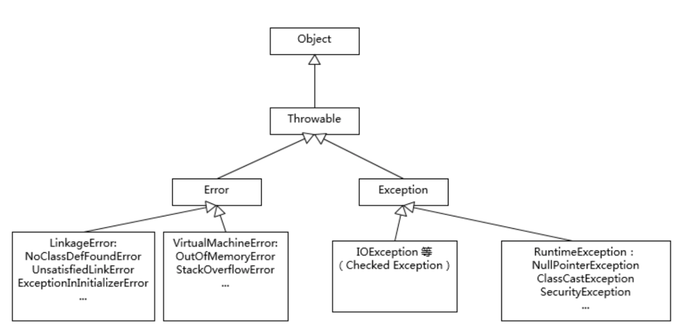

## 异常&反射



#### 1.**error和exception有什么区别**？

error表示系统级的错误，是java运行环境内部错误或者硬件问题，不能指望程序来处理这样的问题，除了退出运行外别无选择，它是Java虚拟机抛出的。

exception 表示程序需要捕捉、需要处理的异常，是由与程序设计的不完善而出现的问题，程序必须处理的问题。

#### 2.说出5个常见的**RuntimeException**？

(1)Java.lang.NullPointerException 空指针异常;出现原因：调用了未经初始化的对象或者是不存在的对象。

(2)Java.lang.NumberFormatException 字符串转换为数字异常;出现原因：字符型数据中包含非数字型字符。

(3)Java.lang.IndexOutOfBoundsException 数组角标越界异常，常见于操作数组对象时发生。

(4)Java.lang.IllegalArgumentException 方法传递参数错误。

(5)Java.lang.ClassCastException 数据类型转换异常。

#### 3.**throw和throws的区别**?

throw：

　　(1)throw 语句用在方法体内，表示抛出异常，由方法体内的语句处理。

　　(2)throw 是具体向外抛出异常的动作，所以它抛出的是一个异常实例，执行 throw 一定是抛出了某种异常。

throws：

​       (1)@throws 语句是用在方法声明后面，表示如果抛出异常，由该方法的调用者来进行异常的处理。

​       (2)throws 主要是声明这个方法会抛出某种类型的异常，让它的使用者要知道需要捕获的异常的类型。

​       (3)throws 表示出现异常的一种可能性，并不一定会发生这种异常。

#### 4.Java中异常分类

按照异常处理时机:

编译时异常(受控异常(CheckedException))和运行时异常(非受控异常(UnCheckedException))

#### 5.如何自定义异常

继承Exception是检查性异常，继承RuntimeException是非检查性异常，一般要复写两个构造方法，用throw抛出新异常

如果同时有很多异常抛出，那可能就是异常链，就是一个异常引发另一个异常，另一个异常引发更多异常，一般我们会找它的原始异常来解决问题，一般会在开头或结尾，异常可通过initCause串起来，可以通过自定义异常

#### 6.Java中异常处理

首先处理异常主要有两种方式:一种try catch，一种是throws。

1. try catch:

- try{} 中放入可能发生异常的代码。catch{}中放入对捕获到异常之后的处理。

2.throw throws：

- throw是语句抛出异常，出现于函数内部，用来抛出一个具体异常实例，throw被执行后面的语句不起作用，直接转入异常处理阶段。
- throws是函数方法抛出异常，一般写在方法的头部，抛出异常，给方法的调用者进行解决。

#### 7.常见的异常

NullPointException：空指针异常，对象是null时会抛出，在调用传入对象时尽量判断是否为null，Jdk8里面可以用Optional对象来避免

IndexOutOfBoundsException：数组下标越界，数组的下标超过了最大值时会抛出，在迭代循环时检查下标是否越界

NumberFormatException：数字类型转化异常，将非数字类型转成数字类型，将类型转化的代码catch住

ClassCastException：类型转换异常，发生在强转时，将不同类型转成同一类型，尽量少用强转，或用instanceof（判断继承中子类的实例是否是父类的实现）做类型判断，或多用泛型

FileNotFoundException：找不到指定文件，文件路径错误或文件不存在，可能用了绝对路径检查文件是否存在，路径是否写错，多用相对路径

ClassNotFoundException：在classpath中找不到引用的类缺乏引用当前类的jar或没有设置classpath或jar损坏-，找到jar并放入classpath中或检查jar是否损坏

OutOfMemoryError：内存溢出异常，产生对象太多，内存不够->不要在循环体重创建大量对象，或对象及时回收，增大初始化堆：-Xms 增加最大值：-Xmx

NoClassDefFoundError：找不到相应的类错误，缺乏当前引用类的jar或jar版本不对->找到jar并放入classpath中或找到合适的版本

ConcurrentModificationException：并发修改异常，在集合迭代时修改里面的元素->在迭代时不要修改集合或用并发集合做遍历（如：ConcurrentHashMap）

NoSuchMethodError：类里找不到相应的方法，一般是jar版本不对，当前引用的jar版本中没有这个方法->检查jar版本是否正确

UnsupportedClassVersionError:版本不支持错误，编译class的jdk和运行时候的jdk版本不一致或比较高->将低版本换成高版本

StackOverflowError：栈溢出错误，一般是函数的死循环，或递归调用无法退出->检查死循环的代码，或让递归有退出值，或加大栈初始化参数

#### 8.异常打印信息组成

所处线程名字、异常类名、异常信息、异常堆栈、异常的源码，包名，类名，方法名，行数

#### 9.常见方法

getMessage：错误信息的字符串解释

getCause：返回异常产生的原因，一般是原始异常如果不知道原因返回null

printStackTrace：打印异常出现的位置或原因

toString：返回String格式的Throwable信息，此信息包括Throwable的名字和本地化信息

initCause：初始化原始异常

PrintStream和PrintWriter作为产生实现重载，这样就能实现打印栈轨迹到文件或流中

#### 10.如何自定义异常

继承Exception是检查性异常，继承RuntimeException是非检查性异常，一般要复写两个构造方法，用throw抛出新异常

如果同时有很多异常抛出，那可能就是异常链，就是一个异常引发另一个异常，另一个异常引发更多异常，一般我们会找它的原始异常来解决问题，一般会在开头或结尾，异常可通过initCause串起来，可以通过自定义异常

#### 11.什么是Java反射机制?

Java的反射（reflection）机制是指在程序的运行状态中，可以构造任意一个类的对象，可以了解任意一个对象所属的类，可以了解任意一个类的成员变量和方法，可以调用任意一个对象的属性和方法。这种动态获取程序信息以及动态调用对象的功能称为Java语言的反射机制。反射被视为动态语言的关键。

#### 12.举例什么地方用到反射机制？

1. JDBC中，利用反射动态加载了数据库驱动程序。
2. Web服务器中利用反射调用了Sevlet的服务方法。
3. Eclispe等开发工具利用反射动态刨析对象的类型与结构，动态提示对象的属性和方法。
4. 很多框架都用到反射机制，注入属性，调用方法，如Spring。

#### 13.java反射机制的作用

- 在运行时判定任意一个对象所属的类
- 在运行时构造任意一个类的对象；
- 在运行时判定任意一个类所具有的成员变量和方法；
- 在运行时调用任意一个对象的方法；
- 生成动态代理；

#### 14.Java反射机制类

```
java.lang.Class; //类               
java.lang.reflect.Constructor;//构造方法 
java.lang.reflect.Field; //类的成员变量       
java.lang.reflect.Method;//类的方法
java.lang.reflect.Modifier;//访问权限
```

#### 15.反射机制优缺点？

优点：运行期类型的判断，动态加载类，提高代码灵活度。

缺点：性能瓶颈：反射相当于一系列解释操作，通知 JVM 要做的事情，性能比直接的java代码要慢很多。

#### 16.利用反射创建对象?

1.通过一个全限类名创建一个对象 Class.forName(“全限类名”); 

例如：com.mysql.jdbc.Driver Driver类已经被加载到 jvm中，并且完成了类的初始化工作就行了 类名.class; 获取Class<？> clz 对象 对象.getClass(); 

2.获取构造器对象，通过构造器new出一个对象 Clazz.getConstructor([String.class]); Con.newInstance([参数]); 3.通过class对象创建一个实例对象（就相当与new类名（）无参构造器) Cls.newInstance();


#### 参考：

https://blog.csdn.net/qq_37875585/article/details/89340495

https://www.cnblogs.com/whoislcj/p/6038511.html

https://blog.csdn.net/Yang_Hui_Liang/article/details/90238678

