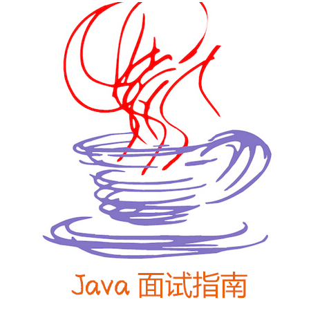
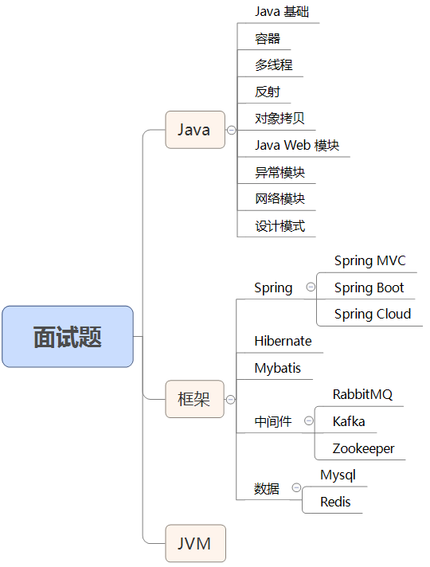

打造最全、解析最清晰的 Java 系列面试题题，持续更新中...

## 2022 年更新内容...

<a href="https://mp.weixin.qq.com/s/cpOXAzdnLrN57-dQGkA-Hw" target="_blank">86：SpringBoot 事务不回滚？怎么解决？</a>

<a href="https://mp.weixin.qq.com/s/4VohiXYi15uVHkAcV8343Q" target="_blank">85：为什么事务@Transactional会失效？</a>

<a href="https://mp.weixin.qq.com/s/4ohJaMwhbhTwav1_y743nA" target="_blank">84：Spring 有几种事务隔离级别？</a>

<a href="https://mp.weixin.qq.com/s/Z4b9HChxs4JaQGFWdctxoQ" target="_blank">83：什么情况会导致@Transactional事务失效？</a>

<a href="https://mp.weixin.qq.com/s/bTYM5LycsSNndU0ugQCMvw" target="_blank">82：SpringBoot 是如何操作事务的？</a>

<a href="https://mp.weixin.qq.com/s/lctKpf0R9NJDhwF1f7oVNw" target="_blank">81：什么是跨域问题？如何解决？</a>

<a href="https://mp.weixin.qq.com/s/BYKhyatvMs8xBG9NeabWWQ" target="_blank">80：说一下 Spring 中 Bean 的生命周期？</a>

<a href="https://mp.weixin.qq.com/s/TNitMuDTA1lik89t34GqLA" target="_blank">79：Bean 作用域是啥？它有几种类型？</a>

<a href="https://mp.weixin.qq.com/s/xpL2g-ZdRq9u6ad-XSNT6w" target="_blank">78：@Autowired 和 @Resource 有什么区别？</a>

<a href="https://mp.weixin.qq.com/s/FPjlJqrEtURuYlxqBXkRCg" target="_blank">77：Spring 依赖注入有几种？各有什么优缺点？</a>

<a href="https://mp.weixin.qq.com/s/atzc0tHYk_t-xjHNwIJlAQ" target="_blank">76：${} 和 #{} 有什么区别？</a>

<a href="https://mp.weixin.qq.com/s/iMyFEGUcBHdKmEcmHsDpyw" target="_blank">75：SpringBoot 有几种读取配置文件的方法？</a>

<a href="https://mp.weixin.qq.com/s/7ccRl9use4XCmMs3dB9zLg" target="_blank">74：properties和yml有什么区别？</a>

<a href="https://mp.weixin.qq.com/s/HQbsydpFzgxxcdbbe71cUA" target="_blank">73：IoC 和 DI 有什么区别？</a>

<a href="https://mp.weixin.qq.com/s/8m938QIUY-qSRd6B3BWeog" target="_blank">72：输入URL之后会执行什么流程？</a>

<a href="https://mp.weixin.qq.com/s/Mp_RWvrLgMrrEq6cZ4Krgg" target="_blank">71：GET 和 POST 有什么区别？</a>

<a href="https://mp.weixin.qq.com/s/casuqOz2J9poAT6QGvq31g" target="_blank">70：什么是粘包和半包？怎么解决？</a>

<a href="https://mp.weixin.qq.com/s/yl870EMNB5Klw1eVZ0KLfA" target="_blank">69：TCP 可靠吗？为什么？</a>

<a href="https://mp.weixin.qq.com/s/ZhZxMpGKRW6ndaTUiEyIVA" target="_blank">68：为什么 TCP 需要 3 次握手？</a>

<a href="https://mp.weixin.qq.com/s/dE3bcd1PAHnvImOrbPFA-Q" target="_blank">67：说一下 TCP/IP 协议？以及每层的作用？</a>

<a href="https://mp.weixin.qq.com/s/-ro11qPt2FO4p8p5Shxkyg" target="_blank">66：请求转发和请求重定向有什么区别？</a>

<a href="https://mp.weixin.qq.com/s/wMSBU1JZHzotXcGHcafjiA" target="_blank">65：HTTPS有什么优点？说一下它的执行流程？</a>

<a href="https://mp.weixin.qq.com/s/B3CYiTwhqFVHfFN09c8nTA" target="_blank">64：了解 HTTP 协议吗？</a>

<a href="https://mp.weixin.qq.com/s/NprMLfMT_1p9PMLGgreVFA" target="_blank">63：MySQL 中如何去重？</a>

<a href="https://mp.weixin.qq.com/s/OOVhdSaBO8uUlANL6gMv-Q" target="_blank">62：group by 有哪些注意事项？</a>

<a href="https://mp.weixin.qq.com/s/XwMT59JcK4R25VC9mDUUww" target="_blank">61：说一下MySQL事务隔离级别？</a>

<a href="https://mp.weixin.qq.com/s/xAqXpxvqVp1j8xfpWLyqeg" target="_blank">60：什么情况会导致 MySQL 索引失效？</a>

<a href="https://mp.weixin.qq.com/s/D4PQslMLt9YIK_0aLEeocg" target="_blank">59：一个表中可以有多个自增列吗？</a>

<a href="https://mp.weixin.qq.com/s/6YmWM2fqpYlmD46CH4eL8A" target="_blank">58：truncate、delete和drop的6大区别！</a>

<a href="https://mp.weixin.qq.com/s/76pA0XXyrRvWXCv_rKuAQA" target="_blank">57：聚簇索引=主键索引吗？</a>

<a href="https://mp.weixin.qq.com/s/tssTN-LnKLYmsIwrWsmjZg" target="_blank">56：聚簇索引和非聚簇索引有什么区别？</a>

<a href="https://mp.weixin.qq.com/s/H67bewH-XQ3XXaaI5TerVA" target="_blank">55：delete、drop、truncate有什么区别？</a>

<a href="https://mp.weixin.qq.com/s/Wd91U2RzyrxJvuJd40Nd4w" target="_blank">54：MySQL 常用引擎有哪些？</a>

<a href="https://mp.weixin.qq.com/s/IAzquyof2psh4ByEmQMMDA" target="_blank">53：常见的 HTTP 状态码有哪些？</a>

<a href="https://mp.weixin.qq.com/s/wgxikt-OkC-G5rl7c_GH7g" target="_blank">52：什么是三范式？它有什么用？</a>

<a href="https://mp.weixin.qq.com/s/fRnaaxRlW-XeytYQoYJX0w" target="_blank">51：为什么单例一定要加 volatile？</a>

<a href="https://mp.weixin.qq.com/s/Hbxe2rKS0lv4yijQ30-x3w" target="_blank">50：单例模式有几种写法？</a>

<a href="https://mp.weixin.qq.com/s/pMVAK8Pja6ZPgmAV1Vk58w" target="_blank">49：说一下 JUC 中的 Exchange 交换器？</a>

<a href="https://mp.weixin.qq.com/s/mOIrI_vUMH5X8WtlWe6ybw" target="_blank">48：死锁的排查工具有哪些？</a>

<a href="https://mp.weixin.qq.com/s/gq7w-V493OsRpezAZXzXog" target="_blank">47：死锁产生的原因有哪些？</a>

<a href="https://mp.weixin.qq.com/s/eogvOQGLxzisbZODR8PluA" target="_blank">46：公平锁和非公平锁有什么区别？</a>

<a href="https://mp.weixin.qq.com/s/yKhds17qnXimAz38TvYVzw" target="_blank">45：为什么要用读写锁？它有什么优点？</a>

<a href="https://mp.weixin.qq.com/s/QSvbR70J-Za4q_0kpCglLA" target="_blank">44：volatile 有什么用？</a>

<a href="https://mp.weixin.qq.com/s/9DlTC2uaQ6A3tWuxWDD0dg" target="_blank">43：lock、tryLock、lockInterruptibly有什么区别？</a>

<a href="https://mp.weixin.qq.com/s/DZR5XdJUYka68fyxmHJNLA" target="_blank">42：synchronized和ReentrantLock有什么区别？</a>

<a href="https://mp.weixin.qq.com/s/jiwF2Rw7Znf5dnW-hw-WDA" target="_blank">41：notify是随机唤醒吗？</a>

<a href="https://mp.weixin.qq.com/s/1x4KdT4tEfGLJrItF454ww" target="_blank">40：线程休眠的方法有几种？</a>

<a href="https://mp.weixin.qq.com/s/Ek-JGBZwKLJCROh5xdfsiw" target="_blank">39：synchronized底层是如何实现的？</a>

<a href="https://mp.weixin.qq.com/s/T7VonKk_rN_W8SeH6Wvg-g" target="_blank">38：synchronized有几种用法？</a>

<a href="https://mp.weixin.qq.com/s/lB7Xn0Y_JdGyKUJITxhfzw" target="_blank">37：线程安全问题的解决方案有哪些？</a>

<a href="https://mp.weixin.qq.com/s/BKp1c1gMsXWSNy3-8-FH0Q" target="_blank">36：线程安全问题是怎么产生的？</a>

<a href="https://mp.weixin.qq.com/s/DNaFXrxFJjvNxwZIbDmsQA" target="_blank">35：如何判断线程池已经执行完所有任务了？</a>

<a href="https://mp.weixin.qq.com/s/-39ZMLDXrBdQduGH1f4IoA" target="_blank">34：如何使用线程池执行定时任务？</a>

<a href="https://mp.weixin.qq.com/s/5qD1bX0bXBbU_7TdXNWdZw" target="_blank">33：线程池有哪些状态？状态是如何转换的？</a>

<a href="https://mp.weixin.qq.com/s/ssvWP5unLjucJL7vRvWV8Q" target="_blank">32：为什么创建线程池一定要用ThreadPoolExecutor？</a>

<a href="https://mp.weixin.qq.com/s/7wqa3Q7BVgSRja1bSO5SJQ" target="_blank">31：什么是守护线程？它和用户线程有什么区别？</a>

<a href="https://mp.weixin.qq.com/s/hwvEmocK4dqg6Ww7pFzV3w" target="_blank">30：线程池是如何执行的？拒绝策略有哪些？</a>

<a href="https://mp.weixin.qq.com/s/Bd74qpEs20xdRHHN2dWz3A" target="_blank">29：说一下线程池7个参数的含义？</a>

<a href="https://mp.weixin.qq.com/s/OBBqUUx6MQsPXWUjIPoRAw" target="_blank">28：线程池有几种创建方式？推荐使用哪种？</a>

<a href="https://mp.weixin.qq.com/s/UO9GYxAgc3yarY9Fieqm5Q" target="_blank">27：为什么需要线程池？什么是池化技术？</a>

<a href="https://mp.weixin.qq.com/s/yCn5knZmRIHpKc1oGes9lg" target="_blank">26：如何正确停止线程？</a>

<a href="https://mp.weixin.qq.com/s/VwnSAPkvfKa1KnUBNmF7Cg" target="_blank">25：sleep方法和wait方法有什么区别？</a>

<a href="https://mp.weixin.qq.com/s/BWyVLCMq5D98sq8vWa_J9A" target="_blank">24：为什么wait和notify必须放在synchronized中？</a>

<a href="https://mp.weixin.qq.com/s/-Y3HBjeVFOBXlOj4qYiakQ" target="_blank">23：说一下线程生命周期，以及转换过程？</a>

<a href="https://mp.weixin.qq.com/s/hKMu4w_PXJ0mYA4FicKkrQ" target="_blank">22：为什么start方法不能重复调用？而run方法却可以？</a>

<a href="https://mp.weixin.qq.com/s/J3FzYclPQyGl1kofR8xeKQ" target="_blank">21：有哪些创建线程的方法？推荐使用哪种？</a>

<a href="https://mp.weixin.qq.com/s/PHYA51CgPYzg5_o2bKMZ4A" target="_blank">20：进程和线程有什么区别？</a>

<a href="https://mp.weixin.qq.com/s/T0h8-wnnkIRoa5PCtvHA_g" target="_blank">19：为什么ConcurrentHashMap不允许插入null值？</a>

<a href="https://mp.weixin.qq.com/s/uibfTQUPXkdyx6lQoNtyQQ" target="_blank">18：为什么ConcurrentHashMap是线程安全的？</a>

<a href="https://mp.weixin.qq.com/s/RfZEYrkDE1gBoP9VY7FbnA" target="_blank">17：HashMap除了死循环之外，还有什么问题？</a>

<a href="https://mp.weixin.qq.com/s/rOTv9RDsHJxLWlJuPIdB8g" target="_blank">16：为什么HashMap会产生死循环？</a>

<a href="https://mp.weixin.qq.com/s/xX8QdojXdm36yvS5QUy3nA" target="_blank">15：说一下HashMap底层实现？及元素添加流程？</a>

<a href="https://mp.weixin.qq.com/s/6tTF-PPL07no42XXXTBn9w" target="_blank">14：方法重写和方法重载有什么区别？</a>

<a href="https://mp.weixin.qq.com/s/foM_-ozFVjPQ9qn22XnYeA" target="_blank">13.方法优先调用可选参数还是固定参数？</a>

<a href="https://mp.weixin.qq.com/s/4pi1OZx8So6GjHD6yxjB3Q" target="_blank">12.为什么不同返回类型不算方法重载？</a>

<a href="https://mp.weixin.qq.com/s/_I72minTniH5SAtsDaajYA" target="_blank">11.方法重写时需要注意哪些问题？</a>

<a href="https://mp.weixin.qq.com/s/-eXL-Y6DHC_dX65PNQTq6w" target="_blank">10.this和super有什么区别？this能调用到父类吗？</a>

<a href="https://mp.weixin.qq.com/s/kF1F4YgjcxmfAccgAk6m5g" target="_blank">9.接口和抽象类有什么区别？</a>

<a href="https://mp.weixin.qq.com/s/ASknNKns4nDPGhWxqaEEvA" target="_blank">8.HashSet如何保证元素不重复？</a>

<a href="https://mp.weixin.qq.com/s/m-zT_7R8WAvoty7rjSYQAQ" target="_blank">7.如何实现 List 集合去重？</a>

<a href="https://mp.weixin.qq.com/s/X8OW7Cpy1Bu2IJJp52BMcg" target="_blank">6.元素排序Comparable和Comparator有什么区别？</a>

<a href="https://mp.weixin.qq.com/s/Dnkx_uwhZqxipcpGPVVtvg" target="_blank">5.HashMap有几种遍历方法？推荐使用哪种？</a>

<a href="https://mp.weixin.qq.com/s/40zaEJEkQYM3Awk2EwIrWA" target="_blank">4.重写 equals 时为什么一定要重写 hashCode？</a>

<a href="https://mp.weixin.qq.com/s/U3FdjfEWICDPSjgy_WEJSA" target="_blank">3.final、finally、finalize 有什么区别？</a>

<a href="https://mp.weixin.qq.com/s/eR0LmlAXb2w0qe3nzVJnsw" target="_blank">2.说一下final关键字和final的4种用法？</a>

<a href="https://mp.weixin.qq.com/s/i-EzrUVJon3ey3HZMqLWdw" target="_blank">1.int和Integer有什么区别？为什么要有包装类？</a>

## 208 面试题解析

19 个模块，分别是： **Java 基础、容器、多线程、反射、对象拷贝、Java Web 模块、异常、网络、设计模式、Spring/Spring MVC、Spring Boot/Spring Cloud、Hibernate、Mybatis、RabbitMQ、Kafka、Zookeeper、MySql、Redis、JVM** ，如下图所示：

## 目录

[Java 基础部分面试题](doc/200%2B/200_1.md)

[容器部分面试题](doc/200%2B/200_1.md)

[多线程部分面试题](doc/200%2B/200_1.md)

[反射部分面试题](doc/200%2B/200_1.md)

[对象拷贝部分面试题](doc/200%2B/200_2.md)

[Java Web 模块部分面试题](doc/200%2B/200_2.md)

[异常部分面试题网络](doc/200%2B/200_2.md)

[设计模式部分面试题](doc/200%2B/200_3.md)

[Spring/Spring MVC部分面试题](doc/200%2B/200_3.md)

[Spring Boot/Spring Cloud部分面试题](doc/200%2B/200_3.md)

[Hibernate部分面试题](doc/200%2B/200_3.md)

[Mybatis部分面试题](doc/200%2B/200_3.md)

[RabbitMQ部分面试题](doc/200%2B/200_4.md)

[Kafka部分面试题](doc/200%2B/200_4.md)

[Zookeeper部分面试题](doc/200%2B/200_4.md)

[MySql部分面试题](doc/200%2B/200_4.md)

[Redis部分面试题](doc/200%2B/200_4.md)

[JVM部分面试题](doc/200%2B/200_4.md)

## 介绍

此开源项目以“Java 面试题”为切入点，为程序员提供整个职业生涯的服务。这个项目前期的重点是收集和整理一些高质量的面试题，为程序员的职业发展奉献一点力量，更希望聚集更多和我们志趣相投的朋友，来为更多的程序员提供服务。

### 为什么要做这个开源项目？

学的好，不如面的好。

掌握技能和经验固然重要，但面试更重要，因为它才是涨薪的关键。拥有高超的技术 + 超强的面试能力 = 符合自己的高薪工作，而本项目要解决的就是后者。让我们一起卷起来，为了理想中的好工作。

### 投稿

众人拾材火焰高，我们渴望更多的人参与进来，为了帮助更多的人找到理想的工作而奉献自己的一份力量。

**投稿方式**：只需要在本项目下提交 ISsues 进行投稿，为了鼓励大家的踊跃参加，您提交的投稿一经采纳，我们会奖励给投稿人 50 元的购书基金，直接发放现金到您的微信。

