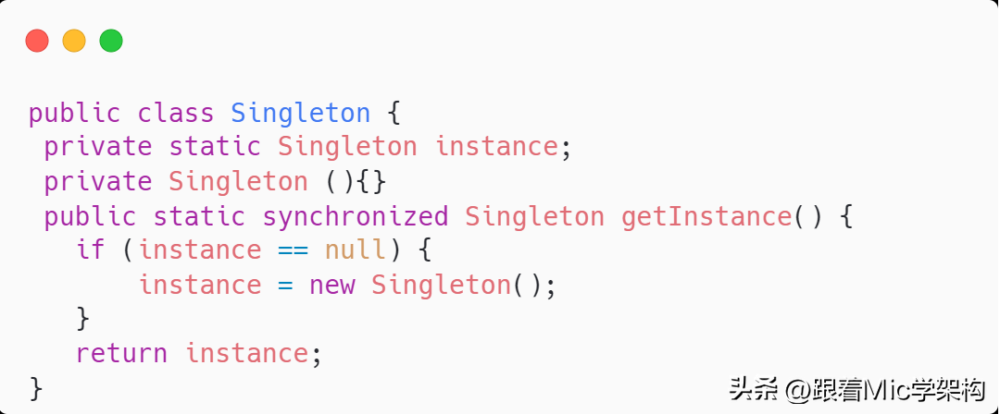
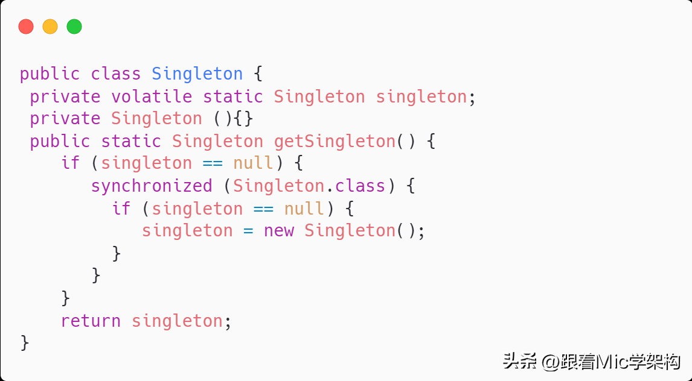
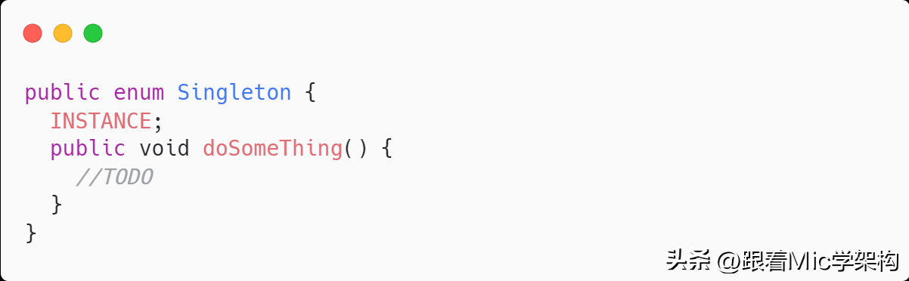

## 跟着mic 学架构
### @Conditional注解有什么用

~~~~
condition注解的一个作用为bean的装载做一个条件判断，只有在满足条件的情况下。spring才会把bean装载到IOC容器里面。而这个条件是我们可以自定义去完成的。我们可以实现condition这个接口，并且重写里面的matches这个方法，去实现自定义的逻辑。所以@condition这个注解，增加了bean的装配的灵活性。在springboot里面对@condition注解做了更进一步的扩展，比如增加了@conditionalOnClass,@conditionOnBean等这样的注解，使得我们在使用的过程中。不再需要些那些条件的逻辑判断。而是可以直接根据数据本身的语义去完成对应的条件的一个装配
~~~~

### 存储MD5的值应该用VARCHAR还是CHAR？
~~~~
我认为应该是用char类型，char类型是一个固定长度的字符串。varchar是一个可变长度的字符串。而md5算法，它所产生的这个数字，他是一个固定长度的。不管数据怎么修改，长度是不变的。这个点呢非常符合char类型的一个特征。另外由于规定长度的，所以在数据变更的时候。不需要进行调整存储空间的一个大小，在效率上会比varchar要更好一些。
~~~~

###  并行和并发有什么区别？
~~~~
并行和并发是Java并发编程里面的概念。
并行，是指在多核CPU架构下，同一时刻同时可以执行多个线程的能力。
在单核CPU架构中，同一时刻只能运行一个线程。
在4核4线程的CPU架构中，同一时刻可以运行4个线程，那这4个线程就是并行执行的。
并发，是指在同一时刻CPU能够处理的任务数量，也可以理解成CPU的并发能力。
在单核CPU架构中，操作系统通过CPU时间片机制提升CPU的并发能力。
在多核CPU架构中，基于任务的并行执行能力以及CPU时间片切换的能力来提升CPU的并发能力。
所以，总的来说，并发是一个宏观概念，它指的是CPU能够承载的压力大小，并行是一个微观概念，它描述CPU同时执行多个任务的能力。
~~~~

###  Mysql中MyISAM和InnoDB引擎有什么区别？

MyISAM和InnoDB都是Mysql里面的两个存储引擎。

在Mysql里面，存储引擎是可以自己扩展的，它的本质其实是定义数据存储的方式以及数据读取的实现逻辑。

而不同存储引擎本身的特性，使得我们可以针对性的选择合适的引擎来实现不同的业务场景。

从而获得更好的性能。

在Mysql 5.5之前，默认的存储引擎是MyISAM，从5.5以后，InnoDB就作为了默认的存储引擎。

在实际应用开发中，我们基本上都是采用InnoDB引擎。

我们先来看一下MyISAM引擎。

MyISAM引擎的数据是通过二进制的方式存储在磁盘上，它在磁盘上体现为两个文件

- 一个是.MYD文件，D代表Data，是MyISAM的数据文件，存放数据记录，
- 一个是.MYI文件，I代表Index，是MyISAM的索引文件，存放索引

实现机制如图所示。

因为索引和数据是分离的，所以在进行查找的时候，先从索引文件中找到数据的磁盘位置，再到数据文件中找到索引对应的数据内容。

在InnoDB存储引擎中，数据同样存储在磁盘上，它在磁盘上只有一个ibd文件，里面包含索引和数据。

它的整体结构如图所示，在B+树的叶子节点里面存储了索引对应的数据，在通过索引进行检索的时候，命中叶子节点，就可以直接从叶子节点中取出行数据。

了解了这两个存储引擎以后，我们在面试的时候该怎么回答呢？

~~~~
基于我的理解，我认为MyISAm和InnoDB的区别有4个，

- 第一个，数据存储的方式不同，MyISAM中的数据和索引是分开存储的，而InnoDB是把索引和数据存储在同一个文件里面。
- 第二个，对于事务的支持不同，MyISAM不支持事务，而InnoDB支持ACID特性的事务处理
- 第三个，对于锁的支持不同，MyISAM只支持表锁，而InnoDB可以根据不同的情况，支持行锁，表锁，间隙锁，临键锁
- 第四个，MyISAM不支持外键，InnoDB支持外键

因此基于这些特性，我们在实际应用中，可以根据不同的场景来选择合适的存储引擎。
比如如果需要支持事务，那必须要选择InnoDB。
如果大部分的表操作都是查询，可以选择MyISAM。
~~~~

资料来源:[Mysql中MyISAM和InnoDB引擎有什么区别？](https://www.toutiao.com/article/7147518399751701022/)

### Java中的单例模式如何实现

单例模式，就是一个类在任何情况下绝对只有一个实例，并且提供一个全局访问点来获取该实例。

要实现单例，至少需要满足两个点：

- 私有化构造方法，防止被外部实例化造成多实例问题
- 提供一个静态方位作为全局访问点来获取唯一的实例对象

在Java里面，至少有6种方法来实现单例。

第一种，是最简单的实现，通过延迟加载的方式进行实例化，并且增加了同步锁机制避免多线程环境下的线程安全问题。

但是这种加锁会造成性能问题，而且同步锁只有在第一次实例化的时候才产生作用，后续不需要。

于是有了第二种改进方案，通过双重检查锁的方式，减少了锁的范围来提升性能

第三种，通过饿汉式实现单例。

这种方式在类加载的时候就触发了实例化，从而避免了多线程同步问题。

另外，我们还可以使用枚举类来实现。

这种写法既能避免多线程同步问题，又能防止反序列化重新创建新对象，也是一个比较好的方案。

回答：

~~~~
我认为可以通过3种方式来实现单例，第一种是通过双重检查锁的方式，它是一种线程安全并且是延迟实例化的方式，但是因为加锁，所以会有性能上的影响。

第二种是通过静态内部类的方式实现，它也是一种延迟实例化，由于它是静态内部类，所以只会使用的时候加载一次，不存在线程安全问题。

第三种是通过枚举类的方式实现，它既是线程安全的，又能防止反序列化导致破坏单例问题。

但是多线程、克隆、反序列化、反射，都有可能会造成单例的破坏。

而我认为，通过枚举的方式实现单例，是能够解决所有可能被破坏的情况
~~~~

文字教程 [「Java面试」快手面试遭遇滑铁卢：Java中的单例模式如何实现](https://www.toutiao.com/article/7146397536012517896/)

视频教程[【Java面试】快手面试遭遇滑铁卢：Java中的单例模式如何实现](https://www.toutiao.com/video/7137181267015139876/)

## 谈谈你对Redis的理解

准确来说，Redis是一个基于内存实现的Key-Value数据结构的Nosql数据库。

注意，这里有三个关键点。

- 内存存储
- key-value结构
- Nosql

所谓内存存储，是指所有数据是存储在内存里面，数据的IO性能比较高。

回答：

~~~~
Redis是一个基于Key-Value存储结构的Nosql开源内存数据库。

它提供了5种常用的数据类型，String、Map、Set、ZSet、List。

针对不同的结构，可以解决不同场景的问题。

因此它可以覆盖应用开发中大部分的业务场景，比如top10问题、好友关注列表、热点话题等。

其次，由于Redis是基于内存存储，并且在数据结构上做了大量的优化

所以IO性能比较好，在实际开发中，会把它作为应用与数据库之间的一个分布式缓存组件。

并且它又是一个非关系型数据的存储，不存在表之间的关联查询问题，所以它可以很好的提升应用程序的数据IO效率。

最后，作为企业级开发来说，它又提供了主从复制+哨兵、以及集群方式实现高可用在Redis集群里面，通过hash槽的方式实现了数据分片，进一步提升了性能。
~~~~

文字教程 [「金九银十必问面试题」谈谈你对Redis的理解](https://www.toutiao.com/article/7141202477369688610/)

视频教程 [「金九银十必问面试题」谈谈你对Redis的理解](https://www.toutiao.com/video/7131992009057370655/)

## 谈谈雪花算法

解决唯一性问题？

~~~~
UUID
Redis的原子递增
数据库的全局表的自增的id
~~~~

还需要满足

~~~~
有序递增
高性能
高可用
带时间戳
~~~~

而雪花算法就是一个比较符合这些特征的全局唯一算法

回答

~~~~
雪花算法是一种生成分布式全局ID的一种算法，它会得到一个64位长度的Long类型的数据，其中这64位的数据。由四个部分组成，第一个Bit位是一个符号位，因为id不会是负数，所以它一般都是0。接着他用41个bit位来表示毫秒单位的时间戳，再用10个bit位来表示机器的id。最后用12个bit位置来表示递增的序列号。然后把这64个bit位拼接成一个long类型的数字，这就是雪花算法的一个实现
~~~~

### 这么回答提升30%的面试通过率，ThreadLocal出现内存泄露吗？

ThreadLocal是一个用来解决线程安全性问题的工具。

它相当于让每个线程都开辟一块内存空间，用来存储共享变量的副本。

然后每个线程只需要访问和操作自己的共享变量副本即可，从而避免多线程竞争同一个共享资源。

它的工作原理很简单每个线程里面有一个成员变量ThreadLocalMap。

当线程访问用ThreadLocal修饰的共享数据的时候这个线程就会在自己成员变量ThreadLocalMap里面保存一份数据副本。

key指向ThreadLocal这个引用，并且是弱引用关系，而value保存的是共享数据的副本。

因为每个线程都持有一个副本，所以就解决了线程安全性问题。

这个问题考察的是内存泄漏，所以必然和对象引用有关系。

ThreadLocal中的引用关系如图所示，Thread中的成员变量ThreadLocalMap，它里面的可以key指向ThreadLocal这个成员变量，并且它是一个弱引用所谓弱引用，就是说成员变量ThreadLocal允许在这种引用关系存在的情况下，被GC回收。

一旦被回收，key的引用就变成了null，就会导致这个内存永远无法被访问，造成内存泄漏。

那到底ThreadLocal会不会存在内存泄漏呢？

从ThreadLocal本身的设计上来看，是一定存在的。

可能有些小伙伴忍不住想怼我了，如果这个线程被回收了，那线程里面的成员变量都会被回收。

就不会存在内存泄漏问题啊？

这样理解没问题，但是在实际应用中，我们一般都是使用线程池，而线程池本身是重复利用的所以还是会存在内存泄漏的问题。

除此之外啊，ThreadLocal为了避免内存泄漏问题，当我们在进行数据的读写时，ThreadLocal默认会去尝试做一些清理动作，找到并清理Entry里面key为null的数据。

但是，它仍然不能完全避免，有同学就问了，那怎么办啊！！！

有两个方法可以避免：

- 每次使用完ThreadLocal以后，主动调用remove()方法移除数据
- 把ThreadLocal声明称全局变量，使得它无法被回收

ThreadLocal本身的设计并不复杂，要想深入了解，建议大家去看看源码！

回答：

~~~~
我认为，不恰当的使用ThreadLocal，会造成内存泄漏问题。

主要原因是，线程的私有变量ThreadLocalMap里面的key是一个弱引用。

弱引用的特性，就是不管是否存在直接引用关系，当成员ThreadLocal没用其他的强引用关系的时候，这个对象会被GC回收掉。

从而导致key可能变成null，造成这块内存永远无法访问，出现内存泄漏的问题。

规避内存泄漏的方法有两个：

通过扩大成员变量ThreadLoca的作用域，避免被GC回收
每次使用完ThreadLocal以后，调用remove方法移除对应的数据
第一种方法虽然不会造成key为null的现象，但是如果后续线程不再继续访问这个key。

也会导致这个内存一直占用不释放，最后造成内存溢出的问题。

所以我认为最好是在使用完以后调用remove方法移除。
~~~~

文字教程 [「Java」这么回答提升30%的通过率，ThreadLocal出现内存泄露吗？](https://www.toutiao.com/article/7146028552499151393/)

视频教程 [「Java」这么回答提升30%的通过率，ThreadLocal出现内存泄露吗？](https://www.toutiao.com/video/7136849327271608840/)

