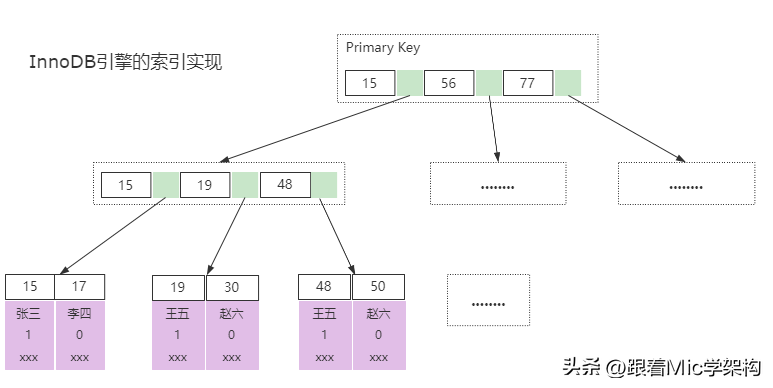

## 跟着mic 学架构
### @Conditional注解有什么用

~~~~
condition注解的一个作用为bean的装载做一个条件判断，只有在满足条件的情况下。spring才会把bean装载到IOC容器里面。而这个条件是我们可以自定义去完成的。我们可以实现condition这个接口，并且重写里面的matches这个方法，去实现自定义的逻辑。所以@condition这个注解，增加了bean的装配的灵活性。在springboot里面对@condition注解做了更进一步的扩展，比如增加了@conditionalOnClass,@conditionOnBean等这样的注解，使得我们在使用的过程中。不再需要些那些条件的逻辑判断。而是可以直接根据数据本身的语义去完成对应的条件的一个装配
~~~~

### 存储MD5的值应该用VARCHAR还是CHAR？
~~~~
我认为应该是用char类型，char类型是一个固定长度的字符串。varchar是一个可变长度的字符串。而md5算法，它所产生的这个数字，他是一个固定长度的。不管数据怎么修改，长度是不变的。这个点呢非常符合char类型的一个特征。另外由于规定长度的，所以在数据变更的时候。不需要进行调整存储空间的一个大小，在效率上会比varchar要更好一些。
~~~~

###  Mysql中MyISAM和InnoDB引擎有什么区别？

MyISAM和InnoDB都是Mysql里面的两个存储引擎。

在Mysql里面，存储引擎是可以自己扩展的，它的本质其实是定义数据存储的方式以及数据读取的实现逻辑。

而不同存储引擎本身的特性，使得我们可以针对性的选择合适的引擎来实现不同的业务场景。

从而获得更好的性能。

在Mysql 5.5之前，默认的存储引擎是MyISAM，从5.5以后，InnoDB就作为了默认的存储引擎。

在实际应用开发中，我们基本上都是采用InnoDB引擎。

我们先来看一下MyISAM引擎。

MyISAM引擎的数据是通过二进制的方式存储在磁盘上，它在磁盘上体现为两个文件

- 一个是.MYD文件，D代表Data，是MyISAM的数据文件，存放数据记录，
- 一个是.MYI文件，I代表Index，是MyISAM的索引文件，存放索引

实现机制如图所示。

因为索引和数据是分离的，所以在进行查找的时候，先从索引文件中找到数据的磁盘位置，再到数据文件中找到索引对应的数据内容。

在InnoDB存储引擎中，数据同样存储在磁盘上，它在磁盘上只有一个ibd文件，里面包含索引和数据。

它的整体结构如图所示，在B+树的叶子节点里面存储了索引对应的数据，在通过索引进行检索的时候，命中叶子节点，就可以直接从叶子节点中取出行数据。

了解了这两个存储引擎以后，我们在面试的时候该怎么回答呢？

~~~~
基于我的理解，我认为MyISAm和InnoDB的区别有4个，

- 第一个，数据存储的方式不同，MyISAM中的数据和索引是分开存储的，而InnoDB是把索引和数据存储在同一个文件里面。
- 第二个，对于事务的支持不同，MyISAM不支持事务，而InnoDB支持ACID特性的事务处理
- 第三个，对于锁的支持不同，MyISAM只支持表锁，而InnoDB可以根据不同的情况，支持行锁，表锁，间隙锁，临键锁
- 第四个，MyISAM不支持外键，InnoDB支持外键

因此基于这些特性，我们在实际应用中，可以根据不同的场景来选择合适的存储引擎。
比如如果需要支持事务，那必须要选择InnoDB。
如果大部分的表操作都是查询，可以选择MyISAM。
~~~~

资料来源:[Mysql中MyISAM和InnoDB引擎有什么区别？](https://www.toutiao.com/article/7147518399751701022/)

### 这么回答提升30%的面试通过率，ThreadLocal出现内存泄露吗？

ThreadLocal是一个用来解决线程安全性问题的工具。

它相当于让每个线程都开辟一块内存空间，用来存储共享变量的副本。

然后每个线程只需要访问和操作自己的共享变量副本即可，从而避免多线程竞争同一个共享资源。

它的工作原理很简单每个线程里面有一个成员变量ThreadLocalMap。

当线程访问用ThreadLocal修饰的共享数据的时候这个线程就会在自己成员变量ThreadLocalMap里面保存一份数据副本。

key指向ThreadLocal这个引用，并且是弱引用关系，而value保存的是共享数据的副本。

因为每个线程都持有一个副本，所以就解决了线程安全性问题。

这个问题考察的是内存泄漏，所以必然和对象引用有关系。

ThreadLocal中的引用关系如图所示，Thread中的成员变量ThreadLocalMap，它里面的可以key指向ThreadLocal这个成员变量，并且它是一个弱引用所谓弱引用，就是说成员变量ThreadLocal允许在这种引用关系存在的情况下，被GC回收。

一旦被回收，key的引用就变成了null，就会导致这个内存永远无法被访问，造成内存泄漏。

那到底ThreadLocal会不会存在内存泄漏呢？

从ThreadLocal本身的设计上来看，是一定存在的。

可能有些小伙伴忍不住想怼我了，如果这个线程被回收了，那线程里面的成员变量都会被回收。

就不会存在内存泄漏问题啊？

这样理解没问题，但是在实际应用中，我们一般都是使用线程池，而线程池本身是重复利用的所以还是会存在内存泄漏的问题。

除此之外啊，ThreadLocal为了避免内存泄漏问题，当我们在进行数据的读写时，ThreadLocal默认会去尝试做一些清理动作，找到并清理Entry里面key为null的数据。

但是，它仍然不能完全避免，有同学就问了，那怎么办啊！！！

有两个方法可以避免：

- 每次使用完ThreadLocal以后，主动调用remove()方法移除数据
- 把ThreadLocal声明称全局变量，使得它无法被回收

ThreadLocal本身的设计并不复杂，要想深入了解，建议大家去看看源码！

回答：

~~~~
我认为，不恰当的使用ThreadLocal，会造成内存泄漏问题。

主要原因是，线程的私有变量ThreadLocalMap里面的key是一个弱引用。

弱引用的特性，就是不管是否存在直接引用关系，当成员ThreadLocal没用其他的强引用关系的时候，这个对象会被GC回收掉。

从而导致key可能变成null，造成这块内存永远无法访问，出现内存泄漏的问题。

规避内存泄漏的方法有两个：

通过扩大成员变量ThreadLoca的作用域，避免被GC回收
每次使用完ThreadLocal以后，调用remove方法移除对应的数据
第一种方法虽然不会造成key为null的现象，但是如果后续线程不再继续访问这个key。

也会导致这个内存一直占用不释放，最后造成内存溢出的问题。

所以我认为最好是在使用完以后调用remove方法移除。
~~~~

文字教程 [「Java」这么回答提升30%的通过率，ThreadLocal出现内存泄露吗？](https://www.toutiao.com/article/7146028552499151393/)

视频教程 [「Java」这么回答提升30%的通过率，ThreadLocal出现内存泄露吗？](https://www.toutiao.com/video/7136849327271608840/)

