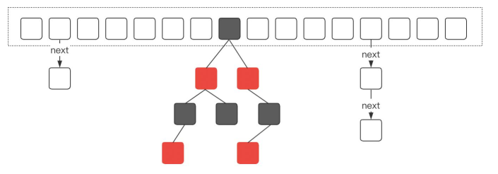
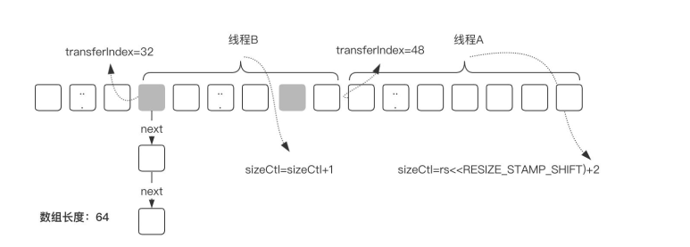
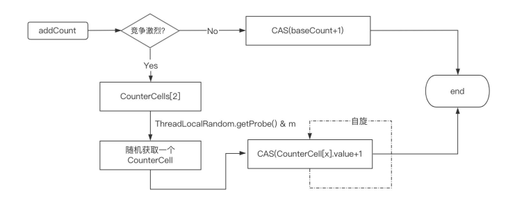
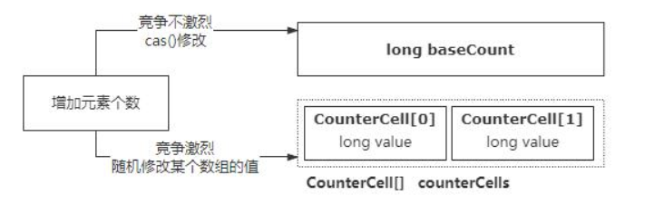
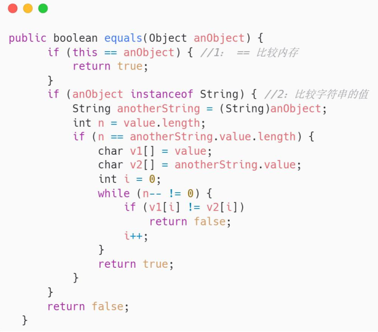
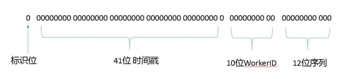
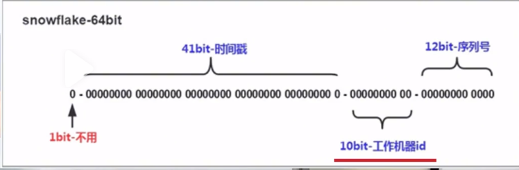

## list

### ArrayList的自动扩容机制的实现原理

资料来源：[ArrayList的自动扩容机制的实现原理](https://www.toutiao.com/video/7108970586155516423/)

ArrayList 是一个数组结构的存储容器， 默认情况下， 数组的长度是 10. 
当然我们也可以在构建 ArrayList 对象的时候自己指定初始长度。 
随着在程序里面不断的往ArrayList中添加数据， 当添加的数据达到10个的时候， 
ArrayList 就没有多余容量可以存储后续的数据。 
这个时候 ArrayList 会自动触发扩容。 
扩容的具体流程很简单： 
首先， 创建一个新的数组， 这个新数组的长度是原来数组长度的 1.5 倍。 
然后使用 Arrays.copyOf 方法把老数组里面的数据拷贝到新的数组里面。 
扩容完成后再把当前要添加的元素加入到新的数组里面， 从而完成动态扩容的过程 

## map

### HashMap啥时候扩容，为什么扩容

资料来源：[全网讲的最透彻的HashMap！HashMap啥时候扩容，为什么扩容？](https://www.toutiao.com/video/7121348879974564382/?from_scene=all)

#### 介绍：

“HashMap 啥时候扩容， 为什么扩容？ ” 
这是一个针对 1 到 3 年左右 Java 开发人员的面试题， 
问题本身不是很难， 但是对于这个阶段粉丝来说， 由于不怎么关注 
所以会难住一部分同学。 
HI， 大家好， 我是 Mic， 一个工作了 14 年的 Java 程序员。 
下面我们分析一下这个问题专业解答。 
在任何语言中， 我们希望在内存中临时存放一些数据， 可以用一些官方封装好的集合比如 List、 HashMap、 Set 等等。 作为数据存储的容器   

当我们创建一个集合对象的时候， 实际上就是在内存中一次性申请一块内存空间。  
而这个内存空间大小是在创建集合对象的时候指定的。 
比如 List 的默认大小是 10、 HashMap 的默认大小是 16。 
在实际开发中， 我们需要存储的数据量往往大于存储容器的大小。 
针对这种情况， 通常的做法就是扩容。 
当集合的存储容量达到某个阈值的时候， 集合就会进行动态扩容， 从而更好的满足更多数据的存储。 
List 和 HashMap， 本质上都是一个数组结构， 所以基本上只需要新建一个更长的数组然后把原来数组中的数据拷贝到新数组就行了。    

**以 HashMap 为例， 它是什么时候触发扩容以及扩容的原理是什么呢？** 
当 HashMap 中元素个数超过临界值时会自动触发扩容， 这个临界值有一个计算公式。
`threashold=loadFactor*capacity`。 
loadFactor 的默认值是 0.75， capacity 的默认值是 16， 也就是元素个数达到 12的时候触发扩容。
扩容后的大小是原来的 2 倍。 
由于动态扩容机制的存在， 所以我们在实际应用中， 需要注意在集合初始化的时候明确指定集合的大小。
避免频繁扩容带来性能上的影响。 
假设我们要向 HashMap 中存储 1024 个元素， 如果按照默认值 16， 随着元素的不断增加， 会造成 7 次扩容。 而这 7 次扩容需要重新创建 Hash 表， 并且进行数据迁移， 对性能影响非常大。 

**最后， 可能有些面试官会继续问， 为什么扩容因子是 0.75？** 
扩容因子表示 Hash 表中元素的填充程度， 扩容因子的值越大， 那么触发扩容的元素个数更多， 虽然空间利用率比较高， 但是 hash 冲突的概率会增加。   
扩容因子的值越小， 触发扩容的元素个数就越少， 也意味着 hash 冲突的概率减少， 但是对内存空间的浪费就比较多， 而且还会增加扩容的频率。 
因此， 扩容因子的值的设置， 本质上就是在 冲突的概率 以及 空间利用率之间的平衡。0.75 这个值的来源， 和统计学里面的泊松分布有关。 
我们知道， HashMap 里面采用链式寻址法来解决 hash 冲突问题， 为了避免链表过长带来时间复杂度的增加所以链表长度大于等于 7 的时候， 就会转化为红黑 树， 提升检索效率   

当扩容因子在 0.75 的时候， 链表长度达到 8 的可能性几乎为 0， 也就是比较好的达到了空间成本和时间成本的平衡。 
以上就是关于这个问题的完整理解。 
在面试的时候， 我们可以这么回答。 
当 HashMap 元素个数达到扩容阈值， 默认是 12 的时候， 会触发扩容。 
默 认 扩 容 的 大 小 是 原 来 数 组 长 度 的 2 倍 ， HashMap 的 最 大 容 量 是Integer.MAX_VALUE， 也就是 2 的 31 次方-1。   

### HashMap 是如何解决 hash 冲突的？ 

资料来源：[【Java】Java工作0到3年大必问题，HashMap是如何解决hash冲突的](https://www.toutiao.com/video/7103415128325882399/?app=news_article&timestamp=1664958643&group_id=7103415128325882399&share_token=DB985399-9F65-47BF-A90A-14886772C090&tt_from=weixin&utm_source=weixin&utm_medium=toutiao_ios&utm_campaign=client_share&wxshare_count=1&source=m_redirect)

好的， 这个问题我需要从几个方面来回答。 
首先， HashMap 底层采用了数组的结构来存储数据元素， 数组的默认长度是 16，当我们通过 put 方法添加数据的时候， HashMap 根据 Key 的 hash 值进行取模运算。最终保存到数组的指定位置。 
但是这种设计会存在 hash 冲突问题， 也就是两个不同 hash 值的 key， 最终取模后会落到同一个数组下标。 
所以 HashMap 引入了链式寻址法来解决 hash 冲突问题， 对于存在冲突的 key，HashMap 把这些 key 组成一个单向链表   
然后采用尾插法把这个 key 保存到链表的尾部。 

另外， 为了避免链表过长的问题， 当**链表长度大于 8** 并且**数组长度大于等于 64**的时候， HashMap 会把链表转化为红黑树。 
从而减少链表数据查询的时间复杂度问题， 提升查询性能  

最后， 我再补充一下， 解决 hash 冲突问题的方法有很多， 比如再 hash 法， 就是如果某个 hash 函数产生了冲突， 再用另外一个 hash 进行计算，比如布隆过滤器就采用了这种方法。 
开放寻址法， 就是直接从冲突的数组位置往下寻找一个空的数组下标进行数据存储， 这个在ThreadLocal 里面有使用到。 
建立公共溢出区， 也就是把存在冲突的 key 统一放在一个公共溢出区里面   

### 这道题HashMap和HashTable的满分回答

资料来源：[【Java面试】这道题HashMap和HashTable的满分回答](https://www.toutiao.com/video/7152788705038893575/)

HashMap 和 HashTable 有什么区别？” 
这是一道非常非常基础的面试题，但很多人却回答不好，没有逻辑性 
今天这个视频就给大家分享一下，高手和普通人遇到这个问题的区别。 
下面先来分享一下这个问题的考察目的   

#### 考察目的

这个问题一般考察 1~3 年开发经验。 
考察目的仍然是看求职者对 Java 基础的掌握程度。 
集合是 Java 基础中非常重要的组件，除了根据不同数据结构选择合适的集合类。 
还需要从安全性、性能、功能特性角度去了解集合的差异性以及底层工作原理。 
如果达不到这个层次，在使用的时候遇到问题影响就比较大。 
因此这也是人才筛选比较基础的一部分。 

#### 问题分析

Hashtable 和 HashMap 都是一个基于 hash 表实现的 K-V 结构的集合。 
Hashtable 是 JDK1.0 引入的一个线程安全的集合类，因为所有数据访问的方法都加了一个 Synchronized 同步锁。 
Hashtable 内部采用数组加链表来实现，链表用来解决 hash 冲突的问题。 
HashMap 是 JDK1.2 引入的一个线程不安全的集合类， 
HashMap 内部也是采用了数组加链表实现，在 JDK1.8 版本里面做了优化，引入了红黑树。 
当链表长度大于等于 8 并且数组长度大于 64 的时候，就会把链表转化为红黑树，提升数据查找性能。 

#### 高手回答

好的， 

-  从功能特性的角度来说 
-  HashTable 是线程安全的，而 HashMap 不是。 
-  HashMap 的性能要比 HashTable 更好，因为，HashTable 采用了全局同步锁来保证安全性，对性能影响较大 
-  从内部实现的角度来说 
-  HashTable 使用数组加链表、HashMap 采用了数组+链表+红黑树 
-  HashMap 初始容量是 16、HashTable 初始容量是 11 
-  HashMap 可以使用 null 作为 key，HashMap 会把 null 转化为 0 进行存储，而 Hashtable 不允许。 
   最后，他们两个的 key 的散列算法不同，HashTable 直接是使用 key 的 hashcode 对数组长度做取模。而 HashMap 对 key 的 hashcode 做了二次散列，从而避免 key 的分布不均匀问题影响到查询能。 
   以上就是我的理解。 

#### 总结

对于这类问题，要能够获得面试官的认可，必须要做两个动作 

>1. 平时要注意总结
>2. 回答的逻辑结构要清晰

临阵磨枪很难达到这种状态。 
好的，今天的视频就到这里了 
喜欢我作品的同学记得转发、收藏、点赞 
我是咕泡科技联合创始人 Mic，咱们下期再见。  

## ConcurrentHashMap 

### ConcurrentHashMap 底层实现原理？高手的回答堪称完美

资料来源：[面试被问：ConcurrentHashMap 底层实现原理？高手的回答堪称完美](https://www.toutiao.com/video/7076020622077362696/)

之前分享过一期 HashMap 的面试题，然后有个小伙伴私信我说，他遇到了一个 
ConcurrentHashMap 的问题不知道怎么回答。 
于是，就有了这一期的内容！！ 
我是 Mic，一个工作了 14 年的 Java 程序员，今天我来分享关 
于 ”ConcurrentHashMap 底层实现原理“ 这个问题， 
看看普通人和高手是如何回答的   

#### 普通人
嗯.. ConcurrentHashMap 是用数组和链表的方式来实现的，嗯… 在 JDK1.8 里面还引入了红黑树。 
然后链表和红黑树是解决 hash 冲突的。嗯……   

#### 高手
这个问题我从这三个方面来回答：（下面这三个点，打印在屏幕上） 
>1. ConcurrentHashMap 的整体架构 
>2. ConcurrentHashMap 的基本功能 
>3. ConcurrentHashMap 在性能方面的优化 

-  ConcurrentHashMap 的整体架构（字幕提示） 
（如图所示），这个是 ConcurrentHashMap 在 JDK1.8 中的存储结构，它是由数组、单向链表、红黑树组成。 
当我们初始化一个 ConcurrentHashMap实例时，默认会初始化一个长度为 16的数组。 
由于 ConcurrentHashMap 它的核心仍然是 hash 表，所以必然会存在 hash 冲突问题。 
ConcurrentHashMap 采用链式寻址法来解决 hash 冲突。 
当 hash 冲突比较多的时候，会造成链表长度较长，这种情况会使得ConcurrentHashMap 中数据元素的查询复杂度变成 O(n)。因此在 JDK1.8 中，引入了红黑树的机制。 
当数组长度大于 64 并且链表长度大于等于 8 的时候，单项链表就会转换为红黑树。 
另外，随着 ConcurrentHashMap 的动态扩容，当树的节点小于等于6，红黑树会退化成单向链表。   

- ConcurrentHashMap 的基本功能（字幕提示） 
ConcurrentHashMap 本质上是一个 HashMap，因此功能和 HashMap 一样，但是ConcurrentHashMap 在 HashMap 的基础上，提供了并发安全的实现。 
并发安全的主要实现是通过对指定的 Node 节点加锁，来保证数据更新的安全性（如图所示）。   

-  ConcurrentHashMap 在性能方面做的优化（字幕提示） 
如果在并发性能和数据安全性之间做好平衡，在很多地方都有类似的设计，比如 cpu
的三级缓存、mysql 的 buffer_pool、Synchronized 的锁升级等等。 
ConcurrentHashMap 也做了类似的优化，主要体现在以下几个方面： 
-  在 JDK1.8 中，ConcurrentHashMap 锁的粒度是数组中的某一个节点，而在
JDK1.7，锁定的是 Segment，锁的范围要更大，因此性能上会更低。 
-  引入红黑树，降低了数据查询的时间复杂度，红黑树的时间复杂度是 O(logn)。 
- （如图所示），当数组长度不够时，ConcurrentHashMap 需要对数组进行扩容，在扩容的实现上，ConcurrentHashMap 引入了多线程并发扩容的机制，简单来说就是多个线程对原始数组进行分片后，每个线程负责一个分片的数据迁移，从而提升了扩容过程中数据迁移的效率。   

- ConcurrentHashMap 中有一个 size()方法来获取总的元素个数，而在多线程并发场景中，在保证原子性的前提下来实现元素个数的累加，性能是非常低的ConcurrentHashMap 在这个方面的优化主要体现在两个点：  
-  当线程竞争不激烈时，直接采用 CAS 来实现元素个数的原子递增。   
- 如果线程竞争激烈，使用一个数组来维护元素个数，如果要增加总的元素个数，则直接从数组中随机选择一个，再通过 CAS 实现原子递增。它的核心思想是引入了数组来实现对并发更新的负载    

以上就是我对这个问题的理解！

#### 结尾

从高手的回答中可以看到，ConcurrentHashMap 里面有很多设计思想值得学习和借鉴。
比如锁粒度控制、分段锁的设计等，它们都可以应用在实际业务场景中。
很多时候大家会认为这种面试题毫无价值，当你有足够的积累之后，你会发现从这些技术底层的设计思想中能够获得
很多设计思路。
本期的普通人 VS 高手面试系列的视频就到这里结束了，喜欢的朋友记得点赞收藏。
另外，我也陆续收到了很多小伙伴的面试题，我会在后续的内容中逐步更新给到大家！
我是 Mic，一个工作了 14 年的 Java 程序员，咱们下期再见。  

 

###  ConcurrentHashMap的size()方法是线程安全的吗？

资料来源：[【Java面试】ConcurrentHashMap的size()方法是线程安全的吗？](https://www.toutiao.com/video/7152788705038893575/)

hi，大家好，我是 Mic，一个没有才华只能靠颜值混饭吃的 Java 程序员。 
一个工作了 5 年的粉丝，最近去蚂蚁面试，在第一面的时候，本问到了几个 Java 基础的问题。其中有一个问题比较有意思 
面试官问：“ConcurrentHashMap 的 size()方法是线程安全的吗？为什么？” 
关于这个问题的高手回答，我整理到了一个 10W 字的面试文档里面，大家可以在我的主页加 V 去领取。 
下面看看普通人和高手对这个问题的回答。 

#### 高手

好的，面试官。 
ConcurrentHashMap 的 size()方法是非线程安全的。 
也就是说，当有线程调用 put 方法在添加元素的时候，其他线程在调用 size()方法获取的元素个数和实际存储元素个数是不一致的。 
原因是 size()方法是一个非同步方法，put()方法和 size()方法并没有实现同步锁。 
put()方法的实现逻辑是：在 hash 表上添加或者修改某个元素，然后再对总的元素个数进行累加。 
其中，线程的安全性仅仅局限在 hash 表数组粒度的锁同步，避免同一个节点出现数据竞争带来线程安全问题。
（如图）数组元素个数的累加方式用到了两个方案： 

-  当线程竞争不激烈的时候，直接用 cas 的方式对一个 long 类型的变量做原子递增。 
-  当线程竞争比较激烈的时候，使用一个 CounterCell 数组，用分而治之的思想减少多线程竞争，从而实现元素个数的原子累加。 

size()方法的逻辑就是遍历 CounterCell 数组中的每个 value 值进行累加，再加上baseCount，汇总得到一个结果。
所以很明显，size()方法得到的数据和真实数据必然是不一致的。 
因此从 size()方法本身来看，它的整个计算过程是线程安全的，因为这里用到了 CAS的方式解决了并发更新问题。 
但是站在 ConcurrentHashMap 全局角度来看，put()方法和 size()方法之间的数据是不一致的，因此也就不是线程安全的。 
之所以不像 HashTable 那样，直接在方法级别加同步锁。在我看来有两个考虑点。 

>  1. 直接在 size()方法加锁，就会造成数据写入的并发冲突，对性能造成影响， 当然有些朋友会说可以加读写锁，但是同样会造成 put 方法锁的范围扩大，性能影响极大！ 
>  2. ConcurrentHashMap 并发集合中，对于 size()数量的一致性需求并不大，并发集合更多的是去保证数据存储的安全性。 

以上就是我对这个问题的理解。

#### 面试点评

关于这个问题，网上很多文章写得都很片面。 
导致大家在找资料学习的时候，很容易被这种不完整的理解误导。 
而且，这个问题切入的角度还挺有意思的，有些同学可能没往这个方向思考过。 
也导致无法很好的回答出来。 
好的，本期的普通人 VS 高手面试系列的视频就到这里结束了。 
大家记得点赞、收藏 加 关注 
我是 Mic，咱们下期再见。   

## java 基础
### String、StringBuffer、StringBuilder区别  

资料来源：[【Java面试】String、StringBuffer、StringBuilder区别](https://www.toutiao.com/video/7107446899690603045/?from_scene=all)

嗯， 好的， 面试官。
关于 String、 StringBuffer、 StringBuilder 的区别， 我想从四个角度来说明。 
**第一个， 可变性。** 
String 内部的 value 值是 final 修饰的， 所以它是不可变类。 所以每次修改 String的值， 都会产生一个新的对象。 
StringBuffer 和 StringBuilder 是可变类， 字符串的变更不会产生新的对象。 
**第二个， 线程安全性。** 
String 是不可变类， 所以它是线程安全的。 
StringBuffer 是线程安全的， 因为它每个操作方法都加了 synchronized 同步关键字。 
StringBuilder 不是线程安全的， 所以在多线程环境下对字符串进行操作， 应该使用 StringBuffer， 否则使用 StringBuilder 
**第三个， 性能方面。** 
String 的性能是最的低的， 因为不可变意味着在做字符串拼接和修改的时候， 需要重新创建新的对象以及分配内存。 
其次是 StringBuffer 要比 String 性能高， 因为它的可变性使得字符串可以直接被修改最后是 StringBuilder， 它比 StringBuffer 的高， 因为 StringBuffer 加了同步锁。 
**第四个， 存储方面。** 
String 存储在字符串常量池里面 
StringBuffer 和 StringBuilder 存储在堆内存空间。  

### new String("abc")到底创建了几个对象？  

资料来源：[面试都这么难了吗？竟然问到newString(abc)到底创建了几个对象？](https://www.toutiao.com/video/7095566047004066340/?channel=&source=video)

一个工作了 6 年的粉丝和我说， 
最近面试感觉越来越难的， 基本上都会问技术底层原理， 甚至有些还会问到操作系统层面的知识。 
我说， 现在各个一线大厂有很多优秀的程序员毕业了， 再加上市场大环境不好对程序员的需求量也在减少。 
如果技术底子不好， 确实找工作会很困难。 
今天分享的问题是： ”new String(“abc”)到底创建了几个对象？ 
关于这个问题， 看看普通人和高手的回答。   

#### 高手
好的， 面试官。 
首先， 这个代码里面有一个 new 关键字， 这个关键字是在程序运行时， 根据已经加载的系统类 String， 在堆内存里面实例化的一个字符串对象。 
然后， 在这个 String 的构造方法里面， 传递了一个“abc”字符串， 因为 String 里面的字符串成员变量是 final 修饰的， 所以它是一个字符串常量。 
接下来， JVM 会拿字面量“abc”去字符串常量池里面试图去获取它对应的 String对象引用， 如果拿不到， 就会在堆内存里面创建一个”abc”的 String 对象 
并且把引用保存到字符串常量池里面。 
后续如果再有字面量“abc”的定义， 因为字符串常量池里面已经存在了字面量“abc”的引用， 所以只需要从常量池获取对应的引用就可以了， 不需要再创建。 
所以， 对于这个问题， 我认为的答案是 

- 如果 abc 这个字符串常量不存在， 则创建两个对象， 分别是 abc 这个字符串常量，以及 new String 这个实例对象。 
-   如果 abc 这字符串常量存在， 则只会创建一个对象   

 

### 为什么重写 equals() 就一定要重写 hashCode() 方法
资料来源：[为什么重写 equals() 就一定要重写 hashCode() 方法](https://www.toutiao.com/video/7153515062097871390/)

为什么重写 equals() 就一定要重写 hashCode() 方法？” 
一个工作了 4 年的粉丝，好不容易拿到一个面试机会，结果就被这个问题暴击了没办法，只能来向我求助了。 
回答这个问题之前，我们先来分析一下这个问题的背景。 

#### 问题分析

关于这个问题，首先需要深入了解一下 equals 这个方法。 
这个 equals 方法是 String 这个类里面的实现。 
从代码中可以看到，当调用 equals 比较两个对象的时候，会做两个操作 

> 1. 用==号比较两个对象的内存地址，如果地址相同则返回 true 
> 2. 否则，继续比较字符串的值，如果两个字符串的值完全相等，同样返回 true   

那 equals 和 hashCode()有什么关系呢？ 

-  首先，Java 里面任何一个对象都有一个 native 的 hashCode()方法 
- 其次，这个方法在散列集合中会用到，比如 HashTable、HashMap 这些，当添加
元素的时候，需要判断元素是否存在，而如果用 equals 效率太低，所以一般是直接用对象的 hashCode 的值进行取模运算。 
-  如果 table 中没有该 hashcode 值，它就可以直接存进去，不用再进行任何比较了；   
- 如果存在该 hashcode 值， 就调用它的 equals 方法与新元素进行比较，相同的话就不存了，不相同就散列其它的地址，所以这里存在一个冲突解决的问题，这样一来实际调用 equals 方法的次数就大大降低了.hashCode 的值默认是 JVM 使用随机数来生成的，两个不同的对象，可能生成的HashCode 会相同。这种情况在 Hash 表里面就是所谓的哈希冲突，通常会使用链表或者线性探测等方式来解决冲突问题。 

但是如果两个完全相同的对象，也就是内存地址指向同一个，那么他们的 hashCode一定是相同的。 
了解了 equals 和 hashCode 的关系以后，再来分析这个面试题。 
在理论情况下，如果 x.equals(y)==true，如果没有重写 equals 方法，那么这两个对象的内存地址是同一个，意味着 hashCode 必然相等。 
但是如果我们只重写了 equals 方法，就有可能导致 hashCode 不相同。一旦出现这种情况，就导致这个类无法和所有集合类一起工作。 
所以，在实际开发中，约定俗成了一条规则，重写 equals 方法的同时也需要重写hashCode 方法。 

#### 高手回答

好的。 
如果只重写 equals 方法，不重写 hashCode 方法。 
就有可能导致 a.equals(b)这个表达式成立，但是 hashCode 却不同。 
那么这个只重写了 equals 方法的对象，在使用散列集合进行存储的时候就会出现问题。 
因为散列结合是使用 hashCode 来计算 key 的存储位置，如果存储两个完全相同的对象，但是有不同的 hashcode 
就会导致这两个对象存储在 hash 表的不同位置，当我们想根据这个对象去获取数据的时候，就会出现一个悖论 
一个完全相同的对象会在存储在 hash 表的两个位置，造成大家约定俗成的规则，出现一些不可预料的错误。 

#### 总结

强调一遍，基础很重要，基础很重要。 
不要觉得每天写 CRUD 能解决业务问题就很牛逼了，等你工作了 7~8 年以后会发现 
对技术体系化的理解和技术底层原理的学习才是自己的核心竞争力。 
好的，今天的视频就到这里了 
喜欢我作品的同学记得转发、收藏、点赞 
我是咕泡科技联合创始人 Mic，咱们下期再见。   

 

###  并行和并发有什么区别？

资料来源：[并行和并发有什么区别？](https://www.toutiao.com/video/7131254022421676581/?from_scene=all)

并行和并发是Java并发编程里面的概念。 
并行，是指在多核CPU架构下，同一时刻同时可以执行多个线程的能力。 
在单核CPU架构中，同一时刻只能运行一个线程。 
在4核4线程的CPU架构中，同一时刻可以运行4个线程，那这4个线程就是并行执行的。 
并发，是指在同一时刻CPU能够处理的任务数量，也可以理解成CPU的并发能力。 
在单核CPU架构中，操作系统通过CPU时间片机制提升CPU的并发能力。 
在多核CPU架构中，基于任务的并行执行能力以及CPU时间片切换的能力来提升CPU的并发能力。 
所以，总的来说，并发是一个宏观概念，它指的是CPU能够承载的压力大小，并行是一个微观概念，它描述CPU同时执行多个任务的能力。 

 

### 什么是幂等、如何解决幂等性问题

资料来源：[什么是幂等、如何解决幂等性问题](https://www.toutiao.com/video/7094827047691911688/?from_scene=all)

所谓幂等， 其实它是一个数学上的概念， 在计算机编程领域中， 幂等是指一个方法被多次重复执行的时候产生的影响和第一次执行的影响相同。 
之所以要考虑到幂等性问题， 是因为在网络通信中， 存在两种行为可能会导致接口被重复执行。 
用户的重复提交或者用户的恶意攻击， 导致这个请求会被多次重复执行。 
在分布式架构中， 为了避免网络通信导致的数据丢失， 在服务之间进行通信的时候都会设计超时重试的机制， 而这种机制有可能导致服务端接口被重复调用。 
所以在程序设计中， 对于数据变更类操作的接口， 需要保证接口的幂等性。 
而幂等性的核心思想， 其实就是保证这个接口的执行结果只影响一次， 后续即便再次调用， 也不能对数据产生影响， 所以基于这样一个诉求， 常见的解决方法有很多。 
使用数据库的唯一约束实现幂等， 比如对于数据插入类的场景， 比如创建订单，因为订单号肯定是唯一的， 所以如果是多次调用就会触发数据库的唯一约束异常，从而避免一个请求创建多个订单的问题。 
使用 redis 里面提供的 setNX 指令， 比如对于 MQ 消费的场景， 为了避免 MQ 重复消费导致数据多次被修改的问题， 可以在接受到 MQ 的消息时， 把这个消息 
通过 setNx 写入到 redis 里面， 一旦这个消息被消费过， 就不会再次消费。 
使用状态机来实现幂等， 所谓的状态机是指一条数据的完整运行状态的转换流程， 
比如订单状态， 因为它的状态只会向前变更， 所以多次修改同一条数据的时候，一旦状态发生变更， 那么对这条数据修改造成的影响只会发生一次。 
当然， 除了这些方法以外， 还可以基于 token 机制、 去重表等方法来实现， 但是不管是什么方法， 无非就是两种， 
要么就是接口只允许调用一次， 比如唯一约束、 基于 redis 的锁机制。 
要么就是对数据的影响只会触发一次， 比如幂等性、 乐观锁 

### SimpleDateFormat 是线程安全的吗?为什么

资料来源：[SimpleDateFormat 是线程安全的吗?为什么](https://www.toutiao.com/video/7127459299298640398/?from_scene=all)

SimpleDateFormat 不是线程安全的， 
SimpleDateFormat 类内部有一个 Calendar 对象引用, 
它用来储存和这个 SimpleDateFormat 相关的日期信息。 
当我们把 SimpleDateFormat 作为多个线程的共享资源来使用的时候。 
意味着多个线程会共享 SimpleDateFormat 里面的 Calendar 引用， 
多个线程对于同一个 Calendar 的操作， 会出现数据脏读现象导致一些不可预料的错误。 
在实际应用中， 我认为有 4 种方法可以解决这个问题。 
第一种， 把 SimpleDateFormat 定义成局部变量， 每个线程调用的时候都创建一个新的实例。 
第二种， 使用 ThreadLocal 工具， 把 SimpleDateFormat 变成线程私有的 
第三种， 加同步锁， 在同一时刻只允许一个线程操作 SimpleDateFormat 
第四种， 在 Java8 里面引入了一些线程安全的日期 API， 比如 LocalDateTimer、DateTimeFormatter 等。 

### 谈谈常用的分布式 ID 设计方案

“谈谈常用的分布式 ID 设计方案”! 
一个工作了 7 年的同学，被问到了这样一个问题。 
问题并不难，但是在实际面试的时候，如果只是回答 1，2，3 
很难通过面试，因为作为一个高级程序员，还需要有自己的理解和思考。 
Hi，大家好，我是 Mic，一个工作了 14 年的 Java 程序员。 
这个问题的高手回答，我整理到了 15W 字的面试文档里面 
大家可以在我的主页加 V 领取。 
下面看看普通人和高手的回答 

#### 高手

好的，这个问题我需要从几个方面来回答。 
首先，分布式全局 ID 的的解决方案有很多，比如： 
-  使用 Mysql 的全局表
-  使用 Zookeeper 的有序节点
-   使用 MongoDB 的 objectid
-   redis 的自增 id
-  UUID 等等
-   ......

这些方案只是解决基础的 id 唯一性问题，在实际生产环境中，需要构建一个全局唯一id 
还需要考虑更多的因素：
-   有序性， 有序的 ID 能够更好的确认数据的位置，以及 B+数的存储结构中，范围查询的效率更高，并且可以提升 B+树数据维护的效率。
-   安全性，避免恶意爬去数据造成数据泄露
-   可用性，ID 生成系统的可用性要求非常高，一旦出现故障就会造成业务不可用的问题 
-   性能，全局 id 生成系统需要满足整个公司的业务需求，涉及到亿级别的调用，对性能要求较高因此，在如果我们选择数据库的全局表，你没获取一次 id 就需要更新数据库，性能上限比较明显，而且基于数据库构建高扩展和高性能的解决方案难度很大。
所以，目前市面上主流的解决方案是基于 Twitter 早期开源的 Snowflake 雪花算法（图片）。
它是由 64 位长度组成的全局 id 生成算法，通过对 64 位进行区间划分来表述不同含义
实现唯一性。 

它的好处是： 
-   算法实现简单 
-   不存在太多外部依赖 
-   可以生成有意义的有序编号 
-   基于位运算，性能也很好，Twitter 测试的峰值是 10 万个每秒。 

另外，美团公司开源了一个全局唯一 id 生成系统 leaf，它里面也用到了雪花算法去构建全局唯一 id
并且在高性能和高可用方面，做了很多的优化，为美团内部业务提供了每天上亿次的调用。
以上就是我对这个问题的理解。 

#### 面试点评

很明显这是一个热点问题，并且在实际应用中也比较广泛。 
建议各位粉丝在这个领域做一些更深层次的思考和研究， 
从而去应对面试官更进一步的追问 
记住，全局 ID 本身的设计方案和实现细节是很重要的。 
好的，本期的视频就到这里结束了   

### 谈谈雪花算法

解决唯一性问题？

> UUID 
Redis的原子递增 
数据库的全局表的自增的id 

还需要满足

> 有序递增  
高性能 
高可用 
带时间戳 

而雪花算法就是一个比较符合这些特征的全局唯一算法

**回答**

雪花算法是一种生成分布式全局ID的一种算法，它会得到一个64位长度的Long类型的数据，其中这64位的数据。由四个部分组成，第一个Bit位是一个符号位，因为id不会是负数，所以它一般都是0。接着他用41个bit位来表示毫秒单位的时间戳，再用10个bit位来表示机器的id。最后用12个bit位置来表示递增的序列号。然后把这64个bit位拼接成一个long类型的数字，这就是雪花算法的一个实现

