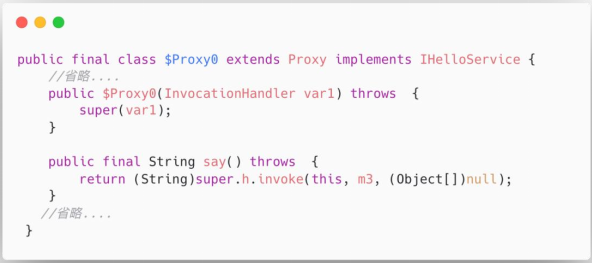

## IO

### IO 和 NIO 有什么区别？

资料来源：[IO 和 NIO 有什么区别？](https://www.toutiao.com/video/7094163029717156383/?from_scene=all)

IO 问题一直是面试的重灾区之一
但又是非常重要而且面试必问的知识点
一个工作了 7 年的粉丝私信我， 他去面试了 4 家互联网公司，  

有三个公司问他网络 IO 的问题， 另外一个公司问了 Netty， 结果都没回答上来。
好吧， 对于“IO 和 NIO 的区别”， 看看普通人和高手的回答。

#### 高手

好的， 关于这个问题， 我会从下面几个方面来回答。
首先， I/O， 指的是 IO 流， 它可以实现数据从磁盘中的读取以及写入。
实际上， 除了磁盘以外， 内存、 网络都可以作为 I/O 流的数据来源和目的地。
在 Java 里面， 提供了字符流和字节流两种方式来实现数据流的操作。
其次， 当程序是面向网络进行数据的 IO 操作的时候， Java 里面提供了 Socket的方式来实现。
通过这种方式可以实现数据的网络传输。
基于 Socket 的 IO 通信， 它是属于阻塞式 IO， 也就是说， 在连接以及 IO 事件未就绪的情况下， 当前的连接会处于阻塞等待的状态  

如果一旦某个连接处于阻塞状态， 那么后续的连接都得等待。 所以服务端能够处理的连接数量非常有限。
NIO， 是 JDK1.4 里面新增的一种 NEW IO 机制， 相比于传统的 IO， NIO 在效率上做了很大的优化， 并且新增了几个核心组件。
Channel、 Buffer、 Selectors。另外， 还提供了非阻塞的特性， 所以， 对于网络 IO 来说， NIO 通常也称为No-Block IO， 非阻塞 IO。也就是说， 通过 NIO 进行网络数据传输的时候， 如果连接未就绪或者 IO 事件未就绪的情况下， 服务端不会阻塞当前连接， 而是继续去轮询后续的连接来处理。所以在 NIO 里面， 服务端能够并行处理的链接数量更多  

因此， 总的来说， IO 和 NIO 的区别， 站在网络 IO 的视角来说， 前者是阻塞 IO，后者是非阻塞 IO。
以上就是我对这个问题的理解。

#### 面试点评
在互联网时代， 网络 IO 是最基础的技术  

无论是微服务架构中的服务通信、 还是应用系统和中间件之间的网络通信。
都在体现网络 IO 的重要性。
好的， 本期的普通人 VS 高手面试系列的视频就到这里结束了，
如果你喜欢这个视频， 记得点赞和收藏。
如果想获得一对一的面试指导以及面试资料， 可以私信我。
我是 Mic， 一个工作了 14 年的 Java 程序员， 咱们下期再见  

### 什么是深拷贝和浅拷贝？

[【Java面试】如何在面试中展现架构能力？什么是深拷贝和浅拷贝？](https://www.toutiao.com/video/7111873410933883400/)

hi，大家好，我是 Mic，一个没有才华只能靠颜值混饭吃的 Java 程序员。 
一个工作了 3 年的小伙子，委屈巴巴的跑过来私信我，说最近面试也太难了。 
只是找个 CRUD 的工作，竟然还问我深拷贝和浅拷贝，这个问题又不影响我写 CRUD，唉。 
然后深情的望向天空，眼里充满了迷茫了焦虑。 
关于：“什么是深拷贝和浅拷贝”这个问题，我把高手的回答整理到了一个 10W 字的面试文档里面， 
大家可以在我的主页加 V 领取。 
下面看看普通人和高手对这个问题的回答。 

#### 高手

好的，面试官。 
深拷贝和浅拷贝是用来描述对象或者对象数组这种引用数据类型的复制场景的。浅拷贝，（如图）就是只复制某个对象的指针，而不复制对象本身。 
这种复制方式意味着两个引用指针指向被复制对象的同一块内存地址。   

深拷贝，（如图）会完全创建一个一模一样的新对象，新对象和老对象不共享内存，也就意味着对新对象的修改不会影响老对象的值。   

在 Java 里面，无论是深拷贝还是浅拷贝，都需要通过实现 Cloneable 接口，并实现clone()方法。 
然后我们可以在 clone()方法里面实现浅拷贝或者深拷贝的逻辑。 
实现深拷贝的方法有很多，比如: 

> 1. 通过序列化的方式实现，也就是把一个对象先序列化一遍，然后再反序列化回来，就会得到一个完整的新对象。 
> 2. 在 clone()方法里面重写克隆逻辑，也就是对克隆对象内部的引用变量再进行一次克隆。
以上就是我对这个问题的理解。 

#### 面试点评

这个问题属于 Java 基础范畴，它很重要。 
如果不小心使用错了拷贝方法，就会导致多个线程同时操作一个对象造成数据安全问题。 
一般情况下这个问题是针对 1~3 年左右的开发人员。 
好的，本期的普通人 VS 高手面试系列的视频就到这里结束了 
大家记得点赞收藏+关注 
我是 Mic，咱们下期再见！   

## 动态代理

###  JDK动态代理为什么只能代理有接口的类？

[月薪30k大厂面试真题： JDK动态代理为什么只能代理有接口的类？](https://www.toutiao.com/video/7080466899552698910/?from_scene=all)

一个工作 5 年的 Java 程序员，去应聘得 物 APP 月薪 30k 的 Java 开发岗位。
被一个基础问题问得措手不及，这个问题是： JDK 动态代理为什么只能代理有接口的类。
这个问题在他的认知里面，是一个很正常的事情，竟然还有问什么？
好吧，对于这个问题，来看看普通人和高手的回答吧。

#### 普通人
嗯， 因为 JDK 里面的动态代理类，默认继承了 Proxy 类，Java 里面只能实现单一继承，所以没办法对类类做代理。
#### 高手
嗯，这个问题的核心本质，是 JDK 动态代理本身的机制来决定的(如图)。 
首先，在 Java 里面，动态代理是通过 Proxy.newProxyInstance()方法来实现的，它需要传入被动态代理的接口类。  

之所以要传入接口，不能传入类，还是取决于 JDK 动态代理的底层实现（如图）。 
JDK 动态代理会在程序运行期间动态生成一个代理类$Proxy0，这个动态生成的代理类会继承 java.lang.reflect.Proxy 类，同时还会实现被代理类的接口 IHelloService。 
在 Java 中，是不支持多重继承的。而每个动态代理类都会继承 Proxy 类（这也是 JDK动态代理的实现规范），所以就导致 JDK 里面的动态代理只能代理接口，而不能代理实现类。(注意，下面这张图片展示的时候，上面的图片仍然保存在一个画面里面)  

我分析过动态代理的源码，发现 Proxy 这个类只是保存了动态代理的处理器InvocationHandler，如果不抽出来，直接设置到$Proxy0 动态代理类里面，也是可以的。 
如果这么做，就可以针对实现类来做动态代理了。作者为什么这么设计，我认为有几个方面的原因。

> 1. 动态代理本身的使用场景或者需求，只是对原始实现的一个拦截，然后去做一些功能的增强或者扩展。而实际的开发模式也都是基于面向接口来开发，所以基于接口来实现动态代理，从需求和场景都是吻合的。当然确实可能存在有些类没有实现接口的，那这个时候，JDK 动态代理确实无法满足。
>
> 2. 在 Java 里面，类的继承关系的设计，更多的是考虑到共性能力的抽象，从而提高代码的重用性和扩展性，而动态代理也是在做这样一个事情，它封装了动态代理类生成的抽象逻辑、判断一个类是否是动态代理类、InvocationHandler 的持有等等，那么把这些抽象的公共逻辑放在 Proxy 这个父类里面，很显然是一个比较正常的设计思路。总的来说，我认为这个设计上并没有什么特别值得讨论的地方，因为我认为技术方案的设计是解决特定场景问题的。如果一定要针对普通类来做动态代理，可以选择 cglib 这个组件，它会动态生成一个被代理类的子类，子类重写了父类中所有非 final 修饰的方法，在子类中拦截父类的所有方法调用从而实现动态代理。

以上就是我对于这个问题的理解！

#### 结尾
我看到评论区有些小伙伴说面试问这些问题没有任何意义。 
我作为一个工作了 14 年，做过开发、架构的程序员，最大的感受是越往上走，对于计算机基础以及底层知识的理解越来越重要。上层的应用框架可能会随着业务的发展发生变化，但是底层的技术原理和设计理念是不会变化的。 
所以，我认为，掌握了基础，就能够以不变应对万变。 
(如图)从另外一个角度来说，大家都停留在业务框架的使用上，短期能带来较大的收益，但是随着生产工具的升级，比如人工智能、低代码、零代码、saas、paas 逐步成熟落地，那业务程序员的价值会被逐步弱化。   

这就像曾经的工业革命，工业革命之前手工劳作不管效率多高，技巧多么熟练，一旦由机器来取代，那传统的手工劳动力必然会被淘汰，伴随而来的就是技能的升级-从传统手工劳作转向了面向机器的操作。 
所以，我认为底层逻辑还是对一个事物本质的认识，而不是停留在表面！ 
好的，本期的普通人 VS 高手面试系列的视频就到这里结束了，喜欢的朋友记得点赞和收藏。 
我是 Mic，咱们下期再见。  

## 反射

### Java 反射的优缺点？  

[【Java面试】这么回答面试官都得另眼相看，Java反射的优缺点？](https://www.toutiao.com/video/7153900735137546766/?channel=&source=search_tab)

请你 Java 反射的优缺点？”
这是一个工作了 5 年的同学，去阿里面试第一面遇到的问题。
今天这个视频给大家分享一下我们遇到这个问题该怎么回答，才能获得面试官的认可。
#### 问题分析
反射是 Java 语言里面比较重要的一个特征。 
它能够在程序运行的过程中去构造任意一个类对象、并且可以获取任意一个类的成员变量、成员方法、属性，以及调用任意一个对象的方法。 
通过反射的能力，可以让 Java 语言支持动态获取程序信息以及动态调用方法的能力。 
在 Java 里面，专门有一个 java.lang.reflect 用来实现反射相关的类库，包括 Construct、Field、Method 等类，分别用来获取类的构造方法、成员变量、方法信息。 
反射的使用场景还挺多的，比如在动态代理的场景中，使用动态生成的代理类来提升代码的复用性。 
在 Spring 框架中，有大量用到反射，比如用反射来实例化 Bean 对象。 

#### 高手回答
好的，
Java 反射的优点：

> 增加程序的灵活性，可以在运行的过程中动态对类进行修改和操作 
> 提高代码的复用率，比如动态代理，就是用到了反射来实现 
> 可以在运行时轻松获取任意一个类的方法、属性，并且还能通过反射进行动态调用 

Java 反射的缺点：
> 反射会涉及到动态类型的解析，所以 JVM 无法对这些代码进行优化，导致性能要比非反射调用更低。 
> 使用反射以后，代码的可读性会下降 
> 反射可以绕过一些限制访问的属性或者方法，可能会导致破坏了代码本身的抽象性 

总结 
好的，今天的视频就到这里了 
喜欢我作品的同学记得转发、收藏、点赞 
我是咕泡科技联合创始人 Mic，咱们下期再见。   

## queue

### 基于数组的阻塞队列 ，ArrayBlockingQueue 原理

[今天分享的是：基于数组的阻塞队列 ，ArrayBlockingQueue 原理](https://www.toutiao.com/video/7084567609114362399/?from_scene=all)

来分享一道“饿了么”的高级工程师的面试题。 
“基于数组的阻塞队列 ArrayBlockingQueue”的实现原理。 
关于这个问题，我们来看看普通人和高手的回答。 
#### 高手

- 1. （如图）阻塞队列（BlockingQueue）是在队列的基础上增加了两个附加操作， 
> 在队列为空的时候，获取元素的线程会等待队列变为非空。 
>  当队列满时，存储元素的线程会等待队列可用。   

- 2. 由于阻塞队列的特性，可以非常容易实现生产者消费者模型，也就是生产者只需要关心数据的生产，消费者只需要关注数据的消费，所以如果队列满了，生产者就等待，同样，队列空了，消费者也需要等待。 
- 3. 要实现这样的一个阻塞队列，需要用到两个关键的技术，队列元素的存储、以及线程阻塞和唤醒。   
- 4. 而 ArrayBlockingQueue 是基于数组结构的阻塞队列，也就是队列元素是存储在一个数组结构里面，并且由于数组有长度限制，为了达到循环生产和循环消费的目的，ArrayBlockingQueue 用到了循环数组。 
- 5. 而线程的阻塞和唤醒，用到了 J.U.C 包里面的 ReentrantLock 和 Condition。Condition 相当于 wait/notify 在 JUC 包里面的实现。 
以上就是我对这个问题的理解。 
#### 面试点评

对于原理类的问题，有些小伙伴找不到切入点，不知道该怎么回答。 
所谓的原理，通常说的是工作原理，比如对于 ArrayBlockingQueue 这个问题。 
它的作用是在队列的基础上提供了阻塞添加和获取元素的能力，那么它的工作原理就是指用了什么设计方法或者技术来实现这样的功能，我们只要把这个部分说清楚就可以了。 
好的，本期的普通人 VS 高手面试系列的视频就到这里结束了，喜欢的朋友记得点赞和收藏。 
另外，这些面试题我都整理成了笔记，大家有需要的可以私信获取。 
我是 Mic，一个工作了 14 年的 Java 程序员，咱们下期再见。   

###  什么叫阻塞队列的有界和无界?

[太卷了！Java面试业务开发，被问： 什么叫阻塞队列的有界和无界?](https://www.toutiao.com/video/7075638697248424461/?from_scene=all)

昨天一个 3 年 Java 经验的小伙伴私信我，他说现在面试怎么这么难啊！ 
我只是面试一个业务开发，他们竟然问我： 什么叫阻塞队列的有界和无界。现在面试也太卷了吧! 
如果你也遇到过类似问题，那我们来看看普通人和高手的回答吧！ 
#### 普通人
有界队列就是说队列中的元素个数是有限制的，而无界对接表示队列中的元素个数没有
限制！ 嗯！！！ 
#### 高手

- 1. （如图），阻塞队列，是一种特殊的队列，它在普通队列的基础上提供了两个附加
功能 
> a. 当队列为空的时候，获取队列中元素的消费者线程会被阻塞，同时唤醒生产者线程。
> b. 当队列满了的时候，向队列中添加元素的生产者线程被阻塞，同时唤醒消费者线程  

- 2. 其中，阻塞队列中能够容纳的元素个数，通常情况下是有界的，比如我们实例化一个 ArrayBlockingList，可以在构造方法中传入一个整形的数字，表示这个基于数组的阻塞队列中能够容纳的元素个数。这种就是有界队列。 
- 3. 而无界队列，就是没有设置固定大小的队列，不过它并不是像我们理解的那种元素没有任何限制，而是它的元素存储量很大，像 LinkedBlockingQueue，它的默认队列长度是 Integer.Max_Value，所以我们感知不到它的长度限制。 

- 4. 无界队列存在比较大的潜在风险，如果在并发量较大的情况下，线程池中可以几乎
无限制的添加任务，容易导致内存溢出的问题！ 
  

以上就是我对这个问题的理解  

#### 结尾

阻塞队列在生产者消费者模型的场景中使用频率比较高，比较典型的就是在线程池中，通过阻塞队列来实现线程任务的生产和消费功能。 
基于阻塞队列实现的生产者消费者模型比较适合用在异步化性能提升的场景，以及做并发流量缓冲类的场景中！ 
在很多开源中间件中都可以看到这种模型的使用，比如在 Zookeeper 源码中就大量用到了阻塞队列实现的生产者消费者模型。 
OK，本期的普通人 VS 高手面试系列的视频就到这里结束了，喜欢的朋友记得点赞收藏。 
我是 Mic，一个工作了 14 年的 Java 程序员，咱们下期再见。   