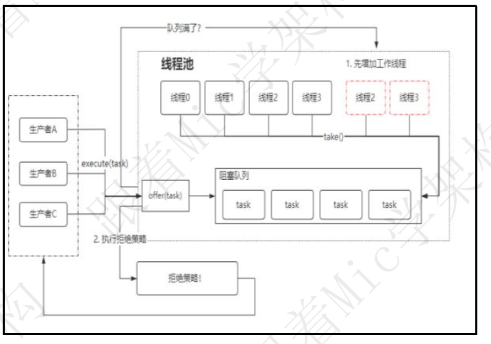

## 怎么理解线程安全？  

Hi， 大家好， 我是 Mic
一个工作了 4 年的小伙伴， 遇到了一个非常抽象的面试题， 说说你对线程安全性
的理解。
这类问题， 对于临时刷面试题来面试的小伙伴， 往往是致命的。
一个是不知道从何说起， 也就是语言组织比较困难。
其次就是， 如果对于线程安全性没有一定程度的理解， 一般很难说出你的理解。
ok， 我们来看看这个问题的回答。  

### 普通人
### 高手
简单来说， 在多个线程访问某个方法或者对象的时候， 不管通过任何的方式调用以及线程如何去交替执行。
在程序中不做任何同步干预操作的情况下， 这个方法或者对象的执行/修改都能按照预期的结果来反馈， 那么这个类就是线程安全的。
实际上， 线程安全问题的具体表现体现在三个方面， 原子性、 有序性、 可见性。
原子性呢， 是指当一个线程执行一系列程序指令操作的时候， 它应该是不可中断的， 因为一旦出现中断， 站在多线程的视角来看， 这一系列的程序指令会出现前后执行结果不一致的问题。
这个和数据库里面的原子性是一样的， 简单来说就是一段程序只能由一个线程完整的执行完成， 而不能存在多个线程干扰。
CPU 的 上 下 文 切 换 ， 是 导 致 原 子 性 问 题 的 核 心 ， 而 JVM 里 面 提 供 了Synchronized 关键字来解决原子性问题  

可见性， 就是说在多线程环境下， 由于读和写是发生在不同的线程里面， 有可能出现某个线程对共享变量的修改， 对其他线程不是实时可见的。
导致可见性问题的原因有很多， 比如 CPU 的高速缓存、 CPU 的指令重排序、 编译器的指令重排序。
有序性， 指的是程序编写的指令顺序和最终 CPU 运行的指令顺序可能出现不一致的现象， 这种现象也可以称为指令重排序， 所以有序性也会导致可见性问题。
可见性和有序性可以通过 JVM 里面提供了一个 Volatile 关键字来解决。
在我看来， 导致有序性、 原子性、 可见性问题的本质， 是计算机工程师为了最大化提升 CPU 利用率导致的。 比如为了提升 CPU 利用率， 设计了三级缓存、 设计了 StoreBuffer、 设计了缓存行这种预读机制、 在操作系统里面， 设计了线程模型、 在编译器里面， 设计了编译器的深度优化机制。
一上就是我对这个问题的理解。  

### 面试点评
从高手的回答中， 可以很深刻的感受到， 他对于计算机底层原理和线程安全性相
关的底层实现是理解得很透彻的。

对我来说， 这个人去写程序代码， 不用担心他滥用线程导致一些不可预测的线程安全性问题了， 这就是这个面试题的价值。
好的， 本期的普通人 VS 高手面试系列的视频就到这里结束了， 喜欢的朋友记得点赞和收藏。
另外， 这些面试题我都整理成了笔记， 大家有需要的可以私信获取。
我是 Mic， 一个工作了 14 年的 Java 程序员， 咱们下期再见  

## 简述一下你对线程池的理解？

到底是什么面试题，
让一个工作了 4 年的精神小伙， 只是去参加了一场技术面试，
就被搞得精神萎靡。 郁郁寡欢！
这一切的背后到底是道德的沦丧， 还是人性的扭曲。
让我们一起揭秘一下这道面试题。
关于， “简述你对线程池的理解”， 看看普通人和高手的回答  

### 普通人
### 高手
关于这个问题， 我会从几个方面来回答。
首先， 线程池本质上是一种池化技术， 而池化技术是一种资源复用的思想， 比较常见的有连接池、 内存池、 对象池。
而线程池里面复用的是线程资源， 它的核心设计目标， 我认为有两个：

减少线程的频繁创建和销毁带来的性能开销， 因为线程创建会涉及到 CPU 上下文切换、 内存分配等工作。
线程池本身会有参数来控制线程创建的数量， 这样就可以避免无休止的创建线程带来的资源利用率过高的问题  起到了资源保护的作用。

其次， 我简单说一下线程池里面的线程复用技术。 因为线程本身并不是一个受控的技术， 也就是说线程的生命周期时由任务运行的状态决定的， 无法人为控制。所以为了实现线程的复用， 线程池里面用到了阻塞队列， 简单来说就是线程池里面的工作线程处于一直运行状态， 它会从阻塞队列中去获取待执行的任务， 一旦队列空了， 那这个工作线程就会被阻塞， 直到下次有新的任务进来。

也就是说， 工作线程是根据任务的情况实现阻塞和唤醒， 从而达到线程复用的目的。  

最后， 线程池里面的资源限制， 是通过几个关键参数来控制的， 分别是核心线程数、 最大线程数。
核心线程数表示默认长期存在的工作线程， 而最大线程数是根据任务的情况动态创建的线程， 主要是提高阻塞队列中任务的处理效率  

以上就是我对这个问题的理解！
### 面试点评
我当时在阅读线程池的源码的时候， 被里面的各种设计思想惊艳到了。

比如动态扩容和缩容的思想、 线程的复用思想、 以及线程回收的方法等等。
我发现越是简单的东西， 反而越不简单。
好的， 本期的普通人 VS 高手面试系列的视频就到这里结束了
更多的面试资料和面试技巧， 可以私信我获取。
我是 Mic， 一个工作了 14 年的 Java 程序员， 咱们下期再见！  

