## mysql 事务

### Mysql的事务隔离级别

资料来源：[Mysql的事务隔离级别](https://www.toutiao.com/video/7091535865247498783/?from_scene=all)

好的， 关于这个问题， 我会从几个方面来回答。<br/>
首先， 事务隔离级别， 是为了解决多个并行事务竞争导致的数据安全问题的一种规范。<br/>
具体来说， 多个事务竞争可能会产生三种不同的现象。<br/>
假设有两个事务 T1/T2 同时在执行， T1 事务有可能会读取到 T2 事务未提交的数据， 但是未提交的事务 T2 可能会回滚， 也就导致了 T1 事务读取到最终不一
定存在的数据产生脏读的现象<br/>

<br/>

假设有两个事务 T1/T2 同时执行， 事务 T1 在不同的时刻读取同一行数据的时候结果可能不一样， 从而导致不可重复读的问题<br/>

<br/>

假设有两个事务 T1/T2 同时执行， 事务 T1 执行范围查询或者范围修改的过程中， 事务 T2 插入了一条属于事务 T1 范围内的数据并且提交了， 这时候在事
务 T1 查询发现多出来了一条数据， 或者在 T1 事务发现这条数据没有被修改，看起来像是产生了幻觉， 这种现象称为幻读<br/>

<br/>

而这三种现象在实际应用中， 可能有些场景不能接受某些现象的存在， 所以在SQL 标准中定义了四种隔离级别， 分别是：<br/>
`读未提交`， 在这种隔离级别下， 可能会产生脏读、 不可重复读、 幻读。
`读已提交（RC)`， 在这种隔离级别下， 可能会产生不可重复读和幻读。
`可重复读（RR）` ， 在这种隔离级别下， 可能会产生幻读
`串行化`， 在这种隔离级别下， 多个并行事务串行化执行， 不会产生安全性问题。
这四种隔离级别里面， 只有串行化解决了全部的问题， 但也意味着这种隔离级别的性能是最低的。
在 Mysql 里面， InnoDB 引擎默认的隔离级别是 RR（可重复读） ， 因为它需要保证事务 ACID 特性中的隔离性特征。
以上就是我对这个问题的理解。


### 请简述MySQL的二阶段提交原理？


## mysql 引擎

###  Mysql中MyISAM和InnoDB引擎有什么区别？
资料来源:[Mysql中MyISAM和InnoDB引擎有什么区别？](https://www.toutiao.com/video/7137497556010926605)

MyISAM和InnoDB都是Mysql里面的两个存储引擎。

在Mysql里面，存储引擎是可以自己扩展的，它的本质其实是定义数据存储的方式以及数据读取的实现逻辑。

而不同存储引擎本身的特性，使得我们可以针对性的选择合适的引擎来实现不同的业务场景。

从而获得更好的性能。

在Mysql 5.5之前，默认的存储引擎是MyISAM，从5.5以后，InnoDB就作为了默认的存储引擎。

在实际应用开发中，我们基本上都是采用InnoDB引擎。

我们先来看一下MyISAM引擎。

MyISAM引擎的数据是通过二进制的方式存储在磁盘上，它在磁盘上体现为两个文件

- 一个是.MYD文件，D代表Data，是MyISAM的数据文件，存放数据记录，
- 一个是.MYI文件，I代表Index，是MyISAM的索引文件，存放索引

实现机制如图所示。

因为索引和数据是分离的，所以在进行查找的时候，先从索引文件中找到数据的磁盘位置，再到数据文件中找到索引对应的数据内容。


在InnoDB存储引擎中，数据同样存储在磁盘上，它在磁盘上只有一个ibd文件，里面包含索引和数据。

它的整体结构如图所示，在B+树的叶子节点里面存储了索引对应的数据，在通过索引进行检索的时候，命中叶子节点，就可以直接从叶子节点中取出行数据。


了解了这两个存储引擎以后，我们在面试的时候该怎么回答呢？

基于我的理解，我认为MyISAm和InnoDB的区别有4个，

- 第一个，数据存储的方式不同，MyISAM中的数据和索引是分开存储的，而InnoDB是把索引和数据存储在同一个文件里面。
- 第二个，对于事务的支持不同，MyISAM不支持事务，而InnoDB支持ACID特性的事务处理
- 第三个，对于锁的支持不同，MyISAM只支持表锁，而InnoDB可以根据不同的情况，支持行锁，表锁，间隙锁，临键锁
- 第四个，MyISAM不支持外键，InnoDB支持外键

因此基于这些特性，我们在实际应用中，可以根据不同的场景来选择合适的存储引擎。
比如如果需要支持事务，那必须要选择InnoDB。
如果大部分的表操作都是查询，可以选择MyISAM。

### Mysql如何解决幻读问题？

资料来源：[Mysql如何解决幻读问题？](https://www.toutiao.com/video/7130449294322041351/)

前天有个去快手面试的小伙伴私信我， 他遇到了这样一个问题： “InnoDB 如何解决幻读”？
这个问题确实不是很好回答， 在实际应用中， 很多同学几乎都不关注数据库的事务隔离性。
所有问题基本就是 CRUD， 一把梭~
那么今天， 我们看一下关于“InnoDB 如何解决幻读”这个问题， 普通人和高手的回答  

#### 普通人
嗯， 我印象中， 幻读是通过 MVCC 机制来解决的， 嗯....
MVCC 类似于一种乐观锁的机制， 通过版本的方式来区分不同的并发事务， 避免幻读问题  

#### 高手

我会从三个方面来回答：

1、 Mysql 的事务隔离级别
Mysql 有四种事务隔离级别， 这四种隔离级别代表当存在多个事务并发冲突时，可能出现的脏读、 不可重复读、 幻读的问题。
其中 InnoDB 在 RR 的隔离级别下， 解决了幻读的问题  

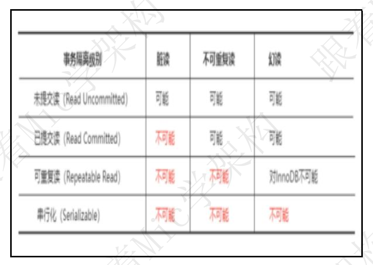

2、 什么是幻读？
那么， 什么是幻读呢？
幻读是指在同一个事务中， 前后两次查询相同的范围时， 得到的结果不一致
第一个事务里面我们执行了一个范围查询， 这个时候满足条件的数据只有一条
第二个事务里面， 它插入了一行数据， 并且提交了
接着第一个事务再去查询的时候， 得到的结果比第一查询的结果多出来了一条数据。  

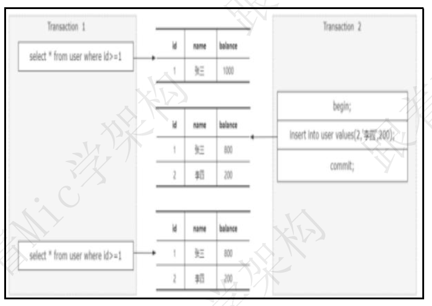4

所以， 幻读会带来数据一致性问题。
3、 InnoDB 如何解决幻读的问题
InnoDB 引入了间隙锁和 next-key Lock 机制来解决幻读问题， 为了更清晰的说明这两种锁， 我举一个例子：
假设现在存在这样这样一个 B+Tree 的索引结构， 这个结构中有四个索引元素分别是： 1、 4、 7、 10。  


当我们通过主键索引查询一条记录， 并且对这条记录通过 for update 加锁  


这个时候， 会产生一个记录锁， 也就是行锁， 锁定 id=1 这个索引。


被锁定的记录在锁释放之前， 其他事务无法对这条记录做任何操作。
前面我说过对幻读的定义： 幻读是指在同一个事务中， 前后两次查询相同的范围时， 得到的结果不一致！
注意， 这里强调的是范围查询，
也就是说， InnoDB 引擎要解决幻读问题， 必须要保证一个点， 就是如果一个事务通过这样一条语句进行锁定时。  


另外一个事务再执行这样一条 insert 语句， 需要被阻塞， 直到前面获得锁的事务释放。  


所以， 在 InnoDB 中设计了一种间隙锁， 它的主要功能是锁定一段范围内的索引记录
当对查询范围 `id>4 and id<7 `加锁的时候， 会针对 B+树中（4， 7） 这个开区间范围的索引加间隙锁。
意味着在这种情况下， 其他事务对这个区间的数据进行插入、 更新、 删除都会被锁住。  

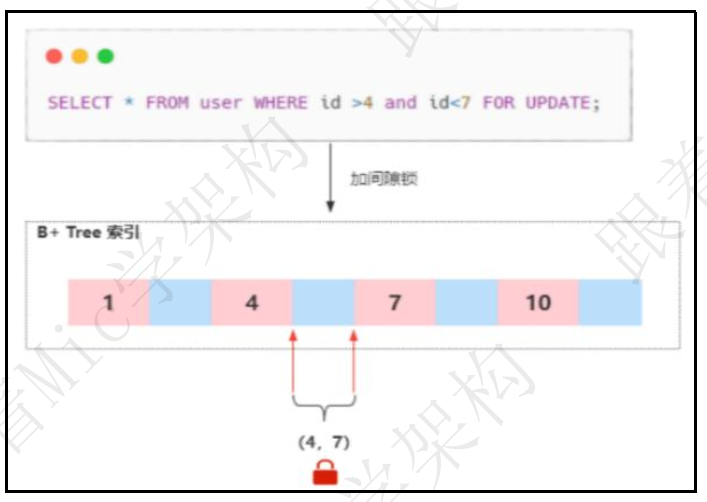

但是， 还有另外一种情况， 比如像这样


这条查询语句是针对 id>4 这个条件加锁， 那么它需要锁定多个索引区间， 所以在这种情况下 InnoDB 引入了 next-key Lock 机制。
next-key Lock 相当于间隙锁和记录锁的合集， 记录锁锁定存在的记录行， 间隙锁锁住记录行之间的间隙， 而 next-key Lock 锁住的是两者之和。  


每个数据行上的非唯一索引列上都会存在一把 next-key lock， 当某个事务持有该数据行的 next-key lock 时， 会锁住一段左开右闭区间的数据。

因此， 当通过 id>4 这样一种范围查询加锁时， 会加 next-key Lock， 锁定的区间范围是： (4,7],(7,10],(10,+∞]  


间隙锁和 next-key Lock 的区别在于加锁的范围， 间隙锁只锁定两个索引之间的引用间隙， 而 next-key Lock 会锁定多个索引区间， 它包含记录锁和间隙锁。
当我们使用了范围查询， 不仅仅命中了 Record 记录， 还包含了 Gap 间隙， 在这种情况下我们使用的就是临键锁， 它是 MySQL 里面默认的行锁算法。
4、 总结
虽然 InnoDB 中通过间隙锁的方式解决了幻读问题， 但是加锁之后一定会影响到并发性能， 因此， 如果对性能要求较高的业务场景中， 可以把隔离级别设置成RC， 这个级别中不存在间隙锁。
以上就是我对于 innoDB 如何解决幻读问题的理解！  

##  数据库连接池

### 数据库连接池有什么用？以及它有哪些关键参数?

资料来源：[数据库连接池有什么用？以及它有哪些关键参数?](https://www.toutiao.com/video/7091921684218774053/?from_scene=all)

一个工作 5 年的粉丝找到我， 他说参加美团面试， 遇到一个基础题没回答上来。
这个问题是： “数据库连接池有什么用？ 以及它有哪些关键参数”？
我说， 这个问题都不知道， 那你项目里面的连接池配置怎么设置的？ 你们猜他怎么回答。 懂得懂得啊。
好的， 关于这个问题， 我们来看看普通人和高手的回答。  

#### 普通人
#### 高手

关于这个问题， 我从这几个方面来回答。
首先， 数据库连接池是一种池化技术， 池化技术的核心思想是实现资源的复用，避免资源重复创建销毁的开销。
而在数据库的应用场景里面， 应用程序每次向数据库发起 CRUD 操作的时候，都需要创建连接
在数据库访问量较大的情况下， 频繁的创建连接会带来较大的性能开销。
而连接池的核心思想， 就是应用程序在启动的时候提前初始化一部分连接保存
到连接池里面， 当应用需要使用连接的时候， 直接从连接池获取一个已经建立好的链接。
连接池的设计， 避免了每次连接的建立和释放带来的开销。  

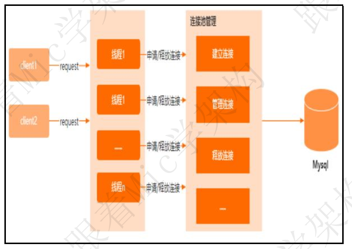

连接池的参数有很多， 不过关键参数就几个：
首先是， 连接池初始化的时候会有几个关键参数：
初始化连接数， 表示启动的时候初始多少个连接保存到连接池里面。
最大连接数， 表示同时最多能支持多少连接， 如果连接数不够， 后续要获取连接的线程会阻塞。
最大空闲连接数， 表示没有请求的时候， 连接池中要保留的最大空闲连接。
最小空闲连接， 当连接数小于这个值的时候， 连接池需要再创建连接来补充到这个值。
然后， 就是在使用连接的时候的关键参数：  

最大等待时间， 就是连接池里面的连接用完了以后， 新的请求要等待的时间， 超过这个时间就会提示超时异常。
无效连接清除， 清理连接池里面的无效连接， 避免使用这个连接操作的时候出现错误。
不同的连接池框架， 除了核心的参数以外， 还有很多业务型的参数， 比如是否要
检测连接 sql 的有效性、 连接初始化 SQL 等等， 这些配置参数可以在使用的时
候去查询 api 文档就可以知道。
以上就是我对这个问题的理解  

#### 面试点评

这个问题更进一步去问， 就会问到最大连接数、 最小连接数应该如何设置？
连接池的实现原理啊等等。
所以建议各位粉丝还是要有一个系统化的学习。
好的， 本期的普通人 VS 高手面试系列的视频就到这里结束了。
如果有任何面试问题、 职业发展问题、 学习问题， 都可以私信我。
我是 Mic， 一个工作了 14 年的 Java 程序员， 咱们下期再见。  

### 为什么阿里Java手册，禁止使用存储过程？

资料来源：[【Java面试】为什么阿里Java手册，禁止使用存储过程？](https://www.toutiao.com/video/7254097421586661945/?from_scene=all)

一个刚刚从传统行业跳槽到互联网公司的粉丝跑过来问我。

他说在他们公司的数据库开发规范上明确禁止使用存储过程，有点困惑。

因为他在之前传统公司的时候在解决一些复杂的逻辑的时候都是习惯性写存储过程的，

突然不让用了都不习惯。

之所以互联网公司不让用，主要有几个方面的原因：

\21. 存储过程不好调试，一旦涉及到非常复杂的逻辑，定位问题的时候比较麻烦

\22. 存储过程的一致性很差， 如果从 Oracle 迁移到 Mysql，涉及到部分数据库独有特性的时候，整个存储过程就需要重写，不仅成本高，而且还有可能对上游业务造成影响

\23. 存储过程的管理比较困难，一旦存储过程的量比较大的时候，就会陷入到一个混乱的状态

\24. 存储过程的优化和维护很麻烦， 随着业务的发展，数据库的表结构也许会发生变化，这些变化需要同步给到存储过程，并且有可能原来的 SQL 语句的执行计划不是最优的，也需要重新维护。  

在互联网公司，业务的迭代速度是日新月异的，把业务逻辑沉淀在应用程序中，反而更加灵活。

好了，今天的分享就到这里。

最后，我给关注了我的粉丝准备了一个 20W 字的面试文档，大家可以在我的评论区置顶中领取，仅限 10 份，先到先得  

<hr/>

## mysql索引


### Mysql索引有哪些缺点，以及具有哪些索引类型？

资料来源：[【Java面试】Mysql索引有哪些缺点，以及具有哪些索引类型？](https://www.toutiao.com/video/7101505375253299748/?from_scene=all)

Hi， 我是 Mic
今天分享的这道面试题， 让一个工作 4 年的小伙子去大众点评拿了 60W 年薪。
这道面试题是： ”请你说一下 Mysql 索引的优点和缺点“
关于这道题， 看看普通人和高手的回答  

高手
索引， 是一种能够帮助 Mysql 高效从磁盘上检索数据的一种数据结构。在 Mysql 中的 InnoDB 引擎中， 采用了 B+树的结构来实现索引和数据的存储 

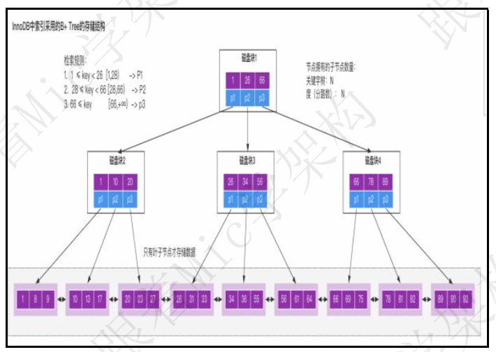

在我看来， Mysql 里面的索引的优点有很多
通过 B+树的结构来存储数据， 可以大大减少数据检索时的磁盘 IO 次数， 从而提升数据查询的性能

B+树索引在进行范围查找的时候， 只需要找到起始节点， 然后基于叶子节点的链表结构往下读取即可， 查询效率较高。
通过唯一索引约束， 可以保证数据表中每一行数据的唯一性当然， 索引的不合理使用， 也会有带来很多的缺点。

数据的增加、 修改、 删除， 需要涉及到索引的维护， 当数据量较大的情况下， 索引的维护会带来较大的性能开销  

一个表中允许存在一个聚簇索引和多个非聚簇索引， 但是索引数不能创建太多，否则造成的索引维护成本过高。
创建索引的时候， 需要考虑到索引字段值的分散性， 如果字段的重复数据过多，创建索引反而会带来性能降低。
在我看来， 任何技术方案都会有两面性， 大部分情况下， 技术方案的选择更多的是看中它的优势和当前问题的匹配度。
以上就是我对这个问题的理解  

#### 面试点评
行业竞争加剧， 再加上现在大环境不好， 各个一二线大厂都在裁员。
带来的问题就是， 人才筛选难度增加， 找工作越来越难。
这道题目考察的是求职者对于 Mysql 的理解程度， 不算难， 但能卡主很多人。
好的， 本期的普通人 VS 高手面试系列的视频就到这里结束了，
喜欢的朋友记得点赞和收藏。
有任何工作和学习上的问题， 可以随时私信我。
我是 Mic， 一个工作了 14 年的 Java 程序员， 咱们下期再见。  

<hr/>

### 什么是聚集索引和非聚集索引

资料来源：[【Java面试】大年一面被挂，什么是聚集索引和非聚集索引](https://www.toutiao.com/video/7206227757359956495/?channel=&source=search_tab)

一个去阿里面试并且第一面就挂了的粉丝私信我， 被数据库里面几个问题难倒了，他说面试官问了事务隔离级别、 MVCC、 聚集索引/非聚集索引、 B 树、 B+树这些， 没回答好。
大厂面试基本上是这样， 由点到面去展开， 如果你对这个技术理解不够全面， 很容易就会被看出来。
ok， 关于“什么是聚集索引和非聚集索引”这个问题， 看看普通人和高手的回答。

#### 普通人
嗯， 聚集索引就是通过主键来构建的索引结构。
而非聚集索引就是除了主键以外的其他索引。  

#### 高手
简单来说， 聚集索引就是基于主键创建的索引， 除了主键索引以外的其他索引，称为非聚集索引， 也叫做二级索引。
由于在 InnoDB 引擎里面， 一张表的数据对应的物理文件本身就是按照 B+树来组织的一种索引结构， 而聚集索引就是按照每张表的主键来构建一颗 B+树， 然后叶子节点里面存储了这个表的每一行数据记录。
所以基于 InnoDB 这样的特性， 聚集索引并不仅仅是一种索引类型， 还代表着一种数据的存储方式。
同时也意味着每个表里面必须要有一个主键， 如果没有主键， InnoDB 会默认选择或者添加一个隐藏列作为主键索引来存储这个表的数据行。 一般情况是建议使用自增 id 作为主键， 这样的话 id 本身具有连续性使得对应的数据也会按照顺序  

存储在磁盘上， 写入性能和检索性能都很高。 否则， 如果使用 uuid 这种随机 id，那么在频繁插入数据的时候， 就会导致随机磁盘 IO， 从而导致性能较低。
需要注意的是， InnoDB 里面只能存在一个聚集索引， 原因很简单， 如果存在多个聚集索引， 那么意味着这个表里面的数据存在多个副本， 造成磁盘空间的浪费，以及数据维护的困难。
由于在 InnoDB 里面， 主键索引表示的是一种数据存储结构， 所以如果是基于非聚集索引来查询一条完整的记录， 最终还是需要访问主键索引来检索。  

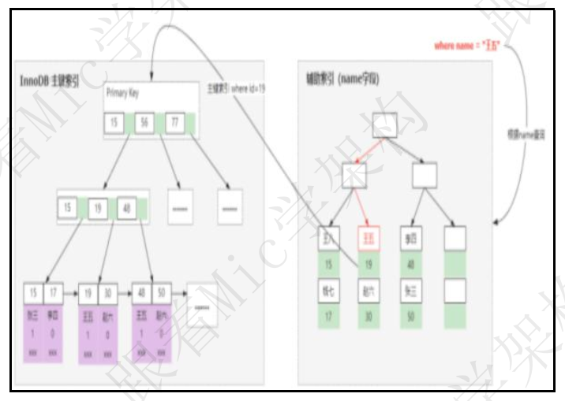


#### 面试点评
这个问题要回答好， 还真不容易。 涉及到 Mysql 里面索引的实现原理。
但是如果回答好了， 就能够很好的反馈求职者的技术功底， 那通过面试就比较容易了。
好的， 本期的普通人 VS 高手面试系列的视频就到这里结束了， 喜欢的朋友记得点赞和收藏。
另外， 这些面试题我都整理成了笔记， 大家有需要的可以私信获取。
我是 Mic， 一个工作了 14 年的 Java 程序员， 咱们下期再见。  

### 索引什么时候失效

资料来源：[索引什么时候失效](https://www.toutiao.com/video/7119682545981227534/?from_scene=all)

InnoDB 引擎里面有两种索引类型， 一种是主键索引、 一种是普通索引。
InnoDB 用了 B+树的结构来存储索引数据。
当使用索引列进行数据查询的时候， 最终会到主键索引树中查询对应的数据行进行返回。
理论上来说， 使用索引列查询， 就能很好的提升查询效率， 但是不规范的使用会导致索引失效， 从而无法发挥索引本身的价值。
导致索引失效的情况有很多：
在索引列上做运算， 比如使用函数， Mysql 在生成执行计划的时候， 它是根据统计信息来判断是否要使用索引的。第一种
而在索引列上加函数运算， 导致 Mysql 无法识别索引列， 也就不会再走索引了。
不过从 Mysql8 开始， 增加了函数索引可以解决这个问题。

第二种：

在一个由多列构成的组合索引中， 需要按照最左匹配法则， 也就是从索引的最左列开始顺序检索， 否则不会走索引。
在组合索引中， 索引的存储结构是按照索引列的顺序来存储的， 因此在 sql 中也需要按照这个顺序才能进行逐一匹配。
否则 InnoDB 无法识别索引导致索引失效。

第三种：

当索引列存在隐式转化的时候， 比如索引列是字符串类型， 但是在 sql 查询中没有使用引号。<br/>

第四种：

那么 Mysql 会自动进行类型转化， 从而导致索引失效在索引列使用不等于号、not 查询的时候， 由于索引数据的检索效率非常低， 因此 Mysql 引擎会判断不走索引。

第五种：

使用`  like ` 通配符匹配后缀` %xxx ` 的时候， 由于这种方式不符合索引的最左匹配原则，所以也不会走索引。

但是反过来， 如果通配符匹配的是前缀`  xxx%` ， 符合最左匹配， 也会走索引。

第六种：

使用` or `连接查询的时候， ` or ` 语句前后没有同时使用索引， 那么索引会失效。 只有` or `左右查询字段都是索引列的时候， 才会生效。
除了这些场景以外， 对于多表连接查询的场景中， 连接顺序也会影响索引的使用。
不过最终是否走索引， 我们可以使用 explain 命令来查看 sql 的执行计划， 然后针对性的进行调优即可

### Mysql索引优点和缺点

资料来源：[Mysql索引优点和缺点](https://www.toutiao.com/video/7096306391794745892/)

索引， 是一种能够帮助 Mysql 高效从磁盘上检索数据的一种数据结构。
在 Mysql 中的 InnoDB 引擎中， 采用了 B+树的结构来实现索引和数据的存储


在我看来， Mysql 里面的索引的优点有很多<br/>
通过 B+树的结构来存储数据， 可以大大减少数据检索时的磁盘 IO 次数， 从而提升数据查询的性能<br/>
B+树索引在进行范围查找的时候， 只需要找到起始节点， 然后基于叶子节点的链表结构往下读取即可， 查询效率较高。<br/>
通过唯一索引约束， 可以保证数据表中每一行数据的唯一性<br/>
当然， 索引的不合理使用， 也会有带来很多的缺点。<br/>
数据的增加、 修改、 删除， 需要涉及到索引的维护， 当数据量较大的情况下， 索引的维护会带来较大的性能开销<br/>
一个表中允许存在一个聚簇索引和多个非聚簇索引， 但是索引数不能创建太多，否则造成的索引维护成本过高。<br/>
创建索引的时候， 需要考虑到索引字段值的分散性， 如果字段的重复数据过多，创建索引反而会带来性能降低。<br/>
在我看来， 任何技术方案都会有两面性， 大部分情况下， 技术方案的选择更多的是看中它的优势和当前问题的匹配度<br/>

<hr/>

### 什么是索引下推？什么是索引覆盖？什么是回表？

资料来源：[【Java面试】什么是索引下推？什么是索引覆盖？什么是回表？](https://www.toutiao.com/video/7287884933354390051/?from_scene=all)

<hr/>

这三个是mysql中经典的面试题
80%以上的公司在问到mysql中的问题中，必然要问到着三个问题
索引下推是mysql5.6推出来的查询优化方案
主要的目的是减少数据或查询中不必要的数据读取和计算
他的原理是将查询条件尽可能的推送到索引层面进行一个过滤
减少从磁盘读取的数据量和后续的计算开销
我简单通过一个案例
来说明一下他的实现原理
有一张用户表user,我们创建一个联合索引(name, age)

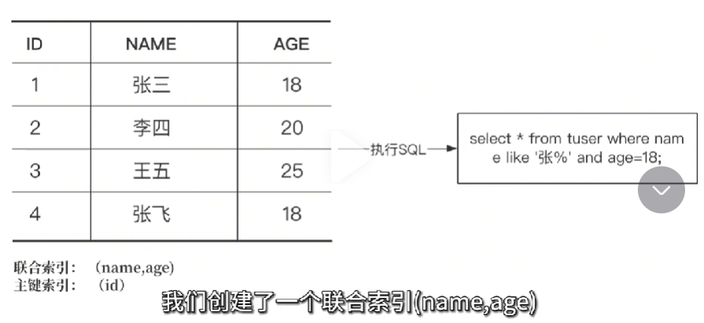现在需要从这个表里面检索名字，是姓张并且年龄是18岁的所有用户
在没有开启索引下推之前，mysql查询方式是这个样子的

- 先从二级索引中根据name匹配到所有姓张的所有数据行，得到主键索引的id分别是1和4
- 分别用1和4去聚簇索引中找到匹配的数据行
- 然后在Mysql的Server层对数据使用age=18这个条件进行过滤

这种方式我们会发现会设计到2次回表，分别是id=1d和id=4对性能的影响会比较大

而索引的下推就是针对这个场景的优化，把过滤的场景下推到存储引擎层面。具体的实现逻辑是，当根据(name,age)进行一个查询的时候，直接在存储引擎中。
根据name和age进行过滤，得到匹配后的数据行再回表查询
在上面这个例子中，我们只需要一次回表就能获取到匹配的数据
**二，什么是回表，就需要了解innoDB中的索引构成关系**

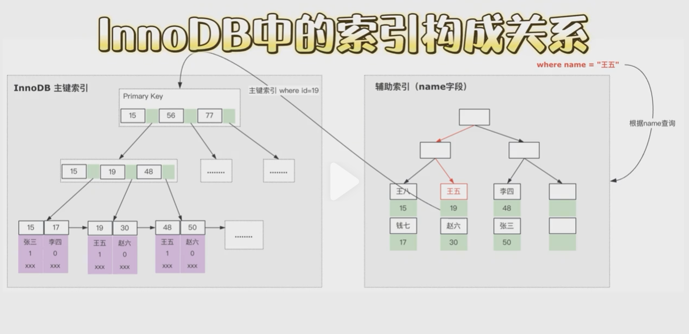我们知道在innerDB的引擎中，所有数据是存储在聚簇索引中的<br/>
一个表有且只有一个聚簇索引，但是可以存在多个非聚簇索引<br/>
当我们基于非聚簇索引进行数据查询的时候，如果返回的列不能满足<br/>
查询结果列的不能满足查询结果列的需求的时候，就需要从聚簇索引中去进行一个查找<br/>
比如执行这样一个语句<br/>

```sql
select * from user where name = '王五'
```
由于返回的字段在二级索引中不存在，需要从聚簇索引中去获取<br/>

我们把这个过程称为回表<br/>**三、什么是索引覆盖呢**

理解前面这两个概念，就很容易理解索引覆盖了<br/>
在这样一个索引结构中，如果执行这样一条sql<br/>

```sql
select * from user where name = '王五'
```
由于sql语句中返回结果列在二级索引中能够获取到，这样我就不在需要回表<br/>

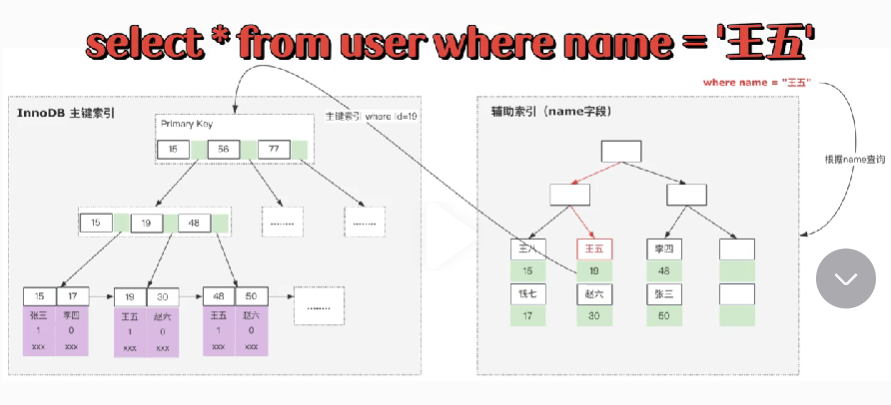

而是直接返回对应的数据内容即可<br/>
这种情况我们就称为索引覆盖<br/>
这个部分内容涉及到的只是点比较多，建议大家有空可以去深度的系统的学习下mysql

### 索引有哪些缺点以及具体有哪些索引类型  

资料来源：[索引有哪些缺点以及具体有哪些索引类型  ](https://www.toutiao.com/video/7220235542535864832/?channel=&source=video)

昨天一个工作 4 年的粉丝，被问到：“Mysql 索引有哪些缺点，以及具体有哪些索引类型”这个问题。<br/>
这个问题比较基础，但凡有 Java 经验的同学都能回答一二，不过在目前整个就业环境并不是特别的情况下。<br/>
回答出来和回答好是两个概念，所以我建议大家可以去评论区置顶中领取那本 30W 字的《大厂面试手册》，<br/>
上面记录了一个比较清晰和完整的回答，大家只需要按照这个模版回答就很好了。下面我来说一下我的回答：<br/>
**第一个，索引的优缺点** <br/>
**优点：**<br/>

-  合理的增加索引，可以提高数据查询的效率，减少查询时间<br/>
-  有一些特殊的索引，可以保证数据的完整性，比如唯一索引<br/>
**缺点：**<br/>
-  创建索引和维护索引需要消耗时间 索引需要额外占用物理空间<br/>
-   对创建了索引的表进行数据的增加、修改、删除时，会同步动态维护索引，这个部
分会造成性能的影响<br/>
**第二个，索引的类型 **<br/>
-  主键索引: 数据列不允许重复，不允许为 NULL，一个表只能有一个主键。<br/>
-  唯一索引: 数据列不允许重复，允许为 NULL 值，一个表允许多个列创建唯一索引。<br/>
-  普通索引: 基本的索引类型，没有唯一性的限制，允许为 NULL 值。<br/>
-  全文索引：是目前搜索引擎使用的一种关键技术，对文本的内容进行分词、搜索。<br/>
-   覆盖索引：查询列要被所建的索引覆盖，不必读取数据行<br/>
-  组合索引：多列值组成一个索引，用于组合搜索，效率大于索引合并<br/>
以上就是我的回答，大家如果觉得这个回答比较完整，可以点赞收藏一下，后续面试的时候可以复习<br/>
好了，今天的分享就到这里， byebye  <br/>

### Mysql为什么使用B+Tree作为索引结构？

资料来源：[Mysql为什么使用B+Tree作为索引结构？](https://www.toutiao.com/video/7091921684218774053/?from_scene=all)

一个工作 8 年的粉丝私信了我一个问题。  <br/>

他说这个问题是去阿里面试的时候被问到的， 自己查了很多资料也没搞明白， 希望我帮他解答。<br/>
问题是： “Mysql 为什么使用 B+Tree 作为索引结构”<br/>
关于这个问题， 看看普通人和高手的回答。<br/>

#### 高手
关于这个问题， 我从几个方面来回答。<br/>
首先， 常规的数据库存储引擎，一般都是采用 B 树或者 B+树来实现索引的存储。
因为 B 树是一种多路平衡树， 用这种存储结构来存储大量数据， 它的整个高度会相比二叉树来说， 会矮很多。
而对于数据库来说， 所有的数据必然都是存储在磁盘上的， 而磁盘 IO 的效率实际上是很低的， 特别是在随机磁盘 IO 的情况下效率更低。<br/>
所以树的高度能够决定磁盘 IO 的次数， 磁盘 IO 次数越少， 对于性能的提升就越大， 这也是为什么采用 B 树作为索引存储结构的原因   


但是在 Mysql 的 InnoDB 存储引擎里面， 它用了一种增强的 B 树结构， 也就是B+树来作为索引和数据的存储结构。
相比较于 B 树结构， B+树做了几个方面的优化。<br/>
B+树的所有数据都存储在叶子节点， 非叶子节点只存储索引。<br/>
叶子节点中的数据使用双向链表的方式进行关联  <br/>

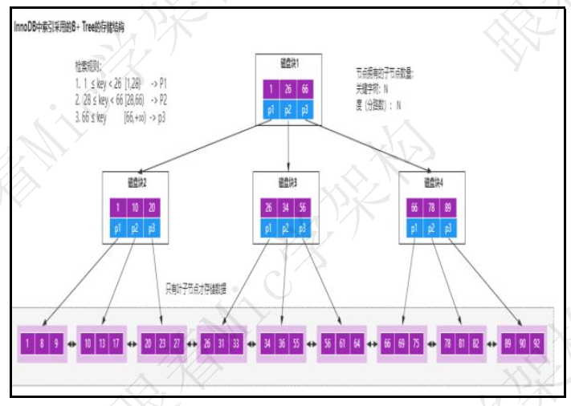

使用 B+树来实现索引的原因， 我认为有几个方面。<br/>
B+树非叶子节点不存储数据， 所以每一层能够存储的索引数量会增加， 意味着B+树在层高相同的情况下存储的数据量要比 B 树要多， 使得磁盘 IO 次数更少。<br/>
在 Mysql 里面， 范围查询是一个比较常用的操作， 而 B+树的所有存储在叶子节点的数据使用了双向链表来关联， 所以在查询的时候只需查两个节点进行遍历就行， 而 B 树需要获取所有节点， 所以 B+树在范围查询上效率更高。<br/>
在数据检索方面， 由于所有的数据都存储在叶子节点， 所以 B+树的 IO 次数会更加稳定一些。<br/>
因为叶子节点存储所有数据， 所以 B+树的全局扫描能力更强一些， 因为它只需要扫描叶子节点。 但是 B 树需要遍历整个树  <br/>

另外， 基于 B+树这样一种结构， 如果采用自增的整型数据作为主键， 还能更好的避免增加数据的时候， 带来叶子节点分裂导致的大量运算的问题。<br/>
总的来说， 我认为技术方案的选型， 更多的是去解决当前场景下的特定问题， 并不一定是说 B+树就是最好的选择， 就像 MongoDB 里面采用 B 树结构， 本质上来说， 其实是关系型数据库和非关系型数据库的差异。<br/>
以上就是我对这个问题的理解。<br/>

#### 面试点评

对于“为什么要选择 xx 技术”的问题， 其实很好回答。<br/>
只要你对这个技术本身的特性足够了解， 那么自然就知道为什么要这么设计。<br/>
就像， 我们在业务开发中， 知道什么时候使用 List， 什么时候使用 Map， 道理是一样的  <br/>

好的， 本期的普通人 VS 高手面试系列的视频就到这里结束了。<br/>
如果有任何面试问题、 职业发展问题、 学习问题， 都可以私信我。<br/>
我是 Mic， 一个工作了 14 年的 Java 程序员， 咱们下期再见  <br/>


### 谈谈你对B树和B+树的理解？

资料来源：[谈谈你对B树和B+树的理解](https://www.toutiao.com/video/7076388733272588807/?from_scene=all)

数据结构与算法问题， 困扰了无数的小伙伴。<br/>
很多小伙伴对数据结构与算法的认知有一个误区， 认为工作中没有用到， 为什么面试要问， 问了能解决实际问题？
图灵奖获得者： Niklaus Wirth 说过： 程序=数据结构+算法， 也就说我们无时无刻都在和数据结构打交道  <br/>

只是作为 Java 开发， 由于技术体系的成熟度较高， 使得大部分人认为： 程序应该等于框架+SQL 呀？<br/>
今天我们就来分析一道数据结构的题目： ”B 树和 B+树“。<br/>
关于这个问题， 我们来看看普通人和高手的回答！

#### 普通人<br/>

嗯.我想想…嗯…Mysql 里面好像是用了 B+树来做索引的！ 然后…  <br/>

#### 高手

为了更清晰的解答这个问题， 我打算从三个方面来回答：<br/>
了解二叉树、 AVL 树、 B 树的概念<br/>
B 树和 B+树的应用场景<br/>
B 树是一种多路平衡查找树， 为了更形象的理解。<br/>
二叉树， 每个节点支持两个分支的树结构， 相比于单向链表， 多了一个分支。<br/>
二叉查找树， 在二叉树的基础上增加了一个规则， 左子树的所有节点的值都小于<br/>
它的根节点， 右子树的所有子节点都大于它的根节点  二叉查找树会出现斜树问题， 导致时间复杂度增加， 因此又引入了一种平衡二叉树， 它具有二叉查找树的所有特点， 同时增加了一个规则： ”它的左右两个子树的高度差的绝对值不超过 1“。 平衡二叉树会采用左旋、 右旋的方式来实现平衡， 而 B 树是一种多路平衡查找树， 它满足平衡二叉树的规则， 但是它可以有多个子树， 子树的数量取决于关键字的数量， 比如这个图中根节点有两个关键字 3和 5， 那么它能够拥有的子路数量=关键字数+1。<br/>
因此从这个特征来看， 在存储同样数据量的情况下， 平衡二叉树的高度要大于 B树。    <br/>


B+树， 其实是在 B 树的基础上做的增强， 最大的区别有两个：<br/>

B 树的数据存储在每个节点上， 而 B+树中的数据是存储在叶子节点， 并且通过链表的方式把叶子节点中的数据进行连接。
B+树的子路数量等于关键字数<br/>

这个是 B 树的存储结构， 从 B 树上可以看到每个节点会存储数据。  <br/>

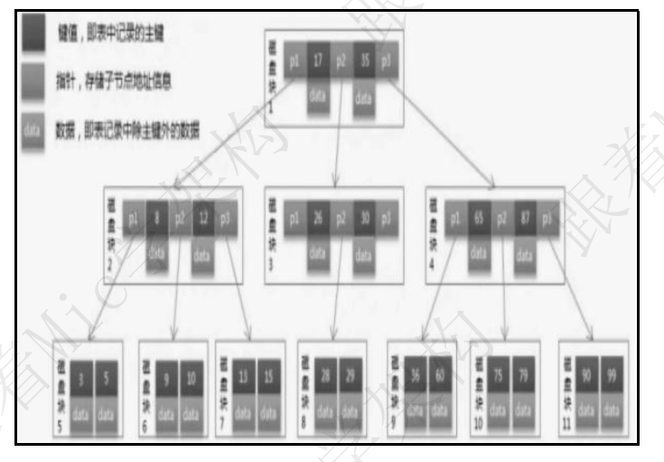

这个是 B+树， B+树的所有数据是存储在叶子节点， 并且叶子节点的数据是用双向链表关联的  <br/>

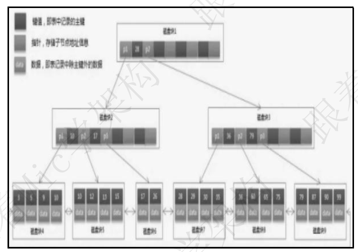

B 树和 B+树， 一般都是应用在文件系统和数据库系统中， 用来减少磁盘 IO 带来的性能损耗。<br/>
以 Mysql 中的 InnoDB 为例， 当我们通过 select 语句去查询一条数据时， InnoDB需要从磁盘上去读取数据， 这个过程会涉及到磁盘 IO 以及磁盘的随机 IO<br/>
我们知道磁盘 IO 的性能是特别低的， 特别是随机磁盘 IO。<br/>
因为， 磁盘 IO 的工作原理是， 首先系统会把数据逻辑地址传给磁盘， 磁盘控制电路按照寻址逻辑把逻辑地址翻译成物理地址， 也就是确定要读取的数据在哪个磁道， 哪个扇区。<br/>
为了读取这个扇区的数据， 需要把磁头放在这个扇区的上面， 为了实现这一个点，磁盘会不断旋转， 把目标扇区旋转到磁头下面， 使得磁头找到对应的磁道， 这里涉及到寻道事件以及旋转时间。  <br/>

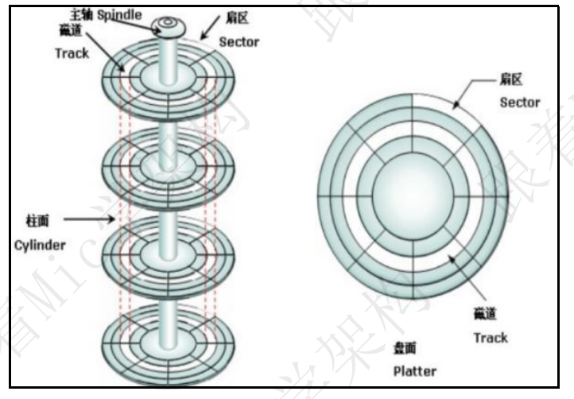

很明显， 磁盘 IO 这个过程的性能开销是非常大的， 特别是查询的数据量比较多的情况下。<br/>
所以在 InnoDB 中， 干脆对存储在磁盘块上的数据建立一个索引， 然后把索引数据以及索引列对应的磁盘地址， 以 B+树的方式来存储。<br/>
如图所示， 当我们需要查询目标数据的时候， 根据索引从 B+树中查找目标数据即可， 由于 B+树分路较多， 所以只需要较少次数的磁盘 IO 就能查找到。<br/>


为什么用 B 树或者 B+树来做索引结构？ 原因是 AVL 树的高度要比 B 树的高度要高， 而高度就意味着磁盘 IO 的数量。 所以为了减少磁盘 IO 的次数， 文件系统或者数据库才会采用 B 树或者 B+树。<br/>
以上就是我对 B 树和 B+树的理解！<br/>

#### 结尾

数据结构在实际开发中非常常见， 比如数组、 链表、 双向链表、 红黑树、 跳跃表、B 树、 B+树、 队列等。<br/>
在我看来， 数据结构是编程中最重要的基本功之一。<br/>
学了顺序表和链表， 我们就能知道查询操作比较多的场景中应该用顺序表， 修改操作比较多的场景应该使用链表。<br/>
学了队列之后， 就知道对于 FIFO 的场景中， 应该使用队列。<br/>
学了树的结构后， 会发现原来查找类的场景， 还可以更进一步提升查询性能。<br/>
基本功决定大家在技术这个岗位上能够走到的高度。  <br/>

### 索引的底层实现为什么选择B+Tree而不是红黑树？

资料来源：[索引的底层实现为什么选择B+Tree而不是红黑树？](https://www.toutiao.com/video/7028890535587021326/)

我主要从两个点来回答
**第一点**
对于一个数据库来说 存储的数据量会比较多，导致索引也很大 因此需要将索引存储在磁盘，但是磁盘的 IO 操作又非常耗，所以提高索引效率的关键在于减少磁盘 IO 的次数。

举个例子 对于 31 个节点的树来说 ，一个 5 阶 B+Tree 的高度是 3 一个红黑树的最小高度是 5，树的高度基本决定了磁盘的 IO 次数 ，所以使用 B+Tree 性能要高很多
**第二点**
B+Tree 有个特点是相邻的数据在物理上也是相邻的，因为 B+Tree 的 node 的大小设为一个页，而一个节点上存有多个相邻的关键字和分支信息，每个节点只需要一次 IO就能完全载入，相当于一次 IO 载入了多个相邻的关键字和分支，而红黑树不具有这个特性，红黑树中大小相邻的数据，在物理结构上可能距离相差很大。由于程序的局部性原理，如果我们在索引中采用了预加载的技术，每次磁盘访问的时候除了将访问到的页加载到磁盘，我们还可以基于局部性原理加载，几页相邻的数据到内存中，而这个加载是不需要消耗多余磁盘 IO 时间的。因此 基于局部性原理，以及 B+Tree 存储结构物理上的特性，所以 B+Tree 的索引性能比红黑树要好很多。

好的关于普通人和高手的回答谁的回答较好呢，大家心中自有定论如果有更好的回答<br/>
欢迎在评论区补充留言，最后呢 ，本期的普通人 VS 高手系列视频就到这里结束了<br/>
喜欢的朋友不妨点个关注一键三连，咱们下期不见不撒！  <br/>

### MySQL官方级别解释，什么是最左匹配原则？速来围观

资料来源：[【Java面试】MySQL官方级别解释，什么是最左匹配原则？速来围观 ](https://www.toutiao.com/video/7272638578465702434/?from_scene=all)

最左匹配原则通常指的是索引的匹配方式<br/>
简单来说，当查询语句中有多个条件，并且这些条件可以使用索引进行匹配时，数据库系统会使用最左匹配原则来选择最适合的索引进行查询。<br/>
举个例子，假设存在这样一个联合索引<br/>

```sql
(column1, column2)
```
如果查询语句的条件是这样的一个形式<br/>
```sql
column1 = 1 and column2 =2
```
那么最左匹配原则会选择使用当前索引进行查询，要理解为什么会是最左匹配原则，还得从Mysql的B+数的索引结构来展开。
假设存在这样`(a, b)`这样一个联合索引，那么在B+树的存储结构中可能是这样<br/>

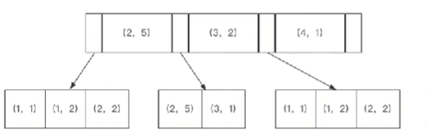

 可以看到a字段值是有序的，b字段的值是没有存储顺序的。但是我们可以发现，<br/>
 如果字段a在匹配成功的情况下，b字段值又是按照顺序进行排列的。但是这种顺序<br/>
 是相对的，这是因为，Mysql创建联合索引的规则是，首先会对联合索引的最左边的第一个字段进行排序<br/>
 在第一个字段的排序基础上，然后在对第二字段进行排序。所以如果只是单纯的用 b=2这个条件是没有办法利用到索引的
 因此在InnoDB的联合索引中，只有先确定的前一个值。才能确定下一个值。<br/>
 如果有范围查找，那么联合索引中使用范围查询字段后的索引在该条SQL中都不会起作用<br/>

 但是要注意in和=这两个操作符号是允许乱序匹配的，比如有这样(a,b,c)这样一个联合索引，那么在B
 那么我们可以通过这样一个SQL<br/>

```sql
select * from t where c=1 and a =1 and b=1
```
是可以去实现最左匹配的，因为Mysql中有一个优化器。他会对这个sql语句进行分析和优化<br/>
最终能够去匹配对应的索引形式，也就是最终会优化成这样一个结构<br/>

```sql
select * from t where a =1 and b=1 and c=1
```
以上，就是我对这个问题的理解<br/>

### 给你 ab,ac,abc 字段，你是如何加索引的？  

这主要考察联合索引的最左前缀原则知识点。

- 这个最左前缀可以是联合索引的最左 N 个字段。比如组合索引 （a,b,c） 可以相当于建立了 （a）,（a,b）,(a,b,c) 三个索引，大大提高了索引复用能力。
- 最左前缀也可以是字符串索引的最左 M 个字符。因此给你 ab,ac,abc 字段，你可以直接加 abc 联合索引和 ac 联合索引即可  

<hr/>

## 事务隔离级别

###  这一次彻底带你搞懂，Mysql的事务隔离级别

一位 5 年工作经验的粉丝，去阿里面试被问到一个关于数据库事务隔离级别的问题，当时，没有问答上来，<br/>
希望给他一个参考答案。那么，今天我给大家谈谈我的理解。<br/>
另外，我花了 1 个多星期把往期的面试题解析配套文档准备好了，一共有 10W 字，想获取的小伙伴可以<br/>
从我的个人煮叶简介中找到。<br/>
【导航条：脏读、幻读、不可重复读】<br/>
（转场，屏幕黑底白字，正中央出现“1 脏读、幻读、不可重复读”）<br/>
1、脏读、幻读、不可重复读<br/>
在 SQL 操作中，多个事务竞争可能会产生三种不同的现象，分别是脏读、幻读、不可重复读。<br/>
首先来看脏读，如图所示，  <br/>

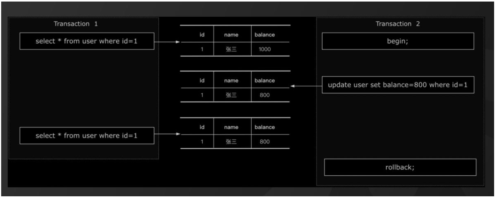

假设有两个事务 T1/T2 同时在执行，T1 事务有可能会读取到 T2 事务未提交的数据，但是未提交的事务T2 可能会回滚，也就导致了 T1 事务读取到最终不一定存在的数据产生脏读的现象  <br/>

然后来看幻读，如图所示：<br/>

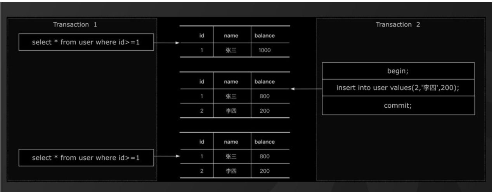

假设有两个事务 T1/T2 同时执行，事务 T1 执行范围查询或者范围修改的过程中，事务 T2 插入了一条属于事务 T1 范围内的数据并且提交了，这时候在事务 T1 查询发现多出来了一条数据，或者在 T1 事务发现这条数据没有被修改，看起来像是产生了幻觉，这种现象称为幻读。  <br/>

最后来看，不可重复读，如图所示：<br/>

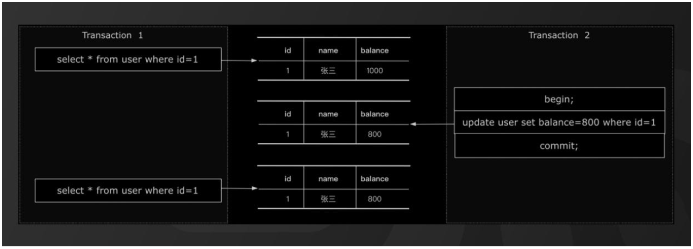

假设有两个事务 T1/T2 同时执行，事务 T1 在不同的时刻读取同一行数据的时候结果可能不一样，从而导致不可重复读的问题。<br/>  

- **2、事务隔离级别**

那么事务隔离级别，就是是为了解决多个并行事务竞争， 。而这脏读、幻读、不可重复读这三种现象在<br/>
实际应用中，有些业务场景是不能接受这些现象存在的，所以在 SQL 标准中定义了四种隔离级别，分别是：<br/>
**读未提交**，在这种隔离级别下，可能会产生脏读、不可重复读、幻读。<br/>
**读已提交（RC)** ，在这种隔离级别下，可能会产生不可重复读和幻读。<br/>
**可重复读（RR ）**，在这种隔离级别下，可能会产生幻读<br/>
**串行化**，在这种隔离级别下，多个并行事务串行化执行，不会产生安全性问题。<br/>
这四种隔离级别里面，只有串行化解决了全部的问题，但这种隔离级别的性能是最低的。<br/>
在 MySQL 里面，InnoDB 引擎默认的隔离级别是 RR（可重复读），因为它需要保证事务 ACID 特性中的隔离性特征。<br/>**结尾**<br/>
以上就是我对 MySQL 事务隔离级别的理解。我是被编程耽误的文艺 Tom，如果我的分享对你有帮助，请动动手指一键三连分享给更多的人。关注我，面试不再难！  <br/>

### 谈谈你对MVCC的理解，普通人和高手的区别在哪里？

[谈谈你对MVCC的理解，普通人和高手的区别在哪里  ](https://www.toutiao.com/video/7029931367177650695/)

对于 MVCC 的理解，我觉得可以先从数据库的三种并发场景说起：<br/>
**第一种：读读**<br/>
就是线程 A 与线程 B 同时在进行读操作，这种情况下不会出现任何并发问题。<br/>
**第二种：读写<br/>**
就是线程 A 与线程 B 在同一时刻分别进行读和写操作。<br/>
这种情况下，可能会对数据库中的数据造成以下问题：<br/>

- 事物隔离性问题，
- 出现脏读，幻读，不可重复读的问题   

**第三种：写写**
就是线程 A 与线程 B 同时进行写操作<br/>
这种情况下可能会存在数据更新丢失的问题。<br/>
而 MVCC 就是为了解决事务操作中并发安全性问题的无锁并发控制技术全称为`Multi-Version Concurrency Control `，也就是多版本并发控制。它是通过数据库记录中的隐式字段，undo 日志 ，Read View 来实现的。<br/>

MVCC 主要解决了三个问题<br/>

- 第一个是：通过 MVCC 可以解决读写并发阻塞问题从而提升数据并发处理能力
- 第二个是：MVCC 采用了乐观锁的方式实现，降低了死锁的概率
- 第三个是：解决了一致性读的问题也就是事务启动时根据某个条件读取到的数据，

直到事务结束时，再次执行相同条件，还是读到同一份数据，不会发生变化。而我们在使用 MVCC 时一般会根据业务场景来选择组合搭配乐观锁或悲观锁。<br/>
这两个组合中，MVCC 用来解决读写冲突，乐观锁或者悲观锁解决写写冲突从而最大程度的提高数据库并发性能。<br/>
以上就是我的对 MVCC 的理解。  