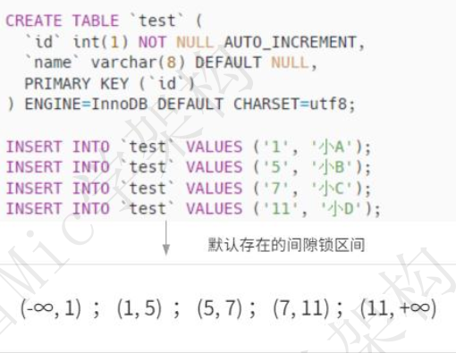
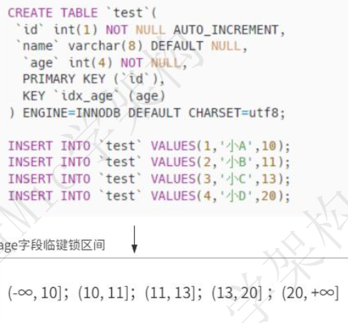
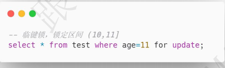
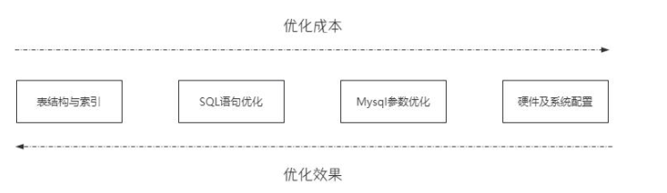
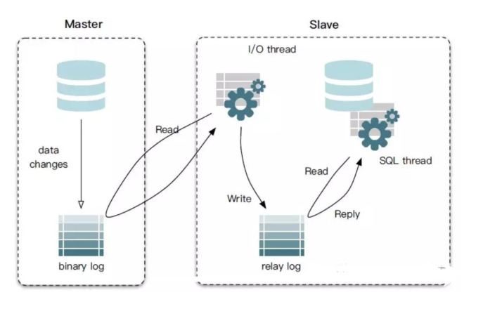

## MySQL锁

### 说一下你对行锁、 临键锁、 间隙锁的理解  

[你对行锁、 临键锁、 间隙锁的理解  ](https://www.toutiao.com/video/7117474406292521485/?channel=&source=video)

一个工作了 6 年的程序员， 最近去阿里面试 p6 这个岗位。
面试之前信心满满的和我说， 这次一定要拿下 35k 月薪的 offer。
然后， 在第一面的时候， 被 Mysql 里面的一个问题难住了。
hi， 大家好， 我是 Mic， 一个没有才华只能靠颜值混饭吃的 Java 程序员。
今天给大家分享阿里的一道面试题， “说一下你对行锁、 临键锁、 间隙锁的理解”
这个问题的回答我整理到了 10W 字的面试文档里面， 大家可以在我的主页加 V
领取。
下面看看普通人和高手的回答  

#### 高手
好的， 面试官。
行锁、 临键锁、 间隙锁， 都是 Mysql 里面 InnoDB 引擎下解决事务隔离性的一系列排他锁。<br/>
下面请允许我分别介绍一下这三种锁。

**行锁**， 也称为记录锁。 当我们针对主键或者唯一索引加锁的时候， Mysql 默认会对查询的这一行数据加行锁，
避免其他事务对这一行数据进行修改。  


**间隙锁**， 顾名思义， 就是锁定一个索引区间。<br/>
在普通索引或者唯一索引列上， 由于索引是基于 B+树的结构存储， 所以默认会存在一个索引区间。
而间隙锁， 就是某个事物对索引列加锁的时候， 默认锁定对应索引的左右开区间范围  <br/>



在基于索引列的范围查询， 无论是否是唯一索引， 都会自动触发间隙锁。<br/>
比如基于 between 的范围查询， 就会产生一个左右开区间的间隙锁。<br/>  


最后一个是临键锁， 它相当于行锁+间隙锁的组合， 也就是它的锁定范围既包含了索引记录， 也包含了索引区间
它会锁定一个左开右闭区间的数据范围。  <br/>




假设我们使用非唯一索引列进行查询的时候， 默认会加一个临键锁， 锁定一个左开右闭区间的范围。  <br/>



所以总的来说， 行锁、 临键锁、 间隙锁只是表示锁定数据的范围， 最终目的是为了解决幻读的问题。<br/>
而临键锁相当于行锁+间隙锁， 因此当我们使用非唯一索引进行精准匹配的时候，会默认加临键锁， 因为它需要锁定匹配的这一行数据， 还需要锁定这一行数据对应的左开右闭区间。  <br/>

因此在实际应用中， 尽可能使用唯一索引或者主键索引进行查询， 避免大面积的锁定造成性能影响。<br/>
以上就是我对这个问题的理解。<br/>

#### 面试点评
关于数据库里面的事务隔离级别， 以及解决隔离级别的底层原理。<br/>
在面试中也非常常见。<br/>
像 Mysql 里面的很多种锁的类型， 除了应对面试以外， 我认为对实际应用开发也有很好的指导意义。<br/>
也就是如何在保证数据安全性的同时平衡好性能。  

<hr/>

### MySQL update 是锁行还是锁表？  

[大厂高频面试题，MySQL update 是行锁还是表锁？](https://www.toutiao.com/video/7250021544888369703/?channel=&source=video)

“MySQL update 是锁行还是锁表？”<br/>
今天给大家分析一下这个问题的底层逻辑以及面试的时候的回答技巧<br/>
文字版本的回答，我整理到了 50W 字的面试文档中了，有需要的小伙伴可以在评论区置顶中领取。<br/>

**问题分析**

要回答好这个问题，需要先了解 Mysql 中为什么要引入锁。<br/>
在多个事物并行对同一个数据进行修改的时候，会产生事物的竞争造成脏读、幻读、不可重复读等问题。<br/>
所谓 Mysql 为了避免这类问题的出现，引入了事物隔离级别，其实本质上来说，最终<br/>解决的方式无非就是 LBCC 和 MVCC 两种。<br/>
而锁是解决事物竞争问题的底层实现方式。<br/>
通常来说，加锁会影响性能， 所以一般情况下都会考虑到性能和安全性的平衡，而 Mysql也根据不同的作用范围，提供了不同的锁的实现方式。<br/>
而这个问题，就是考察候选人对锁范围的理解，下面来看下这个问题的回答思路。<br/>
**问题解答**

MySQL 的 Update 操作既可以锁行，也可以锁表，<br/>
具体使用哪种锁类型，取决于执行的 Update 语句的条件、事务隔离级别等因素。<br/>

-  如果 update 语句中的 where 条件包含了索引列，并且只更新一条数据，那这个时
候就加行锁。
如果 where 条件中不包含索引列，这个时候会加表锁
- 另外，根据查询范围不同，Mysql 也会选择不同粒度的锁来避免幻读问题。
  比如针对主键索引的 for update 操作：
```sql
  SELECT * FROM t WHERE id = 10 FOR UPDATE;
```
  Mysql 会增加 Next-Key Lock 来锁定 id=10 索引所在的区间

- 另外，针对于索引区间的查询或者修改<br/>
```sql
SELECT * FROM user WHERE id BETWEEN 1 AND 100 FOR UPDATE;
```
Mysql 会自动对索引间隙加锁，来解决幻读问题。<br/>
以上就是我的理解！  

<hr/>

 ## mysql性能

### 请你说一下 Mysql 中的性能调优方法  

资料来源：[请你说一下 Mysql 中的性能调优方法  ](https://www.toutiao.com/video/7199126190290895375/?channel=&source=search_tab)

Mysql 性能调优方法可以从四个方面来说，分别是
- 1. 表结构与索引
- 2. SQL 语句优化
-  3. Mysql 参数优化
-  4. 硬件及系统配置

这四个方面的优化成本和优化效果是成反比的。  



- 1. 表结构和索引的优化，主要可以下面这些方面去优化
  分库分表、读写分离、为字段选择合适的数据类型、适当的反范式设计，适当冗余设计、为查询操作创建必要的索引但是要避免索引滥用、尽可能使用 Not Null。

- 2. SQL 语句优化可以从几个方面来做
通过慢查询分析需要优化的 SQL 进行合理优化、利用 explain、profile 等工具分析 SQL执行计划、避免使用 SELECT *查询。尽可能使用索引扫描来排序。

- 3. 参数调优方面，主要可以设置 Buffer_pool 的大小，建议占总内存的 70%左右。设置刷盘策略，平衡好数据安全性和性能的关系等
- 4. 硬件方面、主要是 CPU 核数、磁盘的读写性能（减小寻道时间、旋转时间、传输时间），可以选择 SSD、网卡、内存等方面。

### 说一下你日常工作中是怎么优化 SQL 的  

[【Java面试】经典高频面试题，说一下日常工作中怎么优化SQL？](https://www.toutiao.com/video/7215514885440930344/?from_scene=all)

昨天一个工作 2 年的粉丝去面试，被问到日常工作中的 SQL 优化问题。<br/>
这个问题在面试过程中的频率会特别高，SQL 编写和 SQL 优化是开发人员的基础技能。<br/>
但是要回答好这个问题还是有难度，因为很多时候大家第一反应是加索引，但这个回答并不完整。<br/>
我之前整理的一个 30W 字的面试文档里面，有这个问题的详细回答，需要的小伙伴可以在评论区置顶中领取。<br/>

关于这个问题，我们其实可以从下面几个纬度来回答：<br/>
> 1. 加索引，增加索引是一种简单高效的手段，但是需要选择合适的列，同时避免导致索引失效的操作，比如 like、函数等。<br/>
> 2. 避免返回不必要的数据列，减少返回的数据列可以增加查询的效率。<br/>
> 3. 根据查询分析器适当优化 SQL 的结构，比如是否走全表扫描、避免子查询等<br/>
> 4. 分库分表，在单表数据量较大或者并发连接数过高的情况下，通过这种方式可以有效提升查询效率<br/>
> 5. 读写分离，针对读多写少的场景，这样可以保证写操作的数据库承受更小的压力，也可以缓解独占锁和共享锁的竞争。<br/>

基本上回答到这个程度得到面试官的认可是没问题，不过要注意，面试官还会基于你回答的内容再做更进一步的深度考察，<br/>
比如为什么增加索引能够提升查询效率等，这些在我整理的面试文档中都有。<br/>
好了，今天的分享就到这里，bye  <br/>

### 为什么数据库字段建议设置为NOT NULL？

原创2023-11-03 09:50·[跟着Mic学架构](https://www.toutiao.com/c/user/token/MS4wLjABAAAAezquZb4ZuXyxmh9t98qmjzU-77i03ZxQtqZ7S3baMDQ/?source=tuwen_detail)

[为什么数据库字段建议设置为NOT NULL？](https://www.toutiao.com/video/7273393061315478071/?channel=&source=video)

> ”为什么数据库字段建议设置为NOT NULL？“ <br/>
> 今天给大家分享一下，面试过程中遇到这个问题，我们应该怎么回答 <br/>
> 另外，我已经把这道题的答案添加在了30W字的大厂面试指南中，还有往期其他文章的文字版解析也都已经整理进去了，有需要的小伙伴可以在文章尾端领取。 <br/>

#### 问题分析

其实这个问题代表一类开发规范性问题，通过这类问题其实可以了解求职者是否对于数据库设计有较为全面性考虑。 <br/>
以及良好的数据库实践经验。 <br/>
规则本身并不具备强约束性的特征，所以好与不好仍然是看实际业务需求，以及如果设置允许Null会带来的影响。 <br/>
求职者只要往这个方向去说明，基本上就没问题。 <br/>

#### 问题解答

关于这个问题，有几个方面的考虑： <br/>

- 数据完整性：通过将字段设置为 NOT NULL，可以确保数据库中的数据完整性，如果某个字段允许为空，那么就有可能在数据中出现不完整或不一致的情况。比如，如果一个用户表的用户名字段允许为空，就可能出现用户没有用户名的情况，从而导致数据不一致。 <br/>
- 查询性能：把字段设置为 NOT NULL 还可以提高查询性能。数据库在执行查询时，不需要额外处理空值的情况，可以更快地定位到符合条件的数据行。 <br/>
- 开发者友好性：在应用程序开发中，如果字段被设置为 NOT NULL，可以减少对空值的额外处理逻辑。开发人员可以更加简洁和清晰地编写代码，不需要考虑空值情况的特殊处理。 <br/>
- 数据一致性约束：通过将字段设置为 NOT NULL，可以在数据库层面强制实施数据一致性约束。这样可以避免应用程序层面忽略或错误处理空值的情况，减少了数据质量问题的可能性。 <br/>

## mysql 日志

### 面试题满分解析，binlog和redolog有什么区别？

资料来源：[面试题满分解析，binlog和redolog有什么区别？  ](https://www.toutiao.com/video/7238903348219347508/?channel=&source=video)

昨天，一个工作 3 年的同学好不容易约到一个面试，却被这个问题难倒了。   <br/>
binlog 和 redolog 有什么区别？” <br/>
关于这个问题的回答，我把它整理到了 40W 字的面试文档里面，大家可以去评论区置顶中领取。 <br/>

**问题解析**<br/>
这个问题其实比较简单，但凡稍微了解过 Mysql 数据库，都很容易回答出来。<br/>
一般考察 1~3 年的程序员，所以对于这个工作年限的小伙伴要注意了解它们的原理。<br/>
首先，binlog 和 redolog 都是 Mysql 里面用来记录数据库数据变更操作的日志。<br/>
｛如图｝其中 binlog 主要用来做数据备份、数据恢复和数据同步，大家初步接触这个概念 ，应该是在 Mysql 的主从数据同步的场景中，master 节点的数据变更，会写入到 binlog 中，然后再把 binlog 中的数据通过网络传输给 slave 节点，实现数据同步。<br/>  



而 redolog，主要是在 Mysql 数据库事务的 ACID 特性里面，用来保证数据的持久化特性。但是其实它还有很多的作用。<br/>
比如数据库崩溃时，可以通过 Redo Log 来恢复未完成的数据，保证数据的完整性。通过合理的配置 Redo Log 的大小和数量，还可以优化 Mysql 的性能。<br/>
那下面来看下这个面试题的回答吧。  <br/>

#### 问题答案
binlog 和 redolog 的区别有很多，我可以简单总结三个点
- 1. **使用场景不同**<br/>binlog 主要用来做数据备份、数据恢复、以及主从集群的数据同步； <br/>
     Redo Log 主要用来实现 Mysql 数据库的事务恢复，保证事务的 ACID 特性。当数据库出现崩溃的时候，Redo Log 可以把未提交的事务回滚，把已提交的事务进行持久化，从而保证数据的一致性和持久性。
- 2. **记录的信息不同**<br/>binlog 是记录数据库的逻辑变化，它提供了三种日志格式分别是statement，row 以及 mixed； <br/>
     redo log 记录的是物理变化，也就是数据页的变化结果。
- 3. **记录的时机不同，**<br/> binlog 是在执行 SQL 语句的时候，在主线程中生成逻辑变化写入到磁盘中，所以它是语句级别的记录方式； <br/>
     RedoLog 是在 InnoDB 存储引擎层面的操作，它是在 Mysql 后台线程中生成并写入到磁盘中的，所以它是事务级别的记录方式，一个事务操作完成以后才会被写入到 redo log 中。以上就是我的理解！  

### 请简述MySQL的二阶段提交原理？

[【Java面试】面试官：请简述MySQL的二阶段提交原理？ ](https://www.toutiao.com/video/7242234240396427779/?channel=&source=video)

Spring 里面的事务和分布式事务的使用如何区分，以及这两个事务之间有什么关

#### 问题解析

很多粉丝在面对这个问题的时候，第一反应绝对是懵的，因为他并不知道Mysql里面，哪里设计到二级阶段提交。<br/>
实际上再Mysql开启了binlog日志的情况下，在Mysql事务提交的时候，需要同事完成redolog和binlog的事务写入redolog和binlog大家都知道一个是事务日志，另外一个是数据库变更的逻辑日志，<br/>
这个是两个独立的写入磁盘动作，并且两个操作都要成功。而为了保证两个日志内容的一致性，需要用到两阶段的提交机制<br/>


#### 问题回答

Mysql的二阶段提交，发生在redolog和binLog的日志写入阶段，也就是把日志写入和日志提交，拆分成两个阶段来确保redolog和binlog写入的数据一致性<br/>

>第一阶段是：**prepare阶段**。Mysql会把事务操作记录到redolog中，并标记为prepare状态<br/>
>第二阶段是：**commit阶段**，当事务提交的时，Mysql会将事务操作记录到binlog里面，然后把redolog中的日志设置为commit的状态<br/>

所以InnoDB的写redolog的时候，并不是一次性写完的，而是有两个阶段，**prepare**和**commit**这个就是两阶段提交的含义。在这个设计中<br/>
如果在**写入redolog之前崩溃**，此时redolog和binlog中没有数据，数据是满足一致性的<br/>
如果在**写入redoLog prepare阶段立马崩溃**，那么之后会在崩溃恢复的时候。由于redolog中没有标记为commit，于是拿着redolog中的事务id去binlog中查找此时肯定是找不到的，那么这个时候就执行回滚操作<br/>
如果在**写入binlog后立马崩溃**，在恢复的时候，由于redolog中的事务id可以找到对应的binlog,那么这个时候可以直接提交数据，通过这个方式。就可以保证redolog和binlog的数据一致性。<br/>
以上就是我的理解<br/>

## 应用

### 存储MD5的值应该用VARCHAR还是CHAR？

[存储MD5的值应该用VARCHAR还是CHAR？](https://www.toutiao.com/video/7138369521991516679/?from_scene=all)

我认为应该是用char类型，char类型是一个固定长度的字符串。varchar是一个可变长度的字符串。而md5算法，它所产生的这个数字，他是一个固定长度的。不管数据怎么修改，长度是不变的。这个点呢非常符合char类型的一个特征。另外由于规定长度的，所以在数据变更的时候。不需要进行调整存储空间的一个大小，在效率上会比varchar要更好一些。


