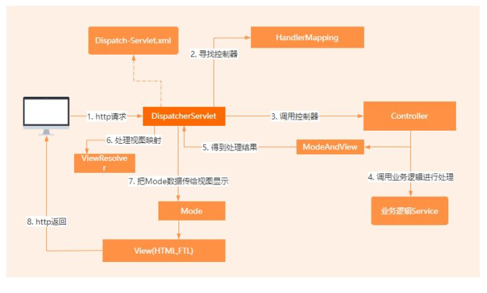

### 【Java面试】看架构师如何分析，过滤器和拦截器有什么区别？

资料来源：[【Java面试】看架构师如何分析，过滤器和拦截器有什么区别？](https://www.toutiao.com/video/7256326397017358885/)

第一：运行的顺序不同
过滤器时在servlet容器。接收到请求之后，但是在servlet被调用之前运行的而拦截器则是在servlet被调用之后，但是在相应被发送到客户端之前运行的

第二配置方式不同
过滤器时在web.xml中去配置的。而拦截器是在spring的配置文件中进行配置或者使用注解的方式进行配置

第三：filter依赖servlet容器，而interceptor不依赖于servlet容器

第四：filter在过滤器中只能对request和response进行操作而interceptor 呢可以对request、response、handler、modelAndView、exception进行操作，相当于interceptor多了对于spring MVC生态组件的一个操作能力

以上就是我的理解

### 说说 Spring MVC 的执行流程？  

[说说 Spring MVC 的执行流程？  ](https://www.toutiao.com/video/7314227076968645120/?channel=&source=search_tab)

昨天，一个工作 2 年的粉丝在面试的时候，面试官要求他说 Spring MVC 的执行流程。他没回答上来，错过了这个 offer。
这个问题在我之前整理的大厂面试指南里面，有标准的回答，大家可以去评论区置顶中领取。
#### 问题解析
Spring MVC 的执行流程，一个面试频率超级高的问题，但是缺难倒了无数的程序员。 
这个问题的考察范围主要是 3~5 年，甚至 5 年以上都会问到。和它同类型的问题还有Bean 的加载过程、IOC 的原理等。
由于 Spring MVC 是基于 Jsp/Servlet 之上做的封装，并为开发人员提供了 MVC 的分层设计以及更加友好的开发模型。
所以我认为大家都应该去把 Spring MVC 的整个执行流程梳理一遍。

#### 问题答案

Spring MVC 的工作流程可以分为几个步骤
- 1. 用户发起请求，请求先被 Servlet 拦截转发给 Spring MVC 框架
- 2. Spring MVC 里面的 DispatcherSerlvet 核心控制器，会接收到请求并转发给HandlerMapping
- 3. HandlerMapping 负责解析请求，根据请求信息和配置信息找到匹配的 Controller类，不过这里如果有配置拦截器，就会按照顺序执行拦截器里面的 preHandle 方法
-  4. 找到匹配的 Controller 以后，把请求参数传递给 Controller 里面的方法
- 5. Controller 中的方法执行完以后，会返回一个 ModeAndView，这里面会包括视图名称和需要传递给视图的模型数据
- 6. 视图解析器根据名称找到视图，然后把数据模型填充到视图里面再渲染成 Html 内容返回给客户端

以上就是我的理解！  

