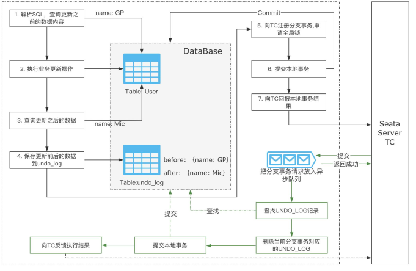
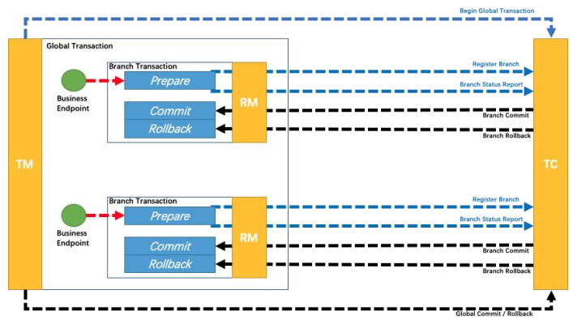
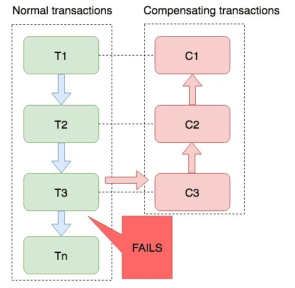
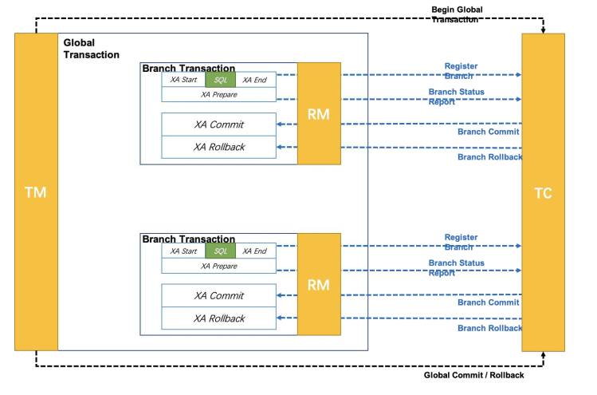
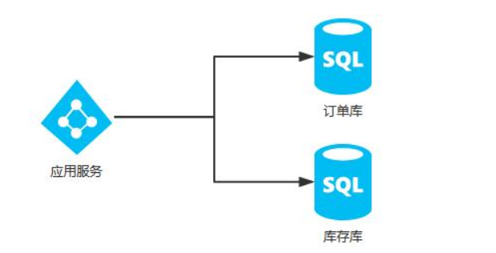

### 分布式事务的解决方案

资料来源：[分布式事务的解决方案](https://www.toutiao.com/video/7044112151887217159/)

大家好，我是 MIC，一个工作了 13 年的 Java 程序员
在互联网企业的面试中，经常会问到分布式、高并发下的技术问题，其中分布式事务问
题就是其中之一。
下面我们来看一下，关于分布式事务的解决方案，普通人和高手是如何回答这个问题的！

#### 普通人的回答

分布式事务，就是多个事务分布在不同的节点上导致的数据一致性问题。 
我们公司的业务基本上都没涉及到分布式事务问题，不过我知道像开源的框架 Seata，就是用来解决分布式事务的框架。 
然后，分布式事务有一个强一致性和弱一致性问题，强一致性会影响性能，弱一致性会影响数据的准确性。 

#### 高手的回答

分布式事务是指事务的参与者、支持事务的服务器、资源服务器以及事务管理器分别位于分布式系统的不同节点之上。 
比如大型的电商系统中的下单场景，会涉及到扣库存、优惠促销计算、订单 ID 生成。 
通常情况下，库存、促销、主键生成策略都位于不同的服务器和数据库表中。 
下单接口的成功与否，不仅取决于本地节点的数据库操作，而且还依赖第三方系统的结果，这时候分布式事务就保证这些操作要么全部成功，要么全部失败。 
因此，本质上来说，分布式事务就是为了保证不同数据库的数据一致性。 
基于 CAP 定理可以知道，对于上述情况产生的分布式事务问题，我们要么采用强一致
性方案、要么采用弱一致性方案。 
- 所谓**强一致性**，就是指通过第三方的事务管理器来协调多个节点的事务，保证每个节点的事务达到同时成功和同时失败，为了实现这样一个需求，我们会引入Xopen/DTP 模型提供的 XA 协议，基于 2pc 或者 3pc 的方式来实现。 
但是，在如果全局事务管理器中的多个节点中，如果任意一个节点再进行事务提交确认时，由于网络通信延迟导致阻塞，就会影响到所有节点事务的提交，而这个阻塞过程也会影响阻塞用户的请求线程，这对于用户体验以及整体性能的影响较大。 
- 而**弱一致性方案**，就是针对强一致性方案所衍生出来性能和数据一致性平衡的一个方案，简单来说就是损失掉强一致性，数据在某一个时刻会存在不一致的状态，但是最终这些数据会达成一致。这样的好处是提升了系统的性能。 

在**弱一致性方案**中，常见的解决方案： 
1. 使用分布式消息队列，来实现最终一致性 
2. 基于 TCC 事务，通过演进版本的二阶段提交实现最终一致性 
3. 使用 Seata 事务框架，它提供了多种事务模式，如 AT、XA、Saga、TCC 等，不同的模型提供了不同的强一致性或者弱一致性的一个支持

以上就是我对分布式事务的理解。   

### 谈谈你对seata的理解

资料来源：[谈谈你对seata的理解](https://www.toutiao.com/video/7071566821220057614/)

很多面试官都喜欢问一些“谈谈你对 xxx 技术的理解”， 
大家遇到这种问题时，是不是完全不知道从何说起，有同感小伙伴的 call 1. 
那么我们来看一下，普通人和高手是如何回答这个问题的？ 

#### 普通人

Seata 是用来解决分布式事务问题的框架。是阿里开源的中间件。 
实际项目中我没有用过，我记得 Seata 里面有几种事务模型，有一种 AT 模式、还有 TCC模式。 
然后 AT 是一种二阶段提交的事务，它是采用的最终一致性来实现数据的一致性。 

#### 高手

对于这个问题，我会从这几个方面来回答

- 1. 在微服务架构下，由于数据库和应用服务的拆分，导致原本一个事务单元中的多个DML 操作，变成了跨进程或者跨数据库的多个事务单元的多个 DML 操作，而传统的数据库事务无法解决这类的问题，所以就引出了分布式事务的概念。 
- 2. 分布式事务本质上要解决的就是跨网络节点的多个事务的数据一致性问题，业内常见的解决方法有两种 
a. **强一致性**，就是所有的事务参与者要么全部成功，要么全部失败，全局事务协调者需要知道每个事务参与者的执行状态，再根据状态来决定数据的提交或者回滚！ 
b. **最终一致性**，也叫弱一致性，也就是多个网络节点的数据允许出现不一致的情况，但是在最终的某个时间点会达成数据一致。 
基于 CAP 定理我们可以知道，强一致性方案对于应用的性能和可用性会有影响，所以对于数据一致性要求不高的场景，就会采用最终一致性算法。 
- 3. 在分布式事务的实现上，对于强一致性，我们可以通过基于 XA 协议下的二阶段提交来实现，对于弱一致性，可以基于 TCC 事务模型、可靠性消息模型等方案来实现。
- 4. 市面上有很多针对这些理论模型实现的分布式事务框架，我们可以在应用中集成这些框架来实现分布式事务。而 Seata 就是其中一种，它是阿里开源的分布式事务解决方案，提供了高性能且简单易用的分布式事务服务。
Seata 中封装了四种分布式事务模式，分别是：

**AT 模式**，是一种基于本地事务+二阶段协议来实现的最终数据一致性方案，也是Seata 默认的解决方案  

**TCC 模式**，TCC 事务是 Try、Confirm、Cancel 三个词语的缩写，简单理解就是把一个完整的业务逻辑拆分成三个阶段，然后通过事务管理器在业务逻辑层面根据每个分支事务的执行情况分别调用该业务的 Confirm 或者 Cacel 方法。  

**Saga 模式**，Saga 模式是 SEATA 提供的长事务解决方案，在 Saga 模式中，业务流程中每个参与者都提交本地事务，当出现某一个参与者失败则补偿前面已经成功的参与者进行回滚。  

**XA 模式**，XA 可以认为是一种强一致性的事务解决方法，它利用事务资源（数据库、消息服务等）对 XA 协议的支持，以 XA 协议的机制来管理分支事务的一种事务模式。  

从这四种模型中不难看出，在不同的业务场景中，我们可以使用 Seata 的不同事务模型来解决不同业务场景中的分布式事务问题，因此我们可以认为 Seata 是一个一站式的分布式事务解决方案。

#### 结尾

屏幕前的小伙伴们，你是否通过高手的回答找到了这类问题的回答方式呢？ 
面试的时候遇到这种宽泛的问题时，先不用慌， 首先自己要有一个回答的思路。 
按照技术的话术，就是先给自己大脑中的知识建立一个索引，然后基于索引来定位你的知识。 
我对于这类问题，建立的索引一般有几个： 

>1. 它是什么
>2. 它能解决什么问题
>3. 它有哪些特点和优势
>4. 它的核心原理，为什么能解决这类问题

大家对照这几个索引去回答今天的这个面试题，是不是就更清晰了？ 
好的，本期的普通人 VS 高手面试系列就到这里结束了，喜欢的朋友记得一键三连，加个关注， 
我是 Mic，一个工作了 14 年的 Java 程序员，咱们下期再见。   

##  对比

### Spring 里面的事务和分布式事务的使用如何区分，以及这两个事务之间有什么关联？  

资料来源：[【Java面试】谈谈你对seata的理解，看看普通人和高手如何回答的](https://www.toutiao.com/video/7104141922838675982/?channel=&source=video)

Hi，大家好，我是 Mic，一个工作了 14 年的程序员和创业者。   
昨天一个粉丝私信我一个问题。   
他去面试的时候遇到一个这样的问题。   
“Spring 里面的事务和分布式事务的使用如何区分，以及这两个事务之间有什么关联”   
我没有想到，还有人回答不了这个问题。   
所以，今天我们就来说一下这个面试题。   
这个问题高手的回答已经整理成了文档，大家可以在主页加 V 领取。   
对于这个问题，来看看普通人和高手的回答。   

#### 高手

好的，面试官。   
首先， 在 Spring 里面并没有提供事务，它只是提供了对数据库事务管理的封装。通过声明式的事务配置，使得开发人员可以从一些复杂的事务处理中得到解脱，我们不再需要关心连接的获取、连接的关闭、事务提交、事务回滚这些操作。更加聚焦在业务开发层面。
所以，Spring 里面的事务，本质上就是数据库层面的事务，  这种事务的管理，主要是针对单个数据库里面多个数据表操作的，去满足事务的 ACID特性。   
（如图）分布式事务，是解决多个数据库的事务操作的数据一致性问题，传统的关系型数据库不支持跨库事务的操作，所以需要引入分布式事务的解决方案。     

而 Spring 并没有提供分布式事务场景的支持，所以 Spring 事务和分布式事务在使用上并没有直接的关联性。但是我们可以使用一些主流的事务解决框架，比如 Seata，集成到 Spring 生态里面，去解决分布式事务的问题。  
以上就是我对这个问题的理解！

#### 面试点评

其实面试的时候不应该问这一类的问题，   
因为 Spring 的事务和分布式事务虽然在名字上类似，但是完全就是两个概念。   
我估计这个问题，面试管考察的是一些刚毕业的小朋友吧。   
好的，本期的普通人 VS 高手面试系列的视频就到这里结束了   
大家记得点赞收藏加关注   
我是 Mic，咱们下期再见！     

