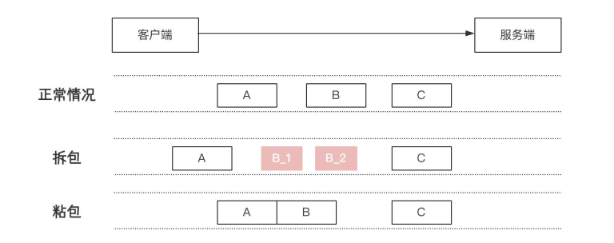
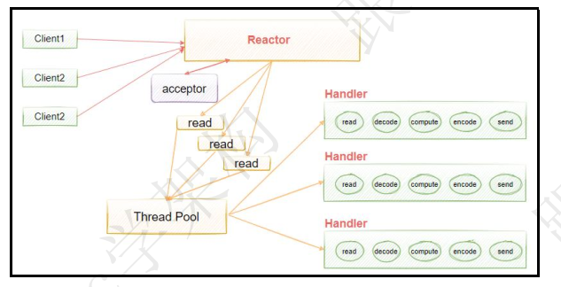
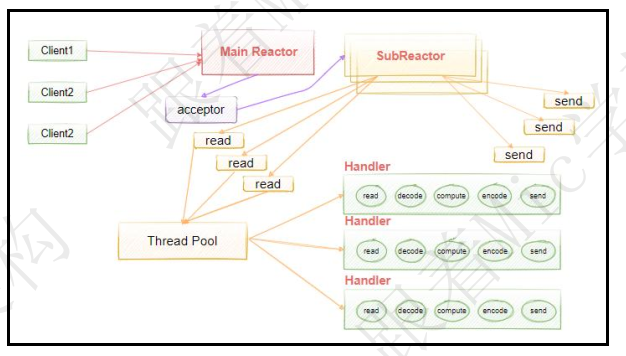
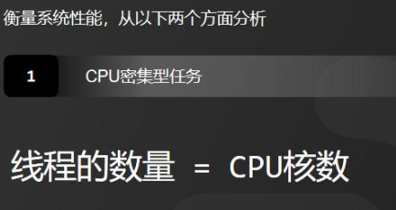
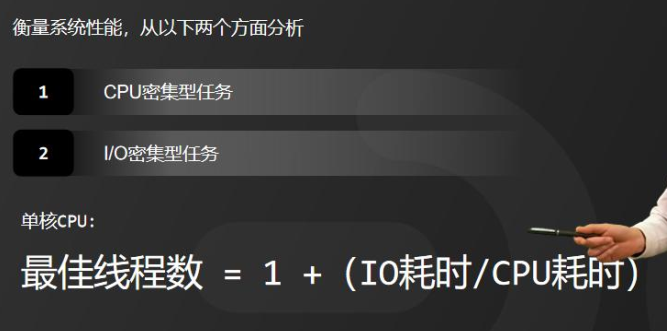
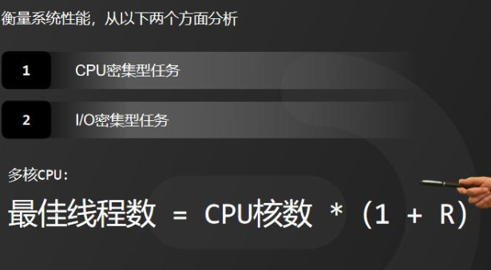
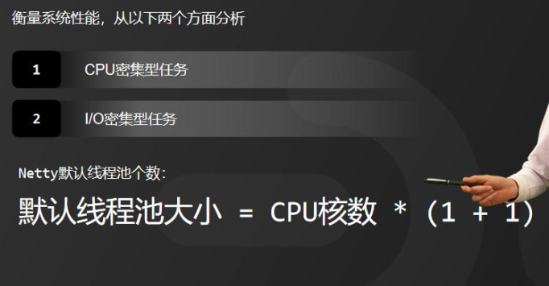
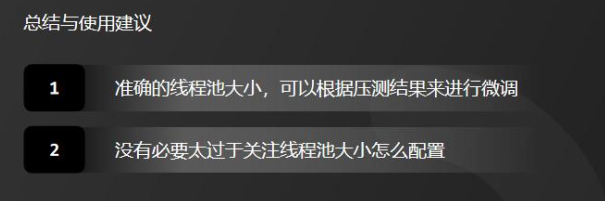

## netty 基础

### 3年经验面试被问，什么是拆包和粘包？怎么解决？

资料来源：[3年经验面试被问，什么是拆包和粘包？怎么解决？](https://www.toutiao.com/video/7253289111069557305/)

什么是粘包？怎么解决？” 
这是一个工作 3 年提交给我的面试真题 
今天我给大家分享一下这个问题的底层原理以及回答思路。 
文字版本的回答，我整理到了 50W 字的面试文档中了，有需要的小伙伴可以在评论区置顶中领取。 
#### 问题分析
拆包和粘包是在网络编程中比较常见的现象。 
因为 TCP 协议底层是面向流的传输，所以数据在传输的过程中会被分割成一个个的数据包（如图） 
接收端在接收数据时需要重新组装数据包，但是 TCP 协议不保证数据包与应用层的数据交互一一对应，
所以就可能会造成数据不完整的问题。   

所以，候选人在回答这个问题之前，必须要了解这个问题的发生背景，否则回答不到点上就错过了这次机会。

#### 问题解答

拆包指的是把一个完整的数据包拆分成多个小包进行发送，而接收端可能无法一次性接收到所有小包，导致接收到的数据不完整。
粘包指的是把多个数据包粘合在一起一次性发送，而接收端可能无法正确区分每个数据包，导致接收到的数据出现错位或混乱。
拆包和粘包现象是 TCP 协议的数据传输机制导致的，所以要解决这个问题，就是需要让服务端知道如何判断一个数据包的完整性，因此可以采用以下几种方法：

- 在数据包中添加特殊字符或特殊标记，表示一个数据包的开始和结尾
-  通过自定义消息协议，并在协议头中保存数据包的长度信息，接收方可以根据这个长度来解析数据包来保证消息的完整性  
- 基于定长消息，也就是发送端的消息长度是固定的，服务端按照固定长度来解析以上就是我的理解！  

### 面试官问Netty，你这么回答就完全对了！

资料来源：[面试官问Netty，你这么回答就完全对了！](https://www.toutiao.com/video/7035203345426055717/)

Netty 是一个高性能 NIO 框架，它可以用来解决高并发网络通信问题。
在很多中间件的网络通信层都是采用 Netty，不过我对 Netty 接触得比较少，了解不是
很多。
#### 高手
好的，我用三点来简单的介绍下 Netty 
- 第一：Netty 是一个 基于 NIO 模型的高性能网络通信框架，其实可以认为它是对 NIO 网络模。型的封装，提供了简单易用的 API，我们可以利用这些封装好的API 快速开发自己的网络程序。 
-  第二：Netty 在 NIO 的基础上做了很多优化，比如零拷贝机制、高性能无锁队列、内存池等，因此性能会比 NIO 更高。 
-  第三：Netty 可以支持多种通信协议，如 Http、WebSocket 等，并且针对数据通信的拆包黏包问题，Netty 内置了拆包策略。 

面试官：哦，还不错，那你在说说为什么要用 Netty ？

Nety 相比于直接使用 JDK 自带的 NIO 相关的 API 来说更加易用。同时，它还具有
以下特点：
> 1. 统一的 API，支持多种传输类型，如阻塞、非阻塞，以及 epoll、poll 等模型。
> 2. 我们可以使用非常少的代码来实现，多线程 Reactor 模型以及主从多线程 Reactor模型
> 3. 自带编解码器解决 TCP 粘包/拆包问题。
> 4. 自带各种协议栈。
> 5. 比直接使用 Java 库中的 NIO API 有更高的吞吐量、更低的延迟、更低的资源消耗和更少的内存复制。
> 6. 安全性不错，有完整的 SSL/TLS 以及 StartTLS 支持。
> 7. 社区活跃成熟稳定，经历了大型项目的使用和考验，而且很多开源项目都使用到了Netty， 比如我们经常接触的 Dubbo、RocketMQ 等等。

### 面试官：那你在通俗地说一下 Netty 可以做什么事情？
我们之所以要用 Netty，核心点还是在于解决服务器如何承载更多的用户同时访问的问题。传统的 BIO 模型，由于阻塞的特性，使得在高并发场景中，很难获得更高的吞吐量。
而后来基于 NIO 的多路复用模型虽然在阻塞方面进行了优化，但是它的 API 使用比较复杂，对于初学者来说使用不是很友好。而 Netty 是基于 NIO 的封装，提供了成熟且简单易用的 API，降低了使用成本和学习成本。
本质上来说，Netty 和 NIO 所扮演的角色是相同的，都是为了提升服务端的吞吐量，让用户获得更好的产品体验。
另外，Netty 这个中间件经过很多年的验证，在目前主流的中间件如 Zookeeper、Dubbo、RocketMQ 中都有应用。
### 面试官：Netty 核心组件了解吗？分别有什么作用？

#### 高手

Netty 由三层结构构成：网络通信层、事件调度器与服务编排层

在网络通信层有三个核心组件：Bootstrap、ServerBootStrap、Channel
-  **Bootstrap** 负责客户端启动并用来链接远程 netty server
-  **ServerBootStrap** 负责服务端监听，用来监听指定端口，
-  **Channel** 是负责网络通信的载体

事件调度器有两个核心组件：**EventLoopGroup** 与 **EventLoop**

- **EventLoopGroup** 本质上是一个线程池，主要负责接收 I/O 请求，并分配线程执行处理请求。
- **EventLoop**。相当于线程池中的线程

在服务编排层有三个核心组件 ChannelPipeline、ChannelHandler、ChannelHandlerContext
-  **ChannelPipeline** 负责将多个 Channelhandler 链接在一起
-  **ChannelHandler** 针对 IO 数据的处理器，数据接收后，通过指定的 Handler 进行处理。
-  **ChannelHandlerContext** 用来保存 ChannelHandler 的上下文信息

### 面试官：在说说 Netty 有几种线程模型吧？
高手 Netty 提供了三种 Reactor 模型的支持
-  单线程单 Reactor 模型
-  多线程单 Reactor 模型
-  多线程多 Reactor 模型  

### 请说一下 Netty 中 Reactor 模式的理解  

资料来源：[6年粉丝去某团面试被问到，请说一下Netty中Reactor模式的理解](https://www.toutiao.com/video/7116052984210915848/?channel=&source=search_tab)

hi， 大家好， 我是 Mic， 一个没有才华只能靠颜值混饭吃的 Java 程序员。 
今天一个工作了 6 年的粉丝， 去美团面试的时候遇到一个比较有意思的问题。 
应该大部分同学对这个领域都比较陌生， 因为网络编程在实际开发中接触还是比较少的。 
这个问题是： “请说一下 Netty 中 Reactor 模式的理解”？ 
这个问题高手部分的回答已经整理到了 10W 字的面试文档里面， 大家可以在我的主页加 V 领取 
下面看看普通人和高手的回答   

#### 高手
Reactor 其实是在 NIO 多路复用的基础上提出的一个高性能 IO 设计模式。  
它的核心思想是把响应 IO 事件和业务处理进行分离， 通过一个或者多个线程来处理 IO 事件。  
然后把就绪的事件分发给业务线程进行异步处理。  
**Reactor 模型有三个重要的组件** 
> Reactor ： 把 I/O 事件分发给对应的 Handler
> Acceptor ： 处理客户端连接请求
> Handlers ： 执行非阻塞读/写， 也就是针对收到的消息进行业务处理。

在 Reactor 的这种设计中， 有三种模型分别是
- 单线程 Reactor 模型。
-  多线程 Reactor 模型。
-  主从多 Reactor 多线程模型。

单线程 Reactor 模型， 就是由同一个线程来负责处理 IO 事件以及业务逻辑。
这种方式的缺点在于 handler 的执行过程是串行， 如果有任何一个 handler 处理
线程阻塞， 就会影响整个服务的吞吐量。  

所以， 就有了多线程 Reactor 模型。也就是把处理 IO 就绪事件的线程和处理 Handler 业务逻辑的线程进行分离， 每个 Handler 由一个独立线程来处理， 在这种设计下， 即便是存在 Handler 线程阻塞问题， 也不会对 IO 线程造成影响。  

在多线程 Reactor 模型下， 所有的 IO 操作都是由一个 Reactor 来完成的， 而且Reactor 运行在单个线程里面。 
对于并发较高的场景下， Reactor 就成为了性能瓶颈， 所以在这个基础上做了更进一步优化。
提出了多 Reactor 多线程模型， 这种模式也叫 Master-Workers 模式。 
它把原本单个 Reactor 拆分成了 Main Reactor 和多个 SubReactor， Main Reactor 负责接收客户端的链接， 然后把接收到的连接请求随机分配到多个subReactor 里面。 
SubReactor 负责 IO 事件的处理   

这种方式另外一个好处就是可以对 subReactor 做灵活扩展， 从而适应不同的并发量， 解决了单个 Reactor 模式的性能瓶颈问题   
以上就是我对 Reactor 模型的理解。

#### 面试点评
Reactor 模型的设计比较常见， 比如 Spring 里面的 Webflux 就用了这种设计。并且像 Master-Worker 模型， 在 Memcached 和 Nginx 中都有用到。 
所以我们其实可以去理解并学习这种设计思想， 也许在某些业务场景中可以帮助我们多提供一个解决思路。  

### 为什么 Netty 线程池默认大小为 CPU 核数的 2 倍  

有位工作 5 年的小伙伴问我说，为什么 Netty 线程池默认大小为 CPU 核数的 2 倍，今天，我花 2 分钟时间给大家专门分享一下我对这个问题的理解。 
另外，我花了 1 个多星期把往期的面试题解析配套文档准备好了，想获取的小伙伴可以在我的煮叶简介中找到。  

**1、分析原因**
我们都知道使用多线程的本质是为了提升程序的性能，总体来说有两个最核心的指标，一个延迟，一个吞吐量。延迟指的是发出请求到收到响应的时间，吞吐量指的是 。这两个指标之间有一定的关联，因为同等条件下延迟越短吞吐量越大，但由于它们是不同的维度，一个是时间，一个是空间，并不能相互转换。 
因此，提升性能最主要的目的就是要降低延迟，提高吞吐量。  

**2、如何衡量性能指标**
具体来说，要降低延时，就是要提高 CPU 的处理能力。而提高吞吐量，就是要提高 IO 读写效率。那么具体如何衡量系统性能，我从以下两个方面来分析： 
我们可以将程序分为是 I/O 密集型任务和 CPU 密集型任务。
那么

**第 1 种情况**，对于 CPU 密集型任务而言，理论上“线程的数量 = CPU 核数”就是合适的。但是，在实际应用中的线程数量一般会设置为“CPU 核数 + 1”。因为线程有可能因为内存页失效或其他原因导致阻塞，多设置一个线程可以保证 CPU 的利用率  

**第 2 种情况**，而对于 I/O 密集型任务而言，我们假设 CPU 计算和 I/O 操作的耗时比是 1:1，那么 2 个线程是最合适的。如果 CPU 计算和 I/O 操作的耗时比是 1:2，也就是说 3 个线程是合适的，这样 CPU 和 I/O设备的利用率都可以达到 100%。根据这个推测，我们可以得到这样一个公式：

`最佳线程数 = 1 +（IO 耗时/CPU 耗时）`  

不过上面这个公式是针对单核 CPU，如果是多核 CPU 只需要等比扩大就可以了，假设 IO 耗时和 CPU 耗时比为 R，那么计算公式如下：

`最佳线程数 = CPU 核数 *（1 + R）  `

而 Netty 的默认线程池个数，就是假设了 I/O 耗时和 CPU 耗时的占比是 1:1，实际上 Netty 有一个参数叫ioRatio，默认为 50，它表示在一个轮事件循环中，单个 I/O 线程执行 I/O 事件和执行异步任务的耗时占比为 1:1。相当于 R = 1，代入上面的公式，就可以得出 Netty 默认设置的线程池大小自然就是

`默认线程池大小 = CPU 核数 * (1 + 1)  `

也就 2 倍 CPU 核数大小。而且 Netty 的应用场景主要是 I/O 密集型任务，所以，Netty 这样设计是有科学性的。看到了这里，你是不是豁然开朗了呢？

**3、总结与使用建议**
通过前面的分析，我们已经知道了 Netty 线程池默认大小未 CPU 核数 2 倍的原因，我们在实际开发中，如何来得到一个比较准确的线程池大小呢？  

我们可以提前压测，根据压测结果来进行微调。一般情况下，保证生产环境为压测环境的 75%即可。如果修改 Netty 的线程池大小，也一定要考虑 ioRatio 这个参数是否需要调整，因为 2 倍 CPU 核数的大小是假设的 I/O 耗时和 CPU 耗时为 1:1，调整线程大小之后，性能效果也不一定符合期望值。  

在大部分场景下，没有必要太过于关注线程池大小怎么配置，I/O 密集型任务使用 Netty 默认配置就可以了。因为，提高吞吐量也不能只简单的只依赖线程池，还可以通过缓存、微服务拆分，优化业务逻辑、优化算法等方式来协作解决。
#### 结尾
好了，以上就是我的分享和理解，对望能对大家有所帮助。我是被编程耽误的文艺 Tom，如果我的分享对你有帮助，请动动手指一键三连分享给更多的人。关注我，面试不再难  

## netty 时间轮

### 什么是时间轮，请你说一下你对时间轮的理解  

资料来源：[「Java面试」什么是时间轮，请你说一下你对时间轮的理解-今日头条 (toutiao.com)](https://www.toutiao.com/article/7122718599793394209/?channel=&source=news)

一个工作了7年的程序员，去字节面试，被问到时间轮的问题。

他面试回来和我说，这个问题超出了他的知识面，自己也在网上找了一些文章去学习，但是理解不是很深刻。

想让我出一个关于时间轮问题的面试文章。

谁叫我这么善良呢？立刻就给这个粉丝安排了。

关于“什么是时间轮，请你说一下你对时间轮的理解”这个问题，我把高手的回答整理到了一个10W字的面试文档里面，大家可以在私信我发送【Mic】领取

下面看看高手的回答

#### 高手：

时间轮，简单理解就是一种用来存储一系列定时任务的环状数组，它的整个工作原理和我们的钟表的表盘类似。

它由两个部分组成， 一个是环状数组，另一个是遍历环状数组的指针。

首先，定义一个固定长度的环状数组，然后数组的每一个元素代表一个时间刻度，假设是1s，那么如果是长度为8的数组，就代表8秒钟。

然后，有一个指针，这个指针按照顺时针无线循环这个数组，每隔最小时间单位前进一个数组索引。

这个指针转一圈代表8秒钟，转两圈表示16秒，假设从0点0分0秒开始，转一圈以后就到了0点0分9秒钟。

环状数组里面的每个元素都是用来存储定时任务的容器，当我们向时间轮里面添加一个定时任务的时候，我们会根据定时任务的执行时间计算它所存储的数组下标。

有可能在某个时间刻度上存在多个定时任务，那这个时候会采用双向链表的方式来存储。

当指针指向某个数组的时候，就会把这个数组中存储的任务取出来，然后遍历这个链表逐个运行里面的任务。

如果某个定时任务的执行时间大于环形数组所表示的长度，一般可以使用一个圈数来表示该任务的延迟执行时间。

也就是说，如果是第16秒要执行的任务，那意味着这个任务应该是在第二圈的数组下标0位置执行。

使用时间轮的方式来管理多个定时任务的好处有很多，我认为有两个核心原因：

- 减少定时任务添加和删除的时间复杂度，提升性能。
- 可保证每次执行定时器任务都是O（1）复杂度，在定时器任务密集的情况下，性能优势非常显。

当然，它也有缺点，对于执行时间非常严格的任务，时间轮不是很适合，因为时间轮算法的精度取决于最小时间单元的粒度。假设以1s为一个时间刻度，那小于1s的任务就无法被时间轮调度。
时间轮算法在很多地方都有用到，比如Dubbo、Netty、Kafka等。

####  总结

时间轮算法是一个比较有意思的设计。
使用范围比较广，但是在实际应用中，大部分同学接触非常少。
我认为这种设计思想或者这种数据结构，在我们实际应用中的某些特定场景也是可以借鉴和使用，比如定时重试、衰减重试等。
大家记得点赞、收藏加关注。

