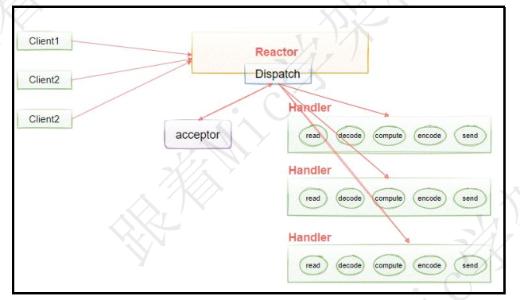

### 3年经验面试被问，什么是拆包和粘包？怎么解决？

资料来源：[3年经验面试被问，什么是拆包和粘包？怎么解决？](https://www.toutiao.com/video/7253289111069557305/)

### 面试官问Netty，你这么回答就完全对了！

资料来源：[面试官问Netty，你这么回答就完全对了！](https://www.toutiao.com/video/7035203345426055717/)

### 请说一下 Netty 中 Reactor 模式的理解  

资料来源：[6年粉丝去某团面试被问到，请说一下Netty中Reactor模式的理解](https://www.toutiao.com/video/7116052984210915848/?channel=&source=search_tab)

hi， 大家好， 我是 Mic， 一个没有才华只能靠颜值混饭吃的 Java 程序员。
今天一个工作了 6 年的粉丝， 去美团面试的时候遇到一个比较有意思的问题。
应该大部分同学对这个领域都比较陌生， 因为网络编程在实际开发中接触还是比
较少的。
这个问题是： “请说一下 Netty 中 Reactor 模式的理解”？
这个问题高手部分的回答已经整理到了 10W 字的面试文档里面， 大家可以在我
的主页加 V 领取
下面看看普通人和高手的回答  

#### 高手
Reactor 其实是在 NIO 多路复用的基础上提出的一个高性能 IO 设计模式。
它的核心思想是把响应 IO 事件和业务处理进行分离， 通过一个或者多个线程来
处理 IO 事件。
然后把就绪的事件分发给业务线程进行异步处理。
Reactor 模型有三个重要的组件  

Reactor ： 把 I/O 事件分发给对应的 Handler
Acceptor ： 处理客户端连接请求
Handlers ： 执行非阻塞读/写， 也就是针对收到的消息进行业务处理。
在 Reactor 的这种设计中， 有三种模型分别是
单线程 Reactor 模型。
多线程 Reactor 模型。
主从多 Reactor 多线程模型。
单线程 Reactor 模型， 就是由同一个线程来负责处理 IO 事件以及业务逻辑。
这种方式的缺点在于 handler 的执行过程是串行， 如果有任何一个 handler 处理
线程阻塞， 就会影响整个服务的吞吐量。  

所以， 就有了多线程 Reactor 模型。
也就是把处理 IO 就绪事件的线程和处理 Handler 业务逻辑的线程进行分离， 每
个 Handler 由一个独立线程来处理， 在这种设计下， 即便是存在 Handler 线程阻
塞问题， 也不会对 IO 线程造成影响。  

在多线程 Reactor 模型下， 所有的 IO 操作都是由一个 Reactor 来完成的， 而且
Reactor 运行在单个线程里面。
对于并发较高的场景下， Reactor 就成为了性能瓶颈， 所以在这个基础上做了更
进一步优化。
提出了多 Reactor 多线程模型， 这种模式也叫 Master-Workers 模式。
它把原本单个 Reactor 拆分成了 Main Reactor 和多个 SubReactor， Main
Reactor 负责接收客户端的链接， 然后把接收到的连接请求随机分配到多个
subReactor 里面。
SubReactor 负责 IO 事件的处理  

这种方式另外一个好处就是可以对 subReactor 做灵活扩展， 从而
适应不同的并发量， 解决了单个 Reactor 模式的性能瓶颈问题  

以上就是我对 Reactor 模型的理解。
#### 面试点评
Reactor 模型的设计比较常见， 比如 Spring 里面的 Webflux 就用了这种设计。
并且像 Master-Worker 模型， 在 Memcached 和 Nginx 中都有用到。
所以我们其实可以去理解并学习这种设计思想， 也许在某些业务场景中
可以帮助我们多提供一个解决思路。  

