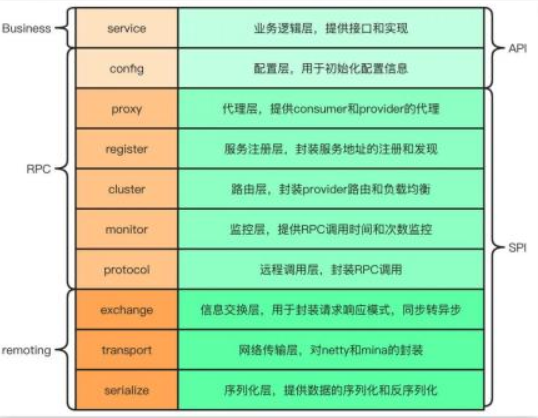
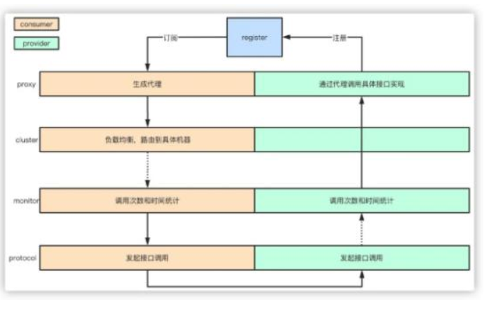

## Dubbo

###  什么是 Dubbo？它有哪些核心功能？  

Dubbo 是以高性能 RPC 框架，它提供了分布式架构下的服务之间通信方案，使得开发者可以不需要关心网络通信的细节。通过该框架可以使得远程服务调用方式和本地服务调用方式一样简单。 
Dubbo 是一款高性能、轻量级的开源 RPC 框架。由 10 层模式构成，整个分层依赖由上至下。 
通过这张图我们也可以将 Dubbo 理解为三层模式：   

第一层的 Business 业务逻辑层由我们自己来提供接口和实现还有一些配置信息。 
第二层的 RPC 调用的核心层负责封装和实现整个 RPC 的调用过程、负载均衡、集群容错、代理等核心功能。Remoting 则是对网络传输协议和数据转换的封装。 

根据 Dubbo 官方文档的介绍，Dubbo 提供了六大核心能力 
-  面向接口代理的高性能 RPC 调用。 
-  智能容错和负载均衡。 
-  服务自动注册和发现。 
-  高度可扩展能力。 
-  运行期流量调度。 
-  可视化的服务治理与运维。   

### 既然说到 Dubbo 的功能，请详细说说 Dubbo 负载均衡的几种策略  

Dubbo 有五种负载策略：
第一种是**加权随机**：假设我们有一组服务器 servers = [A, B, C]，他们对应的权重为weights = [5, 3, 2]，权重总和为 10。现在把这些权重值平铺在一维坐标值上，[0, 5) 区间属于服务器 A，[5, 8) 区间属于服务器 B，[8, 10) 区间属于服务器 C。接下来通过随机数生成器生成一个范围在 [0, 10) 之间的随机数，然后计算这个随机数会落到哪个区间上就可以了。 
第二种是**最小活跃数**：每个服务提供者对应一个活跃数 active，初始情况下，所有服务提供者活跃数均为 0。 
每收到一个请求，活跃数加 1，完成请求后则将活跃数减 1。 
在服务运行一段时间后，性能好的服务提供者处理请求的速度更快，因此活跃数下降的也越快，此时这样的服务提供者能够优先获取到新的服务请求。 
第三种是**一致性 hash**：通过 hash 算法，把 provider 的 invoke 和随机节点生成 hash，并将这个 hash 投射到 [0, 2^32 - 1] 的圆环上，查询的时候根据 key 进行 md5 然后进行 hash，得到第一个节点的值大于等于当前 hash 的 invoker。 
第四种是**加权轮询**：比如服务器 A、B、C 权重比为 5:2:1，那么在 8 次请求中，服务器 A 将收到其中的 5 次请求，服务器 B 会收到其中的 2 次请求，服务器 C 则收到其中的 1 次请求。 
第五种是**最短响应时间权重随机**：计算目标服务的请求的响应时间，根据响应时间最短的服务，配置更高的权重进行随机访问。   

### Dubbo 的工作原理是什么样的？  

1.服务启动的时候，provider 和 consumer 根据配置信息，连接到注册中心 register，分别向注册中心注册和订阅服务 
2.register 根据服务订阅关系，返回 provider 信息到 consumer，同时 consumer 会把 provider 信息缓存到本地。如果信息有变更，consumer 会收到来自 register 的推送  
3.consumer 生成代理对象，同时根据负载均衡策略，选择一台 provider，同时定时向monitor 记录接口的调用次数和时间信息 
4.拿到代理对象之后，consumer 通过代理对象发起接口调用 
5.provider 收到请求后对数据进行反序列化，然后通过代理调用具体的接口实现   

### 最后在说说 Dubbo 与 Spring Cloud 的区别吧！

Dubbo 是 SOA 时代的产物，它的关注点主要在于服务的调用，流量分发、流量监控和熔断。而 Spring Cloud 诞生于微服务架构时代，考虑的是微服务治理的方方面面， 
另外由于依托了 Spirng、Spirng Boot 的优势之上，两个框架在开始目标就不一致，Dubbo 定位服务治理、Spirng Cloud 是一个生态。 
两者最大的区别是 Dubbo 底层是使用 Netty 这样的 NIO 框架，是基于 TCP 协议传输的，配合以 Hession 序列化完成 RPC 通信。而 SpringCloud 是基于 Http 协议+Rest 接口调用远程过程的通信，相对来说，Http 请求会有更大的报文，占的带宽也会更多。但是 REST 相比 RPC 更为灵活，服务提供方和调用方的依赖只依靠一纸契约，不存在代码级别的强依赖。 
以上就是我对 Dubbo 的理解了！

好的，看完高手的回答后，相信每位看完视频的小伙伴 Dubbo 有了更深刻的理解 ，本期普通人 VS 高手系列的视频就到这里就结束了，喜欢的朋友一键三连，加个关注，我是头发很多的程序员 Mic，咱们下期见！  

### 这么回答震惊面试官！Dubbo的服务请求失败怎么处理

资料来源：[【Java面试】这么回答震惊面试官！Dubbo的服务请求失败怎么处理](https://www.toutiao.com/video/7302354368265716233/?from_scene=all&log_from=a0bdacf092f1a_1703572893210)

今天分享的面试题，几乎是 90%以上的互联网公司都会问到的问题。
“Dubbo 的服务请求失败怎么处理”？
对于这个问题，我们来看一下普通人和高手的回答。

#### 普通人

嗯… 我记得， Dubbo 请求处理失败以后，好像是会重试。 嗯！

#### 高手

Dubbo 是一个 RPC 框架，它为我们的应用提供了远程通信能力的封装，同时，Dubbo在 RPC 通信的基础上，逐步在向一个生态在演进，它涵盖了服务注册、动态路由、容错、服务降级、负载均衡等能力，基本上在微服务架构下面临的问题，Dubbo 都可以
解决。 
而对于 Dubbo 服务请求失败的场景，默认提供了重试的容错机制，也就是说，如果基于 Dubbo 进行服务间通信出现异常，服务消费者会对服务提供者集群中其他的节点发起重试，确保这次请求成功，默认的额外重试次数是 2 次。 
除此之外，Dubbo 还提供了更多的容错策略，我们可以根据不同的业务场景来进行选择。 
> 1. 快速失败策略，服务消费者只发起一次请求，如果请求失败，就直接把错误抛出去。这种比较适合在非幂等性场景中使用
> 2. 失败安全策略，如果出现服务通信异常，直接把这个异常吞掉不做任何处理
> 3. 失败自动恢复策略，后台记录失败请求，然后通过定时任务来对这个失败的请求进行重发。
> 4. 并行调用多个服务策略，就是把这个消息广播给服务提供者集群，只要有任何一个节点返回，就表示请求执行成功。
> 5. 广播调用策略，逐个调用服务提供者集群，只要集群中任何一个节点出现异常，就表示本次请求失败

要注意的是，默认基于重试策略的容错机制中，需要注意幂等性的处理，否则在事务型的操作中，容易出现多次数据变更的问题。 
以上就是我对这个问题的理解！ 

####  结尾
这类的问题，并不需要去花太多时间去背，如果你对于整个技术体系有一定的了解，你就很容易想象到最基本的处理方式。 
即便是你对 Dubbo 不熟悉，也能回答一两种！ 
OK，本期的普通人 VS 高手面试系列的视频就到这里结束了，喜欢的朋友记得点赞收藏。 
另外，我也陆续收到了很多小伙伴的面试题，我会在后续的内容中逐步更新给到大家！ 
我是 Mic，一个工作了 14 年的 Java 程序员，咱们下期再见。   

###  Dubbo是如何动态感知服务下线的？
资料来源：[什么？5年经验都答不上，Dubbo是如何动态感知服务下线的？](https://www.toutiao.com/video/7088254935967466021/?from_scene=all)

昨天一个工作了 8 年的粉丝去阿里面试，被问到：Dubbo 的服务请求失败的处理方式，没有回答上来没通过面试。 
今天正好有空，给大家分享一下这个问题的回答。 

#### 回答
Dubbo 是一个 RPC 框架，它为我们的应用提供了远程通信能力的封装，同时，Dubbo在 RPC 通信的基础上，逐步在向一个生态在演进，它涵盖了服务注册、动态路由、容错、服务降级、负载均衡等能力，基本上在微服务架构下面临的问题，Dubbo 都可以解决。 
而对于 Dubbo 服务请求失败的场景，默认提供了重试的容错机制，也就是说，如果基于 Dubbo 进行服务间通信出现异常，服务消费者会对服务提供者集群中其他的节点发起重试，确保这次请求成功，默认的额外重试次数是 2 次。 
除此之外，Dubbo 还提供了更多的容错策略，我们可以根据不同的业务场景来进行选择。

- 1. 快速失败策略，服务消费者只发起一次请求，如果请求失败，就直接把错误抛出去。
这种比较适合在非幂等性场景中使用
- 2. 失败安全策略，如果出现服务通信异常，直接把这个异常吞掉不做任何处理
- 3. 失败自动恢复策略，后台记录失败请求，然后通过定时任务来对这个失败的请求进行重发。
- 4. 并行调用多个服务策略，就是把这个消息广播给服务提供者集群，只要有任何一个节点返回，就表示请求执行成功。
- 5. 广播调用策略，逐个调用服务提供者集群，只要集群中任何一个节点出现异常，就表示本次请求失败

要注意的是，默认基于重试策略的容错机制中，需要注意幂等性的处理，否则在事务型的操作中，容易出现多次数据变更的问题。   