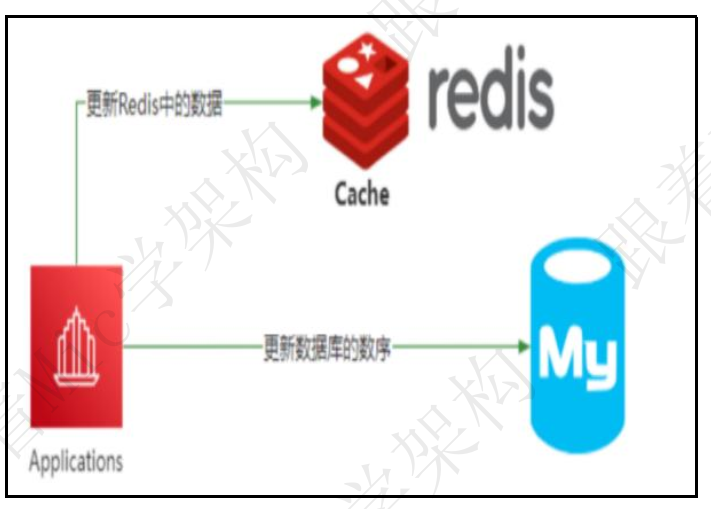
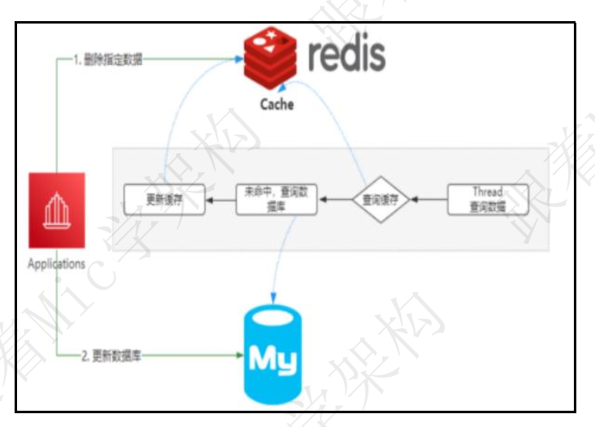
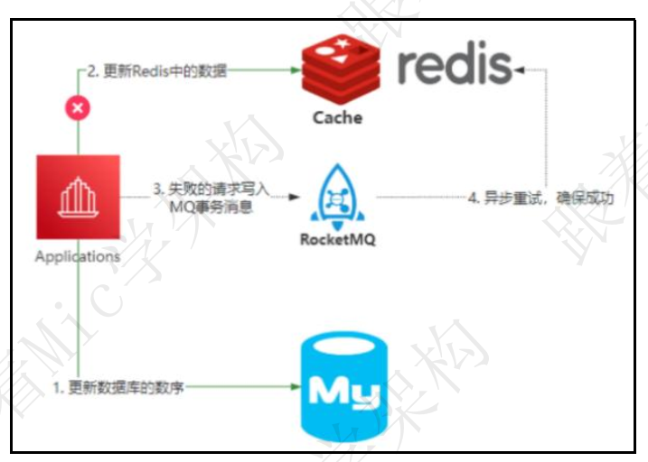
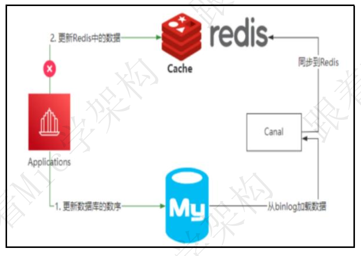

### 阿里二面场景题，如何设计一个短链系统？

资料来源：[【Java面试】阿里二面场景题，如何设计一个短链系统？](https://www.toutiao.com/video/7298278850201551360/?from_scene=all&log_from=8ccb0cd19aa35_1703576684318)

### 如何提升接口的性能？
资料来源：[【Java面试】7年经验去高德面试翻车，如何提升接口的性能？](https://www.toutiao.com/video/7252966928783049277/?from_scene=all&log_from=f0e19dd507499_1703578331375)

### 敏感数据怎么加解密和传输？
资料来源：[【Java面试】蚂蚁金服一面真题，敏感数据怎么加解密和传输？](https://www.toutiao.com/video/7252617120113132066/?from_scene=all&log_from=0b79ba1ea15d2_1703578398079)

### Redis 和 Mysql 如何保证数据一致性

资料来源：[Java面试面试必问，Redis和Mysql如何保证数据一致性？-今日头条 (toutiao.com)](https://www.toutiao.com/video/7207336786626871866/)

今天分享一道一线互联网公司高频面试题。
“Redis 和 Mysql 如何保证数据一致性”。
这个问题难倒了不少工作 5 年以上的程序员， 难的不是问题本身， 而是解决这个
问题的思维模式。
下面来看看普通人和高手对于这个问题的回答  

#### 普通人

嗯....
Redis 和 Mysql 的数据一致性保证是吧？ 我想想。
嗯， 就是， Mysql 的数据发生变化以后， 可以同步修改 Redis 里面的数据。  

#### 高手

一般情况下， Redis 用来实现应用和数据库之间读操作的缓存层， 主要目的是减少数据库 IO， 还可以提升数据的 IO 性能。
这是它的整体架构。
当应用程序需要去读取某个数据的时候， 首先会先尝试去 Redis 里面加载， 如果命中就直接返回。 如果没有命中， 就从数据库查询， 查询到数据后再把这个数据缓存到 Redis 里面。  

在这样一个架构中， 会出现一个问题， 就是一份数据， 同时保存在数据库和 Redis里面， 当数据发生变化的时候， 需要同时更新 Redis 和 Mysql， 由于更新是有先后顺序的， 并且它不像 Mysql 中的多表事务操作， 可以满足 ACID 特性。 所以就会出现数据一致性问题。  

在这种情况下， 能够选择的方法只有几种。
先更新数据库， 再更新缓存
先删除缓存， 再更新数据库
如果先更新数据库， 再更新缓存， 如果缓存更新失败， 就会导致数据库和 Redis中的数据不一致  

如果是先删除缓存， 再更新数据库， 理想情况是应用下次访问 Redis 的时候， 发现 Redis 里面的数据是空的， 就从数据库加载保存到 Redis 里面， 那么数据是一致的。 但是在极端情况下， 由于删除 Redis 和更新数据库这两个操作并不是原子的， 所以这个过程如果有其他线程来访问， 还是会存在数据不一致问题。  

所以， 如果需要在极端情况下仍然保证 Redis 和 Mysql 的数据一致性， 就只能采用最终一致性方案。
比如基于 RocketMQ 的可靠性消息通信， 来实现最终一致性。  

还可以直接通过 Canal 组件， 监控 Mysql 中 binlog 的日志， 把更新后的数据同步到 Redis 里面。  

因为这里是基于最终一致性来实现的， 如果业务场景不能接受数据的短期不一致性， 那就不能使用这个方案来做。
以上就是我对这个问题的理解。

#### 结尾

在面试的时候， 面试官喜欢问各种没有场景化的纯粹的技术问题， 比如说： “你这个最终一致性方案”还是会存在数据不一致的问题啊？ 那怎么解决？
先不用慌， 技术是为业务服务的， 所以不同的业务场景， 对于技术的选择和方案的设计都是不同的， 所以这个时候， 可以反问面试官， 具体的业务场景是什么？
一定要知道的是， 一个技术方案不可能 cover 住所有的场景， 明白了吗？ 