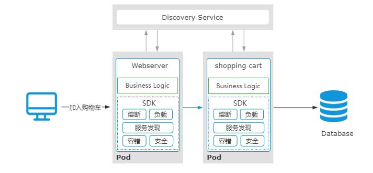

### 说说你对一致性Hash算法的理解

资料来源：[说说你对一致性Hash算法的理解](https://www.toutiao.com/video/7107801038064878111/)

一致性 hash， 是一种比较特殊的 hash 算法， 它的核心思想是解决在分布式环境下，hash 表中可能存在的动态扩容和缩容的问题。 
一般情况下， 我们会使用 hash 表的方式以 key-value 的方式来存储数据， 但是当数据量比较大的时候， 我们就会把数据存储到多个节点上， 然后通过 hash 取模的方法来决定当前 key 存储到哪个节点上。 

 
这种方式有一个非常明显的问题， 就是当存储节点增加或者减少的时候， 原本的映射关系就会发生变化。 
也就是需要对所有数据按照新的节点数量重新映射一遍， 这个涉及到大量的数据迁移和重新映射， 迁移代价很大。 
而一致性 hash 就是用来优化这种动态变化场景的算法， 它的具体工作原理也很简单。 
首先， 一致性 Hash 是通过一个 Hash 环的数据结构来实现的， 这个环的起点是0， 终点是 2^32-1。 
也就是这个环的数据分布范围是[0,2^32-1]。 

（如图）然后我们把存储节点的 ip 地址作为 key 进行 hash 之后，会在 Hash 环上确定一个位置。  

接下来，（如图）就是把需要存储的目标 key 使用 hash 算法计算后得到一个 hash 值，同样也会落到 hash 环的某个位置上。
然后这个目标 key 会按照顺时针的方向找到离自己最近的一个节点进行数据存储。  

> 为什么一致性 Hash 比普通 hash 算法好（字幕提示）

假设现在需要新增一个节点（如图）node4，那数据的映射关系的影响范围只限于node3和 node1， 只有少部分的数据需要重新映射迁移就行了。  

如果是已经存在的节点 node1 因为故障下线了（如图），只那只需要把原本分配在node1 上的数据重新分配到 node2 上就行了。
同样对数据影响的范围非常小。  

所以，在我看来，一致性 hash 算法的好处是扩展性很强，在增加或者减少服务器的时候，数据迁移范围比较小。 
另外，在一致性 Hash 算范里面，为了避免 hash 倾斜导致数据分配不均匀的情况，我们可以使用虚拟节点的方式来解决。
以上就是我对这个问题的理解  

 

### 阿里二面场景题，如何设计一个短链系统？

资料来源：[【Java面试】阿里二面场景题，如何设计一个短链系统？](https://www.toutiao.com/video/7298278850201551360/?from_scene=all&log_from=8ccb0cd19aa35_1703576684318)

### 如何提升接口的性能？
资料来源：[【Java面试】7年经验去高德面试翻车，如何提升接口的性能？](https://www.toutiao.com/video/7252966928783049277/?from_scene=all&log_from=f0e19dd507499_1703578331375)

“如何让性能接口提升？” 
昨天，一个工作 7 年的粉丝去高德面试，被问到这个问题时回答有点混乱。 
今天正好有空，给大家分享一下这个问题的回答思路 
文字版本的回答，我整理到了 50W 字的面试文档中了，有需要的小伙伴可以在评论区置顶中领取。 
#### 问题分析

这是一道比较开放性的面试题，面试官希望通过这类面试题打开面试过程中的沟通话题。 
并且尽可能的让候选人多说，更好的去了解候选人的技术能力。 
所以针对这个问题，可以打开回答的思路，从宏观到微观，把自己能知道的点都说出来就好了。 
下面来看看这个问题的回答。 
#### 问题解答
影响接口性能的因素有很多，我分别从自己理解的几个维度来回答 
- 1. 从接口本身的实现维度来说，可以从几个方面来优化 
> a. 如果在接口中有操作数据库层面的代码，可以优化数据库 IO 的效率，比如 SQL优化、数据库层面的优化等
> b. 如果存在部分频繁访问数据库的热数据，可以采用缓存机制
> c. 如果涉及到远程调用或者耗时的方法调用，可以采用异步方式避免同步阻塞，从而提升程序运行效率
> d. 代码本身的优化，可以利用合适的算法减少时间复杂度、避免一些很明显的重复计算等问题

- 2. 从宏观链路维度来说，可以关注几个方面 
> a. 网络带宽，带宽的大小会影响数据的传输效率
> b. 服务器硬件资源如 CPU、内存等，会影响到接口中代码的执行效率
> c. 但个部署节点的计算能力瓶颈，也会影响接口性能，可以采用分布式部署的方式来优化

总的来说，接口的性能优化涉及到的因素比较多，如果真的出现性能问题，可以根据系统日志以及压测的情况去分析瓶颈点 
再针对性的优化，以上就是我的理解。  

### 敏感数据怎么加解密和传输？
资料来源：[【Java面试】蚂蚁金服一面真题，敏感数据怎么加解密和传输？](https://www.toutiao.com/video/7252617120113132066/?from_scene=all&log_from=0b79ba1ea15d2_1703578398079)

敏感数据怎么加解密和传输？”
这是一个工作 4 年的粉丝去蚂蚁金服第一面遇到的面试真题
今天给大家分析一下这个问题的底层逻辑以及面试的时候的回答技巧
文字版本的回答，我整理到了 50W 字的面试文档中了，有需要的小伙伴可以在评论区
置顶中领取。

#### 问题分析
这是一个典型的信息安全性问题，面试官主要想通过这个问题测试你对安全方面的了解程度，
以及你在实际项目中如何保护敏感数据的能力。
候选人可以从加密算法的选择、加密方案设计、数据传输的安全性等方面来分析，下面来看看这个问题的回答

#### 问题解答

常见的加密算法有两种，一种是对称加密，就是通信双方共享同一个密钥另一种是非对称加密，也就是通过公钥和私钥两个密钥分别进行加密和解密。对于客户端和服务端之间的数据传输（如图），可以采用非对称加密的方式实现。 
首先客户端用提前分配好的公钥对数据加密，然后再把密文传输到服务端，服务端通过私钥来解密。   

常见的非对称加密算法用 `RSA `和 `DSA `两种。 
除了加密以外，还需要通过安全的通信协议进行传输，这里可以采用 https 协议。 
最后，还需要确保公钥和私钥的安全性，防止被第三方拿到了密钥后破解内容。 
以上就是我的理解。   

### 服务网格是微服务架构的更进一步升级，什么是服务网格？

[服务网格是微服务架构的更进一步升级，什么是服务网格？](https://www.toutiao.com/video/7080089211843543565/?from_scene=all)

今天继续来分享一个有趣的面试题，“什么是服务网格”？ 
服务网格这个概念出来很久了，从 2017 年被提出来，到 2018 年正式爆发，很多云厂商和互联网企业都在纷纷向服务网格靠拢。像蚂蚁集团、美团、百度、网易等一线互联网公司，都有服务网格的落地应用。 
在我看来呢，服务网格是微服务架构的更进一步升级，它的核心目的是实现网络通信与业务逻辑的分离，使得开发人员更加专注在业务的实现上。 
那么基于这个问题，我们来看看普通人和高手的回答。 

#### 普通人

嗯？
内心戏：服务网格？服务网格是什么东西？ 
嗯， 很抱歉，这个问题我不是很清楚。 

#### 高手

服务网格，也就是 Service Mesh，它是专门用来处理服务通讯的基础设施层。它的主要功能是处理服务之间的通信，并且负责实现请求的可靠性传递。 
Service Mesh，我们通常把他称为第三代微服务架构，既然是第三代，那么意味着他是在原来的微服务架构下做的升级。 
为了更好的说明 Service Mesh，那我就不得不说一下微服务架构部分的东西。 
首先，当我们把一个电商系统以微服务化架构进行拆分后，会的到这样的一个架构（如图），其中包括 Webserver、payment、inventory 等等。   

（如图）这些微服务应用，会被部署到 Docker 容器、或者 Kubernetes 集群。由于每个服务的业务逻辑是独立的，比如 payment 会实现支付的业务逻辑、order 实现订单的处理、Webserver 实现客户端请求的响应等。   

（如图）所以，服务之间必须要相互通信，才能实现功能的完整性。比如用户把一个商品加入购物车，请求会进入到 Webserver，然后转发到 shopping cart 进行处理，并存到数据库。   

而在这个过程中，每个服务之间必须要知道对方的通信地址，并且当有新的节点加入进来的时候，还需要对这些通信地址进行动态维护。所以，在第一代微服务架构中，每个微服务除了要实现业务逻辑以外，还需要解决上下游寻址、通讯、以及容错等问题。（如图）于是，在第二代微服务架构下，引入了服务注册中心来实现服务之间的寻址，并且服务之间的容错机制、负载均衡也逐步形成了独立的服务框架，比如主流的 SpringCloud、或者 Spring Cloud Alibaba。  

在第二代微服务架构中，负责业务开发的小伙伴不仅仅需要关注业务逻辑，还需要花大量精力去处理微服务中的一些基础性配置工作，虽然 Spring Cloud 已经尽可能去完成了这些事情，但对于开发人员来说，学习 Spring Cloud，以及针对 Spring Cloud 的配置和维护，仍然存在较大的挑战。另外呢，也增加了整个微服务的复杂性。实际上，在我看来，“微服务中所有的这些服务注册、容错、重试、安全等工作，都是为了保证服务之间通信的可靠性”。于是，就有了第三代微服务架构，Service Mesh。   

（如图）原本模块化到微服务框架里的微服务基础能力，被进一步的从一个 SDK 中演进成了一个独立的代理进程-SideCar 
SideCar 的主要职责就是负责各个微服务之间的通信，承载了原本第二代微服务架构中的服务发现、调用容错、服务治理等功能。使得微服务基础能力和业务逻辑迭代彻底解耦。   

之所以我们称 Service Mesh 为服务网格，是因为在大规模微服务架构中，每个服务的通信都是由 SideCar 来代理的，各个服务之间的通信拓扑图，看起来就像一个网格形状（如图）。  

Istio 是目前主流的 Service Mesh 开源框架。 
以上就是我对服务网格的理解。 
结尾
Service Mesh 架构其实就是云原生时代的微服务架构，对于大部分企业来说，仍然是处在第二代微服务架构下。 
所以，很多小伙伴不一定能够知道。 
不过，技术是在快速迭代的，有一句话叫“时代抛弃你的时候，连一句再见也不会说”， 
就像有些人在外包公司干了 10 多年 
再出来面试，发现很多公司要求的技术栈，他都不会。所以，建议大家要时刻刷新自己
的能力，保持竞争优势！ 
好的，本期的普通人 VS 高手面试系列的视频就到这里结束了，喜欢的朋友记得点赞收藏。 
我是 Mic，一个工作了 14 年的 Java 程序员，咱们下期再见。  

## 链路追踪

### 秀！这么回答面试官都听不懂！什么是链路追踪？
资料来源：[【Java面试】秀！这么回答面试官都听不懂！什么是链路追踪？](https://www.toutiao.com/video/7132353330067702302/)

## 序列化

###  传统行业想转行互联网这道题你必须会，序列化和反序列化的理解?

资料来源：[传统行业想转行互联网这道题你必须会，序列化和反序列化的理解?](https://www.toutiao.com/video/7101201621866152462/?from_scene=all)

Hi，大家好，我是 Mic 
一个工作 4 年的粉丝，投了很多简历 
好不容易接到一个互联网公司的面试邀约。 
在面试第一轮就被干掉了，原因是对主流互联网技术理解太浅了。 
其中就有一个这样的问题：“简单说一下你对序列化和反序列化的理解” 
这个问题的回答我整理成了文档，可以在我主页加 V 领取。 
下面看看普通人和高手的回答。 

#### 高手
好的，关于这个问题，我需要从几个方面来回答。 
首先，我认为，之所以需要序列化，核心目的是为了解决网络通信之间的对象传输问题。（如图）也就是说，如何把当前 JVM 进程里面的一个对象，跨网络传输到另外一个 JVM进程里面。 
而**序列化**，就是把内存里面的对象转化为字节流，以便用来实现存储或者传输。 **反序列化**，就是根据从文件或者网络上获取到的对象的字节流，根据字节流里面保存的对象描述信息和状态。 
重新构建一个新的对象。

其次呢，序列化的前提是保证通信双方对于对象的可识别性，所以很多时候，我们会把对象先转化为通用的解析格式， 
比如 json、xml 等。然后再把他们转化为数据流进行网络传输，从而实现跨平台和跨语言的可识性。 
最后，我再补充一下序列化选择。 
市面上开源的序列化技术非常多，比如 Json、Xml、Protobuf、Kyro、hessian 等等。 
那在实际应用里面，哪种序列化最合适，我认为有几个关键因素。 
-  序列化之后的数据大小，因为数据大小会影响传输性能 
-   序列化的性能，序列化耗时较长会影响业务的性能 
-  是否支持跨平台和跨语言 
-   技术的成熟度，越成熟的方案使用的公司越多，也就越稳定。 
以上就是我对这个问题的理解！ 
#### 面试总结

序列化这个问题，面试问得也比较多 
再深入一点，还会问到序列化的算法和原理。 
在实际开发中，序列化技术的选择对于性能的影响也是比较大的。 
因此互联网公司对这方面的考察会比较多一些。 
好的，本期的普通人 VS 高手 面试系列的视频，就到这里结束了。 
喜欢我作品的小伙伴，记得点赞收藏加关注。 
我是 Mic，一个工作了 4 年的 Java 程序员，我们下期再见。   

  

## 流程

### 说说从输入URL到页面渲染的整个过程？

资料来源：[说说从输入URL到页面渲染的整个过程？](https://www.toutiao.com/video/7282692822850470415/?from_scene=all)