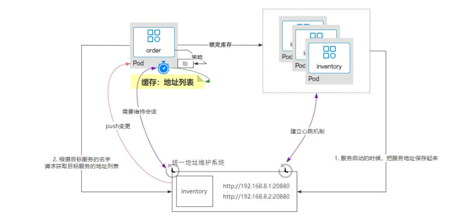
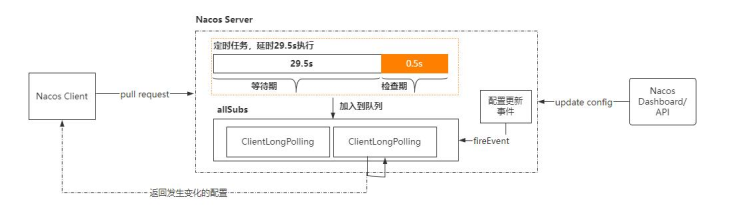

## Spring Cloud

### 你对 Spring Cloud 的理解  

看看普通人和高手是如何回答这个问题的？
普通人
Spring Cloud 是一套微服务解决方案，它包括配置中心、RPC 通信、服务注册、服务
熔断等组件
#### 高手
Spring Cloud 是一套分布式微服务的技术解决方案，它提供了快速构建分布式系统的常用的一些组件 
比如说配置管理、服务的注册与发现、服务调用的负载均衡、资源隔离、熔断降级等等 
不过 Spring Cloud 只是 Spring 官方提供的一套微服务标准定义，而真正的实现目前有两套体系用的比较多。 
-  一个是 Spring Cloud Netflix 
-  一个是 Spring Cloud Alibaba 

Spring Cloud Netflix 是基于Netflix 这个公司的开源组件集成的一套微服务解决方案，其中的组件有 
- 1. Ribbon——负载均衡 
- 2. Hystrix——服务熔断 
- 3.Zuul——网关 
- 4. Eureka——服务注册与发现 
- 5. Feign——服务调用 

Spring Cloud Alibaba 是基于阿里巴巴开源组件集成的一套微服务解决方案，其中包括 
- 1. Dubbo——消息通讯 
- 2. Nacos——服务注册与发现 
- 3.Seata——事务隔离 
- 4. Sentinel——熔断降级 
有了 Spring Cloud 这样的技术生态，使得我们在落地微服务架构时。不用去考虑第三方技术集成带来额外成本，只要通过配置组件来完成架构下的技术问题，从而可以让我们更加侧重性能方面
以上这些就是我对 Spring Cloud 的个人理解！   

## 分布式事务

### 请说一下分布式事务的理解和解决方案

资料来源：[【Java面试】请说一下分布式事务的理解和解决方案](https://www.toutiao.com/video/7145705137972412935/?from_scene=all)

”请说一下分布式事务的理解和解决方案“
这是一个工作了 4 年的同学，在面试的时候遇到的问题。
Hi，大家好，我是 Mic，咕泡科技联合创始人
下面我们来分析一下面试官对于这个问题的考察意图。

#### 考察目的
这个问题考察难度不算大，考察 4 年以上 Java 开发经验的同学
分布式事务主要涉及到跨库事务处理问题，除了考察求职者对这方面知识的了解以外，
还想了解一下求职者的实际处理经验。

### 问题分析

通常情况下，传统的关系型数据库只能保证单个数据库中多个数据表的事务特性。 
一旦多个 SQL 操作涉及到多个数据库，这类的事务无法解决跨库事务问题。 
在传统架构下，这种问题出现的情况非常少，但是在分布式微服务架构中，分布式事务的问题变得更加突出。 
以电商项目为例，假设我们要实现电商系统中的支付功能，它的实现流程如下（如图）。 
在微服务架构中，应用被拆分成以业务模块为单元的服务，并且每个服务有自己的数据库系统。
当用户发起支付时，会涉及到以下几个事务操作： 

- 1. 创建支付订单 
- 2. 从资金服务中扣除余额 
- 3. 从红包服务中扣除余额 
-  4. 更新支付结果   

这是四个典型的事务操作，而且这些操作分别属于不同的数据库，最终期望的结果是希
望这三个服务所对应的数据是一致的，很显然传统的事务无法解决这个问题！ 
因此就产生了分布式事务的问题，所谓分布式事务，就是事务具有分布式特性，简单理
解就是如何实现多个跨数据库的小事务组成的大事务的 ACID 特性。 
下面来看看高手的回答。 
#### 高手回答

好的 
分布式事务是指存在多个跨库事务的事务一致性问题， 
或者是指在分布式架构下由多个应用节点组成的多个事务之间的事务一致性问题。 
目前主流的分布式事务解决方案有两种 
- 一种是基于 XA 协议实现的强一致性事务方案，比如 Atomikos、Seata 中的 XA事务模型。基于 CAP 理论可以知道，如果要保证分布式事务的强一致性，就必然会带来性能的影响从而影响到可用性。 
所以强一致性事务性能会比较低。
-  另一种是基于 BASE 理论下的弱一致性事务解决方案，比如 TCC 事务模型、基于可靠性消息的最终一致性方案、Seata 的 Saga 事务模型等。最终一致性事务损失了数据的强一致性，通过异步补偿的方式达到数据的最终一致。 
因此在性能上比较好，适用于并发量比较高的场景。 
#### 总结

大家知道怎么回答了吗？ 
如果你喜欢我的作品，记得点赞收藏加关注哦 
我是 Mic，咱们下期再见。   

## 注册中心

### 服务注册中心应该是AP还是CP

资料来源：[【Java面试】服务注册中心应该是AP还是CP](https://www.toutiao.com/video/7144612079511536164/?from_scene=all)

在互联网去面试的时候，一定会考察求职者分布式架构领域相关的知识。 
而注册中心是微服务架构里面最重要的核心组件，所以面试频率会比较高。 
其中“服务注册中心应该是 AP 还是 CP 这个问题，就是最近一个工作了 5 年的粉丝遇到的一个问题。 
Hi，大家好，我是 Mic，咕泡科技联合创始人 
下面我们来分析一下面试官对于这个问题的考察意图。 
#### 考察目的
这个问题考察的难度中等偏上，主要考察工作 5 年以上的同学。 
考察目的有两个： 
> 1. 应聘的公司肯定是需要用到微服务架构，所以要了解求职者是否用过注册中心
> 2. 了解求职者是否深入理解注册中心，能够回答这个问题，至少说明对于注册中心的工作原理和价值是有清晰认知的
> 所以，对于这个问题，有两个回答的建议
> 3. 要有自己的总结和理解
> 4. 表达逻辑要足够清晰，不能想到哪说到哪。

#### 问题分析
首先，要先了解 CAP 模型。  
CAP 模型是说，在一个分布式系统里面，不可能同时满足三个点 

-  一致性（Consistency），访问分布式系统中的每一个节点都能获得最新的数据。
-  可用性（Availability），每次请求都能获得一个有效的访问，但不保证数据是最新的。
-  分区容错性（Partition tolerance），分区相当于对通信耗时的要求，系统如果不能在时限范围内达成数据一致，

就意味着发生了分区的情况。 
在 CAP 模型中只能满足 CP 或者 AP，之所以不能满足 CA，因为网络通信的不确定性可能会导致分区容错，也就是分区容错性必然是存在的，因此我们只能在一致性和可用性之间做选择。再回到注册中心（如图），服务注册中心的本质是为了提供服务地址的统一管理，以及提供一个服务动态感知的能力。  
所以，注册中心应该要保证高可用性，也就是无论什么情况下，应用都能正常从注册中心获取到目标服务的通信地址。 
当注册中心不可用的时候，不能影响服务之间的正常通信。 
因此，从这个角度来说，注册中心应该是 AP 模型。    

另外，对于服务动态感知这个场景来说，从服务地址失效到最终客户端感知到变化，必然会存在延迟。 
也就是意味着客户端无法实时感知到出现故障的服务端节点。 
既然一定会出现数据不一致的问题，就更加没必要去搭建一个 CP 模型的注册中心集群了。 
否则反而会降低请求的性能。 

#### 高手回答
我认为注册中心应该是 AP 模型，原因有两个
- 1. 注册中心只是一个地址维护的平台，它如果出现故障，也不能影响服务之间的正常通信。
- 2. 注册中心的地址感知，本身就存在延迟，所以设计一个 CP 模型的架构意义并不大。

#### 总结

大家知道怎么回答了吗？  
如果你喜欢我的作品，记得点赞收藏加关注哦  
我是 Mic，咱们下期再见。    

### 说说你对 CAP 的理解  

资料来源：[【Java面试】这道分布式面试题一定要拿下，说说你对CAP的理解？](https://www.toutiao.com/video/7145278472452211208/?from_scene=all)

分布式架构之所以复杂，就是因为增加了网络通信，而网络通信本身具有不确定性。 
但是作为业务支撑的整个技术架构，所有业务的处理必须要具备确定性。 
因此在这样一个矛盾下，导致架构变得更加复杂。 
面试题”说说你对 CAP 的理解“这个问题，就是在这个背景下产生的 
Hi，大家好，我是 Mic，一个工作了 14 年的 Java 程序员。 
下面我们来分析一下面试官对于这个问题的考察意图。 
考察目的
这个问题考察难度算中等，主要针对 5 年以上开发经验的同学。 
#### 考察目的有两个
> 1. 了解求职者对于分布式架构的理解
> 2. 在分布式架构中，很多技术方案在落地的时候需要有取舍，要么是 CP、要么是 AP，
理解 CAP 定理，能够更好的做出合适的选择

#### 高手回答
CAP 模型，在一个分布式系统里面，不可能同时满足三个点
-  一致性（Consistency），访问分布式系统中的每一个节点都能获得最新的数据。
-  可用性（Availability），每次请求都能获得一个有效的访问，但不保证数据是最新
的。
- 分区容错性（Partition tolerance），分区相当于对通信耗时的要求，系统如果不能在时限范围内达成数据一致，就意味着发生了分区的情况。

在 CAP 模型中只能满足 CP 或者 AP，之所以不能满足 CA，因为网络通信的不确定性可能会导致分区容错，也就是分区容错性必然是存在的，因此我们只能在一致性和可用性之间做选择。
以上就是我的理解。 

#### 总结

大家知道怎么回答了吗？ 
如果你喜欢我的作品，记得点赞收藏加关注哦 
我是 Mic，咱们下期再见。    

## 限流

### 请你说一下你对服务降级的理解？

资料来源：[5年去某东面试竟这题翻车，请你说一下你对服务降级的理解？](https://www.toutiao.com/video/7143895258047185422/?from_scene=all)

请你说一下你对服务降级的理解”！ 
这是一个工作 5 年的同学去京东面试的时候遇到的问题。 
如果屏幕前的你不知道怎么回答这个问题，可以认真看完这条视频。 
Hi，大家好，我是 Mic，咕泡科技的联合创始人 
下面我们来分析一下这个问题的考察意图 

#### 考察目的

服务降级这个问题主要考察工作 5 年以上的同学。 
主要考察求职者是否了解服务降级，以及在实际工作中是否有参与过相关的设计。 
服务降级本身就是一种兜底的设计方案，主要是出现在分布式架构的设计场景中。 
问题难度不大，但是回答的时候逻辑性很重要。 

#### 问题分析

服务降级是一种提升系统稳定性和可用性的策略。 
简单来说，就是当服务器压力增加的情况下，根据实际业务的需求和流量的情况，不对外提供部分服务的功能。 
从而释放服务器的资源去保证核心业务的正常运行。 
服务降级有两种方式，

**一种是主动降级**，**一种是基于特定情况的被动降级**。 

-  主动降级：这种方式在大促的时候使用比较多，比如在电商平台中，核心服务是下单、支付。 
所以一般会把非核心服务比如评论服务关闭掉，这样就使得评论服务不会占用计算资源，从而保证核心服务的稳定运行
-  被动降级：它有两种主要的触发场景 
  -  熔断触发降级， 在一个请求链路中，为了避免某个服务节点出现故障导致请求堆积，造成资源消耗是的服务崩溃的问题，一般会采取熔断策略。 
当触发了熔断机制以后，如果后续再向故障节点发起请求的时候，这个请求不会发送到故障节点上，而是直接置为失败，这样就避免了请求堆积的问题。 
而直接置为失败之后需要给到用户一个反馈，而这个反馈就是降级策略，就相当于给用户一个处理结果。 
比如返回一个“系统繁忙”之类的信息。 
  -  限流触发降级，因为系统资源是有限的，为了避免高并发流量把系统压垮导致不可用问题，所以我们会采取限流的策略去保护系统。通过限流去限制一部分用户的访问，然后保证整个系统的稳定运行 
同样，触发了限流之后，需要给到用户一个反馈，这个反馈同样也称为降级策略。 
比如可以反馈“当前访问人数较多，请稍候再试”，或者让这些用户排队，并显示当前排队的情况等。 
因此，降级带来的结果是使得用户的体验下降，但是却保证了系统的稳定性和可用性。 

#### 高手回答

好的，面试官。
我认为，服务降级其实就是降低服务的能力等级。 
在高并发流量下，因为系统资源有限，导致系统无法为高并发流量提供稳定可靠的支撑。 
所以我们可以把一些非核心服务下掉，或者提供一些默认的处理结果，把这些计算资源腾出来给到核心服务去使用。 
从而保证核心服务的稳定运行。 

#### 总结

关于“你对 xxxx 技术的理解”这类问题，在没有任何准备的情况下， 
很多同学的表述会比较混乱，没有逻辑性，建议大家可以去学习一下结构化表达方式。 
好的，今天的视频就到这里结束了，喜欢这个作品的小伙伴记得点赞收藏加关注 
我是 Mic，咱们下期再见。  

### 熔断降级机制是什么？

资料来源：[【Java面试】高级面试题标准答案，熔断降级机制是什么？](https://www.toutiao.com/video/7198049383815119360/)

## 配置中心

### Nacos 配置更新的工作流程

资料来源：[【Java面试】八年经验连续4次面试都败在Nacos配置更新的工作流程](https://www.toutiao.com/video/7114541721417056798/?channel=&source=video)

Nacos 作为阿里的开源中间件，在加入到 Spring Cloud 生态以后。 
不管是作为配置中心还是注册中心，它的简单易用的特性，被广泛适用在各个互联网公司里面。
然后大家会发现 Nacos 相关的面试也越来越多了。 
hi，大家好，我是 Mic，一个没有才华只能靠颜值混饭吃的 Java 程序员。 
昨天，一个工作了 8 年的粉丝，被面试官问到了这样一个问题： 
“请你详细说一下 Nacos 客户端是如何实现配置的动态更新的”。 
这个问题的高手回答，我整理到了一个 10w 字的面试文档里面，大家可以在我的主页
加 V 领取。 

#### 高手

好的，面试官，这个问题我需要从几个方面来回答。 
首先，Nacos 是采用长轮训的方式向 Nacos Server 端发起配置更新查询的功能。 
所谓长轮训，（如图）就是客户端发起一次轮训请求到服务端，当服务端配置没有任何变更的时候，这个连接一直打开。
直到服务端有配置或者连接超时后返回。   

Nacos Client 端需要获取服务端变更的配置，前提是要有一个比较， 
也就是拿客户端本地的配置信息和服务端的配置信息进行比较。 
一旦发现和服务端的配置有差异，就表示服务端配置有更新，于是把更新的配置拉到本地。 
在这个过程中，有可能因为客户端配置比较多，导致比较的时间较长，使得配置同步较慢的问题。 
于是 Nacos 针对这个场景，做了两个方面的优化。 

- 1. 减少网络通信的数据量，客户端把需要进行比较的配置进行分片，每一个分片大小是 3000，也就是说，每次最多拿 3000 个配置去 Nacos Server 端进行比较。 
- 2. 分阶段进行比较和更新， 
**第一阶段**，客户端把这 3000 个配置的 key 以及对应的 value 值的 md5 拼接成一个字符串，然后发送到 Nacos Server 端进行判断，服务端会逐个比较这些配置中 md5 不同的 key，把存在更新的 key 返回给客户端。 
**第二阶段**，客户端拿到这些变更的 key，循环逐个去调用服务单获取这些 key 的 value值。 
这两个优化，核心目的是减少网络通信数据包的大小，把一次大的数据包通信拆分成了多次小的数据包通信。
虽然会增加网络通信次数，但是对整体的性能有较大的提升。 
- 最后，再采用长连接这种方式，既减少了 pull 轮询次数，又利用了长连接的优势，很好的实现了配置的动态更新同步功能。 

以上就是我对这个问题的理解。 

#### 面试点评

Nacos 里面有很多好的设计理念可以值得我们去研究和学习。 
我们不一定未来会去做源码级别的开发，但是一定会参与架构方案的设计。 
所以还是建议大家去花一些时间，下沉到技术的底层，从而提升自己的核心竞争力。 
好的，本期的普通人 VS 高手面试系列的视频就到这里结束了。 
大家记得点赞、收藏 加 关注 
我是 Mic，咱们下期再见。   

## 链路追踪

### 秀！这么回答面试官都听不懂！什么是链路追踪？

资料来源：[【Java面试】秀！这么回答面试官都听不懂！什么是链路追踪？](https://www.toutiao.com/video/7132353330067702302/)

链路追踪是分布式架构下的一种监控方式， 
对于一些规模比较大的分布是系统来说，一个用户的请求啊 
可能需要设计到多个子系统的一个流转而且随着业务的不断增加 
服务之前的调用关系也会越来越复杂。 
再这样一个背景下呢， 
我们一方面需要去了解整个请求链路的调用关系去定位到性能和故障的一些问题 
另外一个方面，我们还需要从整体到局部，去展示各项系统的一个指标 
快速实现故障的定位和恢复，所以产生了链路追踪这样的一个需求 

最早的链路监控系统室Google的Dapper,在2010年的时候，Google发布了一篇论文 
介绍了Dapper整体的设计，目前市面上所有的链路监控系统，都是在他的理论模型下衍生出来的 
包括阿里的鹰眼，大众点评的cat，推特的zipkin等等。 
有了全链路监控工具，解决了一下几个方面的问题 
**第一个，请求链路追踪，故障的快速定位** 
可以通过调用链路，结合业务日志去快速定位错误信息 
**第二个，可视化** 
我们可以通过一个可视化的界面，去了解整个请求的链路中。各个阶段的耗时。去进行性能的分析和调优 
**第三个，依赖优化** 
我们可以了解调用哦该环节的可用性，梳理服务的依赖关系，以及记性相关的优化 
**第四个用户行为分析** 
我们可以得到用户的行为路径，去汇总分析应用。在很多业务场景中的一些价值体现 

#### 考察目标
考到这个问题的一般都是有一定规模的中大型互联网公司，因为一些企业本身的架构并不复杂 
因此呢没有必要去做一些链路追踪方面的设计，有点儿浪费资源。 
而且这个问题考察的点一般不会太深入，除非是面对比较资深的求职者 
而且可能还会继续了解链路追踪的一些实现原理，建议求职者根据自身的情况 
去简单名明了表达清楚就好了 

#### 高手

链路追踪呢，是一种针对分布框架下，实现请求链路可视化监控的一种技术 
那核心目的啊，是去了解分布是系统中的一些。请求调用的一个行为 
从而去从整体到局部，去详细展示各个系统的一个指标。去实现故障的快速定位和 
缩短故障的排除一个时间，常用的链路追踪工具呢有ZipKin、Skywalking、cat、pinpoint 
等等，不过链路追踪呢、只是分布式链路监控工具里面的核心之一 
除此之外呢，还包括可视化、服务依赖关系梳理、数据分析能力等等 
以上就是我对这个问题的理解