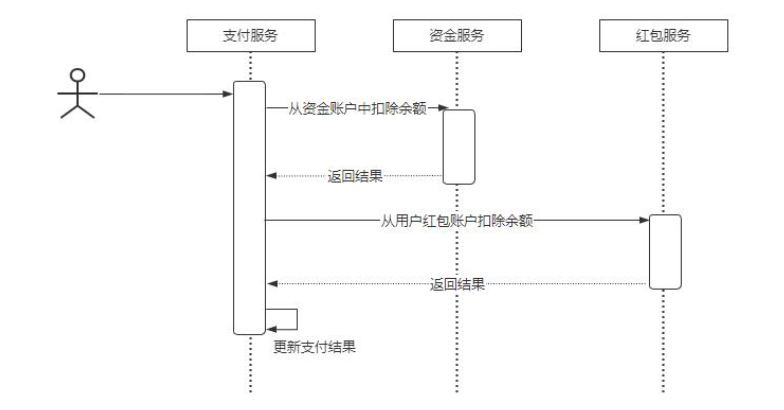

## Spring Cloud

### 你对 Spring Cloud 的理解  

看看普通人和高手是如何回答这个问题的？
普通人
Spring Cloud 是一套微服务解决方案，它包括配置中心、RPC 通信、服务注册、服务
熔断等组件
#### 高手
Spring Cloud 是一套分布式微服务的技术解决方案，它提供了快速构建分布式系统的常用的一些组件 
比如说配置管理、服务的注册与发现、服务调用的负载均衡、资源隔离、熔断降级等等 
不过 Spring Cloud 只是 Spring 官方提供的一套微服务标准定义，而真正的实现目前有两套体系用的比较多。 
-  一个是 Spring Cloud Netflix 
-  一个是 Spring Cloud Alibaba 

Spring Cloud Netflix 是基于Netflix 这个公司的开源组件集成的一套微服务解决方案，其中的组件有 
- 1. Ribbon——负载均衡 
- 2. Hystrix——服务熔断 
- 3.Zuul——网关 
- 4. Eureka——服务注册与发现 
- 5. Feign——服务调用 

Spring Cloud Alibaba 是基于阿里巴巴开源组件集成的一套微服务解决方案，其中包括 
- 1. Dubbo——消息通讯 
- 2. Nacos——服务注册与发现 
- 3.Seata——事务隔离 
- 4. Sentinel——熔断降级 
有了 Spring Cloud 这样的技术生态，使得我们在落地微服务架构时。不用去考虑第三方技术集成带来额外成本，只要通过配置组件来完成架构下的技术问题，从而可以让我们更加侧重性能方面
以上这些就是我对 Spring Cloud 的个人理解！   

## 分布式事务

### 请说一下分布式事务的理解和解决方案

资料来源：[【Java面试】请说一下分布式事务的理解和解决方案](https://www.toutiao.com/video/7145705137972412935/?from_scene=all)

”请说一下分布式事务的理解和解决方案“
这是一个工作了 4 年的同学，在面试的时候遇到的问题。
Hi，大家好，我是 Mic，咕泡科技联合创始人
下面我们来分析一下面试官对于这个问题的考察意图。

#### 考察目的
这个问题考察难度不算大，考察 4 年以上 Java 开发经验的同学
分布式事务主要涉及到跨库事务处理问题，除了考察求职者对这方面知识的了解以外，
还想了解一下求职者的实际处理经验。

### 问题分析

通常情况下，传统的关系型数据库只能保证单个数据库中多个数据表的事务特性。 
一旦多个 SQL 操作涉及到多个数据库，这类的事务无法解决跨库事务问题。 
在传统架构下，这种问题出现的情况非常少，但是在分布式微服务架构中，分布式事务的问题变得更加突出。 
以电商项目为例，假设我们要实现电商系统中的支付功能，它的实现流程如下（如图）。 
在微服务架构中，应用被拆分成以业务模块为单元的服务，并且每个服务有自己的数据库系统。
当用户发起支付时，会涉及到以下几个事务操作： 

- 1. 创建支付订单 
- 2. 从资金服务中扣除余额 
- 3. 从红包服务中扣除余额 
-  4. 更新支付结果   

这是四个典型的事务操作，而且这些操作分别属于不同的数据库，最终期望的结果是希
望这三个服务所对应的数据是一致的，很显然传统的事务无法解决这个问题！ 
因此就产生了分布式事务的问题，所谓分布式事务，就是事务具有分布式特性，简单理
解就是如何实现多个跨数据库的小事务组成的大事务的 ACID 特性。 
下面来看看高手的回答。 
#### 高手回答

好的 
分布式事务是指存在多个跨库事务的事务一致性问题， 
或者是指在分布式架构下由多个应用节点组成的多个事务之间的事务一致性问题。 
目前主流的分布式事务解决方案有两种 
- 一种是基于 XA 协议实现的强一致性事务方案，比如 Atomikos、Seata 中的 XA事务模型。基于 CAP 理论可以知道，如果要保证分布式事务的强一致性，就必然会带来性能的影响从而影响到可用性。 
所以强一致性事务性能会比较低。
-  另一种是基于 BASE 理论下的弱一致性事务解决方案，比如 TCC 事务模型、基于可靠性消息的最终一致性方案、Seata 的 Saga 事务模型等。最终一致性事务损失了数据的强一致性，通过异步补偿的方式达到数据的最终一致。 
因此在性能上比较好，适用于并发量比较高的场景。 
#### 总结

大家知道怎么回答了吗？ 
如果你喜欢我的作品，记得点赞收藏加关注哦 
我是 Mic，咱们下期再见。   

## 注册中心

### 服务注册中心应该是AP还是CP

资料来源：[【Java面试】服务注册中心应该是AP还是CP](https://www.toutiao.com/video/7144612079511536164/?from_scene=all)

在互联网去面试的时候，一定会考察求职者分布式架构领域相关的知识。 
而注册中心是微服务架构里面最重要的核心组件，所以面试频率会比较高。 
其中“服务注册中心应该是 AP 还是 CP 这个问题，就是最近一个工作了 5 年的粉丝遇到的一个问题。 
Hi，大家好，我是 Mic，咕泡科技联合创始人 
下面我们来分析一下面试官对于这个问题的考察意图。 
#### 考察目的
这个问题考察的难度中等偏上，主要考察工作 5 年以上的同学。 
考察目的有两个： 
> 1. 应聘的公司肯定是需要用到微服务架构，所以要了解求职者是否用过注册中心
> 2. 了解求职者是否深入理解注册中心，能够回答这个问题，至少说明对于注册中心的工作原理和价值是有清晰认知的
> 所以，对于这个问题，有两个回答的建议
> 3. 要有自己的总结和理解
> 4. 表达逻辑要足够清晰，不能想到哪说到哪。

#### 问题分析
首先，要先了解 CAP 模型。  
CAP 模型是说，在一个分布式系统里面，不可能同时满足三个点  
-  一致性（Consistency），访问分布式系统中的每一个节点都能获得最新的数据。
-  可用性（Availability），每次请求都能获得一个有效的访问，但不保证数据是最新的。
-  分区容错性（Partition tolerance），分区相当于对通信耗时的要求，系统如果不能在时限范围内达成数据一致，
就意味着发生了分区的情况。
在 CAP 模型中只能满足 CP 或者 AP，之所以不能满足 CA，因为网络通信的不确定性可能会导致分区容错，也就是分区容错性必然是存在的，因此我们只能在一致性和可用性之间做选择。再回到注册中心（如图），服务注册中心的本质是为了提供服务地址的统一管理，以及提供一个服务动态感知的能力。  
所以，注册中心应该要保证高可用性，也就是无论什么情况下，应用都能正常从注册中心获取到目标服务的通信地址。  
当注册中心不可用的时候，不能影响服务之间的正常通信。  
因此，从这个角度来说，注册中心应该是 AP 模型。    

另外，对于服务动态感知这个场景来说，从服务地址失效到最终客户端感知到变化，必然会存在延迟。  
也就是意味着客户端无法实时感知到出现故障的服务端节点。  
既然一定会出现数据不一致的问题，就更加没必要去搭建一个 CP 模型的注册中心集群了。    
否则反而会降低请求的性能。  
#### 高手回答
我认为注册中心应该是 AP 模型，原因有两个
- 1. 注册中心只是一个地址维护的平台，它如果出现故障，也不能影响服务之间的正常通信。
- 2. 注册中心的地址感知，本身就存在延迟，所以设计一个 CP 模型的架构意义并不大。
#### 总结

大家知道怎么回答了吗？  
如果你喜欢我的作品，记得点赞收藏加关注哦  
我是 Mic，咱们下期再见。    

### 说说你对 CAP 的理解  

资料来源：[【Java面试】这道分布式面试题一定要拿下，说说你对CAP的理解？](https://www.toutiao.com/video/7145278472452211208/?from_scene=all)

分布式架构之所以复杂，就是因为增加了网络通信，而网络通信本身具有不确定性。 
但是作为业务支撑的整个技术架构，所有业务的处理必须要具备确定性。 
因此在这样一个矛盾下，导致架构变得更加复杂。 
面试题”说说你对 CAP 的理解“这个问题，就是在这个背景下产生的 
Hi，大家好，我是 Mic，一个工作了 14 年的 Java 程序员。 
下面我们来分析一下面试官对于这个问题的考察意图。 
考察目的
这个问题考察难度算中等，主要针对 5 年以上开发经验的同学。 
#### 考察目的有两个
> 1. 了解求职者对于分布式架构的理解
> 2. 在分布式架构中，很多技术方案在落地的时候需要有取舍，要么是 CP、要么是 AP，
理解 CAP 定理，能够更好的做出合适的选择

#### 高手回答
CAP 模型，在一个分布式系统里面，不可能同时满足三个点
-  一致性（Consistency），访问分布式系统中的每一个节点都能获得最新的数据。
-  可用性（Availability），每次请求都能获得一个有效的访问，但不保证数据是最新
的。
- 分区容错性（Partition tolerance），分区相当于对通信耗时的要求，系统如果不能在时限范围内达成数据一致，就意味着发生了分区的情况。

在 CAP 模型中只能满足 CP 或者 AP，之所以不能满足 CA，因为网络通信的不确定性可能会导致分区容错，也就是分区容错性必然是存在的，因此我们只能在一致性和可用性之间做选择。
以上就是我的理解。 

#### 总结

大家知道怎么回答了吗？ 
如果你喜欢我的作品，记得点赞收藏加关注哦 
我是 Mic，咱们下期再见。    

## 限流

### 请你说一下你对服务降级的理解？

资料来源：[5年去某东面试竟这题翻车，请你说一下你对服务降级的理解？](https://www.toutiao.com/video/7143895258047185422/?from_scene=all)

### 熔断降级机制是什么？

资料来源：[【Java面试】高级面试题标准答案，熔断降级机制是什么？](https://www.toutiao.com/video/7198049383815119360/)

## 配置中心

### Nacos 配置更新的工作流程

## 链路追踪

### 秀！这么回答面试官都听不懂！什么是链路追踪？

资料来源：[【Java面试】秀！这么回答面试官都听不懂！什么是链路追踪？](https://www.toutiao.com/video/7132353330067702302/)