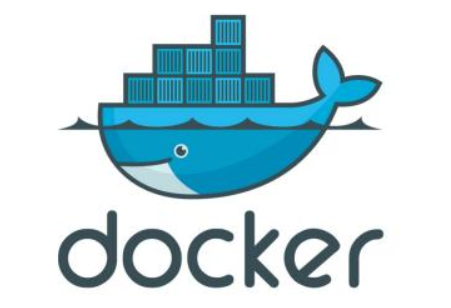

## Docker 

### 还原面试现场，带大家理解何为 Docker  

大家好，我是 MIC，一个工作了 13 年的 Java 程序员 
今天，我们通过一场面试，带大家理解什么是 Docker，什么是容器！   

### 什么是 Docker  

MIC：我个人理解，Docker 是一个超轻量级的虚拟机，也是实现容器化技术的一种应用工具。 
Docker 是使用时下很火的 Golang 语言进行开发的，基于 Linux 内核的 cgroup，namespace，以及 AUFS 类的 UnionFS 等技术，对进程进行封装隔离，属于操作系统层面的虚拟化技术。 由于隔离的进程独立于宿主和其它的隔离进程，因此也被称为容
器。 
我们来看一下Docker的LOGO，一头鲸鱼驮着一堆集装箱，什么意思呢？【展示Docker的 LOGO】   

集装箱表现的含义是：把所有不规整的货物，按照统一标准进行包装，在 Docker 中， 
它代表各种不同的应用程序使用 Docker 的标准来实现构建。 
而运输集装箱的鲸鱼，代表操作系统！ 

### 面试官：那你再说说为什么要用 Dcoker，它具有哪些优势？

MIC：基于我的理解，Docker 有六大优势。   

**资源占用小**
由于容器不需要进行硬件虚拟，也不需要运行完整操作系统等额外的资源开销，使得Docker 对系统资源的利用率更高，无论是应用执行速度还是文件存储速度,都要比传统虚拟机技术更高效,内存消 耗更少 。 
**启动速度快** 
传统的虚拟机技术启动应用服务往往需要较长时间，而 Docker 容器应用，由于直接运行于宿主内核，无需启动完整的操作系统，因此可以做到秒级，甚至毫秒级的启动时间，大大的节约了开发，测试，部署的时间。 
**迁移更轻松** 
由于 Docker 确保了执行环境的一致性，使得应用的迁移更加容易，Docker 可以在很多平台上运行，无论是物理机，虚拟机，公有云，私有云，它们的运行结果是一致的，因此用户可以很轻易的将一个平台上运行的应用，迁移到另一个平台上，而不用担心运行环境的变化导致应用无法正常运行这类的问题。 
**维护和拓展更轻松** 
docker 使用的分层存储和镜像技术，让应用重复部分的复用更容易，也让应用的维护更新更简单，基于基础镜像进一步扩展镜像也变得十分简单。 
另外，docker 团队和各个开源项目团队一起维护了一大批高质量的官网镜像，既可以直接在生产环境使用，又可以作为基础进一步定制，大大降低了应用服务的镜像制作成本。 
**运行环境一致** 
开发过程中一个常见的问题是环境一致性问题，由于开发环境，测试环境，生产环境不一致，导致有些 bug 并未在开发过程中被发现，
而 Docker 的镜像提供了除内核外完整的运行时环境，确保了应用运行环境一致性。持续交付和部署 
使用 Docker 可以通过定制应用镜像来实现持续集成，持续交付，部署。开发人员可以通过 Dockerfile 来进行镜像构建，并结合持续集成系统进行集成测试，而运维人员则可以在生产环境中快速部署该镜像，甚至结合持续部署系统进行自动部署   

**持续交付和部署** 
使用 Docker 可以通过定制应用镜像来实现持续集成，持续交付，部署。开发人员可以通过 Dockerfile 来进行镜像构建， 
并结合持续集成系统进行集成测试，而运维人员则可以在生产环境中快速部署该镜像，甚至结合持续部署系统进行自动部署   

### 面试官：再说说 Docker 核心组件吧！  

Docker 包含三个基本组件： 
-  镜像（Image） 
- 容器（Contaier） 
-  仓库（Repository） 

**镜像（Image）**——一个特殊的文件系统 
简单地理解，Docker 镜像就是一个 Linux 的文件系统（Root FileSystem），这个文件系统里面包含可以运行在 Linux 内核的程序以及相应的数据。 
一个镜像可以包含一个完整的操作系统环境，里面仅安装了 Apache 或用户需要的其它应用程序。镜像可以用来创建 Docker 容器。Docker 提供了一个很简单的机制来创建镜像或者更新现有的镜像，用户甚至可以直接从其他人那里下载一个已经做好的镜像来直接使用。 
**容器（Container）**——镜像运行的实体 
Docker 利用容器来运行应用。容器是从镜像创建的运行实例。它可以被启动、开始、停止、删除。每个容器都是相互隔离的、保证安全的平台。 
可以把容器看做是一个简易版的 Linux 环境（包括 root 用户权限、进程空间、用户空间和网络空间等）和运行在其中的应用程序。
**仓库（Repository）**——集中存放镜像文件的地方 
仓库是集中存放镜像文件的场所。很多人会把仓库和仓库注册服务器（Registry）混为一谈。实际上，仓库注册服务器上往往存放着多个仓库，每个仓库中又包含了多个镜像，每个镜像有不同的标签（tag）。 
仓库分为公**开仓库**（Public）和**私有仓库**（Private）两种形式。最大的公开仓库是 DockerHub，存放了数量庞大的镜像供用户下载。
以上这些就是我对 Docker 的了解. 
面试官：好的，看完本期视频，相信大家对 Docker 有了一定的了解，当然关于 Docker这个话题远不止今天聊的这些，例如：Docker 的基本架构，运行原理，数据卷等等，有兴趣的同学可以在评论区留言，我会在后续的视频中更新。 
我是 MIC 一个工作了 13 年的 Java 程序员，咱们下期再见！   