## 请介绍类加载过程，什么是双亲委派？(未完成)

资料来源：[请介绍类加载过程，什么是双亲委派？](https://www.toutiao.com/video/7085288549322326565/)

Hi， 大家好。
今天我们来分享一道关于 Java 类加载方面的面试题。 在国内的一二线互联网公司面试的时候， 面试官通常是使用这方面的问题来暖场， 但往往造成的是冷场~
比如， 什么是双亲委派？ 什么是类加载？ new String()生成了几个对象等等。
双亲委派的英文是 parent delegation model， 我认为从真正的实现逻辑来看， 正
确的翻译应该是父委托模型。
不管它叫什么， 我们先来看看遇到这个问题应该怎么回答  

## 普通人的回答
## 高手的回答
关于这个问题， 需要从几个方面来回答。
首先， 我简单说一下类的加载机制， 就是我们自己写的 java 源文件到最终运行，
必须要经过编译和类加载两个阶段。
编译的过程就是把.java 文件编译成.class 文件。
类加载的过程， 就是把 class 文件装载到 JVM 内存中， 装载完成以后就会得到
一个 Class 对象， 我们就可以使用 new 关键字来实例化这个对象。  

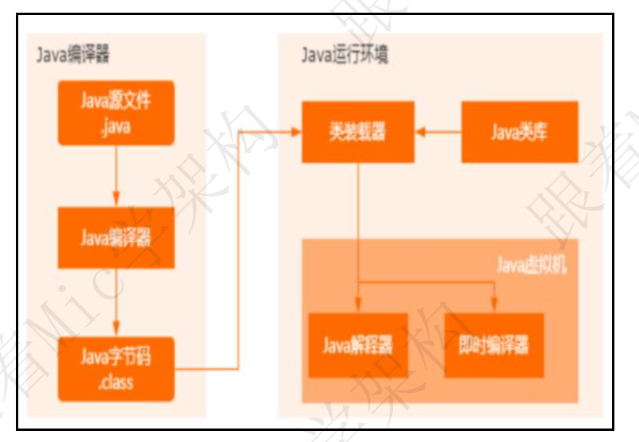

而类的加载过程， 需要涉及到类加载器。
JVM 在运行的时候， 会产生 3 个类加载器， 这三个类加载器组成了一个层级关系每个类加载器分别去加载不同作用范围的 jar 包， 比如
Bootstrap ClassLoader ， 主 要 是 负 责 Java 核 心 类 库 的 加 载 ， 也 就是%{JDK_HOME}\lib 下的 rt.jar、 resources.jar 等Extension ClassLoader， 主要负责%{JDK_HOME}\lib\ext目录下的jar包和class文件

Application ClassLoader， 主要负责当前应用里面的 classpath 下的所有 jar 包和类文件

除了系统自己提供的类加载器以外， 还可以通过 ClassLoader 类实现自定义加载器， 去满足一些特殊场景的需求  

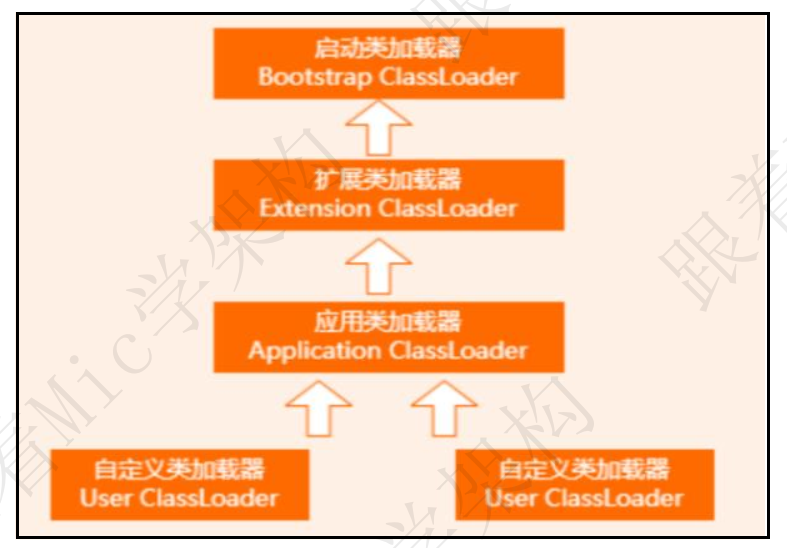

所谓的父委托模型， 就是按照类加载器的层级关系， 逐层进行委派。
比如当需要加载一个 class 文件的时候， 首先会把这个 class 的查询和加载委派
给父加载器去执行， 如果父加载器都无法加载， 再尝试自己来加载这个 class。  

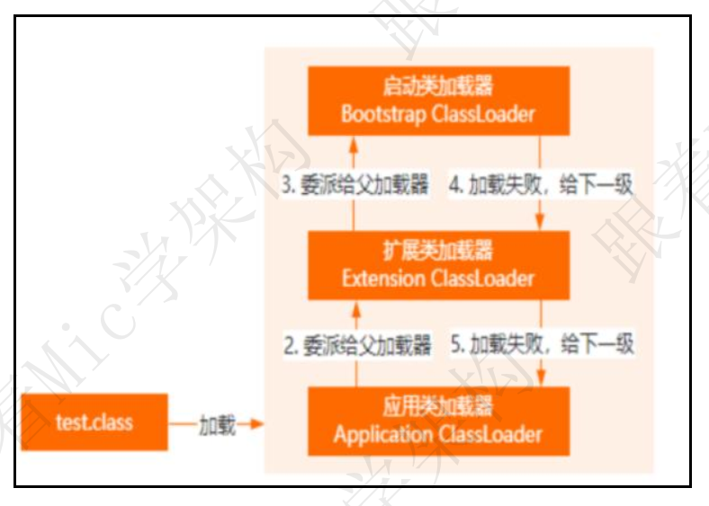

这样设计的好处， 我认为有几个。
安全性， 因为这种层级关系实际上代表的是一种优先级， 也就是所有的类的加载，
优先给 Bootstrap ClassLoader。 那对于核心类库中的类， 就没办法去破坏， 比
如自己写一个 java.lang.String， 最终还是会交给启动类加载器。 再加上每个类
加载器的作用范围， 那么自己写的 java.lang.String 就没办法去覆盖类库中类。
我认为这种层级关系的设计， 可以避免重复加载导致程序混乱的问题， 因为如果
父加载器已经加载过了， 那么子类就没必要去加载了。
以上就是我对这个问题的理解。  

### 面试点评

JVM  虚拟机一定面试必问的领域， 因为我们自己写的程序运行在 JVM 上， 一旦出现问题， 你不理解， 就无法排查。
就像一个修汽车的工人， 他不知道汽车的工作原理， 不懂发动机， 那他是无法做好这份工作的。
好的， 本期的普通人 VS 高手面试系列的视频就到这里结束了， 喜欢的朋友记得点赞和收藏  

## 谈谈你对JVM的理解

资料来源：[谈谈你对JVM的理解](https://www.toutiao.com/video/7039278036189086215/)

看看普通⼈和⾼⼿的回答。

### 普通人
JVM 就是 Java 虚拟机， 是⽤来运⾏我们平时所写的 Java 代码的。 优点是它会⾃动进⾏内存管理和垃圾回收， 缺点是⼀旦发⽣问题， 要是不了解 JVM 的运⾏机制， 就很难排查出问题所在  

高手
JVM 全称是 Java 虚拟机， 在聊什么是 JVM 之前， 我们不妨看⼀下这张图 

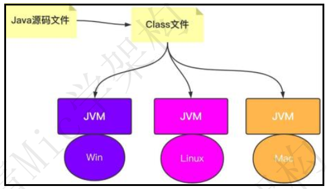

从这张图中可以看出 JVM 所处的位置， 同时也能看出它两个作用：
l 运⾏并管理 Java 源码⽂件所⽣成的 Class⽂件，
l 在不同的操作系统上安装不同的 JVM， 从⽽实现了跨平台的保证。
⼀般情况下， 对于开发者⽽⾔， 即使不熟悉 JVM 的运⾏机制并不影响业务代码的开发， 因为在安装完 JDK 或者 JRE 之后， 其中就已经内置了 JVM， 所以只需要将 Class⽂件交给 JVM 运⾏即可。
但当程序运⾏的过程中出现了问题， ⽽这个问题发生在 JVM 层⾯的， 那我们就需要熟悉 JVM 的运⾏机制， 才能迅速排查并解决 JVM 的性能问题。
我们先看下目前主流的 JVM HotSpot 的架构图， 通过这张架构图， 我们可以看出 JVM 的大致流程是把一个 class 文件通过类加载器加载进系统， 然后放到不同的区域 ，通过编译器编译 。  

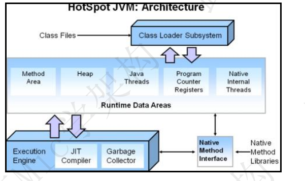

第一个部分 Class Files
在 Java 中， Class⽂件是由源码⽂件⽣成的， ⾄于源码⽂件的内容， 是每个 Java开发者在 JavaSE 阶段的必备知识， 这⾥就不再赘述了， 我们可以关注⼀下 Class⽂件的格式， ⽐如其中的常量池、 成员变量、 ⽅法等， 这样就能知道 Java 源码内容在 Class⽂件中的表示⽅式

第二个部分 Class Loader Subsystem 即类加载机制
Class⽂件加载到内存中， 需要借助 Java 中的类加载机制。 类加载机制分为装载、 链接和初始化， 其主要就是对类进⾏查找、 验证以及分配相关的内存空间和赋值

第三个部分 Runtime Data Areas 也就是通常所说的运⾏时数据区
其解决的问题就是 Class⽂件进入内存之后， 该如何进⾏存储不同的数据以及数据该如何进⾏扭转。 比如： Method Area 通常会储存由 Class⽂件常量池所对应的运⾏时常量池、 字段和⽅法的元数据信息、 类的模板信息等； Heap 是存储各种 Java 中的对象实例； Java Threads 通过线程以栈的⽅式运⾏加载各个⽅法；Native Internal Thread 可以理解为是加载运⾏native 类型的⽅法； PC Register
则是保存每个线程执⾏⽅法的实时地址。这样通过运⾏时数据区的 5 个部分就能很好地把数据存储和运⾏起来了第四个部分 Garbage Collector 也就是通常所说的垃圾回收就是对运⾏时数据区中的数据进⾏管理和回收。 回收机制可以基于不同的垃圾收集器， ⽐如 Serial、 Parallel、 CMS、 G1、 ZGC 等， 可以针对不同的业务场景选择不同的收集器， 只需要通过 JVM 参数设置 即可。 如果我们打开 hotspot 的源码， 可以发现这些收集器其实就是对于不同垃圾收集算法的实现， 核⼼的算法有3 个： 标记-清除、 标记-整理、 复制  

第五个部分是 JIT Compiler 和 Interpreter
通俗理解就是翻译器， Class 的字节码指令通过 JIT Compiler 和 Interpreter 翻译成对应操作系统的 CPU 指令， 只不过可以选择解释执⾏或者编译执⾏， 在HotSpot JVM 默认采用的是这两种⽅式的混合。  

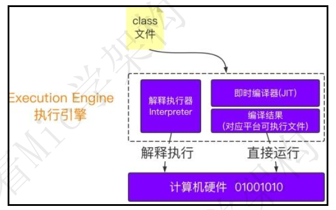

第六就是 JNI 的技术
如果我们想要找 Java 中的某个 native⽅法是如何通过 C 或者 C++实现的， 那么可以通过 Native Method Interface 来进⾏查找， 也就是所谓的 JNI 技术。通过官⽹上给出的 HotSpot 架构图， 我们就能够知道 JVM 到底是如何运行的了，当然在实际操作的过程中我们可以借助⼀些 JVM 参数：  

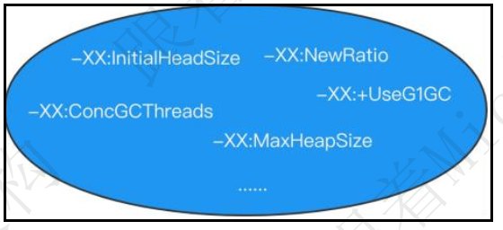

和⼀些常⻅的 JDK 常⻅命令  

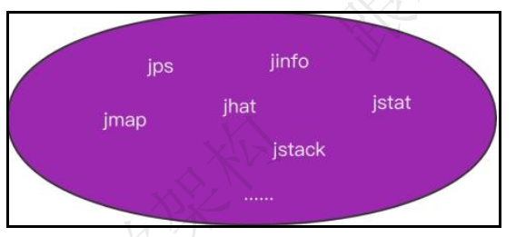

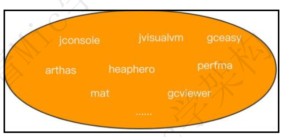

我们就可以优雅地分析 JVM 出现的常⻅问题并对其进⾏调优。
以上就是我对 JVM 的理解。
好的， 看完高手的回答后， 相信每位看完视频的小伙伴对 JVM 有了更深刻的理解了 ， 本期普通人 VS 高手系列的视频就到这里就结束了， 喜欢的朋友一键三连， 加个关注， 我是头发很多的程序员 Mic， 咱们下期见！  

## JVM如何判断一个对象可以被回收？

资料来源：[JVM如何判断一个对象可以被回收？](https://www.toutiao.com/video/7094513500789473800/)

## 为什么垃圾回收要分Eden区和Survior区？
资料来源：[【Java面试】为什么垃圾回收要分Eden区和Survior区？](https://www.toutiao.com/video/7291232808733934095/?from_scene=all&log_from=fca08f2d521bf_1703578038296)

## JVM分代年龄为什么是15次

资料来源：[JVM分代年龄为什么是15次](https://www.toutiao.com/video/7108971301649416734/)

一个工作了 7 年的粉丝去京东面试， 遇到一个很有意思的问题。
这是一个关于 JVM 底层相关的问题， 如果平时没有去花时间是肯定回答不出来
的。
Hello， 大家好， 我是 Mic， 一个工作了 14 年的程序员和创业者。
今天给大家分享的这道面试题是： “JVM 分代年龄为什么是 15 次， 可以是 25 次
吗？ ”
另外我花了 1 个多星期的时间， 把往期高手回答整理成了 10W 字的文档， 想获
取的小伙伴可以从我的个人煮叶简介加微领取
下面看看普通人和高手对这个问题的回答。  

### 高手
好的， 这个问题我会从几个方面来回答。
首先， 在 JVM 的 heap 内存里面， 分为 Eden Space、 Survivor Space、 Old Generation。  

当我们在 Java 里面使用 new 关键字创建一个对象的时候， JVM 会在 Eden Space 分配一块内存空间来存储这个对象。
当 Eden Space 的内存空间不足的时候， 会触发 Young GC 进行对象回收。
那些因为存在引用关系而无法回收的对象， JVM 会把它们转移到 Survivor Space。  

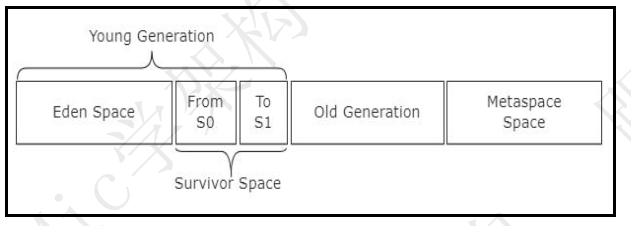

Survivor Space 内部又分为 From 区和 To 区， 刚从 Eden 区转移过来的对象会分配到 From 区， 每经历一次 Young GC， 这些没有办法被回收的对象就会在From 区和 To 区来回移动， 每移动一次， 这个对象的 GC 年龄就加 1。 默认情况下 GC 年龄达到 15 的时候， JVM 就会把这个对象移动到 Old Generation。  

其次呢， 一个对象的 GC 年龄， 是存储在对象头里面的， 一个 Java 对象在 JVM内存中的布局由三个部分组成， 分别是对象头、 实例数据、 对齐填充。 而对象头里 面 有 4 个 bit 位 来 存 储 GC 年 龄 。  

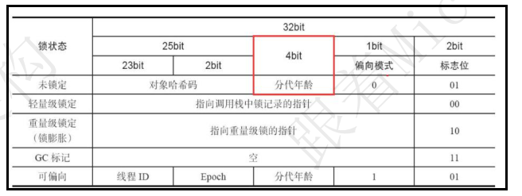

而 4 个 bit 位能够存储的最大数值是 15， 所以从这个角度来说， JVM 分代年龄之所以设置成 15 次是因为它最大能够存储的数值就是 15。
虽然 JVM 提供了参数来设置分代年龄的大小， 但是这个大小不能超过 15。而从设计角度来看， 当一个对象触发了最大值 15 次 gc， 还没有办法被回收， 就只能移动到 old generation 了。
另外， 设计者还引入了动态对象年龄判断的方式来决定把对象转移到 old generation， 也就是说不管这个对象的 gc 年龄是否达到了 15 次， 只要满足动态年龄判断的依据， 也同样会转移到 old generation。  

以上就是我对这个问题的理解。
### 面试点评
这个问题被问到的频率还挺高的。
并且底层涉及到的知识点也非常多， 比如对象头、 jvm 垃圾回收机制、 堆内存划
分等等。
所以建议大家在平时工作之外的时间， 多花一点时间去研究这些底层原理。
好的， 本期的普通人 VS 高手面试系列就到这里结束了。
大家记得点赞收藏加关注
我是 Mic， 咱们下一期再见。  

## 请说一下对象的创建过程？看看高手是如何搞定面试官

资料来源：[请说一下对象的创建过程？看看高手是如何搞定面试官](https://www.toutiao.com/video/7080841126466290206/?from_scene=all)

## 解释一下Java的内存模型和happens-before规则？

资料来源：[解释一下Java的内存模型和happens-before规则？](https://www.toutiao.com/video/7316364363118739994/)

