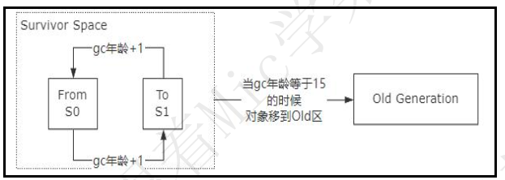
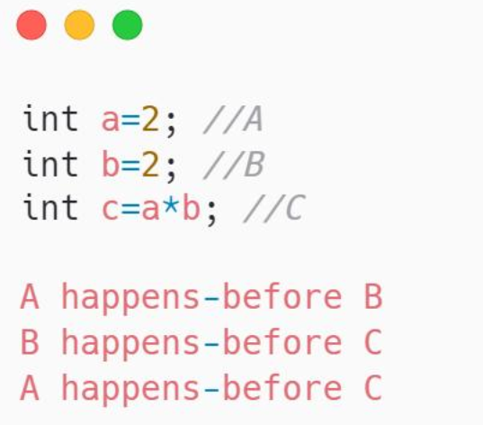
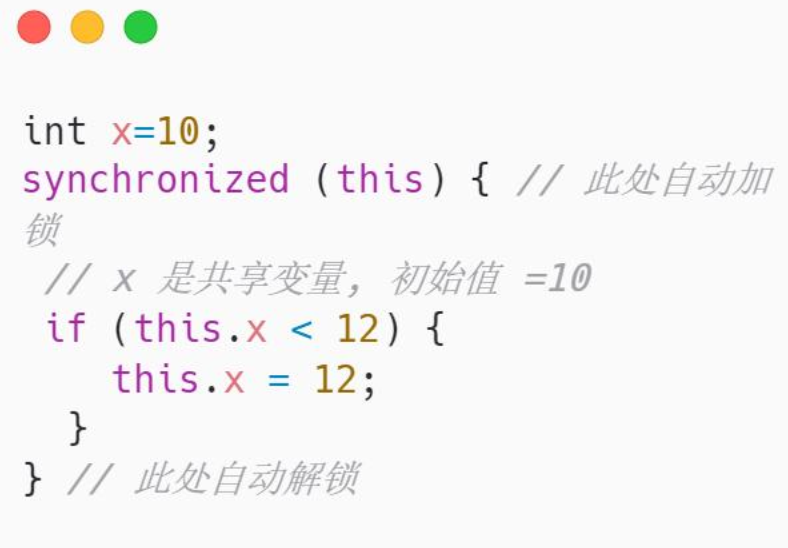
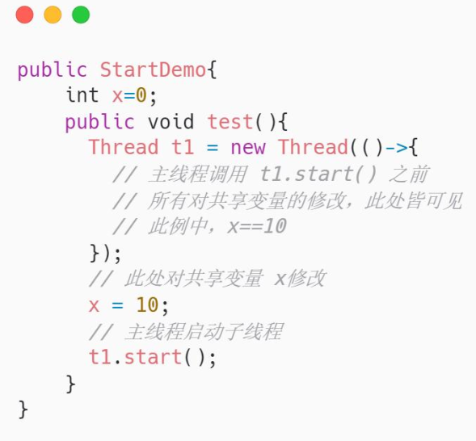
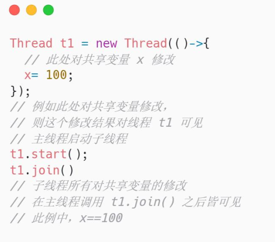

## 请介绍类加载过程，什么是双亲委派？

资料来源：[请介绍类加载过程，什么是双亲委派？](https://www.toutiao.com/video/7085288549322326565/)

Hi， 大家好。
今天我们来分享一道关于 Java 类加载方面的面试题。 在国内的一二线互联网公司面试的时候， 面试官通常是使用这方面的问题来暖场， 但往往造成的是冷场~
比如， 什么是双亲委派？ 什么是类加载？ new String()生成了几个对象等等。
双亲委派的英文是 parent delegation model， 我认为从真正的实现逻辑来看， 正
确的翻译应该是父委托模型。
不管它叫什么， 我们先来看看遇到这个问题应该怎么回答  

### 普通人
### 高手
关于这个问题， 需要从几个方面来回答。
首先， 我简单说一下类的加载机制， 就是我们自己写的 java 源文件到最终运行，
必须要经过编译和类加载两个阶段。
编译的过程就是把.java 文件编译成.class 文件。
类加载的过程， 就是把 class 文件装载到 JVM 内存中， 装载完成以后就会得到
一个 Class 对象， 我们就可以使用 new 关键字来实例化这个对象。  

而类的加载过程， 需要涉及到类加载器。
JVM 在运行的时候， 会产生 3 个类加载器， 这三个类加载器组成了一个层级关系每个类加载器分别去加载不同作用范围的 jar 包， 比如
Bootstrap ClassLoader ， 主 要 是 负 责 Java 核 心 类 库 的 加 载 ， 也 就是%{JDK_HOME}\lib 下的 rt.jar、 resources.jar 等Extension ClassLoader， 主要负责%{JDK_HOME}\lib\ext目录下的jar包和class文件

Application ClassLoader， 主要负责当前应用里面的 classpath 下的所有 jar 包和类文件

除了系统自己提供的类加载器以外， 还可以通过 ClassLoader 类实现自定义加载器， 去满足一些特殊场景的需求  

所谓的父委托模型， 就是按照类加载器的层级关系， 逐层进行委派。
比如当需要加载一个 class 文件的时候， 首先会把这个 class 的查询和加载委派
给父加载器去执行， 如果父加载器都无法加载， 再尝试自己来加载这个 class。  

这样设计的好处， 我认为有几个。
安全性， 因为这种层级关系实际上代表的是一种优先级， 也就是所有的类的加载，
优先给 Bootstrap ClassLoader。 那对于核心类库中的类， 就没办法去破坏， 比
如自己写一个 java.lang.String， 最终还是会交给启动类加载器。 再加上每个类
加载器的作用范围， 那么自己写的 java.lang.String 就没办法去覆盖类库中类。
我认为这种层级关系的设计， 可以避免重复加载导致程序混乱的问题， 因为如果
父加载器已经加载过了， 那么子类就没必要去加载了。
以上就是我对这个问题的理解。  

### 面试点评

JVM  虚拟机一定面试必问的领域， 因为我们自己写的程序运行在 JVM 上， 一旦出现问题， 你不理解， 就无法排查。
就像一个修汽车的工人， 他不知道汽车的工作原理， 不懂发动机， 那他是无法做好这份工作的。
好的， 本期的普通人 VS 高手面试系列的视频就到这里结束了， 喜欢的朋友记得点赞和收藏  

## 如何破坏双亲委派模型  

如何破坏双亲委派模型”！
这是一个工作 5 年的同学去美团面试遇到的面试题。
Hi，大家好，我是 Mic，咕泡科技联合创始人
下面来分析一下这个问题的考察目的
考察目的
这是一个偏 Java 基础的问题，考察 3 年以上的 Java 程序员。
这个问题考察目的有两个：

- 1. 了解求职者对于 Java 基础的掌握深度，类加载相关知识点挺多的，涉及到类加载器、类的生命周期、JVM 的工作原理，掌握这些基础可以快速解决程序中的一些问题，比如加载的类版本错误导致 NoSuchMethodException

- 2. 平时的工作中几乎不会用到类加载器，也不需要涉及到这方面的专业知识，所以这
个问题很好的实现了人才能力的筛选

下面来分析一下这个问题的具体背景。

### 问题分析
我们自己写的 java 源文件到最终运行，必须要经过编译和类加载两个阶段（如图）。编译的过程就是把.java 文件编译成.class 文件。
类加载的过程，就是把 class 文件装载到 JVM 内存中，装载完成以后就会得到一个 Class对象，我们就可以使用 new 关键字来实例化这个对象。

（如图）而类的加载过程，需要涉及到类加载器。 
JVM 在运行的时候，会产生 3 个类加载器，这三个类加载器组成了一个层级关系每个类加载器分别去加载不同作用范围的 jar 包，比如

- Bootstrap ClassLoader，主要是负责 Java 核心类库的加载，也就是 %{JDK_HOME}\lib 下的 rt.jar、resources.jar 等
- Extension ClassLoader，主要负责%{JDK_HOME}\lib\ext 目录下的 jar 包和 class文件
- Application ClassLoader，主要负责当前应用里面的 classpath 下的所有 jar 包和类文件

除了系统自己提供的类加载器以外，还可以通过 ClassLoader 类实现自定义加载器，去满足一些特殊场景的需求。  

（如图）而双亲模型，就是按照类加载器的层级关系，逐层进行委派。 
比如当需要加载一个 class 文件的时候，首先会把这个 class 的查询和加载委派给父加载器去执行，如果父加载器都无法加载，再尝试自己来加载这个 class。  

不过，双亲委派并不是一个强制性的约束模型，我们可以通过一些方式去打破双亲委派模型。 
这个打破的意思，就是类加载器可以加载不属于当前作用范围的类，实际上，JVM 本身就存在双亲委派被破坏的情况。
**第一种情况，**双亲委派是在 JDK1.2 版本发布的，而类加载器和抽象类 ClassLoader 在JDK1.0 就已经存在了，用户可以通过重写 ClassLoader 里面的 loadClass()方法实现自定义类加载，JDK1.2 为了向前兼容，所以在设计的时候需要兼容 loadClass()重写的实
现，导致双亲委派被破坏的情况。同时，为了避免后续再出现这样的问题，不在提倡重写 loadClass()方法，而是使用JDK1.2 中 ClassLoader 中提供了 findClass 方法来实现符合双亲委派规则的类加载逻辑。 
**第二种情况**，在这个类加载模型中，有可能存在顶层类加载器加载的类，需要调用用户
类加载器实现的代码的情况。 
比如 java.jdbc.Driver 接口，它只是一个数据库驱动接口，这个接口是由启动类加载器加载的。 
但是 java.jdbc.Driver 接口的实现是由各大数据库厂商来完成的，既然是自己实现的代码，就应该由应用类加载器来加载。
于是就出现了启动类加载器加载的类要调用应用类加载器加载的实现。 
为了解决这个问题，在 JVM 中引入了线程上下文类加载器，它可以把原本需要启动类加载器加载的类，由应用类加载器进行加载。 
除此之外，像 Tomcat 容器，也存在破坏双亲委派的情况，来实现不同应用之间的资源隔离。 
了解了这些背景之后，我们来看看高手该怎么回答。

#### 高手回答
好的，面试官。
我知道有两种方式来破坏双亲委派模型

- 第一种，集成 ClassLoader 抽象类，重写 loadClass 方法，在这个方法可以自定义要加载的类使用的类加载器。
- 第二种，使用线程上下文加载器，可以通过 java.lang.Thread 类的setContextClassLoader()方法来设置当前类使用的类加载器类型。

### 总结
好的，大家知道怎么回答这个问题了吗？ 
今天的视频就到这里结束了，喜欢这个作品的小伙伴记得点赞收藏加关注
我是 Mic，咱们下期再见。  

## 谈谈你对JVM的理解

资料来源：[谈谈你对JVM的理解](https://www.toutiao.com/video/7039278036189086215/)

看看普通⼈和⾼⼿的回答。

### 普通人
JVM 就是 Java 虚拟机， 是⽤来运⾏我们平时所写的 Java 代码的。 优点是它会⾃动进⾏内存管理和垃圾回收， 缺点是⼀旦发⽣问题， 要是不了解 JVM 的运⾏机制， 就很难排查出问题所在  

高手
JVM 全称是 Java 虚拟机， 在聊什么是 JVM 之前， 我们不妨看⼀下这张图 

从这张图中可以看出 JVM 所处的位置， 同时也能看出它两个作用：
l 运⾏并管理 Java 源码⽂件所⽣成的 Class⽂件，
l 在不同的操作系统上安装不同的 JVM， 从⽽实现了跨平台的保证。
⼀般情况下， 对于开发者⽽⾔， 即使不熟悉 JVM 的运⾏机制并不影响业务代码的开发， 因为在安装完 JDK 或者 JRE 之后， 其中就已经内置了 JVM， 所以只需要将 Class⽂件交给 JVM 运⾏即可。
但当程序运⾏的过程中出现了问题， ⽽这个问题发生在 JVM 层⾯的， 那我们就需要熟悉 JVM 的运⾏机制， 才能迅速排查并解决 JVM 的性能问题。
我们先看下目前主流的 JVM HotSpot 的架构图， 通过这张架构图， 我们可以看出 JVM 的大致流程是把一个 class 文件通过类加载器加载进系统， 然后放到不同的区域 ，通过编译器编译 。  

第一个部分 Class Files
在 Java 中， Class⽂件是由源码⽂件⽣成的， ⾄于源码⽂件的内容， 是每个 Java开发者在 JavaSE 阶段的必备知识， 这⾥就不再赘述了， 我们可以关注⼀下 Class⽂件的格式， ⽐如其中的常量池、 成员变量、 ⽅法等， 这样就能知道 Java 源码内容在 Class⽂件中的表示⽅式

第二个部分 Class Loader Subsystem 即类加载机制
Class⽂件加载到内存中， 需要借助 Java 中的类加载机制。 类加载机制分为装载、 链接和初始化， 其主要就是对类进⾏查找、 验证以及分配相关的内存空间和赋值

第三个部分 Runtime Data Areas 也就是通常所说的运⾏时数据区
其解决的问题就是 Class⽂件进入内存之后， 该如何进⾏存储不同的数据以及数据该如何进⾏扭转。 比如： Method Area 通常会储存由 Class⽂件常量池所对应的运⾏时常量池、 字段和⽅法的元数据信息、 类的模板信息等； Heap 是存储各种 Java 中的对象实例； Java Threads 通过线程以栈的⽅式运⾏加载各个⽅法；Native Internal Thread 可以理解为是加载运⾏native 类型的⽅法； PC Register
则是保存每个线程执⾏⽅法的实时地址。这样通过运⾏时数据区的 5 个部分就能很好地把数据存储和运⾏起来了第四个部分 Garbage Collector 也就是通常所说的垃圾回收就是对运⾏时数据区中的数据进⾏管理和回收。 回收机制可以基于不同的垃圾收集器， ⽐如 Serial、 Parallel、 CMS、 G1、 ZGC 等， 可以针对不同的业务场景选择不同的收集器， 只需要通过 JVM 参数设置 即可。 如果我们打开 hotspot 的源码， 可以发现这些收集器其实就是对于不同垃圾收集算法的实现， 核⼼的算法有3 个： 标记-清除、 标记-整理、 复制  

第五个部分是 JIT Compiler 和 Interpreter
通俗理解就是翻译器， Class 的字节码指令通过 JIT Compiler 和 Interpreter 翻译成对应操作系统的 CPU 指令， 只不过可以选择解释执⾏或者编译执⾏， 在HotSpot JVM 默认采用的是这两种⽅式的混合。  

第六就是 JNI 的技术
如果我们想要找 Java 中的某个 native⽅法是如何通过 C 或者 C++实现的， 那么可以通过 Native Method Interface 来进⾏查找， 也就是所谓的 JNI 技术。通过官⽹上给出的 HotSpot 架构图， 我们就能够知道 JVM 到底是如何运行的了，当然在实际操作的过程中我们可以借助⼀些 JVM 参数：  

和⼀些常⻅的 JDK 常⻅命令  

我们就可以优雅地分析 JVM 出现的常⻅问题并对其进⾏调优。
以上就是我对 JVM 的理解。
好的， 看完高手的回答后， 相信每位看完视频的小伙伴对 JVM 有了更深刻的理解了 ， 本期普通人 VS 高手系列的视频就到这里就结束了， 喜欢的朋友一键三连， 加个关注， 我是头发很多的程序员 Mic， 咱们下期见！  

## JVM如何判断一个对象可以被回收？

资料来源：[JVM如何判断一个对象可以被回收？](https://www.toutiao.com/video/7094513500789473800/)

Hi， 我是 Mic。
今天分享一道一线互联网公司必问的面试题。
”JVM 如何判断一个对象可以被回收“
关于这个问题，来看看普通人和高手的回答。
### 高手
好的，面试官。  

在 JVM 里面，要判断一个对象是否可以被回收，最重要的是判断这个对象是否还在被
使用，只有没被使用的对象才能回收。
- 1. （如图）引用计数器，也就是为每一个对象添加一个引用计数器，用来统计指向当前对象的引用次数，

如果当前对象存在应用的更新，那么就对这个引用计数器进行增加，一旦这个引用计数器变成 0，就意味着它可以被回收了。
这种方法需要额外的空间来存储引用计数器，但是它的实现很简单，而且效率也比较高。  

(如图）不过主流的 JVM 都没有采用这种方式，因为引用计数器在处理一些复杂的循环引用或者相互依赖的情况时，
可能会出现一些不再使用但是又无法回收的内存，造成内存泄露的问题。  

- 2. 可达性分析，它的主要思想是，首先确定一系列肯定不能回收的对象作为 GC root  

比如虚拟机栈里面的引用对象、本地方法栈引用的对象等，然后以 GC ROOT 作为起始节点，
从这些节点开始向下搜索，去寻找它的直接和间接引用的对象，当遍历完之后如果发现有一些对象不可到达，那么就认为这些对象已经没有用了，需要被回收。
在垃圾回收的时候，JVM 会首先找到所有的 GC root，这个过程会暂停所有用户线程，也就是 stop the world，然后再从 GC Roots 这些根节点向下搜索，可达的对象保留，不可达的就会回收掉。
可达性分析是目前主流 JVM 使用的算法。

以上就是我对这个问题的理解。  

#### 面试点评
很多粉丝和我说，很多东西看完以后过一段时间就忘记了，问我是怎么记下来的。 
我和他说，技术这些东西不需要记，你唯一能做的就是减少碎片化的学习，   多花一点时间在系统学习上，只有体系化的知识是不会忘记的。 
可是，搭建体系化知识的过程要比碎片化的点状学习痛苦不止一万倍。 
技术的沉淀是没有捷径的，只能花苦功夫去学习。 
好的，本期的普通人 VS 高手面试系列的视频就到这里结束了 
喜欢我的作品的小伙伴记得点赞和收藏。 
我是 Mic，一个工作了 14 年的 Java 程序员，咱们下期再见。   

## Java 常见的垃圾收集器有哪些？

资料来源：[Java 常见的垃圾收集器有哪些？](https://www.toutiao.com/video/7314518868964311592/?channel=&source=search_tab)

### 高手
实际上，垃圾收集器（GC，Garbage Collector）是和具体 JVM 实现紧密相关的，不同厂商（IBM、Oracle），不同版本的 JVM，提供的选择也不同。接下来，我来谈谈最主流的 Oracle JDK。 
**Serial GC**，它是最古老的垃圾收集器，“Serial”体现在其收集工作是单线程的，并且在进行垃圾收集过程中，会进入臭名昭著的“Stop-The-World”状态。当然，其单线程设计也意味着精简的 GC 实现，无需维护复杂的数据结构，初始化也简单，所以一直是 Client 模式下 JVM 的默认选项。 

从年代的角度，通常将其老年代实现单独称作**Serial Old**，它采用了标记 - 整理（MarkCompact）算法，区别于新生代的复制算法。
Serial GC 的对应 JVM 参数是-XX:+UseSerialGC 
ParNew GC，很明显是个新生代 GC 实现，它实际是 Serial GC 的多线程版本，最常见的应用场景是配合老年代的 CMS GC 工作，下面是对应参数`-XX:+UseConcMarkSweepGC -XX:+UseParNewGC  `

CMS（Concurrent Mark Sweep） GC，基于标记 - 清除（Mark-Sweep）算法，设计目标是尽量减少停顿时间，这一点对于 Web 等反应时间敏感的应用非常重要，一直到今天，仍然有很多系统使用 CMS GC。但是，CMS 采用的标记 - 清除算法，存在着内存碎片化问题，所以难以避免在长时间运行等情况下发生 full GC，导致恶劣的停顿。另外，既然强调了并发（Concurrent），CMS 会占用更多 CPU 资源，并和用户线程争抢。Parrallel GC，在早期 JDK 8 等版本中，它是 server 模式 JVM 的默认 GC选择，也被称作是吞吐量优先的 GC。它的算法和 Serial GC 比较相似，尽管实现要复杂的多，其特点是新生代和老年代 GC 都是并行进行的，在常见的服务器环境中更
加高效。开启选项是：`-XX:+UseParallelGC`另外，Parallel GC 引入了开发者友好的配置项，我们可以直接设置暂停时间或吞吐量等目标，JVM 会自动进行适应性调整，例如下面参数： 

`-XX:MaxGCPauseMillis=value` 
`-XX:GCTimeRatio=N // GC` 时间和用户时间比例= 1 / (N+1) 
G1 GC 这是一种兼顾吞吐量和停顿时间的 GC 实现，是 Oracle JDK 9 以后的默认GC 选项。G1 可以直观的设定停顿时间的目标，相比于 CMS GC，G1 未必能做到 
CMS 在最好情况下的延时停顿，但是最差情况要好很多。G1 GC 仍然存在着年代的概念，但是其内存结构并不是简单的条带式划分，而是类似棋盘的一个个 region。 
Region 之间是复制算法，但整体上实际可看作是标记 - 整理（Mark-Compact）算法，可以有效地避免内存碎片，尤其是当 Java 堆非常大的时候，G1 的优势更加明显。 
G1 吞吐量和停顿表现都非常不错，并且仍然在不断地完善，与此同时 CMS 已经在JDK9 中被标记为废弃（deprecated），所以 G1 GC 值得你深入掌握。 

### 面试点评
垃圾收集机制是 Java 的招牌能力，极大地提高了开发效率。如今，垃圾收集几乎成为现代语言的标配，即使经过如此长时间的发展， Java 的垃圾收集机制仍然在不断的演进中，不同大小的设备、不同特征的应用场景，对垃圾收集提出了新的挑战，这当然也是面试的热点。  

## 为什么垃圾回收要分Eden区和Survior区？

资料来源：[【Java面试】为什么垃圾回收要分Eden区和Survior区？](https://www.toutiao.com/video/7291232808733934095/?from_scene=all&log_from=fca08f2d521bf_1703578038296)

这个是java8版本的运行时数据区在这个图中我们看到Heap堆内存的空间划分为Young区和Old区，其中Young区又划分
为Enden区surivor From、Surivor to如果大家在学习JVM运行时数据区的时候，主动去思考过这个
部分的设计，那么这个问题就比较容易回答了

### 高手

JVM垃圾回收采用了分代回收测了，用这种策略的原因

主要是基于两个重要的观察结果

> 一、大多数对象的生命周期比较短
> 二、老的对象会引用新的对象，但是新的对象很少会引用老的对象

而分代的具体工作流程是这样的；当新对象被创建好以后，他们首先会被放在Eden区

当Eden区满了，就会触发一次Minor GC ，在这个过程中存活的对象会被移动Survivor区

为了平衡Survivor区的使用，和避免内存碎片，java虚拟机会在两个Survivor区之间进行来回的复制

每一次Minor GC以后， 仍然存活的对象会被复制到另外一个Survivor区，直到打到GC年龄，默认15次以后。移动到老年代

通过这样的设计以后，Minor GC只需要处理新生代的内存空间。

由于新生代通常小于老年代，所以Minor GC的时间相对比较短。

同时大部分对象的生命周期又非常短。

所以每一次Minor GC都能回收大量的空间，从而大大的提升了垃圾回收的效率，避免了对整个堆内存进行频繁的Full GC 

以上就是我的理解

## JVM分代年龄为什么是15次

资料来源：[JVM分代年龄为什么是15次](https://www.toutiao.com/video/7108971301649416734/)

一个工作了 7 年的粉丝去京东面试， 遇到一个很有意思的问题。
这是一个关于 JVM 底层相关的问题， 如果平时没有去花时间是肯定回答不出来
的。
Hello， 大家好， 我是 Mic， 一个工作了 14 年的程序员和创业者。
今天给大家分享的这道面试题是： “JVM 分代年龄为什么是 15 次， 可以是 25 次
吗？ ”
另外我花了 1 个多星期的时间， 把往期高手回答整理成了 10W 字的文档， 想获
取的小伙伴可以从我的个人煮叶简介加微领取
下面看看普通人和高手对这个问题的回答。  

### 高手
好的， 这个问题我会从几个方面来回答。
首先， 在 JVM 的 heap 内存里面， 分为 Eden Space、 Survivor Space、 Old Generation。  

当我们在 Java 里面使用 new 关键字创建一个对象的时候， JVM 会在 Eden Space 分配一块内存空间来存储这个对象。
当 Eden Space 的内存空间不足的时候， 会触发 Young GC 进行对象回收。
那些因为存在引用关系而无法回收的对象， JVM 会把它们转移到 Survivor Space。  

Survivor Space 内部又分为 From 区和 To 区， 刚从 Eden 区转移过来的对象会分配到 From 区， 每经历一次 Young GC， 这些没有办法被回收的对象就会在From 区和 To 区来回移动， 每移动一次， 这个对象的 GC 年龄就加 1。 默认情况下 GC 年龄达到 15 的时候， JVM 就会把这个对象移动到 Old Generation。  

其次呢， 一个对象的 GC 年龄， 是存储在对象头里面的， 一个 Java 对象在 JVM内存中的布局由三个部分组成， 分别是对象头、 实例数据、 对齐填充。 而对象头里 面 有 4 个 bit 位 来 存 储 GC 年 龄 。  

而 4 个 bit 位能够存储的最大数值是 15， 所以从这个角度来说， JVM 分代年龄之所以设置成 15 次是因为它最大能够存储的数值就是 15。
虽然 JVM 提供了参数来设置分代年龄的大小， 但是这个大小不能超过 15。而从设计角度来看， 当一个对象触发了最大值 15 次 gc， 还没有办法被回收， 就只能移动到 old generation 了。
另外， 设计者还引入了动态对象年龄判断的方式来决定把对象转移到 old generation， 也就是说不管这个对象的 gc 年龄是否达到了 15 次， 只要满足动态年龄判断的依据， 也同样会转移到 old generation。  

以上就是我对这个问题的理解。
### 面试点评
这个问题被问到的频率还挺高的。
并且底层涉及到的知识点也非常多， 比如对象头、 jvm 垃圾回收机制、 堆内存划
分等等。
所以建议大家在平时工作之外的时间， 多花一点时间去研究这些底层原理。
好的， 本期的普通人 VS 高手面试系列就到这里结束了。
大家记得点赞收藏加关注
我是 Mic， 咱们下一期再见。  

## 什么是 Java 虚拟机，为什么要使用？  

资料来源：[什么是 Java 虚拟机，为什么要使用？](https://www.toutiao.com/video/7128643500048024100/?channel=&source=search_tab)

文字版本: [什么是 Java 虚拟机，为什么要使用？](https://www.toutiao.com/article/7136855470072971780/?channel=&source=search_tab)

> 什么是Java虚拟机，为什么要使用”。
>
> 最近一个1年Java开发经验的同学去面试阿里，遇到这个问题向我求助。
>
> Hi，大家好，我是 Mic，一个工作14年的Java程序员。
>
> 那么，这个问题，面试官希望考察什么呢？

### 问题解析

Java虚拟机，是Java应用程序运行的平台。

很多初学者，第一步基本上都是学习怎么写代码，并没有关注Java代码所运行的平台。

因此，虽然写了几年代码，但是对Java本身的理解不够深刻，程序一旦出现问题，很难排查和解决。

面试官考察这个问题的出发点，我认为有三个

- 了解求职者对于Java语言的理解深度，这个方面有助于提升代码编写的质量
- 了解求职者对于JVM基础的掌握程度，良好的基础有助于快速解决GC问题、内存问题等
- 考察求职者的潜质，一个对技术有热情的人，有助于更好的陪伴公司成长

所以，对于这个问题来说，我们只需要从JVM关键特性Write Once、Run Anywhere这个角度去切入解释就行了。

下面我们来看看高手应该怎么回答。

### 高手：

Java虚拟机是Java语言的运行环境。

之所以需要Java虚拟机，主要是为Java语言提供Write Once，Run Anywhere能力。

实际上，一次编写，到处运行这个能力本身是不可能实现的。因为不同的操作系统和硬件。

最终执行的指令会有较大的差异。

而Java虚拟机就是解决这个问题的，它能根据不同的操作系统和硬件差异，生成符合这个平台机器指令。

简单理解，它就相当于一个翻译工具，在window下，翻译成window可执行的指令，在linux下，

翻译成linux下可执行的指令。

除了这个因素以为，我认为自动回收垃圾这个功能也是原因之一，它让开发者省去了垃圾回收这个工作。

减少了程序开发的复杂性。

### 总结

好了，今天的分享就到这里结束了

如果喜欢我的作品，记得点赞、收藏、关注！

## 请说一下对象的创建过程？看看高手是如何搞定面试官

资料来源：[请说一下对象的创建过程？看看高手是如何搞定面试官](https://www.toutiao.com/video/7080841126466290206/?from_scene=all)

一个工作 5 年的 Java 程序员，去阿里面试，第一面就遇到了一个比较有深度的问题。
“请说一下对象的创建过程？”
唉，Java 生态的技术这么多，你永远不知道面试官会从哪个角度来刁难你。
好吧，对于这个问题，我们来看看普通人和高手的回答吧。
### 普通人
嗯，对象的创建过程。主要有三个步骤吧。
\1. 在堆内存里面分配内存空间
\2. 设置实例的引用指向，指向这个内存空间
\3. 初始化对象  

### 高手
（如图）在实例化一个对象的时候，JVM 首先会去检查目标对象是否已经被加载并初
始化了。
如果没有，JVM 需要立刻去加载目标类，然后调用目标类的构造器完成初始化。 目标
类的加载是通过类加载器来实现的，主要就是把一个类加载到内存里面。
然后初始化的过程，主要是对目标类里面的静态变量、成员变量、静态代码块进行初始
化。  

当目标类被初始化以后，就可以从常量池里面找到对应的类元信息，并且目标对象的大小在类加载之后就已经确定了，所以这个时候就需要为新创建的对象，根据目标对象的大小在堆内存里面分配内存空间。
内存分配的方式一般有两种，一种指针碰撞，另一种是空闲列表，JVM 会根据 Java 堆内存是否规整来决定内存分配方式。
接下来，JVM 会把目标对象里面的普通成员变量初始化为零值，比如 int 类型初始化为0，对象类型初始化为 null，（类变量在类加载的准备阶段就已经初始化过了）。
这一步操作主要是保证对象里面的实例字段，不用初始化就可以直接使用，也就是程序能够获得这些字段对应数据类型的零值。
然后，JVM 还需要对目标对象的对象头做一些设置，比如对象所属的类元信息、对象的 GC 分代年龄、hashcode、锁标记等等。
完成这些步骤以后，对于 JVM 来说，新对象的创建工作已经完成。但是基于 Java 语言来说，对象创建才算是开始。
接下来要做的，就是执行目标对象内部生成的 init 方法，初始化成员变量的值、执行构造块、最后执行目标对象的构造方法，完成对象的创建。
其中，init 方法是 Java 文件编译之后在字节码文件中生成的，它是一个实例构造器，这个构造器会把语句块、变量初始化、调用父类构造器等操作组织在一起。所以调用 init方法能够完成一系列的初始化动作。  

以上就是我对这个问题的理解。
### 面试点评
在我看来，Java 这个行业，你是初级开发、还是高级开发、我是应该给你 15k，还是给你 30k，并没有行业标准。
所以，企业的筛选方式，只能从你的工作背景以及技术的深度去进行考察。
你说你 CRUD 写得很牛逼，市场上一抓一大把，但是同样是写 CRUD，你凭什么薪资要比我高 5000？
你有本事回答出来啊，回答出来我就给你这 30k。是不是，
这个题目，显然也是考察 JVM 的底层原理，恰恰又是大家平时接触最多，但是研究最少的部分。没面上，只能说你没有本事。
即便是我们把所有问题抛给所谓的内卷，但是市场的筛选机制，不会因为你一句话而改变。
好的，本期的普通人 VS 高手面试系列的视频就到这里结束了，喜欢的朋友记得点赞和收藏。  

## 解释一下Java的内存模型和happens-before规则？

资料来源：[解释一下Java的内存模型和happens-before规则？](https://www.toutiao.com/video/7316364363118739994/)

“请你说一下你对 Happens-Before 的理解”
屏幕前的你，听到这个问题的时候，知道怎么回答吗？
Hi，大家好，我是 Mic，一个工作了 14 年的 Java 程序员。
并发编程是面试过程中重点考察的方向，能够考察的方向有很多
关于这个问题，我把高手回答整理到了 15W 字的面试文档里面
大家可以在我的主页加 V 领取
下面看看普通人和高手的回答。  

### 高手
好的，这个问题我需要从几个方面来回答。
首先，Happens-Before 是一种可见性模型，也就是说，在多线程环境下。
原本因为指令重排序的存在会导致数据的可见性问题，也就是 A 线程修改某个共享变量对 B 线程不可见。
因此，JMM 通过 Happens-Before 关系向开发人员提供跨越线程的内存可见性保证。
如果一个操作的执行结果对另外一个操作可见，那么这两个操作之间必然存在Happens-Before 管理。
其次，Happens-Before 关系只是描述结果的可见性，并不表示指令执行的先后顺序，也就是说只要不对结果产生影响，仍然允许指令的重排序。
最后，在 JMM 中存在很多的 Happens-Before 规则。

- 程序顺序规则，一个线程中的每个操作，
  happens-before 这个线程中的任意后续操作，可以简单认为是 as-if-serial
  也就是不管怎么重排序，单线程的程序的执行结果不能改变

-  传递性规则（如图），也就是 A Happens-Before B，B Happens-Before C。
  就可以推导出 A Happens-Before C。  

- volatile 变量规则，对一个 volatile 修饰的变量的写一定 happens-before 于任意
  后续对这个 volatile 变量的读操作

- 监视器锁规则（如图），一个线程对于一个锁的释放锁操作，
  一定 happens-before 与后续线程对这个锁的加锁操作
  在这个场景中，如果线程 A 获得了锁并且把 x 修改成了 12，那么后续的线程获得锁之后得
  到的 x 的值一定是 12  

- 线程启动规则（如图），如果线程 A 执行操作 ThreadB.start(),那么线程 A 的
  ThreadB.start()之前的操作 happens-before 线程 B 中的任意操作。
  在这样一个场景中，t1 线程启动之前对于 x=10 的赋值操作，t1 线程启动以后读取 x
  的值一定是 10.  

- join 规则（如图），如果线程 A 执行操作 ThreadB.join()并成功返回，
  那么线程 B 中的任意操作 happens-before 于线程 A 从 ThreadB.join()操作成功的返
  回。  

以上就是我对 Happens-Before 的理解。
面试点评
Happens-Before 模型，在多线程开发中是必须要理解和掌握的规则。它能够指引开发者在使用多线程开发的时候避免出现内存可见性问题
因此这道面试题其实也是考察求职者的基础能力好的，

今天的视频就到这里结束了
大家记得点赞收藏加关注
我是 Mic，咱们下期再见  

