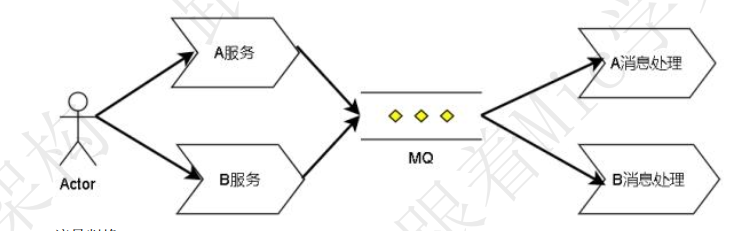
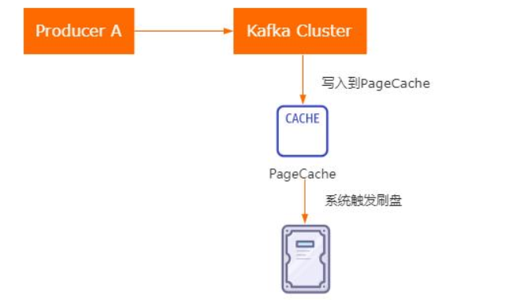

## MQ理论

### 谈谈什么是消息队列(MQ)

资料来源：[谈谈什么是消息队列(MQ)](https://www.toutiao.com/video/7031099634365760036/)

#### 普通人
消息用队列的模式发送， 
把要传输的数据放在队列中， 
产生消息的叫做生产者， 
从队列里取出消息的叫做消费者。 
这些是我对消息队列的理解   

#### 高手  

消息队列 Message Queue， 简称 MQ。 
是一种应用间的通信方式， 主要由三个部分组成。   

**生产者： **Producer
消息的产生者与调用端 
主要负责消息所承载的业务信息的实例化 
是一个队列的发起方 
**代理：**Broker
主要的处理单元 
负责消息的存储、 投递、 及各种队列附加功能的实现 
是消息队列最核心的组成部分 
**消费者： **Consumer

一个消息队列的终端 
也是消息的调用端 
具体是根据消息承载的信息， 处理各种业务逻辑。 消息队列的应用场景较多， 
常用的可以分为三种： 
**异步处理**
主要应用于对实时性要求不严格的场景， 
比如： 用户注册发送验证码、 下单通知、 发送优惠券等等。 
服务方只需要把协商好的消息发送到消息队列， 
剩下的由消费消息的服务去处理， 
不用等待消费服务返回结果。   

**应用解耦**
应用解耦可以看作是把相关但耦合度不高的系统联系起来。 
比如订单系统与 WMS、 EHR 系统， 有关联但不哪么紧密， 每个系统之间只需要把约定的消息发送到 MQ， 另外的系统去消费即可。 
解决了各个系统可以采用不同的架构、 语言来实现， 从而大大增加了系统的灵活性。   

**流量削峰**
流量削峰一般应用在大流量入口且短时间内业务需求处理不完的服务中心，为了权衡高可用， 把大量的并行任务发送到 MQ 中， 
依据 MQ 的存储及分发功能， 平稳的处理后续的业务，  起到一个大流量缓冲的作用   

目前市面上常见的消息队列中间件主要有 
ActiveMQ、 RabbitMQ、 Kafka、 RocketMQ 这几种，在架构技术选型的时候一般根据业务的需求选择合适的中间件： 
比如中小型公司， 低吞吐量的一般用 ActiveMQ、 RabbitMQ 较为合适，大数据高吞吐量的大型公司一般选用 Kafka 和 RocketMQ。 
以上就是我的 MQ 的理解。   

#### 总结
好的， 看完高手的回答后， 相信每位看完视频的小伙伴对消息队列有了更深刻的理解 ， 当然本期视频还有很多内容未涉及到， 比如中间件产品的介绍、 消息队列的实现原理等等， 如果你还想听请在下方的评论区留言， 我会逐步安排   

###  什么叫阻塞队列的有界和无界?

资料来源：[ 什么叫阻塞队列的有界和无界?](https://www.toutiao.com/video/7075638697248424461/?from_scene=all)

昨天一个 3 年 Java 经验的小伙伴私信我， 他说现在面试怎么这么难啊！
我只是面试一个业务开发， 他们竟然问我： 什么叫阻塞队列的有界和无界。 现在
面试也太卷了吧!
如果你也遇到过类似问题， 那我们来看看普通人和高手的回答吧！  

#### 普通人
有界队列就是说队列中的元素个数是有限制的， 而无界对接表示队列中的元素个数没有限制！ 嗯！ ！ ！  

#### 高手
 阻塞队列， 是一种特殊的队列， 它在普通队列的基础上提供了两个附加功能当队列为空的时候， 获取队列中元素的消费者线程会被阻塞， 同时唤醒生产者线程。
当队列满了的时候， 向队列中添加元素的生产者线程被阻塞， 同时唤醒消费者线程  

44

其中， 阻塞队列中能够容纳的元素个数， 通常情况下是有界的， 比如我们实例化一个 ArrayBlockingList， 可以在构造方法中传入一个整形的数字， 表示这个基于数组的阻塞队列中能够容纳的元素个数。 这种就是有界队列。
而无界队列， 就是没有设置固定大小的队列， 不过它并不是像我们理解的那种元素没有任何限制， 而是它的元素存储量很大， 像 LinkedBlockingQueue， 它的默认队列长度是 Integer.Max_Value， 所以我们感知不到它的长度限制。
无界队列存在比较大的潜在风险， 如果在并发量较大的情况下， 线程池中可以几乎无限制的添加任务， 容易导致内存溢出的问题！
以上就是我对这个问题的理解!  

#### 结尾
阻塞队列在生产者消费者模型的场景中使用频率比较高， 比较典型的就是在线程池中， 通过阻塞队列来实现线程任务的生产和消费功能。
基于阻塞队列实现的生产者消费者模型比较适合用在异步化性能提升的场景， 以及做并发流量缓冲类的场景中！  

在很多开源中间件中都可以看到这种模型的使用， 比如在 Zookeeper 源码中就大量用到了阻塞队列实现的生产者消费者模型。
OK， 本期的普通人 VS 高手面试系列的视频就到这里结束了， 喜欢的朋友记得
点赞收藏。
我是 Mic， 一个工作了 14 年的 Java 程序员， 咱们下期再见  

###  基于数组的阻塞队列 ，ArrayBlockingQueue 原理

资料来源：[基于数组的阻塞队列 ，ArrayBlockingQueue 原理](https://www.toutiao.com/video/7084567609114362399/?from_scene=all)

今天来分享一道“饿了么”的高级工程师的面试题。 
“基于数组的阻塞队列 ArrayBlockingQueue”的实现原理。 
关于这个问题， 我们来看看普通人和高手的回答。   

#### 高手
阻塞队列（BlockingQueue） 是在队列的基础上增加了两个附加操作， 
在队列为空的时候， 获取元素的线程会等待队列变为非空。 
当队列满时， 存储元素的线程会等待队列可用。   

由于阻塞队列的特性， 可以非常容易实现生产者消费者模型， 也就是生产者只需要关心数据的生产， 消费者只需要关注数据的消费， 所以如果队列满了， 生产者就等待， 同样， 队列空了， 消费者也需要等待。 
要实现这样的一个阻塞队列， 需要用到两个关键的技术， 队列元素的存储、 以及线程阻塞和唤醒。 
而 ArrayBlockingQueue 是基于数组结构的阻塞队列， 也就是队列元素是存储在一个数组结构里面， 并且由于数组有长度限制， 为了达到循环生产和循环消费的目的， ArrayBlockingQueue 用到了循环数组。 
而线程的阻塞和唤醒， 用到了 J.U.C 包里面的 ReentrantLock 和 Condition。Condition 相当于 wait/notify 在 JUC 包里面的实现。
以上就是我对这个问题的理解。   

#### 面试点评
对于原理类的问题， 有些小伙伴找不到切入点， 不知道该怎么回答。 
所谓的原理， 通常说的是工作原理， 比如对于 ArrayBlockingQueue 这个问题   

它的作用是在队列的基础上提供了阻塞添加和获取元素的能力， 那么它的工作原理就是指用了什么设计方法或者技术来实现这样的功能， 我们只要把这个部分说清楚就可以了。 
好的， 本期的普通人 VS 高手面试系列的视频就到这里结束了， 喜欢的朋友记得点赞和收藏。 
另外， 这些面试题我都整理成了笔记， 大家有需要的可以私信获取。 
我是 Mic， 一个工作了 14 年的 Java 程序员， 咱们下期再见。   

### 可以说下阻塞队列被异步消费怎么保持顺序吗？

资料来源：[可以说下阻塞队列被异步消费怎么保持顺序吗？](https://www.toutiao.com/video/7125672480785728014/?channel=&source=search_tab)

你知道“阻塞队列被异步消费是如何保证消费顺序的吗？” 
Hi，大家好，我是 Mic，一个工作 14 年的 Java 程序员。 
今天给大家分享的这道面试题，我把高手回答整理到了 15W 字的面试文档里面
大家可以在我的主页加 V 领取。 
下面看看普通人和高手的回答 

#### 高手

好的，这个问题我需要从三个方面来回答。 
**首先**，阻塞队列本身是符合 FIFO 特性的队列，也就是存储进去的元素符合先进先出的规则。 
**其次**，在阻塞队列里面，使用了 condition 条件等待来维护了两个等待队列（如图）， 
**一个**是队列为空的时候存储被阻塞的消费者 
**另一个**是队列满了的时候存储被阻塞的生产者 
并且存储在等待队列里面的线程，都符合 FIFO 的特性。   

最后，对于阻塞队列的消费过程，有两种情况。 

- 第一种，就是阻塞队列里面已经包含了很多任务，这个时候启动多个消费者去消费的时候，它的有序性保证是通过加锁来 实现的，也就是每个消费者线程去阻塞队列获取任务的时候必须要先获得排他锁。 
- 第二种，如果有多个消费者线程因为阻塞队列中没有任务而阻塞，这个时候这些线程是按照 FIFO 的顺序存储到condition 条件等待队列中的。 当阻塞队列中开始有任务要处理的时候，这些被阻塞的消费者线程 

会严格按照 FIFO 的顺序来唤醒，从而保证了消费的顺序型。 
以上就是我对这个问题的理解。 

#### 面试点评

这道题考察阻塞队列的实现原理 
算是一个偏进阶类的面试题，只有对阻塞队列的底层实现原理 
以及 condition 条件等待的实现机制有一个深度的理解，才能回答好这个问题。 
好的，本期的视频就到这里结束了 
大家记得点赞收藏加关注 
我是 Mic，咱们下期再见。 

## RabbitMQ  

### RabbitMQ 的消息如何实现路由？

资料来源：[【Java面试】RabbitMQ的消息如何实现路由，怎么答才能镇住面试官](https://www.toutiao.com/video/7115291021403128328/?channel=&source=video)

hi，大家好，我是 Mic，一个没有才华只能靠颜值混饭吃的 Java 程序员。今天分享的
这个面试题，没什么特别复杂和特殊的地方。 
就是一个 RabbitMQ 里面的普通面试题 
这个问题一般是去互联网公司里面 去考察 3~5 年的求职者。 
问题是： “RabbitMQ 的消息如何实现路由”？ 
高手部分的回答已经整理到了 10W 字的面试文档里面，大家可以在我的主页加 V 领取
下面看看普通人和高手的回答 

#### 高手

好的，面试官。 
RabbitMQ 是一个基于 AMQP 协议实现的分布式消息中间件。 
（如图）AMQP 的具体工作机制是，生产者把消息发送到 RabbitMQ Broker 上的Exchange 交换机上。
Exchange 交换机把收到的消息根据路由规则发给绑定的队列（Queue）。 
最后再把消息投递给订阅了这个队列的消费者，从而完成消息的异步通讯。   

其中，Exchange 是一个消息交换机，它里面定义了消息路由的规则，也就是这个消息路由到那个队列。
然后 Queue 表示消息的载体，每个消息可以根据路由规则路由到一个或者多个队列里面。
而关于消息的路由机制，核心的组件是 Exchange。 
它负责接收生产者的消息然后把消息路由到消息队列，而消息的路由规则由ExchangeType 和 Binding 决定。
（如图）Binding 表示建立 Queue 和 Exchange 之间的绑定关系，每一个绑定关系会存在一个 BindingKey。
通过这种方式相当于在 Exchange 中建立了一个路由关系表。   

（如图）生产者发送消息的时候，需要声明一个 routingKey（路由键），Exchange拿到 routingKey 之后，
根据 RoutingKey 和路由表里面的 BindingKey 进行匹配，而匹配的规则是通过ExchangeType 来决定的。 

在 RabbitMQ 中，有三种类型的 Exchange：direct ，fanout 和 topic。 

- direct： 完整匹配方式，也就是 Routing key 和 Binding Key 完全一致，相当于点对点的发送。 
- fanout： 广播机制，这种方式不会基于 Routing key 来匹配，而是把消息广播给绑定到当前 Exchange 上的所有队列上。 
- topic： 正则表达式匹配，根据 Routing Key 使用正则表达式进行匹配，符合匹配规则的 Queue 都会收到这个消息 

以上就是我对这个问题的理解！ 

#### 面试点评

RabbitMQ、Kafka、RocketMQ 是目前最主流的分布式消息中间件了。 
有的同学可能对 kafka 比较了解，有的同学可能对 RabbitMQ 比较了解。 
不过，在面试的时候，面试官一般会问你用过的技术组件。 
通过面试过程中推演出你的学习能力以及对技术的掌握能力， 
这个方面如果还不错的话，接触一个新的 MQ 组件所消耗的学习成本会比较小。 
好的，本期的普通人 VS 高手面试系列的视频就到这里结束了。 
大家记得点赞、收藏 加 关注 
我是 Mic，咱们下期再见。   

### 如何保证 RabbitMQ 的消息可靠传输

资料来源：《咕泡面试》 

最近一段时间，很多粉丝反馈，投递了很多简历出去，没什么面试机会。 
而且即便有面试机会，面试也基本同步过。 
确实，今年的面试难度特别高，所以大家可以趁这段时间好好积累一下，为金九银十做好准备。 
hi，大家好，我是 Mic，一个没有才华只能靠颜值混饭吃的 Java 程序员。 
今天分享的问题是：如何保证 RabbitMQ 的消息可靠传输？ 
这个问题高手部分的回答已经整理到了 10W 字的面试文档里面，大家可以在我的主页加 V 领取
下面看看普通人和高手的回答 

#### 高手

好的，面试官，这个问题我从几个方面来说明。 
首先，在 RabbitMQ 的整个消息传递过程中，有三种情况会存在丢失。 

-  生产者把消息发送到 RabbitMQ Server 的过程中丢失
-  RabbitMQ Server 收到消息后在持久化之前宕机导致数据丢失
-  消费端收到消息还没来得及处理宕机，导致 RabbitMQ Server 认为这个消息已签收

所以，我认为只需要从这三个纬度去保证消息的可靠性传输就行了。 
从生产者发送消息的角度来说，RabbitMQ 提供了一个 Confirm（消息确认）机制，生产者发送消息到 Server 端以后，如果消息处理成功，Server 端会返回一个 ack 消息。 
客户端可以根据消息的处理结果来决定是否要做消息的重新发送，从而确保消息一定到达 RabbitMQ Server 上。 
从 RabbitMQ Server 端来说，可以开启消息的持久化机制，也就是收到消息之后持久化到磁盘里面。 
设置消息的持久化有两个步骤。 

-  创建 Queue 的时候设置为持久化 
-  发送消息的时候，把消息投递模式设置为持久化投递 

不过虽然设置了持久化消息，但是有可能会出现，消息刷新到磁盘之前，RabbitMQServer 宕机导致消息丢失的问题。 
所以为了确保万无一失，需要结合 Confirm 消息确认机制一起使用。 
从消费端的角度来说，我们可以把消息的自动确认机制修改成手动确认，也就是说消费端只有手动调用消息确认方法才表示消息已经被签收。 
这种方式可能会造成重复消费问题，所以这里需要考虑到幂等性的设计。 
以上就是我对这个问题的理解！ 

#### 面试点评

保证消息的可靠性问题，不管是 kafka、rocketmq、rabbitmq。 
解决方法都是差不多的，而且这些消息中间件一定会提供对应的解决办法。 
这个问题只是考察求职者对于 MQ 使用上的一些理解，考察不深，但是也是一个比较常见的问题。 
好的，本期的普通人 VS 高手面试系列的视频就到这里结束了。 
大家记得点赞、收藏加关注 
我是 Mic，咱们下期再见。   

### RabbitMQ如何实现高可用

资料来源：[RabbitMQ如何实现高可用](https://www.toutiao.com/video/7134958549234680350/?from_scene=all)

“RabbitMQ 如何实现高可用”？ 
Hi，大家好，我是 Mic，一个工作了 14 年的 Java 程序员。 
下面我们来分析一下面试官对于这个问题的考察意图 

#### 考察目标

这个问题就是简单的考察 RabbitMQ 相关知识点的了解。 
难度并不大，主要考察 3 年以上开发经验的同学。 
但是这个问题只是一个切入点，我认为接下来会根据求职者的背景 
针对这个问题做更进一步去深度考察。 

#### 问题解析

在分布式架构下，高可用是最基础的设计。 
也就是说，一旦依赖的某个服务出现故障，不能影响业务的正常执行。 
RabbitMQ 提供了两种集群模式： 

-  普通集群模式
-  镜像集群模式

先来看普通集群（如图） 
这种集群模式下，各个节点只同步元数据，不同步队列中的消息。 
其中元数据包含队列的名称、交换机名称及属性、交换机与队列的绑定关系等。 
当我们发送消息和消费消息的时候，不管请求发送到 RabbitMQ 集群的哪个节点。 
最终都会通过元数据定位到队列所在的节点去存储以及拉取数据。 
很显然，这种集群方式并不能保证 Queue 的高可用，因为一旦 Queue 所在的节点挂了，那么这个 Queue的消息就没办法访问了。 
它的好处是通过多个节点分担了流量的压力，提升了消息的吞吐能力。   

第二种是镜像集群（如图）
它和普通集群的区别在于，镜像集群中 Queue 的数据会在 RabbitMQ 集群的每个节点存储一份。 
一旦任意一个节点发生故障，其他节点仍然可以继续提供服务。 
所以这种集群模式实现了真正意义上的高可用。   

最后，在镜像集群的模式下，我们可以通过 Keepalived+HAProxy 来实现 RabbitMQ集群的负载均衡（如图）。 
其中：

-  HAProxy 是一个能支持四层和七层的负载均衡器，可以实现对 RabbitMQ 集群的负载均衡
-  同时为了避免 HAProxy 的单点故障，可以再增加 Keepalived 实现 HAProxy 的主备，如果 HAProxy 主节点出现故障那么备份节点就会接管主节点提供服务。Keepalived 提供了一个虚拟 IP，业务只需要连接到虚拟 IP 即可。  

好了，这就是 RabbitMQ 的常见高可用实现方案。
那么在面试的时候，怎么回答比较好呢？

#### 高手回答

好的。
RabbitMQ 高可用实现方式有两种， 

-  第一种是普通集群模式，在这种模式下，一个 Queue 的消息只会存在集群的一个
   节点上，集群里面的其他节点会同步 Queue 所在节点的元数据，消息在生产和消费的时候，不管请求发送到集群的哪个节点，最终都会路由到 Queue 所在节点上去存储和拉取消息。这种方式并不能保证 Queue 的高可用性，但是它可以提升 RabbitMQ 的消息吞吐能力
-  第二种是镜像集群，也就是集群里面的每个节点都会存储 Queue 的数据副本。意味着每次生产消息的时候，都需要把消息内容同步给集群中的其他节点。这种方式能够保证 Queue 的高可用性，但是集群副本之间的同步会带来性能的损耗。另外，由于每个节点都保存了副本，所以我们还可以通过 HAProxy 实现负载均衡。
-  以上就是我的理解。

#### 总结

大家知道怎么回答了吗？ 
如果你喜欢我的作品，记得点赞收藏加关注哦 
我是 Mic，咱们下期再见。 

## Kafka

### Kafka如何保证消息不丢失？

资料来源：[Kafka如何保证消息不丢失？](https://www.toutiao.com/video/7083432523916640799/?from_scene=all)

今天分享的这道面试题，是一个工作 2 年的小伙伴私信给我的。
我觉得这个问题比较简单，本来不打算说，但是，唉~ 作为新的 UP 主
满足粉丝的基本要求，才能获得更多的点赞呀~是吧。
关于“Kafka 如何保证消息不丢失”这个问题，看看普通人和高手的回答。

#### 高手

（如图）kafka 是一个用来实现异步消息通信的中间件，它的整个架构由 Producer、Consumer、Broker 组成。   

所以，对于 kafka 如何保证消息不丢失这个问题，可以从三个方面来考虑和实现。 
首先是 Producer 端，需要确保消息能够到达 Broker 并实现消息存储，在这个层面，有可能出现网络问题，导致消息发送失败，所以，针对 Producer 端，可以通过 2 种方式来避免消息丢失 

- Producer 默认是异步发送消息，这种情况下要确保消息发送成功，有两个方法 

> a. 把异步发送改成同步发送，这样 producer 就能实时知道消息发送的结果。 
> b. 添加异步回调函数来监听消息发送的结果，如果发送失败，可以在回调中重试。 
>
> -  Producer 本身提供了一个重试参数 retries，如果因为网络问题或者 Broker 故障导致发送失败，Producer 会自动重试。 
>    然后是 Broker 端，Broker 需要确保 Producer 发送过来的消息不会丢失，也就是只需 要把消息持久化到磁盘就可以了。 
>    （如图）但是，Kafka 为了提升性能，采用了异步批量刷盘的实现机制，也就是说按照一定的消息量和时间间隔来刷盘，而最终刷新到磁盘的这个动作，是由操作系统来调度的，所以如果在刷盘之前系统崩溃，就会导致数据丢失。   

（如图）Kafka 并没有提供同步刷盘的实现，所以针对这个问题，需要通过 Partition的副本机制和 acks 机制来一起解决。 
“我简单说一下 Partition 副本机制，它是针对每个数据分区的高可用策略，每个partition 副本集包含唯一的一个 Leader 和多个 Follower，Leader 专门处理事务类的请求，Follower 负责同步 Leader 的数据”。 
在这样的一种机制的基础上，kafka 提供了一个 acks 的参数，Producer 可以设置 acks参数再结合 Broker 的副本机制来个共同保障数据的可靠性。 
**acks 有几个值的选择**。

>  acks=0， 表示 producer 不需要等 Broker 的响应，就认为消息发送成功，这种情况会存在消息丢失。 
>  acks=1，表示 Broker 中的 Leader Partition 收到消息以后，不等待其他 FollowerPartition 同步完，就给 Producer 返回确认，这种情况下 Leader Partition 挂了，会存在数据丢失。 
>  acks=-1，表示 Broker 中的 Leader Parititon 收到消息后，并且等待 ISR 列表中的 follower 同步完成，再给 Producer 返回确认，这个配置可以保证数据的可靠性。 

最后，就是 Consumer 必须要能消费到这个消息，实际上，我认为，只要 producer和 broker 的消息可靠的到了保障，那么消费端是不太可能出现消息无法消费的问题，除非是 Consumer 没有消费完这个消息就直接提交了，但是即便是这个情况，也可以通过调整 offset 的值来重新消费。 
以上就是我对这个问题的理解。 

#### 面试点评

从高手的回答可以发现，任何的技术问题，是可以按照请求的顺序，或者调用关系来逐层推导去回答的。 
当然，技术的底子要足够厚，至少像 kafka 里面这些副本、数据同步、分区、刷盘等功能，至少都要有深度的思考和研究。 
好的，本期的普通人 VS 高手面试系列的视频就到这里结束了，喜欢的朋友记得点赞和收藏。 
另外，有任何技术上的问题，职业发展有关的问题，都可以私信我，我会在第一时间回复。 
我是 Mic，一个工作了 14 年的 Java 程序员，咱们下期再见   

### Kafka怎么避免重复消费？

资料来源：[Kafka怎么避免重复消费？](https://www.toutiao.com/video/7099638175949128222/?from_scene=all)

#### 回答：

好的， 关于这问题， 我从几个方面来回答。 
首先， Kafka Broker 上存储的消息， 都有一个 Offset 标记。 
然后 kafka 的消费者是通过 offSet 标记来维护当前已经消费的数据， 
每消费一批数据， Kafka Broker 就会更新 OffSet 的值， 避免重复消费 

默认情况下， 消息消费完以后， 会自动提交 Offset 的值， 避免重复消费。 
Kafka 消费端的自动提交逻辑有一个默认的 5 秒间隔， 也就是说在 5 秒之后的下一次向 Broker 拉取消息的时候提交。 
所以在 Consumer 消费的过程中， 应用程序被强制 kill 掉或者宕机， 可能会导致Offset 没提交， 从而产生重复提交的问题。 
除此之外， 还有另外一种情况也会出现重复消费。在 Kafka 里面有一个 Partition Balance 机制， 就是把多个 Partition 均衡的分配给多个消费者。 
Consumer 端会从分配的 Partition 里面去消费消息， 如果 Consumer 在默认的 5分钟内没办法处理完这一批消息。 
就会触发 Kafka 的 Rebalance 机制， 从而导致 Offset 自动提交失败。 
而在重新 Rebalance 之后， Consumer 还是会从之前没提交的 Offset 位置开始消费， 也会导致消息重复消费的问题。 

基于这样的背景下， 我认为解决重复消费消息问题的方法有几个。 
提高消费端的处理性能避免触发 Balance， 比如可以用异步的方式来处理消息， 
缩短单个消息消费的市场。 或者还可以调整消息处理的超时时间。 还可以减少一次性从 Broker 上拉取数据的条数   

可以针对消息生成 md5 然后保存到 mysql 或者 redis 里面， 在处理消息之前先去 mysql 或者 redis 里面判断是否已经消费过。 这个方案其实就是利用幂等性的思想。 

### Kafka 如何保证消息消费的顺序性？

资料来源：[MQ是如何保证消息顺序性](https://www.toutiao.com/video/7106388748878905870/)

最近很多同学去面试，都被问到“MQ 如何保证消费顺序性”这样一个问题
很多人都没回到上来，特别是面试官在面试的时候，还会再补充一句：“还有没有其他
方案”。
然后求职者一脸懵逼，实在不知道该怎么回答。
Hi，大家好，我是 Mic，一个工作了 14 年的程序员和创业者。
今天我们来分析一道 这样的面试题，“MQ 是如何保证消费顺序性”
这个问题的回答已经整理成了文档，可以在主页加 V 领取。
下面看看普通人和高手对这个问题的回答。

#### 高手
好的，这个问题我从两个方面来回答。  

- kafka 为什么会存在无序消费
- kafka 如何保证有序消费
  

首先，在 kafka 的架构里面，用到了 Partition 分区机制来实现消息的物理存储（如图）， 在同一个 topic 下面，可以维护多个 partition 来实现消息的分片。     

生产者在发送消息的时候，会根据消息的 key 进行取模（如图），来决定把当前消息存储到哪个 partition 里面。  
并且消息是按照先后顺序有序存储到 partition 里面的。    

在这种情况下，（如图），假设有一个 topic 存在三个 partition，而消息正好被路由到三个独立的 partition 里面。  
然后消费端有三个消费者通过 balance 机制分别指派了对应消费分区。因为消费者是完全独立的网络节点，  
所有可能会出现，消息的消费顺序不是按照发送顺序来实现的，从而导致乱序的问题。    

针对这个问题，一般的解决办法就是自定义消息分区路由的算法，然后把指定的 key都发送到同一个 Partition 里面。（如图）  
接着指定一个消费者专门来消费某个分区的数据，这样就能保证消息的顺序消费了。    

另外，有些设计方案里面，在消费端会采用异步线程的方式来消费数据来提高消息的处理效率，那这种情况下，  
因为每个线程的消息处理效率是不同的，所以即便是采用单个分区的存储和消费也可能会出现无序问题，  
针对这个问题的解决办法就是在消费者这边使用一个阻塞队列，把获取到的消息先保存阻塞队列里面，然后异步线程从阻塞队列里面去获取消息来消费。  
以上就是我对这个问题的理解。  
#### 面试点评
关于这个问题，有些面试官还会这样问： 如果我不想把消息路由到同一个分区，但是还想实现消息的顺序消费，怎么办？  
严格来说，kafka 只能保证同一个分区内的消息存储的有序性。  
如果一定要去实现，也不是不行，只是代价太大了没必要。  
虽然没有标准答案，但是面试官要这么问，无非就是想考察你面对复杂问题的时候是如何思考的，以及你的技术底蕴怎么样。  
好的，本期的普通人 VS 高手面试系列的视频就到这里结束了  
大家记得点赞收藏加关注  
我是 Mic，咱们下期再见。  

###  如何回答分布式中间件中，kafka的零拷贝原理

资料来源：[【Java面试】如何回答分布式中间件中，kafka的零拷贝原理](https://www.toutiao.com/video/7073047003101889060/?from_scene=all)

最近一个学员去滴滴面试，在第二面的时候遇到了这个问题： 
”请你简单说一下 Kafka 的零拷贝原理“ 
然后那个学员努力在大脑里检索了很久，没有回答上来。 
那么今天，我们基于这个问题来看看，普通人和高手是如何回答的！ 

#### 普通人的回答
零拷贝是一种减少数据拷贝的机制，能够有效提升数据的效率

#### 高手的回答

在实际应用中，如果我们需要把磁盘中的某个文件内容发送到远程服务器上，如图那么它必须要经过几个拷贝的过程，如图（贴图）。 
- 1. 从磁盘中读取目标文件内容拷贝到内核缓冲区 
- 2. CPU 控制器再把内核缓冲区的数据赋值到用户空间的缓冲区中 
- 3. 接着在应用程序中，调用 write()方法，把用户空间缓冲区中的数据拷贝到内核下的 Socket Buffer 中。 
- 4. 最后，把在内核模式下的 SocketBuffer 中的数据赋值到网卡缓冲区（NIC Buffer) 
- 5. 网卡缓冲区再把数据传输到目标服务器上。   

在这个过程中我们可以发现，数据从磁盘到最终发送出去，要经历 4 次拷贝，而在这四次拷贝过程中，有两次拷贝是浪费的，分别是：  
>  从内核空间赋值到用户空间
>  从用户空间再次复制到内核空间

除此之外，由于用户空间和内核空间的切换会带来 CPU 的上线文切换，对于 CPU 性能也会造成性能影响。    
而零拷贝，就是把这两次多于的拷贝省略掉，应用程序可以直接把磁盘中的数据从内核中直接传输给 Socket，而不需要再经过应用程序所在的用户空间，如下图所示。  
零拷贝通过DMA（Direct Memory Access）技术把文件内容复制到内核空间中的ReadBuffer，接着把包含数据位置和长度信息的文件描述符加载到 Socket Buffer 中，DMA 引擎直接可以把数据从内核空间中传递给网卡设备。  
在这个流程中，数据只经历了两次拷贝就发送到了网卡中，并且减少了 2 次 cpu 的上下文切换，对于效率有非常大的提高。    

所以，所谓零拷贝，并不是完全没有数据赋值，只是相对于用户空间来说，不再需要进行数据拷贝。对于前面说的整个流程来说，零拷贝只是减少了不必要的拷贝次数而已。在程序中如何实现零拷贝呢？  
-  在 Linux 中，零拷贝技术依赖于底层的 sendfile()方法实现  
-  在 Java 中，FileChannal.transferTo() 方法的底层实现就是 sendfile() 方法。  
除此之外，还有一个 mmap 的文件映射机制  
它的原理是：将磁盘文件映射到内存, 用户通过修改内存就能修改磁盘文件。使用这种方式可以获取很大的 I/O 提升，省去了用户空间到内核空间复制的开销。  
以上就是我对于 Kafka 中零拷贝原理的理解  
#### 结尾

好的，本期的普通人 VS 高手面试系列就到这里结束了。  
本次的面试题涉及到一些计算机底层的原理，基本上也是业务程序员的知识盲区。  
但我想提醒大家，做开发其实和建房子一样，要想楼层更高更稳，首先地基要打牢固。  
另外，如果你有任何面试相关的疑问，欢迎评论区给我留言。  
我是 Mic，一个工作了 14 年的 Java 程序员，咱们下期再见。    

###  简历写精通kafka怎么才能惊艳到面试官?什么是ISR为什么要引入ISR

资料来源：[  简历写精通kafka怎么才能惊艳到面试官?什么是ISR为什么要引入ISR](https://www.toutiao.com/video/7100451177044804133/)

Hi，大家好，我是 Mic。 
一个工作 5 年的粉丝，在简历上写精通 Kafka。 
结果在面试的时候直接打脸。 
面试官问他：“什么是 ISR，为什么需要设计 ISR” 
然后他一脸懵逼的看着面试官. 
关于这个问题的回答，我整理成了文档，有需要的小伙伴可以在主页加 v 领取。 
下面看看普通人和高手的回答。 

#### 高手
好的，关于这个问题，我需要从几个方面来回答。 
首先，发送到 Kafka Broker 上的消息，最终是以 Partition 的物理形态来存储到磁盘上的。（如图）而 Kafka 为了保证 Parititon 的可靠性，提供了 Paritition 的副本机制，然后在这些 Partition 副本集里面。存在 Leader Partition 和 Flollower Partition。 
生产者发送过来的消息，会先存到 Leader Partition 里面，然后再把消息复制到Follower Partition， 
这样设计的好处就是一旦 Leader Partition 所在的节点挂了，可以重新从剩余的Partition 副本里面选举出新的 Leader。 
然后消费者可以继续从新的 Leader Partition 里面获取未消费的数据。   

在 Partition 多副本设计的方案里面，有两个很关键的需求。  
- 副本数据的同步  
-  新 Leader 的选举  

这两个需求都需要涉及到网络通信，Kafka 为了避免网络通信延迟带来的性能问题，以及尽可能的保证新选举出来的 Leader Partition 里面的数据是最新的，所以设计了ISR 这样一个方案。  
ISR 全称是 in-sync replica，它是一个集合列表，里面保存的是和 Leader Parition 节点数据最接近的 Follower Partition  
如果某个 Follower Partition 里面的数据落后 Leader 太多，就会被剔除 ISR 列表。  
简单来说，ISR 列表里面的节点，同步的数据一定是最新的，所以后续的 Leader 选举，  
只需要从 ISR 列表里面筛选就行了。  
所以，我认为引入 ISR 这个方案的原因有两个  
- 1. 尽可能的保证数据同步的效率，因为同步效率不高的节点都会被踢出 ISR 列表。  
- 2. 避免数据的丢失，因为 ISR 里面的节点数据是和 Leader 副本最接近的。  

以上就是我对这个问题的理解。

#### 面试总结

在我看来，这个问题非常有研究价值。  
一般来说，副本数据同步，无非就是同步阻塞、或者异步非阻塞。  
但是这两种方案，要么带来性能问题，要么带来数据丢失问题，都不是特别合适。  
而 ISR，就非常完美解决了这个问题，在实际过程中，我们也可以借鉴类似的设计思路。  
好的，本期的普通人 VS 高手 面试系列的视频，就到这里结束了。  
喜欢我作品的小伙伴，记得点赞收藏加关注。  
我是 Mic，一个工作了 4 年的 Java 程序员，我们下期再见。    

