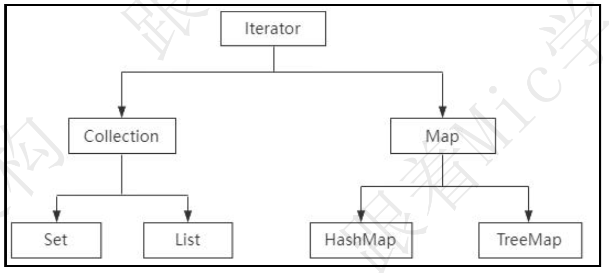
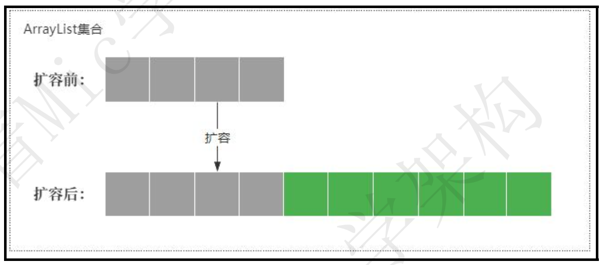
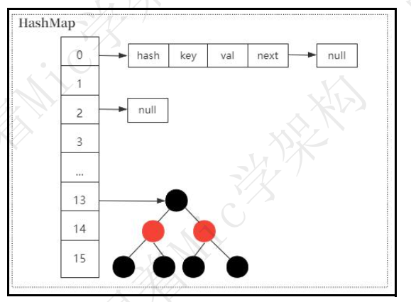

### HashMap啥时候扩容，为什么扩容

资料来源：[全网讲的最透彻的HashMap！HashMap啥时候扩容，为什么扩容？](https://www.toutiao.com/video/7121348879974564382/?from_scene=all)

#### 介绍：

“HashMap 啥时候扩容， 为什么扩容？ ”
这是一个针对 1 到 3 年左右 Java 开发人员的面试题，
问题本身不是很难， 但是对于这个阶段粉丝来说， 由于不怎么关注
所以会难住一部分同学。
HI， 大家好， 我是 Mic， 一个工作了 14 年的 Java 程序员。
下面我们分析一下这个问题专业解答。
在任何语言中， 我们希望在内存中临时存放一些数据， 可以用一些官方封装好的
集合比如 List、 HashMap、 Set 等等。 作为数据存储的容器  

当我们创建一个集合对象的时候， 实际上就是在内存中一次性申请一块内存空间。 
而这个内存空间大小是在创建集合对象的时候指定的。
比如 List 的默认大小是 10、 HashMap 的默认大小是 16。
在实际开发中， 我们需要存储的数据量往往大于存储容器的大小。
针对这种情况， 通常的做法就是扩容。
当集合的存储容量达到某个阈值的时候， 集合就会进行动态扩容， 从而更好的满
足更多数据的存储。
List 和 HashMap， 本质上都是一个数组结构， 所以基本上只需要新建一个更长
的数组然后把原来数组中的数据拷贝到新数组就行了。   

**以 HashMap 为例， 它是什么时候触发扩容以及扩容的原理是什么呢？**
当 HashMap 中元素个数超过临界值时会自动触发扩容， 这个临界值有一个计算
公式。
threashold=loadFactor*capacity。
loadFactor 的默认值是 0.75， capacity 的默认值是 16， 也就是元素个数达到 12
的时候触发扩容。
扩容后的大小是原来的 2 倍。
由于动态扩容机制的存在， 所以我们在实际应用中， 需要注意在集合初始化的时
候明确指定集合的大小。
避免频繁扩容带来性能上的影响。
假设我们要向 HashMap 中存储 1024 个元素， 如果按照默认值 16， 随着元素的
不断增加， 会造成 7 次扩容。 而这 7 次扩容需要重新创建 Hash 表， 并且进行数
据迁移， 对性能影响非常大。
**最后， 可能有些面试官会继续问， 为什么扩容因子是 0.75？**
扩容因子表示 Hash 表中元素的填充程度， 扩容因子的值越大， 那么触发扩容的
元素个数更多， 虽然空间利用率比较高， 但是 hash 冲突的概率会增加。  

扩容因子的值越小， 触发扩容的元素个数就越少， 也意味着 hash 冲突的概率减少， 但是对内存空间的浪费就比较多， 而且还会增加扩容的频率。

因此， 扩容因子的值的设置， 本质上就是在 冲突的概率 以及 空间利用率之间的平衡。
0.75 这个值的来源， 和统计学里面的泊松分布有关。

我们知道， HashMap 里面采用链式寻址法来解决 hash 冲突问题， 为了避免链表过长带来时间复杂度的增加所以链表长度大于等于 7 的时候， 就会转化为红黑 树， 提升检索效率  

当扩容因子在 0.75 的时候， 链表长度达到 8 的可能性几乎为 0， 也就是比较好
的达到了空间成本和时间成本的平衡。
以上就是关于这个问题的完整理解。
在面试的时候， 我们可以这么回答。
当 HashMap 元素个数达到扩容阈值， 默认是 12 的时候， 会触发扩容。
默 认 扩 容 的 大 小 是 原 来 数 组 长 度 的 2 倍 ， HashMap 的 最 大 容 量 是
Integer.MAX_VALUE， 也就是 2 的 31 次方-1。  

### HashMap 是如何解决 hash 冲突的？  

资料来源：[【Java】Java工作0到3年大必问题，HashMap是如何解决hash冲突的](https://www.toutiao.com/video/7103415128325882399/?app=news_article&timestamp=1664958643&group_id=7103415128325882399&share_token=DB985399-9F65-47BF-A90A-14886772C090&tt_from=weixin&utm_source=weixin&utm_medium=toutiao_ios&utm_campaign=client_share&wxshare_count=1&source=m_redirect)

好的， 这个问题我需要从几个方面来回答。
首先， HashMap 底层采用了数组的结构来存储数据元素， 数组的默认长度是 16，当我们通过 put 方法添加数据的时候， HashMap 根据 Key 的 hash 值进行取模运算。
最终保存到数组的指定位置。
但是这种设计会存在 hash 冲突问题， 也就是两个不同 hash 值的 key， 最终取模后会落到同一个数组下标。

所以 HashMap 引入了链式寻址法来解决 hash 冲突问题， 对于存在冲突的 key，HashMap 把这些 key 组成一个单向链表  

然后采用尾插法把这个 key 保存到链表的尾部。

另外， 为了避免链表过长的问题， 当链表长度大于 8 并且数组长度大于等于 64
的时候， HashMap 会把链表转化为红黑树。
从而减少链表数据查询的时间复杂度问题， 提升查询性能  

最后， 我再补充一下， 解决 hash 冲突问题的方法有很多， 比如
再 hash 法， 就是如果某个 hash 函数产生了冲突， 再用另外一个 hash 进行计算，
比如布隆过滤器就采用了这种方法。  

开放寻址法， 就是直接从冲突的数组位置往下寻找一个空的数组下标进行数据存
储， 这个在 ThreadLocal 里面有使用到。
建立公共溢出区， 也就是把存在冲突的 key 统一放在一个公共溢出区里面  

以上就是我对这个问题的理解。

### String、StringBuffer、StringBuilder区别  

资料来源：[【Java面试】String、StringBuffer、StringBuilder区别](https://www.toutiao.com/video/7107446899690603045/?from_scene=all)

嗯， 好的， 面试官。
关于 String、 StringBuffer、 StringBuilder 的区别， 我想从四个角度来说明。
**第一个， 可变性。**
String 内部的 value 值是 final 修饰的， 所以它是不可变类。 所以每次修改 String
的值， 都会产生一个新的对象。
StringBuffer 和 StringBuilder 是可变类， 字符串的变更不会产生新的对象。
**第二个， 线程安全性。**
String 是不可变类， 所以它是线程安全的。
StringBuffer 是线程安全的， 因为它每个操作方法都加了 synchronized 同步关键
字。
StringBuilder 不是线程安全的， 所以在多线程环境下对字符串进行操作， 应该使
用 StringBuffer， 否则使用 StringBuilder
**第三个， 性能方面。**
String 的性能是最的低的， 因为不可变意味着在做字符串拼接和修改的时候， 需
要重新创建新的对象以及分配内存。
其次是 StringBuffer 要比 String 性能高， 因为它的可变性使得字符串可以直接被
修改最后是 StringBuilder， 它比 StringBuffer 的性能高， 因为 StringBuffer 加了
同步锁。
**第四个， 存储方面。**
String 存储在字符串常量池里面
StringBuffer 和 StringBuilder 存储在堆内存空间。  