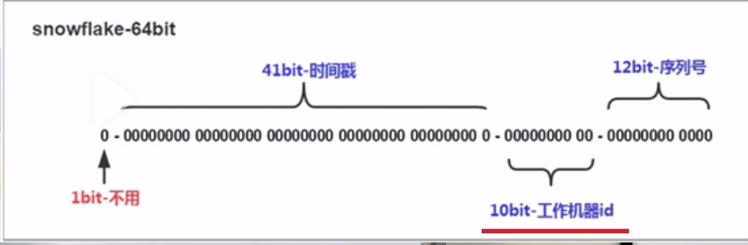
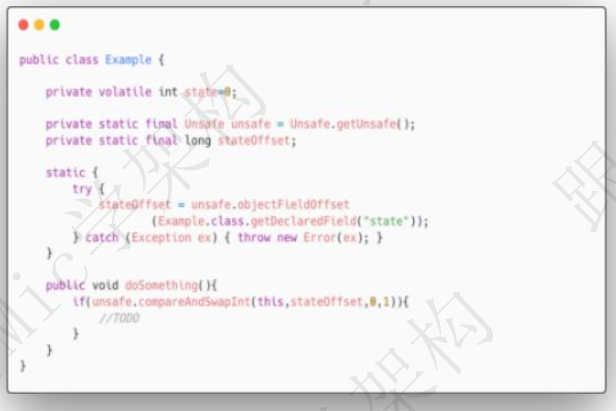

### ArrayList的自动扩容机制的实现原理

资料来源：[ArrayList的自动扩容机制的实现原理](https://www.toutiao.com/video/7108970586155516423/)

ArrayList 是一个数组结构的存储容器， 默认情况下， 数组的长度是 10. 
当然我们也可以在构建 ArrayList 对象的时候自己指定初始长度。 
随着在程序里面不断的往ArrayList中添加数据， 当添加的数据达到10个的时候， 
ArrayList 就没有多余容量可以存储后续的数据。 
这个时候 ArrayList 会自动触发扩容。 
扩容的具体流程很简单： 
首先， 创建一个新的数组， 这个新数组的长度是原来数组长度的 1.5 倍。 
然后使用 Arrays.copyOf 方法把老数组里面的数据拷贝到新的数组里面。 
扩容完成后再把当前要添加的元素加入到新的数组里面， 从而完成动态扩容的过程 

### HashMap啥时候扩容，为什么扩容

资料来源：[全网讲的最透彻的HashMap！HashMap啥时候扩容，为什么扩容？](https://www.toutiao.com/video/7121348879974564382/?from_scene=all)

#### 介绍：

“HashMap 啥时候扩容， 为什么扩容？ ”
这是一个针对 1 到 3 年左右 Java 开发人员的面试题，
问题本身不是很难， 但是对于这个阶段粉丝来说， 由于不怎么关注
所以会难住一部分同学。
HI， 大家好， 我是 Mic， 一个工作了 14 年的 Java 程序员。
下面我们分析一下这个问题专业解答。
在任何语言中， 我们希望在内存中临时存放一些数据， 可以用一些官方封装好的
集合比如 List、 HashMap、 Set 等等。 作为数据存储的容器  

当我们创建一个集合对象的时候， 实际上就是在内存中一次性申请一块内存空间。 
而这个内存空间大小是在创建集合对象的时候指定的。
比如 List 的默认大小是 10、 HashMap 的默认大小是 16。
在实际开发中， 我们需要存储的数据量往往大于存储容器的大小。
针对这种情况， 通常的做法就是扩容。
当集合的存储容量达到某个阈值的时候， 集合就会进行动态扩容， 从而更好的满
足更多数据的存储。
List 和 HashMap， 本质上都是一个数组结构， 所以基本上只需要新建一个更长
的数组然后把原来数组中的数据拷贝到新数组就行了。   

**以 HashMap 为例， 它是什么时候触发扩容以及扩容的原理是什么呢？**
当 HashMap 中元素个数超过临界值时会自动触发扩容， 这个临界值有一个计算
公式。
threashold=loadFactor*capacity。
loadFactor 的默认值是 0.75， capacity 的默认值是 16， 也就是元素个数达到 12
的时候触发扩容。
扩容后的大小是原来的 2 倍。
由于动态扩容机制的存在， 所以我们在实际应用中， 需要注意在集合初始化的时
候明确指定集合的大小。
避免频繁扩容带来性能上的影响。
假设我们要向 HashMap 中存储 1024 个元素， 如果按照默认值 16， 随着元素的
不断增加， 会造成 7 次扩容。 而这 7 次扩容需要重新创建 Hash 表， 并且进行数
据迁移， 对性能影响非常大。

**最后， 可能有些面试官会继续问， 为什么扩容因子是 0.75？**
扩容因子表示 Hash 表中元素的填充程度， 扩容因子的值越大， 那么触发扩容的
元素个数更多， 虽然空间利用率比较高， 但是 hash 冲突的概率会增加。  

扩容因子的值越小， 触发扩容的元素个数就越少， 也意味着 hash 冲突的概率减少， 但是对内存空间的浪费就比较多， 而且还会增加扩容的频率。

因此， 扩容因子的值的设置， 本质上就是在 冲突的概率 以及 空间利用率之间的平衡。
0.75 这个值的来源， 和统计学里面的泊松分布有关。

我们知道， HashMap 里面采用链式寻址法来解决 hash 冲突问题， 为了避免链表过长带来时间复杂度的增加所以链表长度大于等于 7 的时候， 就会转化为红黑 树， 提升检索效率  

当扩容因子在 0.75 的时候， 链表长度达到 8 的可能性几乎为 0， 也就是比较好
的达到了空间成本和时间成本的平衡。
以上就是关于这个问题的完整理解。
在面试的时候， 我们可以这么回答。
当 HashMap 元素个数达到扩容阈值， 默认是 12 的时候， 会触发扩容。
默 认 扩 容 的 大 小 是 原 来 数 组 长 度 的 2 倍 ， HashMap 的 最 大 容 量 是
Integer.MAX_VALUE， 也就是 2 的 31 次方-1。  

### HashMap 是如何解决 hash 冲突的？  

资料来源：[【Java】Java工作0到3年大必问题，HashMap是如何解决hash冲突的](https://www.toutiao.com/video/7103415128325882399/?app=news_article&timestamp=1664958643&group_id=7103415128325882399&share_token=DB985399-9F65-47BF-A90A-14886772C090&tt_from=weixin&utm_source=weixin&utm_medium=toutiao_ios&utm_campaign=client_share&wxshare_count=1&source=m_redirect)

好的， 这个问题我需要从几个方面来回答。
首先， HashMap 底层采用了数组的结构来存储数据元素， 数组的默认长度是 16，当我们通过 put 方法添加数据的时候， HashMap 根据 Key 的 hash 值进行取模运算。
最终保存到数组的指定位置。
但是这种设计会存在 hash 冲突问题， 也就是两个不同 hash 值的 key， 最终取模后会落到同一个数组下标。

所以 HashMap 引入了链式寻址法来解决 hash 冲突问题， 对于存在冲突的 key，HashMap 把这些 key 组成一个单向链表  

然后采用尾插法把这个 key 保存到链表的尾部。

另外， 为了避免链表过长的问题， 当链表长度大于 8 并且数组长度大于等于 64
的时候， HashMap 会把链表转化为红黑树。
从而减少链表数据查询的时间复杂度问题， 提升查询性能  

最后， 我再补充一下， 解决 hash 冲突问题的方法有很多， 比如
再 hash 法， 就是如果某个 hash 函数产生了冲突， 再用另外一个 hash 进行计算，
比如布隆过滤器就采用了这种方法。  

开放寻址法， 就是直接从冲突的数组位置往下寻找一个空的数组下标进行数据存
储， 这个在 ThreadLocal 里面有使用到。
建立公共溢出区， 也就是把存在冲突的 key 统一放在一个公共溢出区里面  

 

### 说说你对一致性Hash算法的理解

资料来源：[说说你对一致性Hash算法的理解](https://www.toutiao.com/video/7107801038064878111/)

一致性 hash， 是一种比较特殊的 hash 算法， 它的核心思想是解决在分布式环境下，hash 表中可能存在的动态扩容和缩容的问题。 
一般情况下， 我们会使用 hash 表的方式以 key-value 的方式来存储数据， 但是当数据量比较大的时候， 我们就会把数据存储到多个节点上， 然后通过 hash 取模的方法来决定当前 key 存储到哪个节点上。 

 
这种方式有一个非常明显的问题， 就是当存储节点增加或者减少的时候， 原本的映射关系就会发生变化。 
也就是需要对所有数据按照新的节点数量重新映射一遍， 这个涉及到大量的数据迁移和重新映射， 迁移代价很大。 
而一致性 hash 就是用来优化这种动态变化场景的算法， 它的具体工作原理也很简单。 
首先， 一致性 Hash 是通过一个 Hash 环的数据结构来实现的， 这个环的起点是0， 终点是 2^32-1。 
也就是这个环的数据分布范围是[0,2^32-1]。 

 

### String、StringBuffer、StringBuilder区别  

资料来源：[【Java面试】String、StringBuffer、StringBuilder区别](https://www.toutiao.com/video/7107446899690603045/?from_scene=all)

嗯， 好的， 面试官。
关于 String、 StringBuffer、 StringBuilder 的区别， 我想从四个角度来说明。 
**第一个， 可变性。** 
String 内部的 value 值是 final 修饰的， 所以它是不可变类。 所以每次修改 String
的值， 都会产生一个新的对象。

StringBuffer 和 StringBuilder 是可变类， 字符串的变更不会产生新的对象。 
**第二个， 线程安全性。** 
String 是不可变类， 所以它是线程安全的。

StringBuffer 是线程安全的， 因为它每个操作方法都加了 synchronized 同步关键字。

StringBuilder 不是线程安全的， 所以在多线程环境下对字符串进行操作， 应该使用 StringBuffer， 否则使用 StringBuilder 
**第三个， 性能方面。** 
String 的性能是最的低的， 因为不可变意味着在做字符串拼接和修改的时候， 需要重新创建新的对象以及分配内存。 

其次是 StringBuffer 要比 String 性能高， 因为它的可变性使得字符串可以直接被修改最后是 StringBuilder， 它比 StringBuffer 的高， 因为 StringBuffer 加了同步锁。 

**第四个， 存储方面。** 
String 存储在字符串常量池里面

StringBuffer 和 StringBuilder 存储在堆内存空间。 

### new String("abc")到底创建了几个对象？  
一个工作了 6 年的粉丝和我说，
最近面试感觉越来越难的， 基本上都会问技术底层原理， 甚至有些还会问到操作
系统层面的知识。
我说， 现在各个一线大厂有很多优秀的程序员毕业了， 再加上市场大环境不好对
程序员的需求量也在减少。
如果技术底子不好， 确实找工作会很困难。
今天分享的问题是： ”new String(“abc”)到底创建了几个对象？
关于这个问题， 看看普通人和高手的回答。  

#### 高手
好的， 面试官。
首先， 这个代码里面有一个 new 关键字， 这个关键字是在程序运行时， 根据已经加载的系统类 String， 在堆内存里面实例化的一个字符串对象。
然后， 在这个 String 的构造方法里面， 传递了一个“abc”字符串， 因为 String 里面的字符串成员变量是 final 修饰的， 所以它是一个字符串常量。
接下来， JVM 会拿字面量“abc”去字符串常量池里面试图去获取它对应的 String对象引用， 如果拿不到， 就会在堆内存里面创建一个”abc”的 String 对象
并且把引用保存到字符串常量池里面。
后续如果再有字面量“abc”的定义， 因为字符串常量池里面已经存在了字面量“abc”的引用， 所以只需要从常量池获取对应的引用就可以了， 不需要再创建。
所以， 对于这个问题， 我认为的答案是

- 如果 abc 这个字符串常量不存在， 则创建两个对象， 分别是 abc 这个字符串常量，以及 new String 这个实例对象。
-   如果 abc 这字符串常量存在， 则只会创建一个对象  

 

###  并行和并发有什么区别？

资料来源：[并行和并发有什么区别？](https://www.toutiao.com/video/7131254022421676581/?from_scene=all)

并行和并发是Java并发编程里面的概念。 
并行，是指在多核CPU架构下，同一时刻同时可以执行多个线程的能力。 
在单核CPU架构中，同一时刻只能运行一个线程。 
在4核4线程的CPU架构中，同一时刻可以运行4个线程，那这4个线程就是并行执行的。 
并发，是指在同一时刻CPU能够处理的任务数量，也可以理解成CPU的并发能力。 
在单核CPU架构中，操作系统通过CPU时间片机制提升CPU的并发能力。 
在多核CPU架构中，基于任务的并行执行能力以及CPU时间片切换的能力来提升CPU的并发能力。 
所以，总的来说，并发是一个宏观概念，它指的是CPU能够承载的压力大小，并行是一个微观概念，它描述CPU同时执行多个任务的能力。 

 

### 什么是幂等、如何解决幂等性问题

资料来源：[什么是幂等、如何解决幂等性问题](https://www.toutiao.com/video/7094827047691911688/?from_scene=all)

所谓幂等， 其实它是一个数学上的概念， 在计算机编程领域中， 幂等是指一个方法被多次重复执行的时候产生的影响和第一次执行的影响相同。 
之所以要考虑到幂等性问题， 是因为在网络通信中， 存在两种行为可能会导致接口被重复执行。 
用户的重复提交或者用户的恶意攻击， 导致这个请求会被多次重复执行。 
在分布式架构中， 为了避免网络通信导致的数据丢失， 在服务之间进行通信的时候都会设计超时重试的机制， 而这种机制有可能导致服务端接口被重复调用。
所以在程序设计中， 对于数据变更类操作的接口， 需要保证接口的幂等性。 
而幂等性的核心思想， 其实就是保证这个接口的执行结果只影响一次， 后续即便再次调用， 也不能对数据产生影响， 所以基于这样一个诉求， 常见的解决方法有
很多。 
 
使用数据库的唯一约束实现幂等， 比如对于数据插入类的场景， 比如创建订单，因为订单号肯定是唯一的， 所以如果是多次调用就会触发数据库的唯一约束异常，
从而避免一个请求创建多个订单的问题。 
使用 redis 里面提供的 setNX 指令， 比如对于 MQ 消费的场景， 为了避免 MQ 重复消费导致数据多次被修改的问题， 可以在接受到 MQ 的消息时， 把这个消息 
通过 setNx 写入到 redis 里面， 一旦这个消息被消费过， 就不会再次消费。 
使用状态机来实现幂等， 所谓的状态机是指一条数据的完整运行状态的转换流程， 
比如订单状态， 因为它的状态只会向前变更， 所以多次修改同一条数据的时候，一旦状态发生变更， 那么对这条数据修改造成的影响只会发生一次。 
当然， 除了这些方法以外， 还可以基于 token 机制、 去重表等方法来实现， 但是不管是什么方法， 无非就是两种， 
要么就是接口只允许调用一次， 比如唯一约束、 基于 redis 的锁机制。 
要么就是对数据的影响只会触发一次， 比如幂等性、 乐观锁 

### SimpleDateFormat 是线程安全的吗?为什么

资料来源：[SimpleDateFormat 是线程安全的吗?为什么](https://www.toutiao.com/video/7127459299298640398/?from_scene=all)

SimpleDateFormat 不是线程安全的， 
SimpleDateFormat 类内部有一个 Calendar 对象引用, 
它用来储存和这个 SimpleDateFormat 相关的日期信息。 
当我们把 SimpleDateFormat 作为多个线程的共享资源来使用的时候。 
意味着多个线程会共享 SimpleDateFormat 里面的 Calendar 引用， 
多个线程对于同一个 Calendar 的操作， 会出现数据脏读现象导致一些不可预料的错误。 
在实际应用中， 我认为有 4 种方法可以解决这个问题。 
第一种， 把 SimpleDateFormat 定义成局部变量， 每个线程调用的时候都创建一个新的实例。 
第二种， 使用 ThreadLocal 工具， 把 SimpleDateFormat 变成线程私有的 
第三种， 加同步锁， 在同一时刻只允许一个线程操作 SimpleDateFormat 
第四种， 在 Java8 里面引入了一些线程安全的日期 API， 比如 LocalDateTimer、DateTimeFormatter 等。 

### 谈谈雪花算法

解决唯一性问题？

> UUID 
Redis的原子递增 
数据库的全局表的自增的id 

还需要满足

> 有序递增  
高性能 
高可用 
带时间戳 

而雪花算法就是一个比较符合这些特征的全局唯一算法

**回答**

雪花算法是一种生成分布式全局ID的一种算法，它会得到一个64位长度的Long类型的数据，其中这64位的数据。由四个部分组成，第一个Bit位是一个符号位，因为id不会是负数，所以它一般都是0。接着他用41个bit位来表示毫秒单位的时间戳，再用10个bit位来表示机器的id。最后用12个bit位置来表示递增的序列号。然后把这64个bit位拼接成一个long类型的数字，这就是雪花算法的一个实现

### 并发编程面试请你谈一下CAS机制？

资料来源：[并发编程面试请你谈一下CAS机制？](https://www.toutiao.com/video/7077490308761682469/?from_scene=all)

一个小伙伴私信我， 他说遇到了一个关于 CAS 机制的问题， 他以为面试官问的
是 CAS 实现单点登录。
心想， 这个问题我熟啊， 然后就按照单点登录的思路去回答， 结果面试官一直摇
头。
他来和我说， 到了面试结束都没明想白自己回答这么好， 怎么就没有当场给我发
offer 呢？
实际上， 面试官问的是并发编程中的 CAS 机制。
下面我们来看看普通人和高手对于 CAS 机制的回答吧  

### 普通人
CAS， 是并发编程中用来实现原子性功能的一种操作， 嗯， 它类似于一种乐观锁的机制， 可以保证并发情况下对共享变量的值的更改的原子性。嗯， 像 AtomicInteger 这个类中， 就用到了 CAS 机制。 嗯…  

#### 高手  

CAS 是 Java 中 Unsafe 类里面的方法， 它的全称是 CompareAndSwap， 比较并交换的意思。 它的主要功能是能够保证在多线程环境下， 对于共享变量的修改的原子性。
我来举个例子， 比如说有这样一个场景， 有一个成员变量 state， 默认值是 0，定义了一个方法 doSomething()， 这个方法的逻辑是， 判断 state 是否为 0， 如果为 0， 就修改成 1。
这个逻辑看起来没有任何问题， 但是在多线程环境下， 会存在原子性的问题， 因为这里是一个典型的， Read-Write 的操作。
一般情况下， 我们会在 doSomething()这个方法上加同步锁来解决原子性问题。  

但是， 加同步锁， 会带来性能上的损耗， 所以， 对于这类场景， 我们就可以使用CAS 机制来进行优化这个是优化之后的代码
在 doSomething()方法中， 我们调用了 unsafe 类中的 compareAndSwapInt()方法来达到同样的目的， 这个方法有四个参数，
分别是： 当前对象实例、 成员变量 state 在内存地址中的偏移量、 预期值 0、 期望更改之后的值 1。
CAS 机制会比较 state 内存地址偏移量对应的值和传入的预期值 0 是否相等， 如果相等， 就直接修改内存地址中 state 的值为 1.否则， 返回 false， 表示修改失败， 而这个过程是原子的， 不会存在线程安全问题。  

CompareAndSwap 是一个 native 方法， 实际上它最终还是会面临同样的问题，就是先从内存地址中读取 state 的值， 然后去比较， 最后再修改。这个过程不管是在什么层面上实现， 都会存在原子性问题。所以呢， CompareAndSwap 的底层实现中， 在多核 CPU 环境下， 会增加一个Lock 指令对缓存或者总线加锁， 从而保证比较并替换这两个指令的原子性。
CAS 主要用在并发场景中， 比较典型的使用场景有两个。
第一个是 J.U.C 里面 Atomic 的原子实现， 比如 AtomicInteger， AtomicLong。
第 二 个 是 实 现 多 线 程 对 共 享 资 源 竞 争 的 互 斥 性 质 ， 比 如 在 AQS 、
ConcurrentHashMap、 ConcurrentLinkedQueue 等都有用到。以上就是我对这个问题的理解。
结尾
最近大家也发现了我的视频内容在高手回答部分的变化。
有些小伙伴说， 你面试怎么还能带图来， 明显作弊啊  

### IO 和 NIO 有什么区别？

资料来源：[IO 和 NIO 有什么区别？](https://www.toutiao.com/video/7094163029717156383/?from_scene=all)

IO 问题一直是面试的重灾区之一
但又是非常重要而且面试必问的知识点
一个工作了 7 年的粉丝私信我， 他去面试了 4 家互联网公司，  

有三个公司问他网络 IO 的问题， 另外一个公司问了 Netty， 结果都没回答上来。
好吧， 对于“IO 和 NIO 的区别”， 看看普通人和高手的回答。

#### 高手

好的， 关于这个问题， 我会从下面几个方面来回答。
首先， I/O， 指的是 IO 流， 它可以实现数据从磁盘中的读取以及写入。
实际上， 除了磁盘以外， 内存、 网络都可以作为 I/O 流的数据来源和目的地。
在 Java 里面， 提供了字符流和字节流两种方式来实现数据流的操作。
其次， 当程序是面向网络进行数据的 IO 操作的时候， Java 里面提供了 Socket的方式来实现。
通过这种方式可以实现数据的网络传输。
基于 Socket 的 IO 通信， 它是属于阻塞式 IO， 也就是说， 在连接以及 IO 事件未就绪的情况下， 当前的连接会处于阻塞等待的状态  

如果一旦某个连接处于阻塞状态， 那么后续的连接都得等待。 所以服务端能够处理的连接数量非常有限。
NIO， 是 JDK1.4 里面新增的一种 NEW IO 机制， 相比于传统的 IO， NIO 在效率上做了很大的优化， 并且新增了几个核心组件。
Channel、 Buffer、 Selectors。另外， 还提供了非阻塞的特性， 所以， 对于网络 IO 来说， NIO 通常也称为No-Block IO， 非阻塞 IO。也就是说， 通过 NIO 进行网络数据传输的时候， 如果连接未就绪或者 IO 事件未就绪的情况下， 服务端不会阻塞当前连接， 而是继续去轮询后续的连接来处理。所以在 NIO 里面， 服务端能够并行处理的链接数量更多  

因此， 总的来说， IO 和 NIO 的区别， 站在网络 IO 的视角来说， 前者是阻塞 IO，后者是非阻塞 IO。
以上就是我对这个问题的理解。

#### 面试点评
在互联网时代， 网络 IO 是最基础的技术  

无论是微服务架构中的服务通信、 还是应用系统和中间件之间的网络通信。
都在体现网络 IO 的重要性。
好的， 本期的普通人 VS 高手面试系列的视频就到这里结束了，
如果你喜欢这个视频， 记得点赞和收藏。
如果想获得一对一的面试指导以及面试资料， 可以私信我。
我是 Mic， 一个工作了 14 年的 Java 程序员， 咱们下期再见  

### 月薪30k大厂面试真题： JDK动态代理为什么只能代理有接口的类？

[月薪30k大厂面试真题： JDK动态代理为什么只能代理有接口的类？](https://www.toutiao.com/video/7080466899552698910/?from_scene=all)

一个工作 5 年的 Java 程序员，去应聘得 物 APP 月薪 30k 的 Java 开发岗位。
被一个基础问题问得措手不及，这个问题是： JDK 动态代理为什么只能代理有接口的类。
这个问题在他的认知里面，是一个很正常的事情，竟然还有问什么？
好吧，对于这个问题，来看看普通人和高手的回答吧。
#### 普通人
嗯， 因为 JDK 里面的动态代理类，默认继承了 Proxy 类，Java 里面只能实现单一继承，所以没办法对类类做代理。
#### 高手
嗯，这个问题的核心本质，是 JDK 动态代理本身的机制来决定的(如图)。 
首先，在 Java 里面，动态代理是通过 Proxy.newProxyInstance()方法来实现的，它需要传入被动态代理的接口类。  

之所以要传入接口，不能传入类，还是取决于 JDK 动态代理的底层实现（如图）。 
JDK 动态代理会在程序运行期间动态生成一个代理类$Proxy0，这个动态生成的代理类会继承 java.lang.reflect.Proxy 类，同时还会实现被代理类的接口 IHelloService。 
在 Java 中，是不支持多重继承的。而每个动态代理类都会继承 Proxy 类（这也是 JDK动态代理的实现规范），所以就导致 JDK 里面的动态代理只能代理接口，而不能代理实现类。(注意，下面这张图片展示的时候，上面的图片仍然保存在一个画面里面)  

我分析过动态代理的源码，发现 Proxy 这个类只是保存了动态代理的处理器InvocationHandler，如果不抽出来，直接设置到$Proxy0 动态代理类里面，也是可以的。 
如果这么做，就可以针对实现类来做动态代理了。作者为什么这么设计，我认为有几个方面的原因。

> 1. 动态代理本身的使用场景或者需求，只是对原始实现的一个拦截，然后去做一些功能的增强或者扩展。而实际的开发模式也都是基于面向接口来开发，所以基于接口来实现动态代理，从需求和场景都是吻合的。当然确实可能存在有些类没有实现接口的，那这个时候，JDK 动态代理确实无法满足。
>
> 2. 在 Java 里面，类的继承关系的设计，更多的是考虑到共性能力的抽象，从而提高代码的重用性和扩展性，而动态代理也是在做这样一个事情，它封装了动态代理类生成的抽象逻辑、判断一个类是否是动态代理类、InvocationHandler 的持有等等，那么把这些抽象的公共逻辑放在 Proxy 这个父类里面，很显然是一个比较正常的设计思路。总的来说，我认为这个设计上并没有什么特别值得讨论的地方，因为我认为技术方案的设计是解决特定场景问题的。如果一定要针对普通类来做动态代理，可以选择 cglib 这个组件，它会动态生成一个被代理类的子类，子类重写了父类中所有非 final 修饰的方法，在子类中拦截父类的所有方法调用从而实现动态代理。

以上就是我对于这个问题的理解！

#### 结尾
我看到评论区有些小伙伴说面试问这些问题没有任何意义。 
我作为一个工作了 14 年，做过开发、架构的程序员，最大的感受是越往上走，对于计算机基础以及底层知识的理解越来越重要。上层的应用框架可能会随着业务的发展发生变化，但是底层的技术原理和设计理念是不会变化的。 
所以，我认为，掌握了基础，就能够以不变应对万变。 
(如图)从另外一个角度来说，大家都停留在业务框架的使用上，短期能带来较大的收益，但是随着生产工具的升级，比如人工智能、低代码、零代码、saas、paas 逐步成熟落地，那业务程序员的价值会被逐步弱化。   

这就像曾经的工业革命，工业革命之前手工劳作不管效率多高，技巧多么熟练，一旦由机器来取代，那传统的手工劳动力必然会被淘汰，伴随而来的就是技能的升级-从传统手工劳作转向了面向机器的操作。 
所以，我认为底层逻辑还是对一个事物本质的认识，而不是停留在表面！ 
好的，本期的普通人 VS 高手面试系列的视频就到这里结束了，喜欢的朋友记得点赞和收藏。 
我是 Mic，咱们下期再见。  

### Java 反射的优缺点？  

[【Java面试】这么回答面试官都得另眼相看，Java反射的优缺点？](https://www.toutiao.com/video/7153900735137546766/?channel=&source=search_tab)

请你 Java 反射的优缺点？”
这是一个工作了 5 年的同学，去阿里面试第一面遇到的问题。
今天这个视频给大家分享一下我们遇到这个问题该怎么回答，才能获得面试官的认可。
#### 问题分析
反射是 Java 语言里面比较重要的一个特征。 
它能够在程序运行的过程中去构造任意一个类对象、并且可以获取任意一个类的成员变量、成员方法、属性，以及调用任意一个对象的方法。 
通过反射的能力，可以让 Java 语言支持动态获取程序信息以及动态调用方法的能力。 
在 Java 里面，专门有一个 java.lang.reflect 用来实现反射相关的类库，包括 Construct、Field、Method 等类，分别用来获取类的构造方法、成员变量、方法信息。 
反射的使用场景还挺多的，比如在动态代理的场景中，使用动态生成的代理类来提升代码的复用性。 
在 Spring 框架中，有大量用到反射，比如用反射来实例化 Bean 对象。 

#### 高手回答
好的，
Java 反射的优点：

>  增加程序的灵活性，可以在运行的过程中动态对类进行修改和操作 
>  提高代码的复用率，比如动态代理，就是用到了反射来实现 
>  可以在运行时轻松获取任意一个类的方法、属性，并且还能通过反射进行动态调用 

Java 反射的缺点：
> 反射会涉及到动态类型的解析，所以 JVM 无法对这些代码进行优化，导致性能要比非反射调用更低。 
> 使用反射以后，代码的可读性会下降 
> 反射可以绕过一些限制访问的属性或者方法，可能会导致破坏了代码本身的抽象性 

总结
好的，今天的视频就到这里了
喜欢我作品的同学记得转发、收藏、点赞
我是咕泡科技联合创始人 Mic，咱们下期再见。  