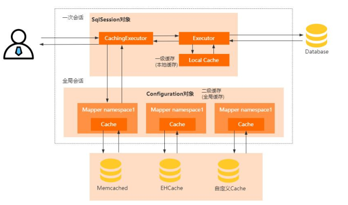
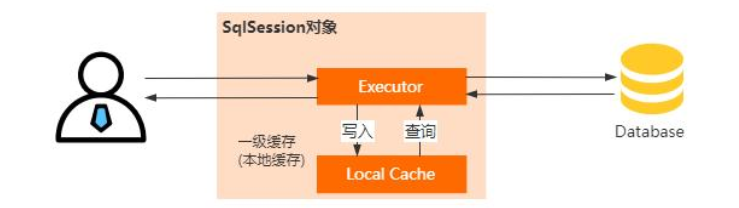
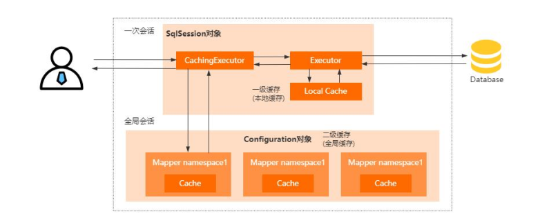
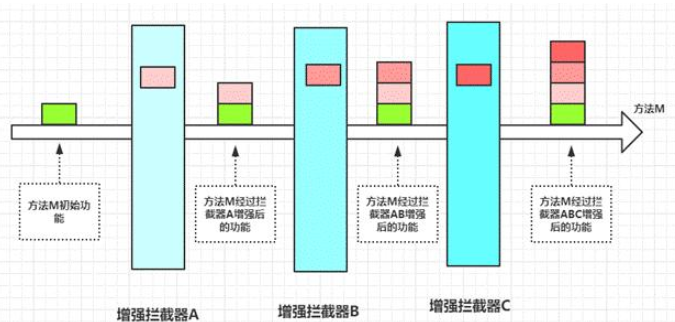
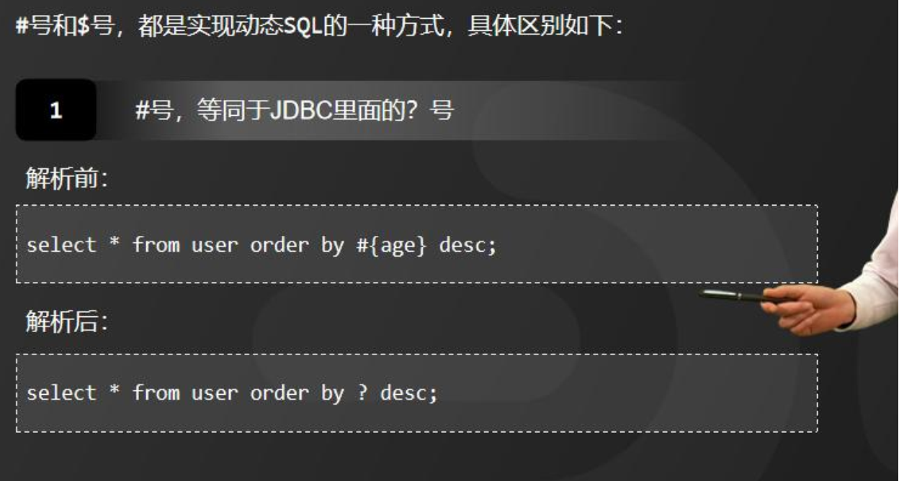
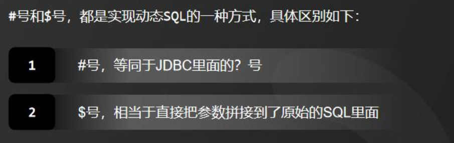

### 那你说说Mybatis里面的缓存机制吧?

资料来源：[那你说说Mybatis里面的缓存机制吧?](https://www.toutiao.com/video/7087139756894585357/?from_scene=all)

昨天一个工作了 4 年的粉丝去面试，被问到 Mybatis 里面的缓存机制时，哆嗦了半天没回答上来。<br/>

然后回来就在群里面抱怨面试太卷了，实际上，Mybatis 多级缓存在开发中是会用到的一个功能，如果这个部分没弄清楚。<br/>

可能会出现一些莫名其妙的问题，最后又得通过百度帮你解决，个人能力还是没有提升。我之前给大家分享的 20W 字的面试文档里面也有这个问题的标准回答，短期面试突击的话还是可以去看一下，具体可以在评论区的置顶中领取。<br/>

#### 回答正题，
（如图）Mybatis 里面设计的二级缓存是用来提升数据的检索效率，避免每次数据的访问都需要去查询数据库。<br/>

一级缓存，是 SqlSession 级别的缓存，也叫本地缓存，因为每个用户在执行查询的时候都需要使用 SqlSession 来执行，为了避免每次都去查数据库，Mybatis 把查询出来的数据保存到 SqlSession 的本地缓存中，后续的 SQL 如果命中缓存，就可以直接从本地缓存读取了。
如果想要实现跨 SqlSession 级别的缓存？那么一级缓存就无法实现了，因此在Mybatis 里面引入了二级缓存，就是当多个用户在查询数据的时候，只有有任何一个 SqlSession 拿到了数据就会放入到二级缓存里面，其他的 SqlSession 就可以从二级缓存加载数据。  <br/>



(如图）一级缓存的具体实现原理是：<br/>
在 SqlSession 里面持有一个 Executor，每个 Executor 中有一个 LocalCache 对象。当用户发起查询的时候，Mybatis 会根据执行语句在 Local Cache 里面查询，如果没命中，再去查询数据库并写入到 LocalCache，否则直接返回。<br/>

所以，以及缓存的生命周期是 SqlSessiion，而且在多个 Sqlsession 或者分布式环境下，可能会导致数据库写操作出现脏数据。  <br/>




（如图）二级缓存的具体实现原理是：<br/>
使用 CachingExecutor 装饰了 Executor，所以在进入一级缓存的查询流程之前，会先通过 CachingExecutor 进行二级缓存的查询 。<br/>

开启二级缓存以后，会被多个 SqlSession 共享，所以它是一个全局缓存。因此它的查询流程是先查二级缓存，再查一级缓存，最后再查数据库。另外，MyBatis 的二级缓存相对于一级缓存来说，实现了 SqlSession 之间缓存数据的共享，同时缓存粒度也能够到 namespace 级别，并且还可以通过 Cache 接口实现类不同的组合，对 Cache 的可控性也更强。  <br/>




二级缓存的设计思想非常常见，比如 Nacos、Eureka 都用到了，学习这块的思想有助于提升解决问题的能力。
好了，今天的分享就到这里，在面试的时候大家还有遇到哪些比较难的问题，欢迎在评论区留言  <br/>

<hr/>


### Mybatis是如何进行分页的

资料来源：[Mybatis是如何进行分页的](https://www.toutiao.com/video/7137869607662158350/?from_scene=all)

“Mybatis 是如何进行分页的”？<br/>
这是一个工作了 3 年的同学，在面试的时候遇到的问题。<br/>
Hi，大家好，我是 Mic，一个工作了 14 年的 Java 程序员。<br/>
下面我们来分析一下面试官对于这个问题的考察意图。<br/>

#### 考察目标
Mybatis 是 Java 应用开发的基础框架，而分页又是我们实时都在使用的功能。<br/>

因此，在我看来，一方面考察的是求职者对 Mybatis 框架的使用能力<br/>

另一方面，以此为切入点去深度挖掘 Mybatis 里面更多的问题，从而了解求职者对它的理解深度。<br/>

这道题考察难度不大，主要考察 1-3 年 Java 开发经验的同学。<br/>
问题解析<br/>
数据进行分页是最基础的功能，一般可以把分页分成两类：<br/>

- 逻辑分页，先查询出所有的数据缓存到内存，再根据业务相关需求，从内存数据中筛选出合适的数据进行分页。 <br/>
  
- 物理分页 ，直接利用数据库支持的分页语法来实现，比如 Mysql 里面提供了分页关键词 Limit<br/>
  Mybatis 提供了四种分页方式：<br/>
  
- 在 Mybatis Mapper 配置文件里面直接写分页 SQL，这种方式比较灵活，实现也简单。<br/>
  
- RowBounds 实现逻辑分页，也就是一次性加载所有符合查询条件的目标数据，根
  据分页参数值在内存中实现分页。  <br/>

当然，在数据量比较大的情况下，JDBC 驱动本身会做一些优化，也就是不会把所有结果存储在 ResultSet 里面，<br/>
而是只加载一部分数据，再根据需求去数据库里面加载。<br/>
这种方式不适合数据量较大的场景，而且有可能会频繁访问数据库造成比较大的压力。<br/>

- Interceptor 拦截器实现，通过拦截需要分页的 select 语句，然后在这个 sql 语句里面动态拼接分页关键字，从而实现分页查询。
  （如图）Interceptor 是 Mybatis 提供的一种针对不同生命周期的拦截器，比如：<br/>
  
- 拦截执行器方法<br/>

- 拦截参数的处理<br/>

- 拦截结果集的处理<br/>

- 拦截 SQL 语法构建的处理<br/>

我们可以拦截不同阶段的处理，来实现 Mybatis 相关功能的扩展  <br/>




这种方式的好处，就是可以提供统一的处理机制，不需要我们再单独去维护分页相关的功能。<br/>

- 插件（PageHelper）及（MyBaits-Plus、tkmybatis）框架实现这些插件本质上也是使用 Mybatis 的拦截器来实现的。<br/>
  只是他们帮我们实现了扩展和封装，节省了分页扩展封装的工作量，在实际开发中，只需要拿来即用即可。  <br/>

总结一下，对于任何 ORM 框架，分页的实现逻辑无外乎两种，不管怎么包装，最终给到开发者的，只是使用上的差异而已。<br/>
那么，我们来看看高手该如何回答。<br/>

#### 高手回答
好的。<br/>
我认为有三种方式来实现分页：<br/>

- 第一种，直接在 Select 语句上增加数据库提供的分页关键字，然后在应用程序里面传递当前页，以及每页展示条数即可。 <br/>
  
- 第二种，使用 Mybatis 提供的 RowBounds 对象，实现内存级别分页。<br/>

- 第三种，基于 Mybatis 里面的 Interceptor 拦截器，在 select 语句执行之前动态拼接分页关键字。<br/>

以上就是我的理解。<br/>
**总结**<br/>
大家知道怎么回答了吗？<br/>
如果你喜欢我的作品，记得点赞收藏加关注哦<br/>
我是 Mic，咱们下期再见  <br/>

## 【Java面试】Mybatis里面#{}和${}的区别是什么
前几天，一位应届生去面试，被问到一个 MyBatis 中比较基础的问题，说 MyBatis 中的#号和$符号有什么区别？今天，我给大家来详细介绍一下。<br/>
另外，我花了 1 个多星期，准备了一份 10W 字的面试题解析配套文档，想获取的小伙伴可以从我的个人煮叶简介中找到。<br/>
（转场，屏幕黑底白字，正中央出现“1 两者区别”）<br/>

1、两者区别<br/>
Mybatis 提供到的#号和$号，都是实现动态 SQL 的一种方式，通过这两种方式把参数传递到 XML 之后，在执行操作之前，Mybatis 会对这两种占位符进行动态解析。 <br/>


下面我给家详细介绍一下#号和$号的区别，<br/>
首先，来看#号，等同于 JDBC 里面的？号（占位符）。  <br/>


它相当于向 PreparedStatement 预处理语句中设置参数，而 PreparedStatement 中的 SQL 语句是预编
译的，如果在设置的参数包含特殊字符，会自动进行转义。所以#号占位符可以防止 SQL 注入。  



比如：这样一段代码：  <br/>****

解析前：<br/>

```sql
select * from user order by #{age} desc;
```


解析后：<br/>

```sql
select * from user order by ? desc;  
```




所以$和#最大的区别在于，前者是动态参数，后者是占位符， 动态参数无法防止 SQL 注入的问题，所以在实际应用中，应该尽可能的使用#号占位符。<br/>
另外，$符号的动态传参，可以适合应用在一些动态 SQL 场景中，比如动态传递表名、动态设置排序字段等。  <br/>

**2、总结<br/>**
一些小的细节如果不注意，就有可能造成巨大的经济损失。在技术如此成熟的互联网时代，还是会有一些网站经常出现 SQL 注入导致信息泄露的问题。<br/>
【结尾】<br/>
以上就是我对 MyBatis 配置#号和$号的理解。我是被编程耽误的文艺 Tom，如果我的分享对你有帮助，请动动手指一键三连分享给更多的人。关注我，面试不再难！  <br/>