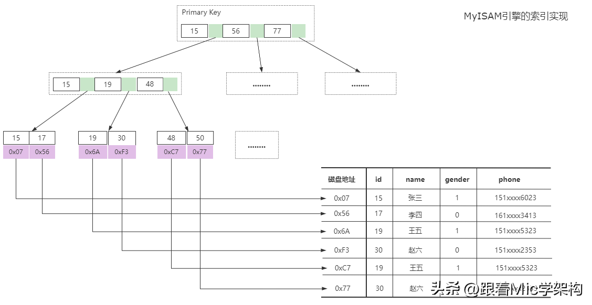

### 索引什么时候失效

资料来源：[索引什么时候失效](https://www.toutiao.com/video/7119682545981227534/?from_scene=all)

InnoDB 引擎里面有两种索引类型， 一种是主键索引、 一种是普通索引。 
InnoDB 用了 B+树的结构来存储索引数据。 
当使用索引列进行数据查询的时候， 最终会到主键索引树中查询对应的数据行进行返回。 
理论上来说， 使用索引列查询， 就能很好的提升查询效率， 但是不规范的使用会导致索引失效， 从而无法发挥索引本身的价值。 
导致索引失效的情况有很多： 
在索引列上做运算， 比如使用函数， Mysql 在生成执行计划的时候， 它是根据统计信息来判断是否要使用索引的。 
而在索引列上加函数运算， 导致 Mysql 无法识别索引列， 也就不会再走索引了。 
不过从 Mysql8 开始， 增加了函数索引可以解决这个问题。 
在一个由多列构成的组合索引中， 需要按照最左匹配法则， 也就是从索引的最左列开始顺序检索， 否则不会走索引。 
在组合索引中， 索引的存储结构是按照索引列的顺序来存储的， 因此在 sql 中也需要按照这个顺序才能进行逐一匹配。 
否则 InnoDB 无法识别索引导致索引失效。 
当索引列存在隐式转化的时候， 比如索引列是字符串类型， 但是在 sql 查询中没有使用引号。 
那么 Mysql 会自动进行类型转化， 从而导致索引失效在索引列使用不等于号、not 查询的时候， 由于索引数据的检索效率非常低， 因此 Mysql 引擎会判断不走
索引。 
使用`  like ` 通配符匹配后缀` %xxx ` 的时候， 由于这种方式不符合索引的最左匹配原则，所以也不会走索引。 
但是反过来， 如果通配符匹配的是前缀`  xxx%` ， 符合最左匹配， 也会走索引。 
使用` or `连接查询的时候， ` or ` 语句前后没有同时使用索引， 那么索引会失效。 只有` or `左右查询字段都是索引列的时候， 才会生效。 
除了这些场景以外， 对于多表连接查询的场景中， 连接顺序也会影响索引的使用。 
不过最终是否走索引， 我们可以使用 explain 命令来查看 sql 的执行计划， 然后针对性的进行调优即可 

### Mysql索引优点和缺点

资料来源：[Mysql索引优点和缺点](https://www.toutiao.com/video/7096306391794745892/)

索引， 是一种能够帮助 Mysql 高效从磁盘上检索数据的一种数据结构。
在 Mysql 中的 InnoDB 引擎中， 采用了 B+树的结构来实现索引和数据的存储

在我看来， Mysql 里面的索引的优点有很多 
通过 B+树的结构来存储数据， 可以大大减少数据检索时的磁盘 IO 次数， 从而提升数据查询的性能 
B+树索引在进行范围查找的时候， 只需要找到起始节点， 然后基于叶子节点的链表结构往下读取即可， 查询效率较高。 
通过唯一索引约束， 可以保证数据表中每一行数据的唯一性 
当然， 索引的不合理使用， 也会有带来很多的缺点。 
数据的增加、 修改、 删除， 需要涉及到索引的维护， 当数据量较大的情况下， 索引的维护会带来较大的性能开销 
一个表中允许存在一个聚簇索引和多个非聚簇索引， 但是索引数不能创建太多，否则造成的索引维护成本过高。 
创建索引的时候， 需要考虑到索引字段值的分散性， 如果字段的重复数据过多，创建索引反而会带来性能降低。 
在我看来， 任何技术方案都会有两面性， 大部分情况下， 技术方案的选择更多的是看中它的优势和当前问题的匹配度 

### Mysql为什么使用B+Tree作为索引结构？

资料来源：[Mysql为什么使用B+Tree作为索引结构？](https://www.toutiao.com/video/7091921684218774053/?from_scene=all)

### Mysql的事务隔离级别

资料来源：[Mysql的事务隔离级别](https://www.toutiao.com/video/7091535865247498783/?from_scene=all)

好的， 关于这个问题， 我会从几个方面来回答。 
首先， 事务隔离级别， 是为了解决多个并行事务竞争导致的数据安全问题的一种规范。 
具体来说， 多个事务竞争可能会产生三种不同的现象。 
假设有两个事务 T1/T2 同时在执行， T1 事务有可能会读取到 T2 事务未提交的数据， 但是未提交的事务 T2 可能会回滚， 也就导致了 T1 事务读取到最终不一
定存在的数据产生脏读的现象 

 

假设有两个事务 T1/T2 同时执行， 事务 T1 在不同的时刻读取同一行数据的时候结果可能不一样， 从而导致不可重复读的问题 

 

假设有两个事务 T1/T2 同时执行， 事务 T1 执行范围查询或者范围修改的过程中， 事务 T2 插入了一条属于事务 T1 范围内的数据并且提交了， 这时候在事
务 T1 查询发现多出来了一条数据， 或者在 T1 事务发现这条数据没有被修改，看起来像是产生了幻觉， 这种现象称为幻读 

 

而这三种现象在实际应用中， 可能有些场景不能接受某些现象的存在， 所以在SQL 标准中定义了四种隔离级别， 分别是： 
`读未提交`， 在这种隔离级别下， 可能会产生脏读、 不可重复读、 幻读。 
`读已提交（RC)`， 在这种隔离级别下， 可能会产生不可重复读和幻读。 
`可重复读（RR）` ， 在这种隔离级别下， 可能会产生幻读 
`串行化`， 在这种隔离级别下， 多个并行事务串行化执行， 不会产生安全性问题。 
这四种隔离级别里面， 只有串行化解决了全部的问题， 但也意味着这种隔离级别的性能是最低的。 
在 Mysql 里面， InnoDB 引擎默认的隔离级别是 RR（可重复读） ， 因为它需要保证事务 ACID 特性中的隔离性特征。 
以上就是我对这个问题的理解。

### 存储MD5的值应该用VARCHAR还是CHAR？

我认为应该是用char类型，char类型是一个固定长度的字符串。varchar是一个可变长度的字符串。而md5算法，它所产生的这个数字，他是一个固定长度的。不管数据怎么修改，长度是不变的。这个点呢非常符合char类型的一个特征。另外由于规定长度的，所以在数据变更的时候。不需要进行调整存储空间的一个大小，在效率上会比varchar要更好一些。

###  Mysql中MyISAM和InnoDB引擎有什么区别？ 
资料来源:[Mysql中MyISAM和InnoDB引擎有什么区别？](https://www.toutiao.com/article/7147518399751701022/)

MyISAM和InnoDB都是Mysql里面的两个存储引擎。

在Mysql里面，存储引擎是可以自己扩展的，它的本质其实是定义数据存储的方式以及数据读取的实现逻辑。

而不同存储引擎本身的特性，使得我们可以针对性的选择合适的引擎来实现不同的业务场景。

从而获得更好的性能。

在Mysql 5.5之前，默认的存储引擎是MyISAM，从5.5以后，InnoDB就作为了默认的存储引擎。

在实际应用开发中，我们基本上都是采用InnoDB引擎。

我们先来看一下MyISAM引擎。

MyISAM引擎的数据是通过二进制的方式存储在磁盘上，它在磁盘上体现为两个文件

- 一个是.MYD文件，D代表Data，是MyISAM的数据文件，存放数据记录，
- 一个是.MYI文件，I代表Index，是MyISAM的索引文件，存放索引

实现机制如图所示。

因为索引和数据是分离的，所以在进行查找的时候，先从索引文件中找到数据的磁盘位置，再到数据文件中找到索引对应的数据内容。

在InnoDB存储引擎中，数据同样存储在磁盘上，它在磁盘上只有一个ibd文件，里面包含索引和数据。

它的整体结构如图所示，在B+树的叶子节点里面存储了索引对应的数据，在通过索引进行检索的时候，命中叶子节点，就可以直接从叶子节点中取出行数据。

了解了这两个存储引擎以后，我们在面试的时候该怎么回答呢？

基于我的理解，我认为MyISAm和InnoDB的区别有4个，

- 第一个，数据存储的方式不同，MyISAM中的数据和索引是分开存储的，而InnoDB是把索引和数据存储在同一个文件里面。
- 第二个，对于事务的支持不同，MyISAM不支持事务，而InnoDB支持ACID特性的事务处理
- 第三个，对于锁的支持不同，MyISAM只支持表锁，而InnoDB可以根据不同的情况，支持行锁，表锁，间隙锁，临键锁
- 第四个，MyISAM不支持外键，InnoDB支持外键

因此基于这些特性，我们在实际应用中，可以根据不同的场景来选择合适的存储引擎。
比如如果需要支持事务，那必须要选择InnoDB。
如果大部分的表操作都是查询，可以选择MyISAM。

### Mysql如何解决幻读问题？

资料来源：[Mysql如何解决幻读问题？](https://www.toutiao.com/video/7130449294322041351/)

** TODO **

### 数据库连接池有什么用？以及它有哪些关键参数?

资料来源：[数据库连接池有什么用？以及它有哪些关键参数?](https://www.toutiao.com/video/7091921684218774053/?from_scene=all)