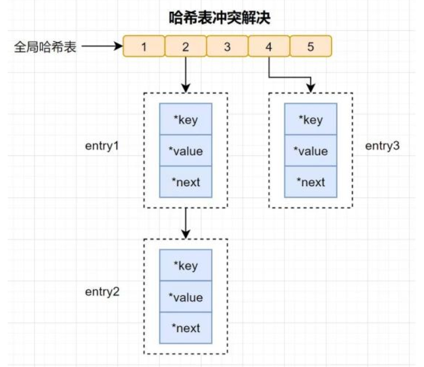
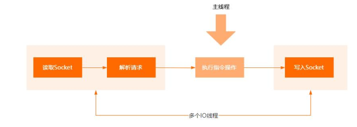
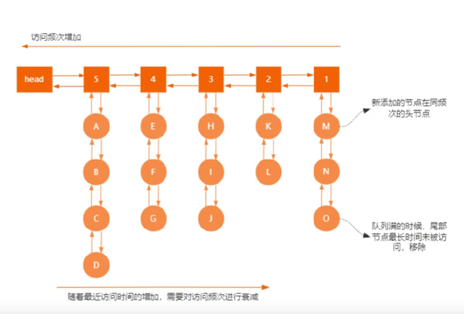
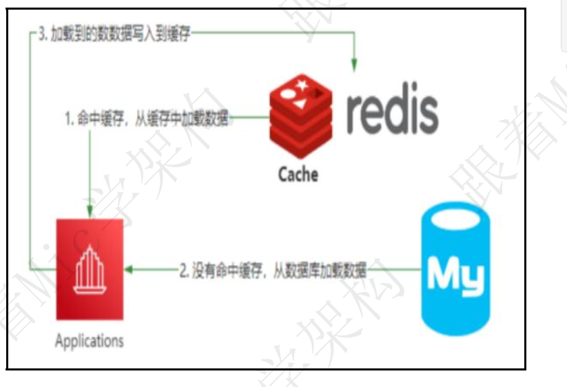

## redis

### 谈谈你对Redis的理解

文字教程 [「金九银十必问面试题」谈谈你对Redis的理解](https://www.toutiao.com/article/7141202477369688610/) 
视频教程 [「金九银十必问面试题」谈谈你对Redis的理解](https://www.toutiao.com/video/7131992009057370655/) 
准确来说，Redis是一个基于内存实现的Key-Value数据结构的Nosql数据库。

注意，这里有三个关键点。

- 内存存储
- key-value结构
- Nosql

所谓内存存储，是指所有数据是存储在内存里面，数据的IO性能比较高。

回答：

Redis是一个基于Key-Value存储结构的Nosql开源内存数据库。

它提供了5种常用的数据类型，String、Map、Set、ZSet、List。

针对不同的结构，可以解决不同场景的问题。

因此它可以覆盖应用开发中大部分的业务场景，比如top10问题、好友关注列表、热点话题等。

其次，由于Redis是基于内存存储，并且在数据结构上做了大量的优化

所以IO性能比较好，在实际开发中，会把它作为应用与数据库之间的一个分布式缓存组件。

并且它又是一个非关系型数据的存储，不存在表之间的关联查询问题，所以它可以很好的提升应用程序的数据IO效率。

最后，作为企业级开发来说，它又提供了主从复制+哨兵、以及集群方式实现高可用在Redis集群里面，通过hash槽的方式实现了数据分片，进一步提升了性能。

### Redis遇到Hash冲突怎么办？

资料来源：[【Java面试】5年架构师都是这么回答，Redis遇到Hash冲突怎么办？](https://www.toutiao.com/video/7222929409823474213/)

昨天，一个工作 5 年的粉丝去面试，被问到 Redis 遇到 Hash 冲突的问题时，是怎么去解决的。 
这其实是一个比较通用的问题，在我整理的大厂面筋指南中有这个问题的完整回答，有需要的小伙伴可以在评论区的置顶中去领取。

首先，Redis 里面的的 Hash 结构的底层数据结构（如图），是使用了一张全局 hash表来保存的所有键值对，这张哈希表，有多个哈希桶组成，哈希桶中的 entry 元素保存了 key 和 value 指针，其中 key 指向了实际的键，value 指向了实际的值。   

所谓 hash 冲突，是指不同的 key，计算出来的结果落到了同一个 hash 桶中。Redis 为了解决哈希冲突，采用了链式寻址法，也就是采用链表的方式来保存同一个hash 桶中的多个元素。 
这个部分的实现和 Java 中的 HashMap 是一样的。

有些粉丝可能会问，如果出现大量的 key 的冲突导致链表过长的情况下，会导致数据的检索效率变慢，Redis 是怎么解决这个问题的呢？

为了保持高效，Redis 会对哈希表做 rehash 操作，也就通过增加哈希桶来减少冲突。 
为了 rehash 更高效，Redis 还默认使用了两个全局哈希表，一个用于当前使用，称为主哈希表，一个用于扩容，称为备用哈希表 
好的，今天的分享就到这里了，感谢大家的点赞和评论，byebye。   

### Redis里面的持久化机制怎么回答

资料来源：[Redis里面的持久化机制怎么回答](https://www.toutiao.com/video/7100835616237191694/?from_scene=all)

#### 回答

首先， Redis 本身是一个基于 Key-Value 结构的内存数据库， 为了避免 Redis 故障导致数据丢失的问题， 所以提供了 RDB 和 AOF 两种持久化机制。 
RDB 是通过快照的方式来实现持久化的， 也就是说会根据快照的触发条件， 把内存里面的数据快照写入到磁盘，以二进制的压缩文件进行存储。

 
RDB 快照的触发方式有很多， 比如执行 bgsave 命令触发异步快照， 执行 save命令触发同步快照， 同步快照会阻塞客户端的执行指令。 
根据 redis.conf 文件里面的配置， 自动触发 bgsave 主从复制的时候触发 AOF持久化， 它是一种近乎实时的方式， 把 Redis Server 执行的事务命令进行追加存储。 
简单来说， 就是客户端执行一个数据变更的操作， Redis Server 就会把这个命令追加到 aof 缓冲区的末尾， 然后再把缓冲区的数据写入到磁盘的 AOF 文件里面，至于最终什么时候真正持久化到磁盘， 是根据刷盘的策略来决定的。 

另外， 因为 AOF 这种指令追加的方式， 会造成 AOF 文件过大， 带来明显的 IO性能问题， 所以 Redis 针对这种情况提供了 AOF 重写机制， 也就是说当 AOF
文件的大小达到某个阈值的时候， 就会把这个文件里面相同的指令进行压缩。 

因此， 基于对 RDB 和 AOF 的工作原理的理解， 我认为 RDB 和 AOF 的优缺点有两个。 
RDB 是每隔一段时间触发持久化， 因此数据安全性低， AOF 可以做到实时持久化， 数据安全性较高 RDB 文件默认采用压缩的方式持久化， AOF 存储的是执行
指令， 所以 RDB 在数据恢复的时候性能比 AOF 要好 
在我看来， 所谓优缺点， 本质上其实是哪种方案更适合当前的应用场景而已。   

### Redis存在线程安全问题吗

资料来源：[Redis存在线程安全问题吗](https://www.toutiao.com/video/7090436681647522311/?from_scene=all)

好的， 关于这个问题， 我从两个方面来回答。
**第一个， 从 Redis 服务端层面。**  
Redis Server 本身是一个线程安全的 K-V 数据库， 也就是说在 Redis Server 上执行的指令， 不需要任何同步机制， 不会存在线程安全问题。 
虽然 Redis 6.0 里面， 增加了多线程的模型， 但是增加的多线程只是用来处理 
网络 IO 事件， 对于指令的执行过程， 仍然是由主线程来处理， 所以不会存在多个线程通知执行操作指令的情况。 

为什么 Redis 没有采用多线程来执行指令， 我认为有几个方面的原因。 
Redis Server 本身可能出现的性能瓶颈点无非就是网络 IO、 CPU、 内存。 但是CPU 不是 Redis 的瓶颈点， 所以没必要使用多线程来执行指令。 
如果采用多线程， 意味着对于 redis 的所有指令操作， 都必须要考虑到线程安全问题， 也就是说需要加锁来解决， 这种方式带来的性能影响反而更大。 
**第二个， 从 Redis 客户端层面。**
虽然 Redis Server 中的指令执行是原子的， 但是如果有多个 Redis 客户端同时执行多个指令的时候， 就无法保证原子性。 
假设两个 redis client 同时获取 Redis Server 上的 key1， 同时进行修改和写入，因为多线程环境下的原子性无法被保障， 以及多进程情况下的共享资源访问的竞争问题， 使得数据的安全性无法得到保障。 

 

当然， 对于客户端层面的线程安全性问题， 解决方法有很多， 比如尽可能的使用Redis 里面的原子指令， 或者对多个客户端的资源访问加锁， 或者通过 Lua 脚本来实现多个指令的操作等等。 

### 用高手的回答去面试！Redis多线程模型怎么理解

资料来源：[【Java面试】用高手的回答去面试！Redis多线程模型怎么理解](https://www.toutiao.com/video/7114175628928090661/?from_scene=all)

hi，大家好，我是 Mic，一个没有才华只能靠颜值混饭吃的 Java 程序员。 
昨天，一个工作了 7 年的粉丝私信我这样一个问题。 
他说 Redis6.0 已经支持多线程了，那是不是会存在线程安全问题，如果有线程安全问题，它是怎么解决的。 
这个问题说简单也简单，说难也挺难的，毕竟不仅仅只是涉及到多线程的问题，还设计到 NIO 里面的 Reactor 模型问题。 
关于：“Redis 多线程模型怎么理解，那它会有线程安全问题吗？”这个问题。 
我把高手部分的回答整理到了 10W 字的面试文档里面，大家可以在我的主页加 V 领取。 
下面看看普通人和高手的回答   

#### 高手
好的，面试官，这个问题我需要从几个方面回答。   首先，Redis 在 6.0 支持的多线程，并不是说指令操作的多线程，而是针对网络 IO 的多线程支持。 
也就是 Redis 的命令操作，仍然是线程安全的。 
其次， Redis 本身的性能瓶颈，取决于三个纬度，网络、CPU、内存。而真正影响内存的关键问题是像内存和网络。 
而 Redis6.0 的多线程，本质上解决网络 IO 的处理效率问题。 
在 Redis6.0 之前。Redis Server 端处理接受到客户端请求的时候，Socket 连接建立到指令的读取、解析、执行、写回都是由一个线程来处理，这种方式，在客户端请求比较多的情况下，单个线程的网络处理效率太慢，导致客户端的请求处理效率较低。 
于是在 Redis6.0 里面，（如图）针对网络 IO 的处理方式改成了多线程，通过多线程并行的方式提升了网络 IO 的处理效率。 
但是对于客户端指令的执行过程，还是使用单线程方式来执行。  

最后，Redis6.0 里面多线程默认是关闭的，需要在 redis.conf 文件里面修改io-threads-do-reads 配置才能开启。另外，之所以指令执行不使用多线程，我认为有两个方面的原因。 
-  内存的 IO 操作，本身不存在性能瓶颈，Redis 在数据结构上已经做了非常多的优化。
-  如果指令的执行使用多线程，那 Redis 为了解决线程安全问题，需要对数据操作增加锁的同步， 不仅仅增加了复杂度，还会影响性能，代价太大不合算。

以上就是我对这个问题的理解！
#### 面试点评
其实，在 Redis6.0 之前，就已经有用到多线程了，比如数据持久化、集群数据同步等。只是可能这些机制离我们应用开发比较远，没有过多关注。  
另外还要注意，Redis 本身虽然是线程安全的，但是应用程序对于 Redis 的Ready-modify -write 操作。  
仍然是非线程安全的。  
掌握这些基础，可以有效避免开发过程中写出一下自己都不懂的 bug。  
好的，本期的普通人 VS 高手面试系列的视频就到这里结束了。  
大家记得点赞、收藏 加 关注  
我是 Mic，咱们下期再见。  

### 缓存雪崩和缓存穿透的理解以及如何避免？

资料来源：[缓存雪崩和缓存穿透的理解以及如何避免？](https://www.toutiao.com/video/7081953754299400734/?from_scene=all)

缓存雪崩， 就是存储在缓存里面的大量数据， 在同一个时刻全部过期，原本缓存组件抗住的大部分流量全部请求到了数据库。导致数据库压力增加造成数据库服务器崩溃的现象 

导致缓存雪崩的主要原因， 我认为有两个： 
缓存中间件宕机， 当然可以对缓存中间件做高可用集群来避免。 
缓存中大部分 key 都设置了相同的过期时间， 导致同一时刻这些 key 都过期了。 
对于这样的情况， 可以在失效时间上增加一个 1 到 5 分钟的随机值。 
缓存穿透问题， 表示是短时间内有大量的不存在的 key 请求到应用里面， 而这些不存在的 key 在缓存里面又找不到， 从而全部穿透到了数据库， 造成数据库压力。 
我认为这个场景的核心问题是针对缓存的一种攻击行为， 因为在正常的业务里面， 
即便是出现了这样的情况， 由于缓存的不断预热， 影响不会很大。 
而攻击行为就需要具备时间是的持续性， 而只有 key 确实在数据库里面也不存在的情况下， 才能达到这个目的， 所以， 我认为有两个方法可以解决： 
把无效的 key 也保存到 Redis 里面， 并且设置一个特殊的值， 比如“null”， 这样的话下次再来访问， 就不会去查数据库了。 
但是如果攻击者不断用随机的不存在的 key 来访问， 也还是会存在问题， 所以可以用布隆过滤器来实现， 在系统启动的时候把目标数据全部缓存到布隆过滤器里
面， 当攻击者用不存在的 key 来请求的时候， 先到布隆过滤器里面查询， 如果不存在， 那意味着这个 key 在数据库里面也不存在。布隆过滤器还有一个好处， 就是它采用了 bitmap 来进行数据存储， 占用的内存空间很少 

不过， 在我看来， 您提出来的这个问题， 有点过于放大了它带来的影响。 
首先， 在一个成熟的系统里面， 对于比较重要的热点数据， 必然会有一个专门缓存系统来维护， 同时它的过期时间的维护必然和其他业务的 key 会有一定的差别。 
而且非常重要的场景， 我们还会设计多级缓存系统。 
其次， 即便是触发了缓存雪崩， 数据库本身的容灾能力也并没有那么脆弱， 数据库的主从、 双主、 读写分离这些策略都能够很好的缓解并发流量。 
最后， 数据库本身也有最大连接数的限制， 超过限制的请求会被拒绝， 再结合熔断机制， 也能够很好的保护数据库系统， 最多就是造成部分用户体验不好。 
另外， 在程序设计上， 为了避免缓存未命中导致大量请求穿透到数据库的问题，还可以在访问数据库这个环节加锁。 虽然影响了性能， 但是对系统是安全的 

总而言之， 我认为解决的办法很多， 具体选择哪种方式， 还是看具体的业务场景。

### Redis的内存淘汰算法和原理是什么？

资料来源：[Redis的内存淘汰算法和原理是什么？](https://www.toutiao.com/video/7081226773366571550/?from_scene=all)

一个工作 5 年的小伙伴私信我，他去京东面试，前面项目部分和应用技术回答得都挺好的。

然后，面试官看我这么牛逼，就开始在问题上加码，不断问我技术原理，前面我都能一一应对。

直到，遇到一个绝杀题：“Redis 的内存淘汰算法和原理是什么？”

虽然最后拿到了月薪 30k 的 offer，但是比较遗憾这个问题没回答上来。

好吧，对于这个问题，我们来看看普通人和高手的回答！  

#### 普通人
嗯....
Redis 里面的内存淘汰算法，应该是用的 LRU 算法来实现的。

原理应该是判断 key 的访问频率，来决定把不经常访问的数据淘汰掉。

#### 高手
Redis 里面的内存淘汰策略，是指内存的使用率达到 maxmemory 上限的时候的一种内存释放的行为。

Redis 里面提供了很多中内存淘汰算法，归纳起来主要就四种

> \1. Random 算法，随机移除某个 key
> \2. TTL 算法 ，在设置了过期时间的键中，把更早过期时间的 key 有限移除
> \3. LRU 算法，移除最近很少使用的 key
> \4. LFU 算法，移除最近很少使用的 key

（如图）LRU 是比较常见的一种内存淘汰算法，在 Redis 里面会维护一个大小为 16 的侯选池，这个侯选池里面的数据会根据时间进行排序，然后每一次随机取出 5 个 key放入到这个侯选池里面，当侯选池满了以后，访问的时间间隔最大的 key 就会从侯选池里面取出来淘汰掉。  

### Redis和Mysql如何保证数据一致性，如何高分回答？

资料来源：[Redis和Mysql如何保证数据一致性，如何高分回答？](https://www.toutiao.com/video/7078611818205151751/?from_scene=all)

今天分享一道一线互联网公司高频面试题。
“Redis 和 Mysql 如何保证数据一致性”。
这个问题难倒了不少工作 5 年以上的程序员， 难的不是问题本身， 而是解决这个
问题的思维模式。
下面来看看普通人和高手对于这个问题的回答。  

#### 普通人
嗯....
Redis 和 Mysql 的数据一致性保证是吧？ 我想想。
嗯， 就是， Mysql 的数据发生变化以后， 可以同步修改 Redis 里面的数据。
#### 高手
一般情况下， Redis 用来实现应用和数据库之间读操作的缓存层， 主要目的是减
少数据库 IO， 还可以提升数据的 IO 性能。
这是它的整体架构。
当应用程序需要去读取某个数据的时候， 首先会先尝试去 Redis 里面加载， 如果
命中就直接返回。 如果没有命中， 就从数据库查询， 查询到数据后再把这个数据
缓存到 Redis 里面。  

在这种情况下， 能够选择的方法只有几种。
先更新数据库， 再更新缓存
先删除缓存， 再更新数据库
如果先更新数据库， 再更新缓存， 如果缓存更新失败， 就会导致数据库和 Redis
中的数据不一致。  

