## spring
### 为什么要使用Spring 框架？

资料来源：[为什么要使用Spring 框架？](https://www.toutiao.com/video/7086770071976018445/?from_scene=all)

一个工作了 4 年的小伙伴， 他说他从线下培训就开始接触 Spring， 到现在已经快 5 年时间了。 
从来没有想过， 为什么要使用 Spring 框架。 
结果在面试的时候， 竟然遇到一个这样的问题。 
大脑一时间短路了， 来求助我， 这类问题应该怎么去回答。 
下面我们来看看普通人和高手的回答   

#### 高手

Spring 是一个轻量级应用框架， 它提供了 IoC 和 AOP 这两个核心的功能。 
它的核心目的是为了简化企业级应用程序的开发， 使得开发者只需要关心业务需求， 不需要关心 Bean 的管理，以及通过切面增强功能减少代码的侵入性。 
从 Spring 本身的特性来看， 我认为有几个关键点是我们选择 Spring 框架的原因。 
轻量： Spring 是轻量的， 基本的版本大约 2MB。   

**IOC/DI**： Spring 通过 IOC 容器实现了 Bean 的生命周期的管理， 以及通过 DI 实现依赖注入， 从而实现了对象依赖的松耦合管理。面向切面的编程(AOP)： Spring 支持面向切面的编程， 从而把应用业务逻辑和系统服务分开。 
**MVC 框架**： Spring MVC 提供了功能更加强大且更加灵活的 Web 框架支持 
**事务管理**： Spring 通过 AOP 实现了事务的统一管理， 对应用开发中的事务处理提供了非常灵活的支持 
**最后**， Spring 从第一个版本发布到现在， 它的生态已经非常庞大了。 在业务开发领域， Spring 生态几乎提供了
非常完善的支持， 更重要的是社区的活跃度和技术的成熟度都非常高， 以上就是我对这个问题的理解。   

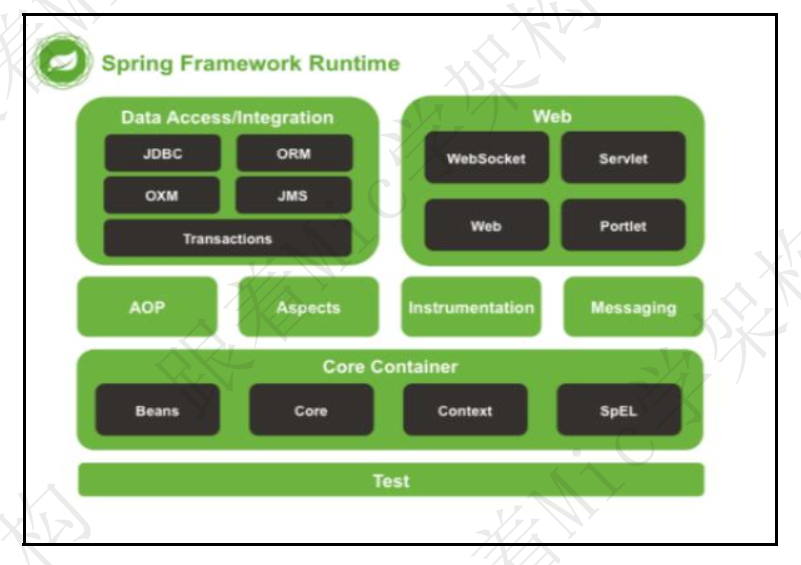

**面试点评**
任何一个技术框架， 一定是为了解决某些特定的问题， 只是大家忽视了这个点。  
为什么要用， 再往高一点来说， 其实就是技术选型， 能回答这个问题    
意味着面对业务场景或者技术问题的解决方案上， 会有自己的见解和思考。  
所以， 我自己也喜欢在面试的时候问这一类的问题。  
好的， 本期的普通人 VS 高手面试系列的视频就到这里结束了。  
有任何不懂的技术面试题， 欢迎随时私信我  
我是 Mic， 一个工作了 14 年的 Java 程序员， 咱们下期再见    

## spring之IOC

### 谈谈你对 Spring IOC 和 DI 的理解

资料来源：[Java高级开发必须要懂，谈谈你对 Spring IOC 和 DI 的理解](https://www.toutiao.com/video/7112251973440963109/?from_scene=all)

#### 回答

首先， Spring IOC， 全称控制反转（Inversion of Control） 。 
在传统的 Java 程序开发中， 我们只能通过 new 关键字来创建对象， 这种导致程序中对象的依赖关系比较复杂， 耦合度较高。   
 
而 IOC 的主要作用是实现了对象的管理， 也就是我们把设计好的对象交给了 IOC容器控制， 然后在需要用到目标对象的时候， 直接从容器中去获取。   
 
有了 IOC 容器来管理 Bean 以后， 相当于把对象的创建和查找依赖对象的控制权交给了容器， 这种设计理念使得对象与对象之间是一种松耦合状态， 极大提升了程序的灵活性以及功能的复用性。   
然后， DI 表示依赖注入， 也就是对于 IOC 容器中管理的 Bean， 如果 Bean 之间存在依赖关系， 那么 IOC 容器需要自动实现依赖对象的实例注入， 通常有三种方法来描述 Bean 之间的依赖关系。   

接口注入 
setter 注入 
构造器注入 
另外， 为了更加灵活的实现 Bean 实例的依赖注入， Spring 还提供了@Resource和@Autowired 这两个注解。 
分别是根据 bean 的 id 和 bean 的类型来实现依赖注入。 
以上就是我对这个问题的理解！  

### 介绍下Spring IoC的工作流程？

资料来源：[介绍下Spring IoC的工作流程？](https://www.toutiao.com/video/7090050239951962660/)

Hi， 我是 Mic
一个工作了 4 年的粉丝， 在面试的时候遇到一个这样的问题。
“介绍一下 Spring IOC 的工作流程”
他说回答得不是很好， 希望我能帮他梳理一下。
这个问题高手部分的回答已经整理成了文档， 可以在主页加 V 领取。
关于这个问题， 我们来看看普通人和高手的回答。  

#### 普通人

#### 高手

好的， 这个问题我会从几个方面来回答。
IOC 是什么
Bean 的声明方式
IOC 的工作流程
IOC 的全称是 Inversion Of Control,也就是控制反转， 它的核心思想是把对象的管理权限交给容器。
应用程序如果需要使用到某个对象实例， 直接从 IOC 容器中去获取就行， 这样设计的好处是降低了程序里面对象与对象之间的耦合性。使得程序的整个体系结构变得更加灵活。  

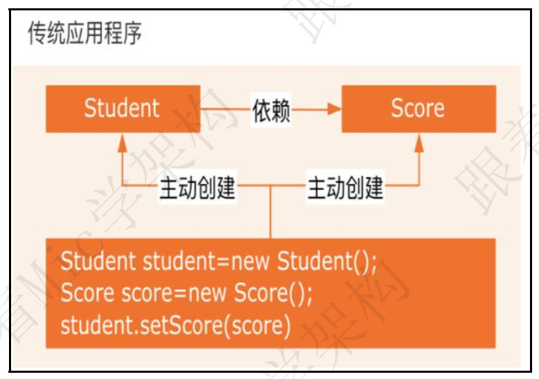

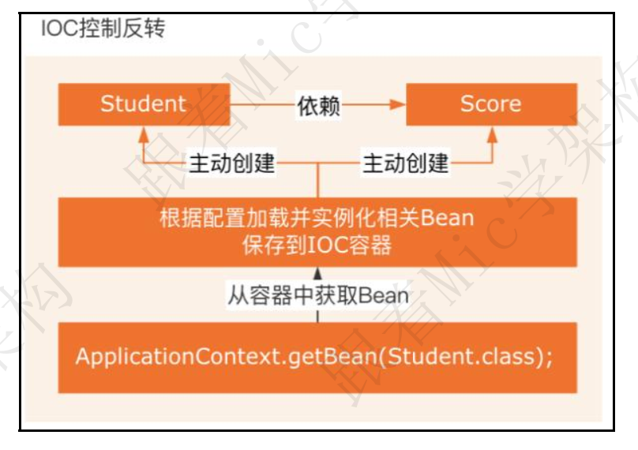

Spring 里面很多方式去定义 Bean， 比如 XML 里面的<bean>标签、 @Service、@Component、 @Repository、 @Configuration 配置类中的@Bean 注解等等。
Spring 在启动的时候， 会去解析这些 Bean 然后保存到 IOC 容器里面。  

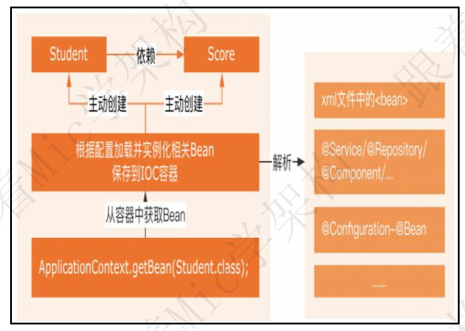

Spring IOC 的工作流程大致可以分为两个阶段。
第一个阶段， 就是 IOC 容器的初始化
这个阶段主要是根据程序中定义的 XML 或者注解等 Bean 的声明方式
通过解析和加载后生成 BeanDefinition， 然后把 BeanDefinition 注册到 IOC 容
器。  

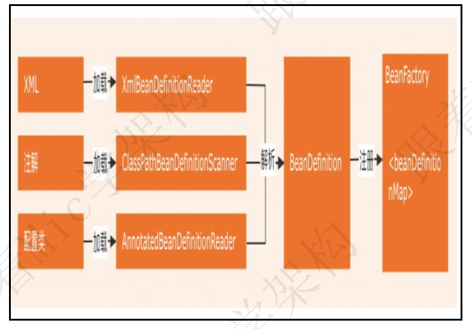

通过注解或者 xml 声明的 bean 都会解析得到一个 BeanDefinition 实体， 实体中包含这个 bean 中定义的基本属性。最后把这个 BeanDefinition 保存到一个 Map 集合里面， 从而完成了 IOC 的初始化。
IoC 容器的作用就是对这些注册的 Bean 的定义信息进行处理和维护， 它 IoC 容器控制反转的核心。
第二个阶段， 完成 Bean 初始化及依赖注入
然后进入到第二个阶段， 这个阶段会做两个事情
通过反射针对没有设置 lazy-init 属性的单例 bean 进行初始化。
完成 Bean 的依赖注入  

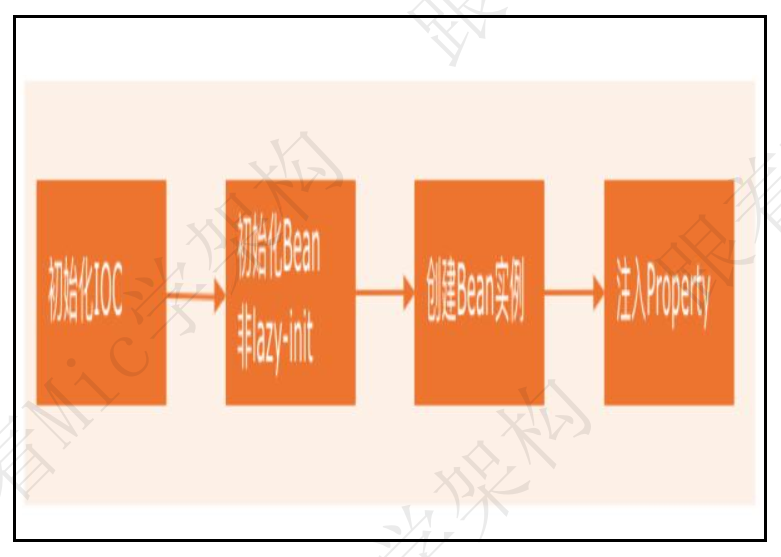

第三个阶段， Bean 的使用
通常我们会通过@Autowired或者BeanFactory.getBean()从IOC容器中获取指定的 bean 实例。
另外， 针对设置 layy-init 属性以及非单例 bean 的实例化， 是在每次获取 bean对象的时候， 调用 bean 的初始化方法来完成实例化的， 并且 Spring IOC 容器
不会去管理这些 Bean。  

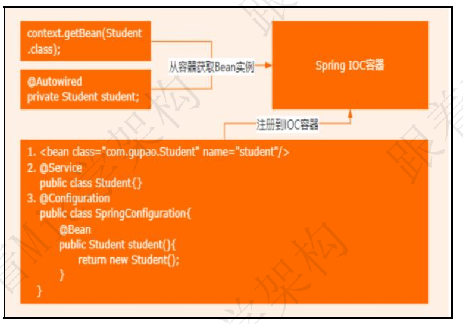

以上就是我对这个问题的理解。
面试点评
对于工作原理或者工作流程性的问题， 大家一定要注意回答的结构和节奏。
否则面试官会觉得很混乱， 无法理解， 导致面试的效果大打折扣。
高手的回答逻辑非常清晰， 大家可以参考。
好的， 本期的普通人 VS 高手面试系列就到这里结束了。
喜欢我的作品的小伙伴记得点赞和收藏加关注。
我是 Mic， 一个工作 14 年的 Java 程序员， 咱们下期再见  

### @Conditional注解有什么用

`condition` 注解的一个作用为bean的装载做一个条件判断，只有在满足条件的情况下。
`spring`才会把`bean`装载到`IOC`容器里面。而这个条件是我们可以自定义去完成的。
我们可以实现`condition`这个接口，并且重写里面的`matches`这个方法，去实现自定义的逻辑。所以`@condition`这个注解，增加了bean的装配的灵活性。在`springboot`里面对`@condition`注解做了更进一步的扩展，比如增加了`@conditionalOnClass`,`@conditionOnBean`等这样的注解，使得我们在使用的过程中。不再需要些那些条件的逻辑判断。而是可以直接根据数据本身的语义去完成对应的条件的一个装配

### @Resource 和 @Autowired 的区别  

[「Java面试」带你用不同视角分析@Resource和@Autowired的区别？-今日头条 (toutiao.com)](https://www.toutiao.com/article/7106424759147397664/?channel=&source=search_tab)

Hi， 大家好， 我是 Mic。
一个工作 2 年的粉丝， 问我一个 Spring 里面的问题。
希望我能从不同的视角去分析， 然后碾压面试官。
这个问题是： “@Resource 和@Autowired”的区别。
高手部分的回答我已经整理成了文档， 需要的小伙伴可以在主页加 V 领取。
下面看看普通人和高手的回答

#### 普通人

#### 高手

好的， 面试官。
@Resource 和@Autowired 这两个注解的作用都是在 Spring 生态里面去实现Bean 的依赖注入。 
下面我分别说一下@Autowired 和@Resource 这两个注解。 
**首先**， @Autowired 是 Spring 里面提供的一个注解， 默认是根据类型来实现 Bean的依赖注入。
@Autowired 注解里面有一个 `required `属性默认值是 true， 表示强制要求 bean实例的注入，
在应用启动的时候， 如果 IOC 容器里面不存在对应类型的 Bean， 就会报错。当然， 如果不希望自动注入， 可以把这个属性设置成 false。 
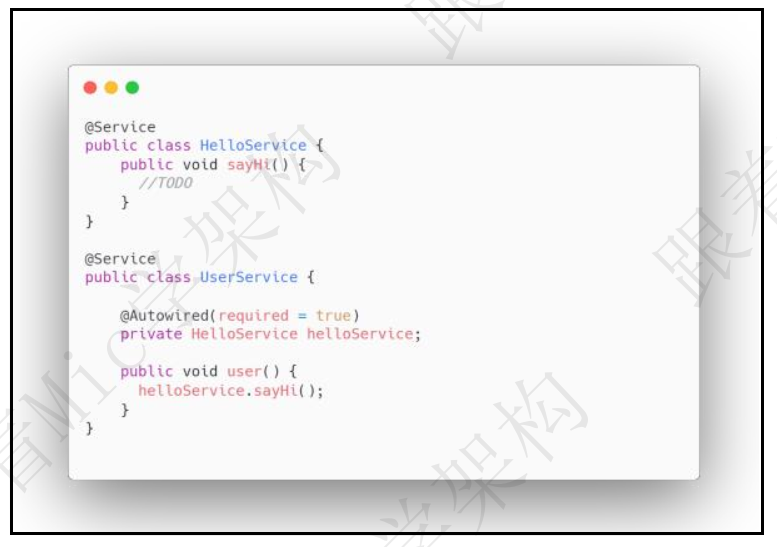

**其次**呢， 如果在 Spring IOC 容器里面存在多个相同类型的 Bean 实例。 由于@Autowired 注解是根据类型来注入 Bean 实例的   

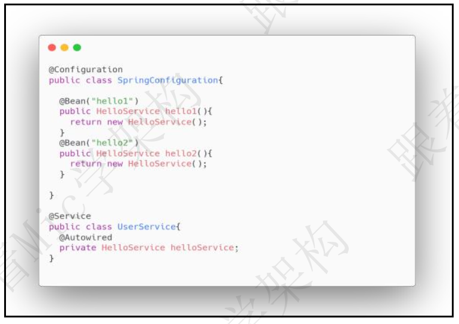

所以 Spring 启动的时候， 会提示一个错误， 大概意思原本只能注入一个单实例Bean，但是在 IOC 容器里面却发现有多个， 导致注入失败。   

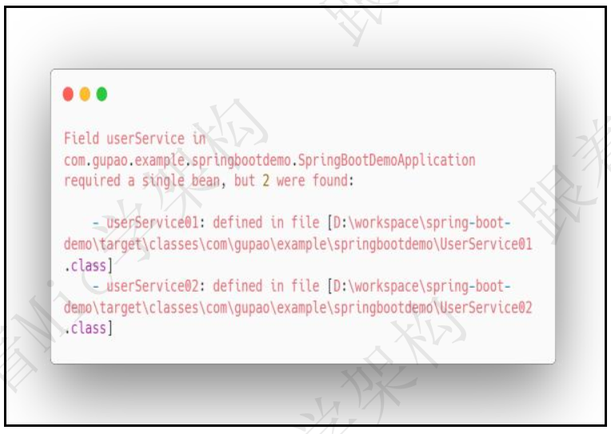
当然， 针对这个问题， 我们可以使用 @Primary 或者@Qualifier 这两个注解来解决。 
> @Primary 表示主要的 bean， 当存在多个相同类型的 Bean 的时候， 优先使用声明了@Primary 的 Bean。 
> @Qualifier 的作用类似于条件筛选， 它可以根据 Bean 的名字找到需要装配的目标 Bean。   

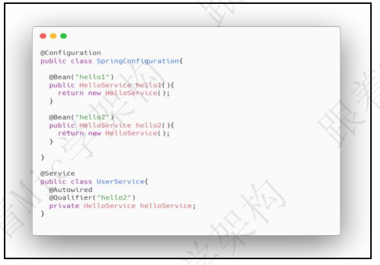

接下来， 我再解释一下@Resource 注解。 
@Resource 是 JDK 提供的注解， 只是 Spring 在实现上提供了这个注解的功能支持。 
它的使用方式和@Autowired 完全相同， 最大的差异于@Resource 可以支持ByName 和 ByType 两种注入方式。 
如果使用name， Spring就根据bean的名字进行依赖注入， 如果使用type， Spring就根据类型实现依赖注入。 
如果两个属性都没配置， 就先根据定义的属性名字去匹配， 如果没匹配成功， 再根据类型匹配。 两个都没匹配到， 就报错   

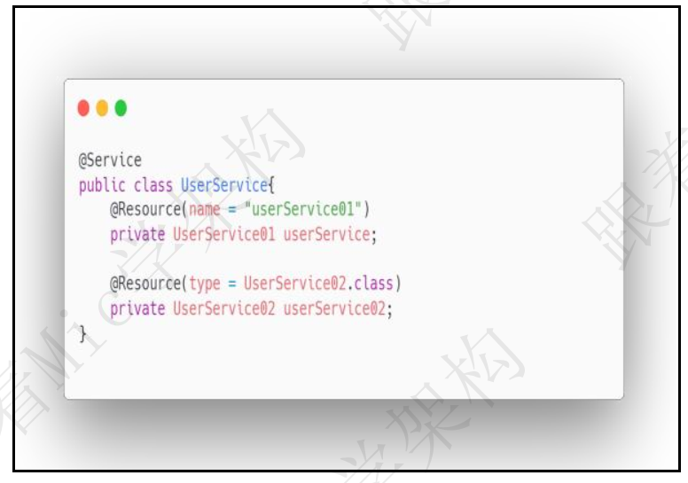

最后， 我再总结一下。

> @Autowired 是根据 type 来匹配， @Resource 可以根据 name 和 type 来匹配，默认是 name 匹配。 
> @Autowired 是 Spring 定义的注解， @Resource 是 JSR 250 规范里面定义的注解， 而 Spring 对 JSR 250 规范提供了支持。 
> @Autowired 如果需要支持 name 匹配， 就需要配合@Primary 或者@Qualifier来实现。 

以上就是我对这个问题的理解。 

#### 面试总结  

大家可以关注高手部分的回答， 他的逻辑结构很清晰的。 
他是非常直观的告诉面试官这两个注解的差异， 同时又基于两个注解的特性解释了更多的差异。 
最后做了一个简短的总结。 
大家在面试的时候可以参考类似的回答思路。 
好的， 本期的普通人 VS 高手面试系列的视频就到这里结束了。 
喜欢我的作品的小伙伴记得点赞和收藏加关注。 
我是 Mic， 一个工作 14 年的 Java 程序员， 咱们下期再见！   

## spring Bean
###  Spring 中Bean的作用域有哪些？
资料来源：[Spring 中Bean的作用域有哪些？高手的回答秀到我了](https://www.toutiao.com/video/7088874285007110687/?from_scene=all)

一个工作 3 年的小伙子，去面试被问到 Spring 里面的问题。 
这个问题比较简单，但是他却没有回答上来。 
虽然他可以通过搜索引擎找到答案，但是如果没有理解，下次面试还是不会！ 
这个面试题是： “Spring 中的 Bean，作用域有哪些？” 
对于这个问题，看看普通人和高手的回答。 

#### 高手
好的，这个问题可以从几个方面来回答。 
首先呢，Spring 框架里面的 IOC 容器，可以非常方便的去帮助我们管理应用里面的Bean 对象实例。 
我们只需要按照 Spring 里面提供的 xml 或者注解等方式去告诉 IOC 容器，哪些 Bean需要被 IOC 容器管理就行了。 
其次呢，既然是 Bean 对象实例的管理，那意味着这些实例，是存在生命周期，也就是所谓的作用域。 
理论上来说，**常规的生命周期只有两种：**

- **singleton**， 也就是单例，意味着在整个 Spring 容器中只会存在一个 Bean 实例。 
-  **prototype**，翻译成原型，意味着每次从 IOC 容器去获取指定 Bean 的时候，都会返回一个新的实例对象。 
但是在基于 Spring 框架下的 Web 应用里面，增加了一个会话纬度来控制 Bean 的生命周期，主要有三个选择 
-  **request**， 针对每一次 http 请求，都会创建一个新的 Bean 
-  **session**，以 sesssion 会话为纬度，同一个 session 共享同一个 Bean 实例，不同的 session 产生不同的 Bean 实例 
-   globalSession，针对全局 session 纬度，共享同一个 Bean 实例session
以上就是我对这个问题的理解。

#### 面试点评

“技术框架的本质是去解决特定问题的，所以如果能够站在技术的角度去思考Spring” 
当遇到这种问题的时候，就可以像这个高手的回答一样，能够基于场景来推断出答案。 
就像我们现在写 CRUD 代码，它已经变成了一种基本能力去让我们完成复杂业务逻辑的开发。 
好的，本期的普通人 VS 高手面试系列的视频就到这里结束了。 
有任何不懂的技术面试题，欢迎随时私信我 
我是 Mic，一个工作了 14 年的 Java 程序员，咱们下期再见。   

### Spring中有哪些方式可以把Bean注入到IOC容器

资料来源：[Spring中有哪些方式可以把Bean注入到IOC容器](https://www.toutiao.com/video/7098586416824713736/)

问题是： “Spring 中有哪些方式可以把 Bean 注入到 IOC 容器”。 
他说这道题是所有面试题里面回答最好的， 但是看面试官的表情， 好像不太对。 
我问他怎么回答的， 他说： “接口注入”、 “Setter 注入”、 “构造器注入”。 
为什么不对？ 来看看普通人和高手的回答。   

#### 高手

好的， 把 Bean 注入到 IOC 容器里面的方式有 7 种方式 
使用 xml 的方式来声明 Bean 的定义， Spring 容器在启动的时候会加载并解析这个 xml， 把 bean 装载到 IOC 容器中。 
使用@CompontScan 注解来扫描声明了@Controller、@Service、@Repository、@Component 注解的类。 
使用@Configuration 注解声明配置类， 并使用@Bean 注解实现 Bean 的定义，这种方式其实是 xml 配置方式的一种演变， 是 Spring 迈入到无配置化时代的里程碑   

使用@Import 注解， 导入配置类或者普通的 Bean使 用 FactoryBean 工 厂 bean ， 动 态 构 建 一 个 Bean 实 例 ， Spring Cloud
OpenFeign 里面的动态代理实例就是使用 FactoryBean 来实现的。实现 ImportBeanDefinitionRegistrar 接口， 可以动态注入 Bean 实例。 这个在Spring Boot 里面的启动注解有用到。实现 ImportSelector 接口， 动态批量注入配置类或者 Bean 对象， 这个在 Spring Boot 里面的自动装配机制里面有用到。 
以上就是我对这个问题的理解。   

### Spring如何解决循环依赖问题的

资料来源：[Spring如何解决循环依赖问题的](https://www.toutiao.com/video/7038513985431437831/)

#### 普通人

Spring 是利用缓存机制来解决循环依赖问题的

高手
我们都知道， 如果在代码中， 将两个或多个 Bean 互相之间持有对方的引用就会
发生循环依赖。 循环的依赖将会导致注入死循环。 这是 Spring 发生循环依赖的
原因。
循环依赖有三种形态：
第一种互相依赖： A 依赖 B， B 又依赖 A， 它们之间形成了循环依赖  

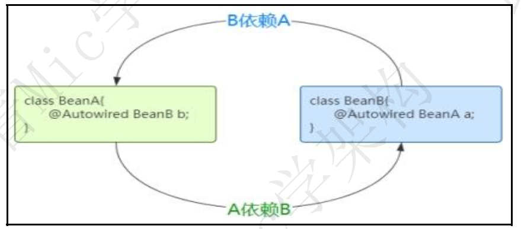

第二种三者间依赖： A 依赖 B， B 依赖 C， C 又依赖 A， 形成了循环依赖。

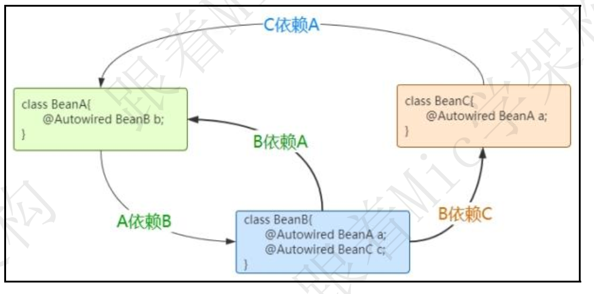

第三种是自我依赖： A 依赖 A 形成了循环依赖。  

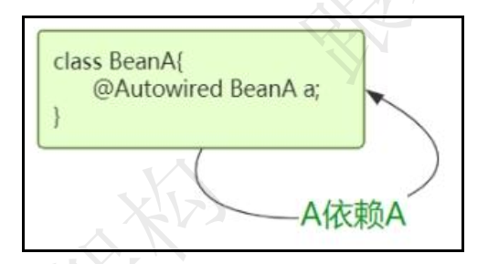

而 Spring 中设计了三级缓存来解决循环依赖问题， 当我们去调用 getBean()方法的时候， Spring 会先从一级缓存中去找到目标 Bean， 如果发现一级缓存中没有便会去二级缓存中去找， 而如果一、 二级缓存中都没有找到， 意味着该目标 Bean还没有实例化。 于是， Spring 容器会实例化目标 Bean（PS： 刚初始化的 Bean称为早期 Bean） 。 然后， 将目标 Bean 放入到二级缓存中， 同时， 加上标记是否存在循环依赖。 如果不存在循环依赖便会将目标 Bean 存入到二级缓存， 否则，便会标记该 Bean 存在循环依赖， 然后将等待下一次轮询赋值， 也就是解析@Autowired 注解。 等@Autowired 注解赋值完成后（PS： 完成赋值的 Bean 称为成熟 Bean） ， 会将目标 Bean 存入到一级缓存。Spring 一级缓存中存放所有的成熟 Bean，  二级缓存中存放所有的早期 Bean， 先取一级缓存， 再去二级缓存。

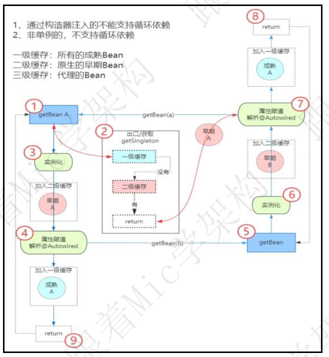

面试官： 那么， 前面有提到三级缓存， 三级缓存的作用是什么？

高手：

三级缓存是用来存储代理 Bean， 当调用 getBean()方法时， 发现目标 Bean 需要通过代理工厂来创建， 此时会将创建好的实例保存到三级缓存， 最终也会将赋值好的 Bean 同步到一级缓存中。
面试官： Spring 中哪些情况下， 不能解决循环依赖问题？

高手： 有四种情况：

> 1.多例 Bean 通过 setter 注入的情况， 不能解决循环依赖问题
>
> 2.构造器注入的 Bean 的情况， 不能解决循环依赖问题
>
> 3.单例的代理 Bean 通过 Setter 注入的情况， 不能解决循环依赖问题  
>
> 4.设置了@DependsOn 的 Bean 的情况， 不能解决循环依赖问题

#### 普通人

Spring 是利用缓存机制来解决循环依赖问题的

#### 高手

我们都知道， 如果在代码中， 将两个或多个 Bean 互相之间持有对方的引用就会发生循环依赖。 循环的依赖将会导致注入死循环。 这是 Spring 发生循环依赖的原因。
循环依赖有三种形态：  第一种互相依赖： A 依赖 B， B 又依赖 A， 它们之间形成了循环依赖。

### 如何叙述Spring Bean 的生命周期

资料来源：[如何叙述Spring Bean 的生命周期](https://www.toutiao.com/video/7041875113050014238/)

#### 普通人
Spring Bean的生命周期， 可以分为单例、多实例。呃... 不对， 这个是Spring Bean的作用域。

生命周期， 我想想....
我记得 Bean 的生命周期会有加载、 实例化、 销毁这些阶段， 其他的记得不是很清晰。  

#### 高手  

Spring 生命周期全过程大致分为五个阶段： 创建前准备阶段、 创建实例阶段、依赖注入阶段、容器缓存阶段和销毁实例阶段。
这张是 Spring Bean 生命周期完整流程图， 其中对每个阶段的具体操作做了详细介绍：  

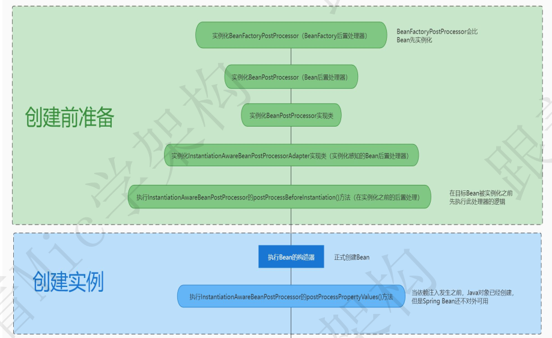

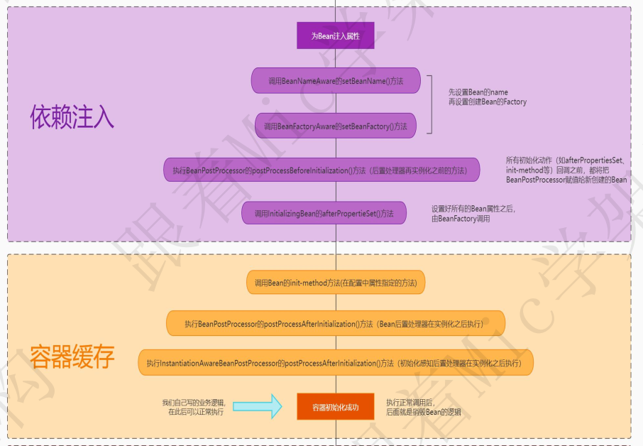

**一、 创建前准备阶段** 
这个阶段主要的作用是， Bean 在开始加载之前， 需要从上下文和相关配置中解析并查找 Bean 有关的扩展实现， 
比如像 init-method-容器在初始化 bean 时调用的方法、 destory-method， 容器在销毁 bean 时调用的方法。以及， BeanFactoryPostProcessor 这类的 bean 加载过程中的前置和后置处理。 
这些类或者配置其实是 Spring 提供给开发者， 用来实现 Bean 加载过程中的扩展机制， 在很多和 Spring 集成的中间件中比较常见， 比如 Dubbo。 
**二、 创建实例阶段 **
这个阶段主要是通过反射来创建 Bean 的实例对象， 并且扫描和解析 Bean 声明的一些属性。 
**三、 依赖注入阶段** 
如果被实例化的 Bean 存在依赖其他 Bean 对象的情况， 则需要对这些依赖 bean进行对象注入。 比如常见的@Autowired、 setter 注入等依赖注入的配置形式。 
同 时 ， 在 这 个 阶 段 会 触 发 一 些 扩 展 的 调 用 ， 比 如 常 见 的 扩 展 类 ：BeanPostProcessors（用来实现 bean 初始化前后的扩展回调） 、InitializingBean（这个类有一个afterPropertiesSet()， 这个在工作中也比较常见）、BeanFactoryAware 等等。 
**四、 容器缓存阶段 **
容器缓存阶段主要是把 bean 保存到容器以及 Spring 的缓存中， 到了这个阶段，Bean 就可以被开发者使用了。这个阶段涉及到的操作， 常见的有， init-method 这个属性配置的方法， 会在这个阶段调用。以 及 像 BeanPostProcessors 方 法 中 的 后 置 处 理 器 方 法 如 ：postProcessAfterInitialization， 也会在这个阶段触发。 
**五、 销毁实例阶段**

当 Spring 应用上下文关闭时， 该上下文中的所有 bean 都会被销毁。如果存在 Bean 实现了 DisposableBean 接口， 或者配置了 destory-method 属性，会在这个阶段被调用。   

MIC： 嗯， 看完高手的回答后， 相信大家对 Spring Bean 的生命周期有了深刻的 
印象了， 需要文档中 Spring Bean 生命周期的高清流程图， 可以加微信： mic6769。
在附赠一张高清的时序图给大家！  

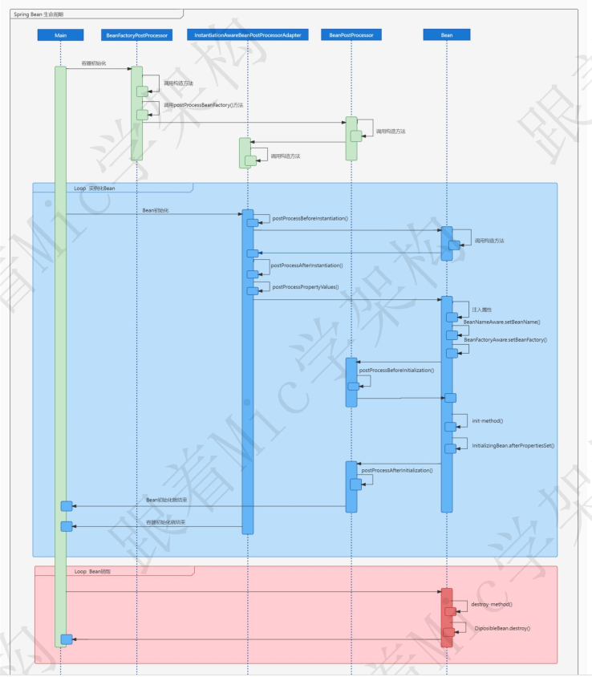

### Spring中BeanFactory和FactoryBean的区别

资料来源：[Spring中BeanFactory和FactoryBean的区别](https://www.toutiao.com/video/7090791563147772424/)

一个工作了六年多的粉丝， 胸有成竹的去京东面试。
然后被 Spring 里面的一个问题卡住， 唉， 我和他说， 6 年啦， Spring 都没搞明
白？
那怎么去让面试官给你通过呢？
这个问题是： Spring 中 BeanFactory 和 FactoryBean 的区别。
好吧， 对于这个问题看看普通人和高手的回答  

#### 高手
关于这个问题， 我从几个方面来回答。
首先， Spring 里面的核心功能是 IOC 容器， 所谓 IOC 容器呢， 本质上就是一个Bean 的容器或者是一个 Bean 的工厂。
它能够根据 xml 里面声明的 Bean 配置进行 bean 的加载和初始化， 然后BeanFactory 来生产我们需要的各种各样的 Bean。
所以我对 BeanFactory 的理解了有两个。
BeanFactory 是所有 Spring Bean 容器的顶级接口， 它为 Spring 的容器定义了一套规范， 并提供像 getBean 这样的方法从容器中获取指定的 Bean 实例。
BeanFactory 在产生 Bean 的同时， 还提供了解决 Bean 之间的依赖注入的能力，也就是所谓的 DI。  

FactoryBean 是一个工厂 Bean， 它是一个接口， 主要的功能是动态生成某一个类型的 Bean 的实例， 也就是说， 我们可以自定义一个 Bean 并且加载到 IOC 容器里面。
它里面有一个重要的方法叫 getObject()， 这个方法里面就是用来实现动态构建Bean 的过程。
Spring Cloud 里 面 的 OpenFeign 组 件 ， 客 户 端 的 代 理 类 ， 就 是 使 用 了FactoryBean 来实现的  

以上就是我对这个问题的理解。
#### 面试点评
这个问题， 只要稍微看过 Spring 框架的源码， 怎么都能回答出来。
关键在于你是否愿意逼自己去学习一些工作中不常使用的技术来提升自己。
在我看来， 薪资和能力是一种等价交换， 在市场经济下， 能力一般又想获得更高薪资， 很显然不可能！
好的， 本期的普通人 VS 高手面试系列的视频就到这里结束了。
我是 Mic， 一个工作了 14 年的 Java 程序员， 咱们下期再见  

### @Autowired 和 @Resource 有什么区别

资料来源：[@Autowired 和 @Resource 有什么区别](https://www.toutiao.com/video/7148039216365044254/)

`@Resource` 和@`Autowired `这两个注解的作用都是在` Spring `生态里面去实现`Bean `的依赖注入。 
下面我分别说一下`@Autowired `和`@Resource` 这两个注解。 
闪现 [@Autowired 的作用详解 ] 几个字。 
首先， @Autowired 是 Spring 里面提供的一个注解， 默认是根据类型来实现 `Bean`的依赖注入。 
@Autowired 注解里面有一个 `required `属性默认值是 `true，` 表示强制要求` bean`实例的注入， 
在应用启动的时候， 如果 IOC 容器里面不存在对应类型的 Bean， 就会报错。 
当然， 如果不希望自动注入， 可以把这个属性设置成 false。 

 

其次呢， 如果在 `Spring IOC` 容器里面存在多个相同类型的 Bean 实例。 由于`@Autowired `注解是根据类型来注入` Bean `实例的 

 

所以 `Spring` 启动的时候， 会提示一个错误， 大概意思原本只能注入一个单实例`Bean`，但是在 `IOC` 容器里面却发现有多个， 导致注入失败。 

 

当然， 针对这个问题， 我们可以使用 `@Primary `或者@`Qualifier `这两个注解来解决。 
`@Primary` 表示主要的 bean， 当存在多个相同类型的 Bean 的时候， 优先使用声明了`@Primary `的 Bean。 
`@Qualifier` 的作用类似于条件筛选， 它可以根据 Bean 的名字找到需要装配的目标 Bean。  

  

闪现 [`@Resource` 的作用详解 ] 几个字。
接下来， 我再解释一下`@Resource` 注解 。
`@Resource `是 `JDK `提供的注解， 只是 Spring 在实现上提供了这个注解的功能支持。 
它的使用方式和`@Autowired` 完全相同， 最大的差异于`@Resource` 可以支持`ByName `和` ByType `两种注入方式。 
如果使用`name`， `Spring`就根据`bean`的名字进行依赖注入， 如果使用`type`，` Spring`就根据类型实现依赖注入。 
如果两个属性都没配置， 就先根据定义的属性名字去匹配， 如果没匹配成功， 再根据类型匹配。 两个都没匹配到， 就报错。   

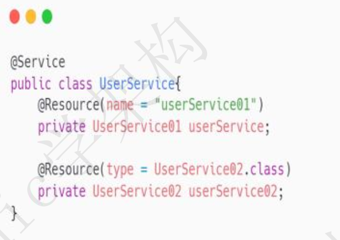

最后， 我再总结一下。  
`@Autowired`是根据 type 来匹配， `@Resource` 可以根据 name 和 type 来匹配，默认是 name 匹配。  
`@Autowired` 是 Spring 定义的注解，` @Resource `是 JSR 250 规范里面定义的注解， 而 Spring 对 JSR 250 规范提供了支持。  
`@Autowired` 如果需要支持 name 匹配， 就需要配合`@Primary` 或者`@Qualifier`来实现。  

### Spring里面两个id相同的bean会报错吗？

资料来源：[Spring里面两个id相同的bean会报错吗？](https://www.toutiao.com/video/7099349888562889252/?from_scene=all)

关于这个问题， 我从几个点来回答。 
首先， 在同一个 XML 配置文件里面， 不能存在 id 相同的两个 bean， 否则 spring容器启动的时候会报错 

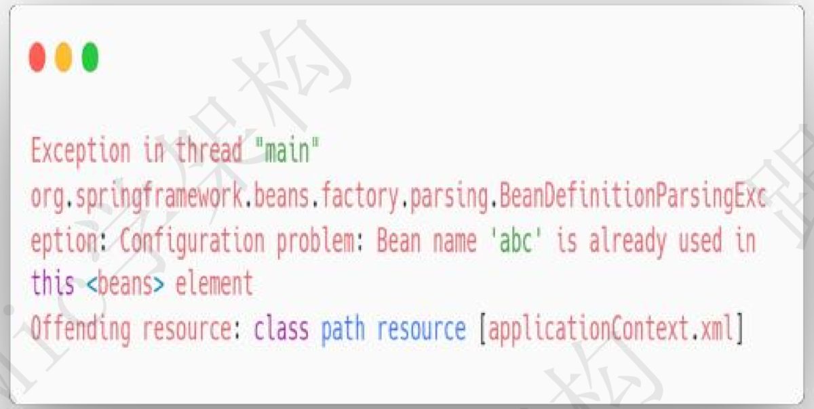

因为 id 这个属性表示一个 Bean 的唯一标志符号， 所以 Spring 在启动的时候会去验证 id 的唯一性， 一旦发现重复就会报错， 
这个错误发生 Spring 对 XML 文件进行解析转化为 BeanDefinition 的阶段。 
但是在两个不同的 Spring 配置文件里面， 可以存在 id 相同的两个 bean。 IOC容器在加载 Bean 的时候， 默认会多个相同 id 的 bean 进行覆盖。 
在 Spring3.x 版本以后， 这个问题发生了变化 
我们知道 Spring3.x 里面提供@Configuration 注解去声明一个配置类， 然后使用@Bean 注解实现 Bean 的声明， 这种方式完全取代了 XMl。 
在这种情况下， 如果我们在同一个配置类里面声明多个相同名字的 bean， 在Spring IOC 容器中只会注册第一个声明的 Bean 的实例。 
后续重复名字的 Bean 就不会再注册了。 
像这样一段代码， 在 Spring IOC 容器里面， 只会保存 UserService01 这个实例，后续相同名字的实例不会再加载。 

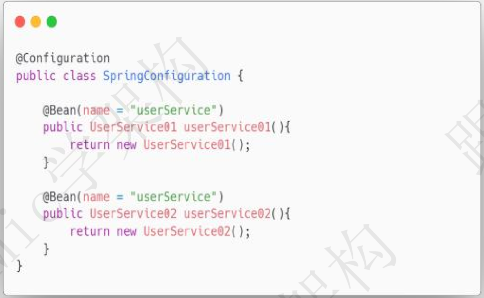 

如果使用@Autowired 注解根据类型实现依赖注入， 因为 IOC 容器只有UserService01的实例， 所以启动的时候会提示找不到UserService02这个实例   

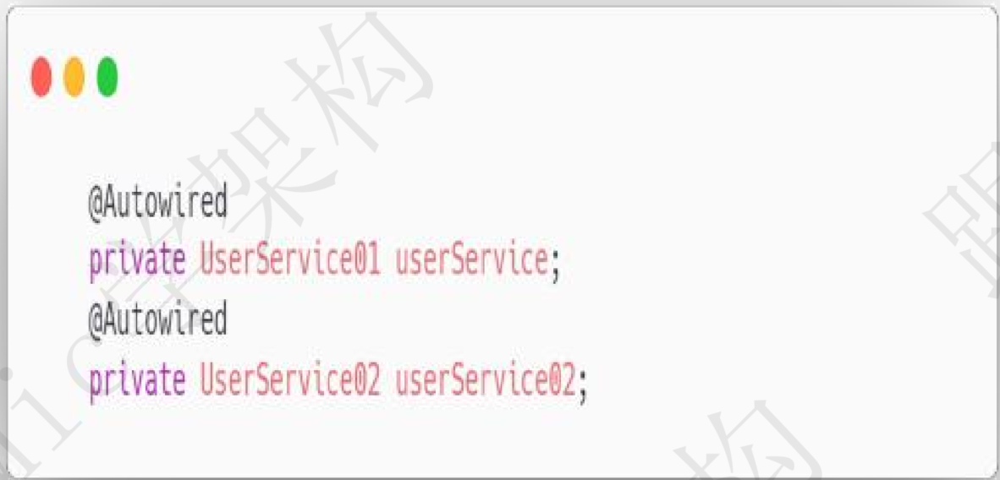 

如果使用@Resource 注解根据名词实现依赖注入， 在 IOC 容器里面得到的实例对象是 UserService01， 
于是 Spring 把 UserService01 这个实例赋值给 UserService02， 就会提示类型不匹配错误。 

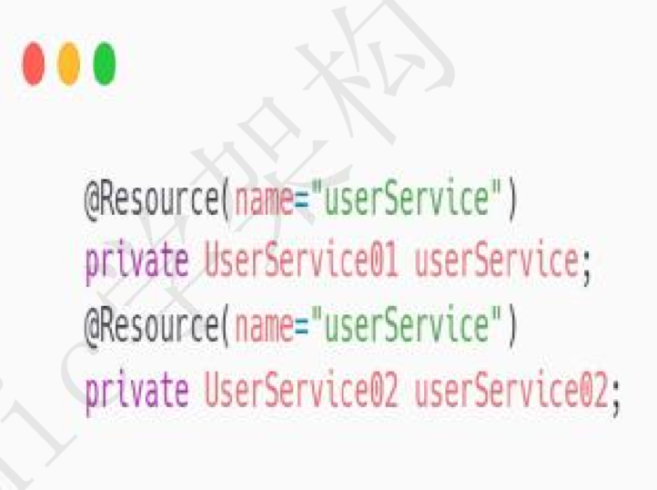 
这个错误， 是在 Spring IOC 容器里面的 Bean 初始化之后的依赖注入阶段发生的。 
以上就是我对这个问题的理解 

## spring 事务

### Spring中事务的传播行为有哪些？

资料来源：[Spring中事务的传播行为有哪些？](https://www.toutiao.com/video/7087137193034318349/?from_scene=all)

一个工作了 2 年的粉丝， 私信了一个比较简单的问题。
说： “Spring 中事务的传播行为有哪些？ ”
他说他能记得一些， 但是在项目中基本上不需要配置， 所以一下就忘记了。
结果导致面试被拒绝， 有点遗憾！
ok， 关于这个问题， 看看普通人和高手的回答。  

#### 高手
对于这个问题， 需要从几个方面去回答。
首选， 所谓的事务传播行为， 就是多个声明了事务的方法相互调用的时候， 这个事务应该如何传播。
比如说， methodA()调用 methodB()， 两个方法都显示的开启了事务。  

那么 methodB()是开启一个新事务， 还是继续在 methodA()这个事务中执行？ 就取 决 于 事 务 的 传 播 行 为 。  

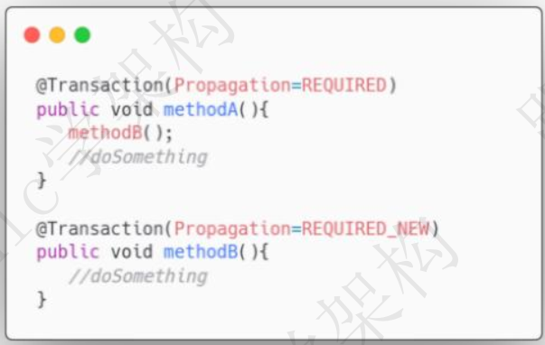

在 Spring 中， 定义了 7 种事务传播行为。
**REQUIRED**： 默认的 Spring 事物传播级别， 如果当前存在事务， 则加入这个事务， 如果不存在事务， 就新建一个事务。
**REQUIRE_NEW**： 不管是否存在事务， 都会新开一个事务， 新老事务相互独立。外部事务抛出异常回滚不会影响内部事务的正常提交。
**NESTED**： 如果当前存在事务， 则嵌套在当前事务中执行。 如果当前没有事务，则新建一个事务， 类似于 REQUIRE_NEW。
**SUPPORTS**： 表示支持当前事务， 如果当前不存在事务， 以非事务的方式执行。
**NOT_SUPPORTED**： 表示以非事务的方式来运行， 如果当前存在事务， 则把当前事务挂起。
**MANDATORY**： 强制事务执行， 若当前不存在事务， 则抛出异常.
**NEVER**： 以非事务的方式执行， 如果当前存在事务， 则抛出异常。
Spring 事务传播级别一般不需要定义， 默认就是 PROPAGATION_REQUIRED，除非在嵌套事务的情况下需要重点了解。  

以上就是我对这个问题的理解！
#### 面试点评
这个问题其实只需要理解事务传播行为的本质以及为什么需要考虑到事务传播
的问题。
就可以直接基于自身的技术积累来推演出答案， 无非就是基于可能的策略进行穷
举， 怎么也能推演出 5 种吧。
好的， 本期的普通人 VS 高手面试系列的视频就到这里结束了。
有任何不懂的技术面试题， 欢迎随时私信我
我是 Mic， 一个工作了 14 年的 Java 程序员， 咱们下期再见  

### 为什么有些公司禁止使用@Transactional声明式事务？

资料来源:[【Java面试】为什么有些公司禁止使用@Transactional声明式事务？](https://www.toutiao.com/video/7254852356146528779/)

“为什么有些公司禁止使用@Transactional 声明式事务？” 
Hi，大家好，我是 Mic，一个工作了 14 年的 Java 程序员 
屏幕前的粉丝朋友，如果不知道怎么回答这个问题，可以在评论区的置顶中领取这个问题的文字回答。 
以及我们花了一年时间整理的 50 万字的大厂面试指南。 

#### 问题分析
@Transaction 注解在很多互联网公司也在使用，并不是每个公司都禁止。 
所以是否要使用也和@Transaction 注解的特性和特定的环境有关系 
因此大家可以沿着@Transaction 声明式事务可能存在的问题去说就好了。 
下面来看一下这个问题的解答。 

#### 问题解答

我认为有几个方面的考虑 
> 1. 在方法上增加@Transaction 声明式事务，如果一个方法中的存在较多耗时操作，就容易引发长事物问题，而长事物会带来锁的竞争影响性能，同时也会导致数据库连接池被耗尽，影响程序的正常执行。 
> 2. 如果方法存在嵌套调用，而被嵌套调用的方法也声明了@Transaction 事物，就会出现事物的嵌套调用行为，容易引起事物的混乱造成程序运行结果出现异常 
> 3. @Transaction 声明式事务是将事物控制逻辑放在注解中，如果项目的复杂度增加，事务的控制可能会变得更加复杂，导致代码可读性和维护性下降。所以，为了避免这类问题，有些公司会推荐使用编程式事务，这样可以更加灵活地控制事务的范围，减少事务的锁定时间，提高系统的性能。以上就是我的理解，如果你喜欢 

这个作品，记得点赞和关注，我是 Mic，我们下期再见。   

## Spring 声明式事务原理？哪些场景事务会失效  

**声明式事务原理**
spring 声明式事务，即 @Transactional ,它可以帮助我们实现事务开启、提交或者回滚的操作，通过 Aop 的方式进行管理  

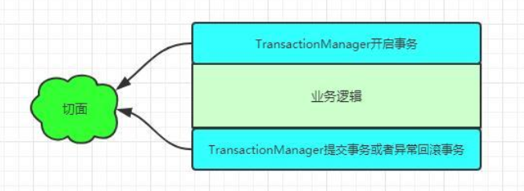

在 spring 的 bean 的初始化过程中，就需要对实例化的 bean 进行代理，并且生成代理对象。生成代理对象的代理逻辑中，进行方法调用时，需要先获取切面逻辑，@Transactional 注解的切面逻辑类似于@Around，在 spring 中实现一种类似代理逻辑  

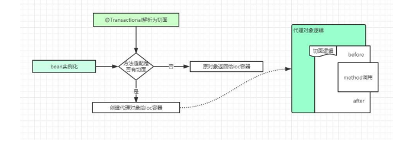

**spring 声明式事务哪些场景会失效**

> 1. 方法的访问权限必须是 public，其他 private 等权限，事务失效
> 2. 方法被定义成了 final 的，这样会导致事务失效。
> 3. 在同一个类中的方法直接内部调用，会导致事务失效。
> 4. 一个方法如果没交给 spring 管理，就不会生成 spring 事务。
> 5. 多线程调用，两个方法不在同一个线程中，获取到的数据库连接不一样✁。
> 6. 表的存储引擎不支持事务
> 7. 如果自己 try...catch 误吞了异常，事务失效。
> 8. 错误的事务传播机制  