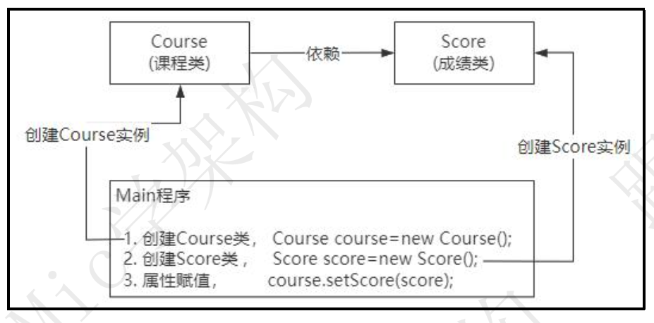
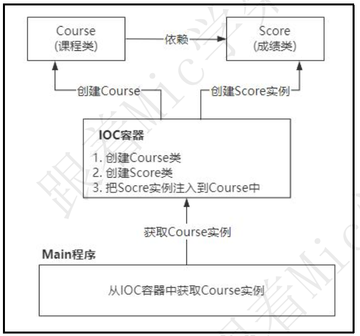

### 谈谈你对 Spring IOC 和 DI 的理解

资料来源：[Java高级开发必须要懂，谈谈你对 Spring IOC 和 DI 的理解](https://www.toutiao.com/video/7112251973440963109/?from_scene=all)

#### 介绍：

> 一个工作 4 年的 Java 程序员， Spring 都用了 4 年了， 竟然连 Spring 里面这么
> 基础的问题都回答不好。
> 还以为像 3~4 年前一样， 随便准备一下就可以拿到一个薪资不错的 Offer。
> 同学们， 这种好日子已经过去了， 对于 Java 程序员来说， 未来找工作一定会越
> 来越难。
> hi， 大家好， 我是 Mic， 一个没有才华只能靠颜值混饭吃的 Java 程序员。
> 今天分享的面试提示： 谈谈你对 Spring IOC 和 DI 的理解。
> 下面看看普通人和高手的回答  

#### 回答

首先， Spring IOC， 全称控制反转（Inversion of Control） 。

在传统的 Java 程序开发中， 我们只能通过 new 关键字来创建对象， 这种导致程序中对象的依赖关系比较复杂， 耦合度较高。  

而 IOC 的主要作用是实现了对象的管理， 也就是我们把设计好的对象交给了 IOC容器控制， 然后在需要用到目标对象的时候， 直接从容器中去获取。  

有了 IOC 容器来管理 Bean 以后， 相当于把对象的创建和查找依赖对象的控制权交给了容器， 这种设计理念使得对象与对象之间是一种松耦合状态， 极大提升了程序的灵活性以及功能的复用性。  

然后， DI 表示依赖注入， 也就是对于 IOC 容器中管理的 Bean， 如果 Bean 之间存在依赖关系， 那么 IOC 容器需要自动实现依赖对象的实例注入， 通常有三种方法来描述 Bean 之间的依赖关系。  

接口注入
setter 注入
构造器注入
另外， 为了更加灵活的实现 Bean 实例的依赖注入， Spring 还提供了@Resource和@Autowired 这两个注解。
分别是根据 bean 的 id 和 bean 的类型来实现依赖注入。
以上就是我对这个问题的理解！  