## springboot

### Spring Boot 约定优于配置，你的理解是什么

资料来源：[Spring Boot 约定优于配置，你的理解是什么](https://www.toutiao.com/video/7072300941218677256/)

对于 Spring Boot 约定优于配置这个问题， 看看普通人和高手是如何回答的？ 

#### 普通人的回答

嗯， 在 Spring Boot 里面， 通过约定优于配置这个思想， 可以让我们少写很多的配置， 
然后就只需要关注业务代码的编写就行。 嗯！ 

#### 高手的回答

我从 4 个点方面来回答。 
**首先**， 约定优于配置是一种软件设计的范式， 它的核心思想是减少软件开发人员对于配置项的维护， 从而让开发人员更加聚焦在业务逻辑上。 
**第二**Spring Boot 就是约定优于配置这一理念下的产物， 它类似于 Spring 框架下的一个脚手架， 通过 Spring Boot， 我们可以快速开发基于 Spring 生态下的应用程序。 
**第三**基于传统的 Spring 框架开发 web 应用， 我们需要做很多和业务开发无关并且只需要做一次的配置， 比如：

> 1,管理 jar 包依赖 
> 2,web.xml 维护 
> 3,springmvc中的Dispatch-Servlet.xml 配置项维护 
> 4,应用部署到 Web 容器 
> 5,第三方组件集成到 Spring IOC 容器中的配置项维护  

而在 Spring Boot 中， 我们不需要再去做这些繁琐的配置， Spring Boot 已经自动帮我们完成了， 这就是约定由于配置思想的体现。

**最后**Spring Boot 约定由于配置的体现有很多， 比如：

- Spring Boot Starter 启动依赖， 它能帮我们管理所有 jar 包版本 
- 如果当前应用依赖了spring mvc相关的jar， 那么Spring Boot会自动内置Tomcat容器来运行 web 应用， 我们不需要再去单独做应用部署。
- Spring Boot 的自动装配机制的实现中， 通过扫描约定路径下的 spring.factories文件来识别配置类， 实现 Bean 的自动装配。
- 默认加载的配置文件 application.properties 等等。 
  

总的来说， 约定优于配置是一个比较常见的软件设计思想， 它的核心本质都是为了更高效以及更便捷的实现软件系统的开发和维护。 
以上就是我对这个问题的理解。 

#### 结尾

好的， 本期的普通人 VS 高手面试系列就到这里结束了， 对于这个问题， 你知道该怎么回答了吗？ 
另外， 如果你有任何面试相关的疑问， 欢迎评论区给我留言。 
我是 Mic， 一个工作了 14 年的 Java 程序员， 咱们下期再见   

### Spring Boot 自动装配机制的原理？

资料来源：[Spring Boot 自动装配机制的原理？](https://www.toutiao.com/video/7078998564252156446/?from_scene=all)

最近一个粉丝说， 他面试了 4 个公司， 有三个公司问他： “Spring Boot 中自动装配机制的原理” 
他回答了， 感觉没回答错误， 但是怎么就没给 offer 呢？ 
对于这个问题， 看看普通人和高手该如何回答。 

#### 普通人

嗯…Spring Boot 里面的自动装配， 就是@EnableAutoConfiguration 注解。 
嗯…它可以实现 Bean 的自动管理， 不需要我们手动再去配置。 

#### 高手

自动装配， 简单来说就是自动把第三方组件的 Bean 装载到 Spring IOC 器里面，不需要开发人员再去写 Bean 的装配配置。 
在 Spring Boot 应用里面， 只需要在启动类加上@SpringBootApplication 注解就可以实现自动装配。 
@SpringBootApplication是一 个复合注解 ， 真 正 实 现 自 动 装 配 的注解是@EnableAutoConfiguration。 
自动装配的实现主要依靠三个核心关键技术。 **第一个**引入 Starter 启动依赖组件的时候， 这个组件里面必须要包含@Configuration 配置类， 在这个配置类里面通过@Bean 注解声明需要装配到 IOC 容器的 Bean 对象。 **第二个**这个配置类是放在第三方的 jar 包里面， 然后通过 SpringBoot 中的约定优于配置思想， 把这个配置类的全路径放在 classpath:/META-INF/spring.factories 文件中。 
这样 SpringBoot 就可以知道第三方 jar 包里面的配置类的位置， 这个步骤主要是用到了 Spring 里面的 SpringFactoriesLoader 来完成的。 
**第三个**SpringBoot 拿到所第三方 jar 包里面声明的配置类以后， 再通过 Spring 提供的ImportSelector 接口， 实现对这些配置类的动态加载。从而去完成自动装配这个动作 

在我看来， SpringBoot 是约定优于配置这一理念下的产物， 所以在很多的地方，都会看到这类的思想。 它的出现， 让开发人员更加聚焦在了业务代码的编写上，而不需要去关心和业务无关的配置。 
其实， 自动装配的思想， 在 SpringFramework3.x 版本里面的@Enable 注解， 就有了实现的雏形。 @Enable 注解是模块驱动的意思， 我们只需要增加某个@Enable 注解， 就自动打开某个功能， 而不需要针对这个功能去做 Bean 的配置， @Enable 底层也是帮我们去自动完成这个模块相关 Bean 的注入。 
以上， 就是我对 Spring Boot 自动装配机制的理解   

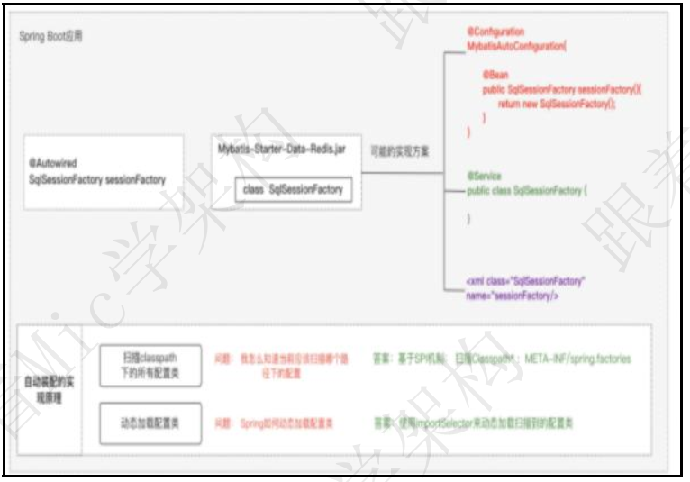

#### 结尾

发现了吗？ 高手和普通人的回答， 并不是回答的东西多和少。 
而是让面试官看到你对于这个技术领域的理解深度和自己的见解， 从而让面试官 
在一大堆求职者中， 对你产生清晰的印象。   

### SpringBoot如何解决跨域问题？

资料来源：[【Java面试】SpringBoot如何解决跨域问题？](https://www.toutiao.com/video/7250372149167587843/)

“SpringBoot 如何解决跨域问题？” 
今天给大家分析一下这个问题的底层逻辑以及面试的时候的回答技巧 
文字版本的回答，我整理到了 50W 字的面试文档中了，有需要的小伙伴可以在评论区
置顶中领取。 

#### 问题分析

跨域指的是浏览器在执行网页中的 JavaScript 代码时，由于浏览器同源策略的限制（如图）。 
只能访问同源（协议、域名、端口号均相同）的资源，而不能访问其他源（协议、域名、端口号任意一个不同）的资源。   

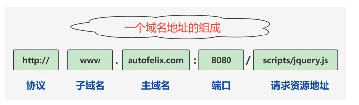

（如图）比如像这样一种情况就体现了跨域的问题。 

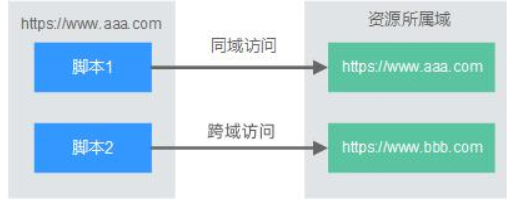

而解决跨域问题的方法，就是在不破坏同源策略的情况下，能够安全地实现数据共享和交互。

#### 问题解答

常见的解决跨域问题的方法有两种，

- 一种是 jsonp，
- 另一种是 CORS。 

其中，CORS 是一种在服务器后端解决跨域的方案，它的工作原理很简单。 
如果一个网站需要访问另一个网站的资源，浏览器会先发送一个 OPTIONS 请求， 
根据服务器返回的 Access-Control-Allow-Origin 头信息，决定是否允许跨域访问。 
所以，我们只需要在服务器端配置 Access-Control-Allow-Origin 属性，并配置允许哪些域名支持跨域请求即可。 
在 Spring Boot 中，提供了两种配置 Access-Control-Allow-Origin 属性的方式来解决跨域问题 

- 通过@CrossOrigin(origins = "http://localhost:8080")注解，指定允许哪些origins 允许跨域  
- 使用 WebMvcConfigurer 接口，重写 addCorsMappings 方法来配置允许跨域的请求源  

~~~~java
@Configuration
publicclassCorsConfigimplementsWebMvcConfigurer {
	@Override
	publicvoidaddCorsMappings(CorsRegistryregistry) {
		registry.addMapping("/**")
		.allowedOrigins("http://localhost:8080")
		.allowedMethods("*");
	}
}
~~~~

以上就是解决这个问题的方法。 

### 如何理解Spring Boot中的Starter？看完高手的回答简直就像教科书
[如何理解Spring Boot中的Starter？看完高手的回答简直就像教科书](https://www.toutiao.com/video/7091928878859584007/?from_scene=all)

一个工作了 3 年的 Java 程序员， 遇到一个 Spring Boot 的问题。 
他对这个问题有一些了解， 但是回答得不是很好， 希望参考我的高手回答。 
这个问题是： “如何理解 Spring Boot 中的 Starter”。 
对于这个问题， 看看普通人和高手的回答。 

#### 高手

Starter 是 Spring Boot 的四大核心功能特性之一， 除此之外， Spring Boot 还有自动装配、 Actuator 监控等特性。 
Spring Boot 里面的这些特性， 都是为了让开发者在开发基于 Spring 生态下的企业级应用时， 只需要关心业务逻辑，
减少对配置和外部环境的依赖。 
其中， Starter 是启动依赖， 它的主要作用有几个。 
Starter 组件以功能为纬度， 来维护对应的 jar 包的版本依赖，使得开发者可以不需要去关心这些版本冲突这种容易出错的细节。 
Starter 组件会把对应功能的所有 jar 包依赖全部导入进来， 避免了开发者自己去引入依赖带来的麻烦。 
Starter 内部集成了自动装配的机制， 也就说在程序中依赖对应的 starter 组件以后，这个组件自动会集成到 Spring 生态下， 并且对于相关 Bean 的管理， 也是基于自动装配机制来完成。   

依赖 Starter 组件后， 这个组件对应的功能所需要维护的外部化配置， 会自动集成到 Spring Boot 里面， 
我们只需要在 application.properties 文件里面进行维护就行了， 比如 Redis 这个starter， 只需要在 application.properties文件里面添加 redis 的连接信息就可以直接使用了。 
在我看来， Starter组件几乎完美的体现了Spring Boot里面约定优于配置的理念   

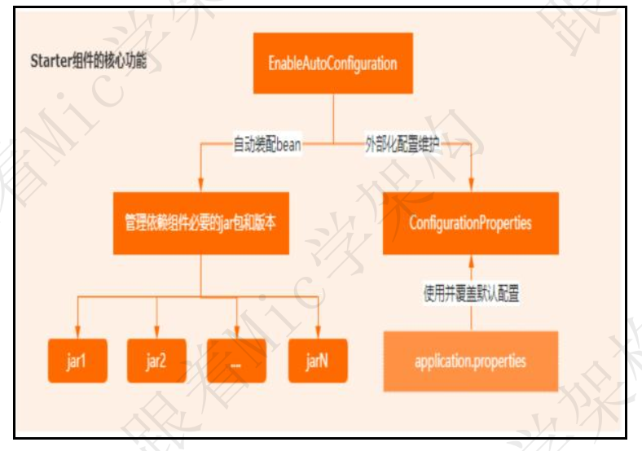

另外， Spring Boot 官方提供了很多的 Starter 组件， 比如 Redis、 JPA、 MongoDB等等。 
但是官方并不一定维护了所有中间件的 Starter， 所以对于不存在的 Starter， 第三方组件一般会自己去维护一个。 
官方的 starter 和第三方的 starter 组件， 最大的区别在于命名上。 
官方维护的 starter 的以 spring-boot-starter 开头的前缀。 
第三方维护的 starter 是以 spring-boot-starter 结尾的  后缀   

这也是一种约定优于配置的体现。   

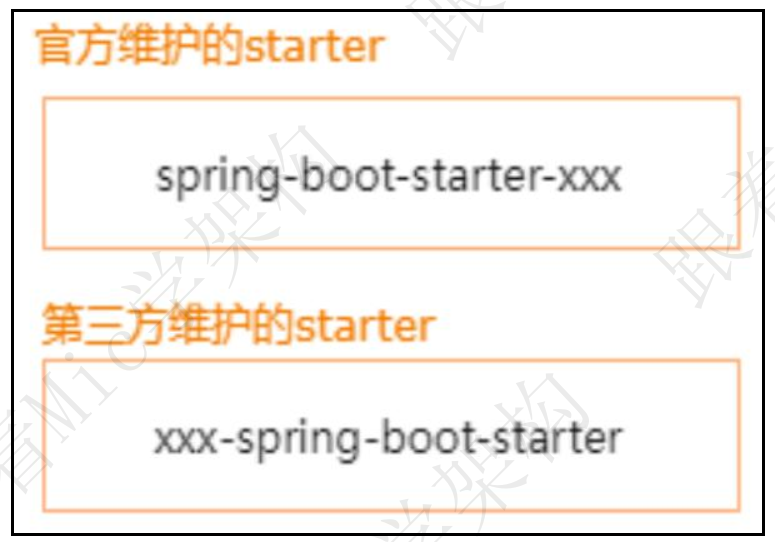

以上就是我对这个问题的理解。 

#### 面试点评

在技术的学习过程中， 我认为“为什么是”比“是什么”要重要。 
以这种方式来学习， 带来的好处就是对技术理解会更加深刻。 
这道题考察的就是“为什么是”， 不难， 关键在于自己的理解。 
好的， 本期的普通人 VS 高手面试系列的视频就到这里结束了， 
如果你喜欢这个视频， 记得点赞和收藏。 
如果想获得一对一的面试指导以及面试资料， 可以私信我。 
我是 Mic， 一个工作了 14 年的 Java 程序员， 咱们下期再见！   

## 微服务

### 谈谈你对分布式和微服务的理解
[谈谈你对分布式和微服务的理解](https://www.toutiao.com/video/7111211129317261855/?from_scene=all)

很难想象， 在分布式架构以及微服务架构普及了近 10 年时间的现在， 还有人不清楚微服务架构和分布式架构。  
这不， 一个工作了 3 年的粉丝， 就遇到了这个方面的问题， 希望我能出一个视频。  
hi， 大家好， 我是 Mic， 一个没有才华只能靠颜值混饭吃的 Java 程序员。  
今天给大家分享的面试题是： “请你说一下你对分布式和微服务的理解”。  
关于这个问题的回答以及以往的面试题， 我整理成了 10 多万字的文档， 大家可以在我的主页加 V 领取。  
下面看看普通人和高手对这个问题的回答    

#### 高手

首先我先解释一下分布式系统。  
简单来说， 分布式是一组通过网络进行通信， 并且为了完成共同的计算任务的计算机节点组成的系统。  
分布式系统的设计理念， 其实是来自于小型机或者大型机的计算能力的瓶颈和成本的增加。  
在集中式系统里面， 要想提升程序的运行性能， 只能不断的升级 CPU 以及增加内存， 但是硬件的提升本身也是有瓶颈的， 所以当企业对于计算要求越来越高的时候， 集中式架构已经无法满足需求了。  
在这样的背景下， 就产生了分布式计算， 也就是把一个计算任务分配给多个计算机节点去运行。  
但是对于用户或者客户端来说， 感知不到背后的逻辑， 就像访问单个计算机一样，他看到的仍然是一个整体。    

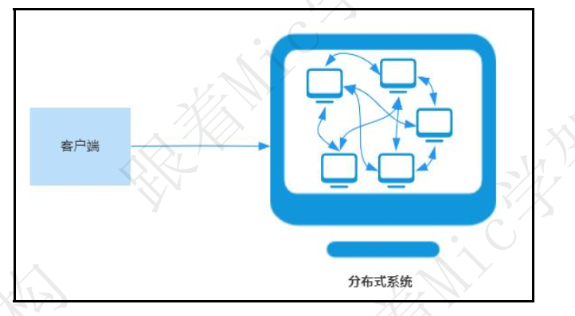

在分布式系统中， 软件架构也需要作出相应的调整， 需要把原本的单体应用进行拆分， 部署到多个计算机节点上， 然后各个服务之间使用远程通信协议实现计算结果的数据交互。  
针对这种分布式部署的应用架构， 我们称为 SOA（面向服务） 的架构。  
其次， 我再解释一下微服务架构。  

其实微服务架构本身就是一种分布式架构， 它强调的是对部署在各个计算机上的应用服务的粒度。  
它的核心思想是， 针对拆分的服务节点做更进一步的解耦。  
也就是说， 针对 SOA 服务化架构下的单个业务服务， 以更加细粒度的方式进一步拆分。  
每个拆分出来的微服务由独立的小团队负责， 最好在 3 人左右。   

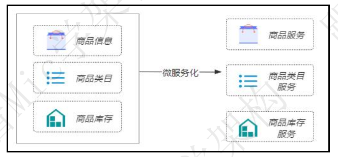

拆分的好处是使得程序的扩展性更强， 开发迭代效率更高。 
对于一些大型的互联网项目来说， 微服务能够在不影响用户使用的情况下非常方便的实现产品功能的创新和上线。 
以上就是我对这个问题的理解。 

#### 面试点评

相信还有很多小伙伴没用过微服务， 也没有接触过 Spring Cloud。 
现在的微服务架构， 就像 10 多年之前的 SSH 架构， 它是很多企业的基础应用架构， 
技术的发展是日新月异的， 不要让自己停留在一个舒适区， 否则以后找不到合适
的工作会焦虑。 
我是 Mic， 咱们下期再见！   

### 是微服务架构嘛？如果你来设计一个类似淘宝 的系统，你怎么划分微服务？  

- 1. 可以按业务领域、功能、重要程度进行划分。
- 2. 可以按业务领域，按照用户、社区、商品信息、消息等模块等划分。
- 3. 单一功能职责，按功能拆分，比如订单、支付、物流、权限。
- 4. 按重要程度划分，区分核心和非核心功能，比如支付、订单就是核心功能  

### 你们 是怎么分库分表 的？分布式 ID 如何生成？

如果是我们公司的话，使用了水平分库的方式，就是一个用户注册时，就划分了属于哪个数据库，然后具体的表结构是一样的。 
业界还有垂直分库，就是按照不同的系统中的不同业务进行拆分，比如拆分成用户库、订单库、积分库、商品库，把它们部署在不同的数据库服务器。 
分表的话也有水平分表和垂直分表，垂直分表就是将一些不常用的、数据较大或者长度较长的列拆分到另外一张表，水平分表就是可以按照某种规则（如 hash 取模、range），把数据切分到多张表去。一张订单表，按时间 range 拆分如下   

range 划分利于数据迁移，但是存在数据热点问题。hash 取模划分，不会存在明显的热点问题，但是不利于扩容。可以 range+hash 取模结合使用。 
**分布式 ID 可以使用雪花算法生成** 
雪花算法是一种生成分布式全局唯一 ID 的算法，生成的 ID 称为 SnowflakeIDs。这种算法由 Twitter 创的。 
分布式 ID 可以使用雪花算法生成一个 Snowflake ID 有 64 位。 

-  第 1 位：Java 中 long 的最高位是符号位代表正负，正数是 0，负数是 1，一般生 成 ID 都为正数，所以默认为 0。 
- 接下来前 41 位的时间戳，表示了自选定的时期以来的毫秒数。 
-  接下来的 10 位代表计算机 ID，防止冲突。 
-  其余 12 位代表每台机器上生成 ID ✁序列号，这允许在同一毫秒内创建多个Snowflake ID   

### 服务网格是微服务架构的更进一步升级，什么是服务网格？

[服务网格是微服务架构的更进一步升级，什么是服务网格？](https://www.toutiao.com/video/7080089211843543565/?from_scene=all)

今天继续来分享一个有趣的面试题，“什么是服务网格”？ 
服务网格这个概念出来很久了，从 2017 年被提出来，到 2018 年正式爆发，很多云厂商和互联网企业都在纷纷向服务网格靠拢。像蚂蚁集团、美团、百度、网易等一线互联网公司，都有服务网格的落地应用。 
在我看来呢，服务网格是微服务架构的更进一步升级，它的核心目的是实现网络通信与业务逻辑的分离，使得开发人员更加专注在业务的实现上。 
那么基于这个问题，我们来看看普通人和高手的回答。 

#### 普通人

嗯？
内心戏：服务网格？服务网格是什么东西？ 
嗯， 很抱歉，这个问题我不是很清楚。 

#### 高手

服务网格，也就是 Service Mesh，它是专门用来处理服务通讯的基础设施层。它的主要功能是处理服务之间的通信，并且负责实现请求的可靠性传递。 
Service Mesh，我们通常把他称为第三代微服务架构，既然是第三代，那么意味着他是在原来的微服务架构下做的升级。 
为了更好的说明 Service Mesh，那我就不得不说一下微服务架构部分的东西。 
首先，当我们把一个电商系统以微服务化架构进行拆分后，会的到这样的一个架构（如图），其中包括 Webserver、payment、inventory 等等。   

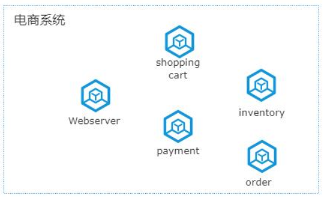

（如图）这些微服务应用，会被部署到 Docker 容器、或者 Kubernetes 集群。由于每个服务的业务逻辑是独立的，比如 payment 会实现支付的业务逻辑、order 实现订单的处理、Webserver 实现客户端请求的响应等。   

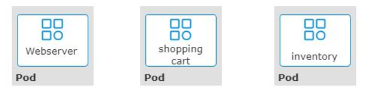

（如图）所以，服务之间必须要相互通信，才能实现功能的完整性。比如用户把一个商品加入购物车，请求会进入到 Webserver，然后转发到 shopping cart 进行处理，并存到数据库。   

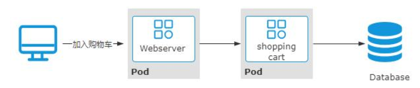

而在这个过程中，每个服务之间必须要知道对方的通信地址，并且当有新的节点加入进来的时候，还需要对这些通信地址进行动态维护。所以，在第一代微服务架构中，每个微服务除了要实现业务逻辑以外，还需要解决上下游寻址、通讯、以及容错等问题。 
（如图）于是，在第二代微服务架构下，引入了服务注册中心来实现服务之间的寻址，并且服务之间的容错机制、负载均衡也逐步形成了独立的服务框架，比如主流的 SpringCloud、或者 Spring Cloud Alibaba。   

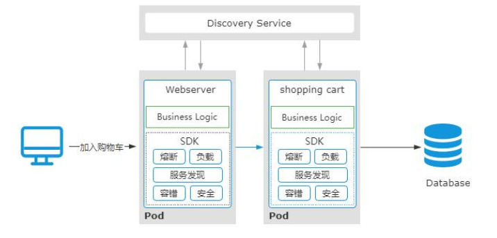

在第二代微服务架构中，负责业务开发的小伙伴不仅仅需要关注业务逻辑，还需要花大量精力去处理微服务中的一些基础性配置工作，虽然 Spring Cloud 已经尽可能去完成了这些事情，但对于开发人员来说，学习 Spring Cloud，以及针对 Spring Cloud 的配置和维护，仍然存在较大的挑战。另外呢，也增加了整个微服务的复杂性。 
实际上，在我看来，“微服务中所有的这些服务注册、容错、重试、安全等工作，都是为了保证服务之间通信的可靠性”。 
于是，就有了第三代微服务架构，Service Mesh。   

（如图）原本模块化到微服务框架里的微服务基础能力，被进一步的从一个 SDK 中演进成了一个独立的代理进程-SideCar
SideCar 的主要职责就是负责各个微服务之间的通信，承载了原本第二代微服务架构中的服务发现、调用容错、服务治理等功能。使得微服务基础能力和业务逻辑迭代彻底解耦。   

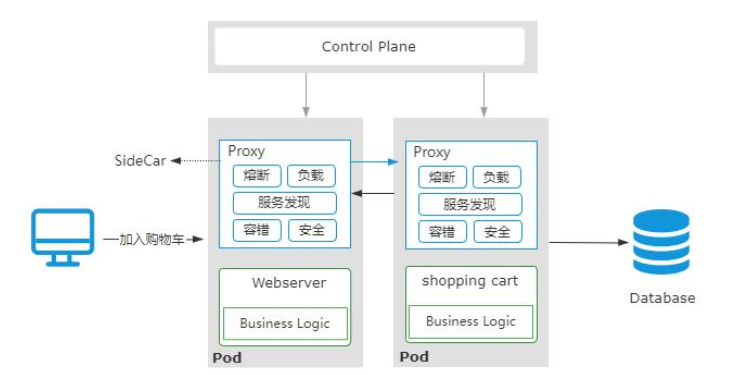

之所以我们称 Service Mesh 为服务网格，是因为在大规模微服务架构中，每个服务的通信都是由 SideCar 来代理的，各个服务之间的通信拓扑图，看起来就像一个网格形状（如图）。 

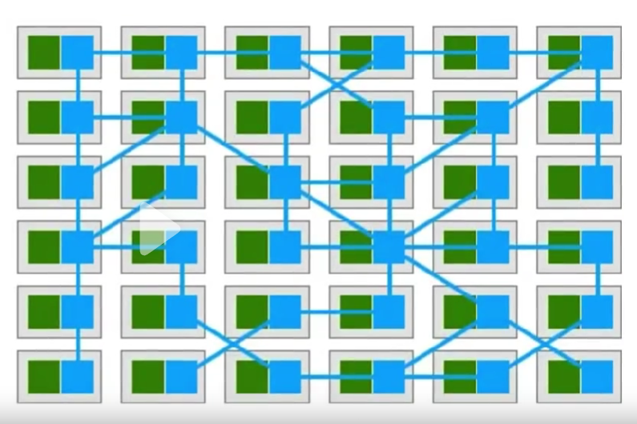

Istio 是目前主流的 Service Mesh 开源框架。 
以上就是我对服务网格的理解。   

#### 结尾

Service Mesh 架构其实就是云原生时代的微服务架构，对于大部分企业来说，仍然是处在第二代微服务架构下。 
所以，很多小伙伴不一定能够知道。  