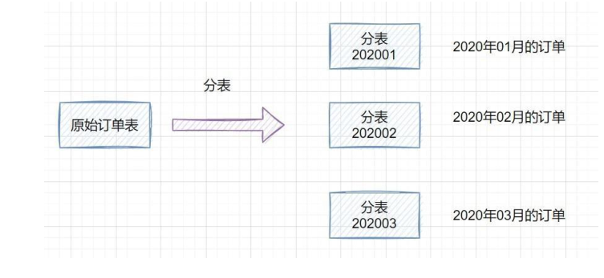

## springboot

### Spring Boot 约定优于配置，你的理解是什么

资料来源：[Spring Boot 约定优于配置，你的理解是什么](https://www.toutiao.com/video/7072300941218677256/)

### Spring Boot 自动装配机制的原理？

资料来源：[Spring Boot 自动装配机制的原理？](https://www.toutiao.com/video/7078998564252156446/?from_scene=all)

### Spring Boot 自动装配机制的原理？

资料来源：[面试28K的高级开发，被问：Spring Boot 自动装配机制的原理？](https://www.toutiao.com/video/7078998564252156446/)

### SpringBoot如何解决跨域问题？

资料来源：[【Java面试】SpringBoot如何解决跨域问题？](https://www.toutiao.com/video/7250372149167587843/)

### 如何理解Spring Boot中的Starter？看完高手的回答简直就像教科书
[如何理解Spring Boot中的Starter？看完高手的回答简直就像教科书](https://www.toutiao.com/video/7091928878859584007/?from_scene=all)

### 谈谈你对分布式和微服务的理解
[谈谈你对分布式和微服务的理解](https://www.toutiao.com/video/7111211129317261855/?from_scene=all)

## 微服务

### 是微服务架构嘛？如果你来设计一个类似淘宝 的系统，你怎么划分微服务？  

- 1. 可以按业务领域、功能、重要程度进行划分。
- 2. 可以按业务领域，按照用户、社区、商品信息、消息等模块等划分。
- 3. 单一功能职责，按功能拆分，比如订单、支付、物流、权限。
- 4. 按重要程度划分，区分核心和非核心功能，比如支付、订单就是核心功能  

### 你们 是怎么分库分表 的？分布式 ID 如何生成？

如果是我们公司的话，使用了水平分库的方式，就是一个用户注册时，就划分了属于哪个数据库，然后具体的表结构是一样的。 
业界还有垂直分库，就是按照不同的系统中的不同业务进行拆分，比如拆分成用户库、订单库、积分库、商品库，把它们部署在不同的数据库服务器。 
分表的话也有水平分表和垂直分表，垂直分表就是将一些不常用的、数据较大或者长度较长的列拆分到另外一张表，水平分表就是可以按照某种规则（如 hash 取模、range），把数据切分到多张表去。一张订单表，按时间 range 拆分如下   

range 划分利于数据迁移，但是存在数据热点问题。hash 取模划分，不会存在明显的热点问题，但是不利于扩容。可以 range+hash 取模结合使用。 
**分布式 ID 可以使用雪花算法生成** 
雪花算法是一种生成分布式全局唯一 ID 的算法，生成的 ID 称为 SnowflakeIDs。这种算法由 Twitter 创的。 
分布式 ID 可以使用雪花算法生成一个 Snowflake ID 有 64 位。 

-  第 1 位：Java 中 long 的最高位是符号位代表正负，正数是 0，负数是 1，一般生 成 ID 都为正数，所以默认为 0。 
- 接下来前 41 位的时间戳，表示了自选定的时期以来的毫秒数。 
-  接下来的 10 位代表计算机 ID，防止冲突。 
-  其余 12 位代表每台机器上生成 ID ✁序列号，这允许在同一毫秒内创建多个Snowflake ID   

### 服务网格是微服务架构的更进一步升级，什么是服务网格？

[服务网格是微服务架构的更进一步升级，什么是服务网格？](https://www.toutiao.com/video/7080089211843543565/?from_scene=all)

