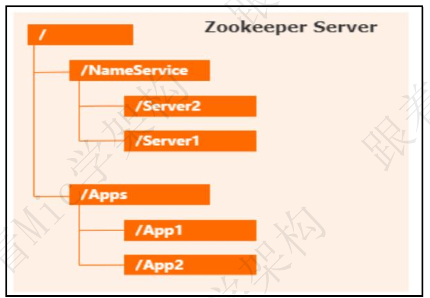
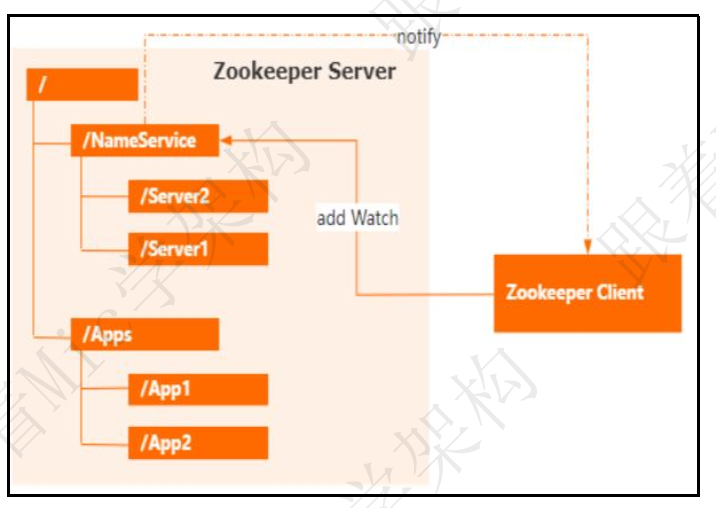
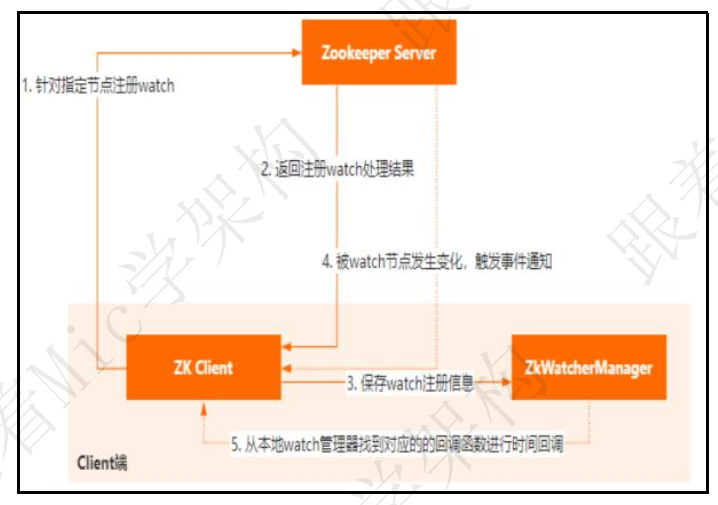
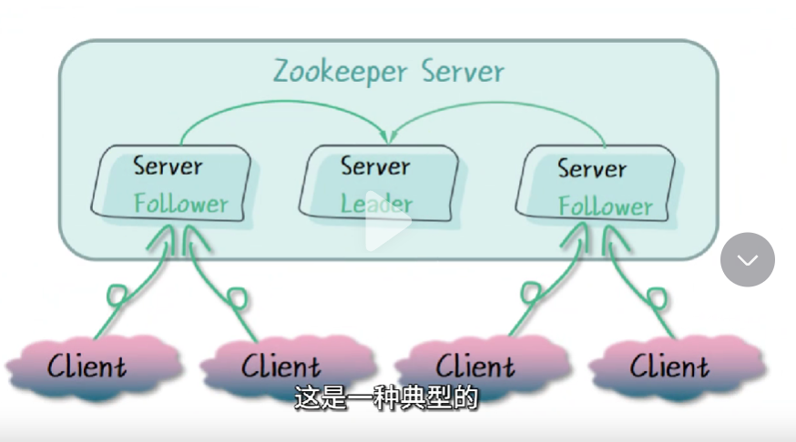
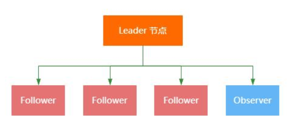
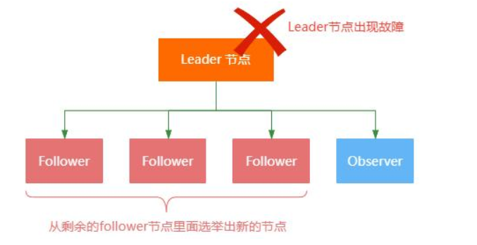
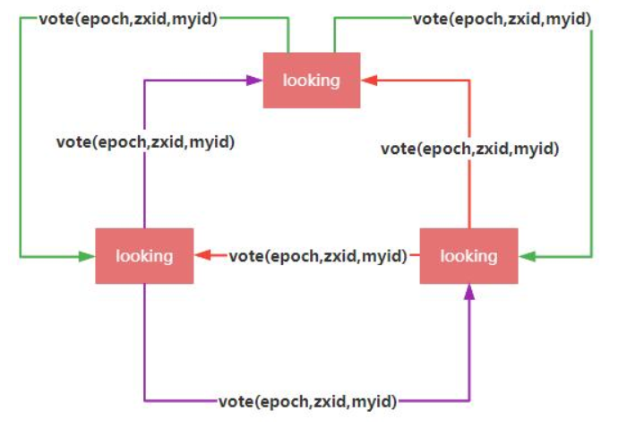

### Zookeeper中的Watch机制的原理？

资料来源：[ Zookeeper中的Watch机制的原理？](https://www.toutiao.com/video/7090044424264090120/)

一个工作了 7 年的粉丝， 遇到了一个 Zookeeper 的问题。

因为接触过 Zookeeper 这个技术， 不知道该怎么回答。
我说一个工作了 7 年的程序员， 没有接触过主流技术， 这不正常。
于是我问了他工资以后， 我理解了！
好吧， 关于“Zookeeper 中 Watch 机制的实现原理”， 看看普通人和高手的回答。  

#### 高手

好的， 这个问题我打算从两个方面来回答。
Zookeeper 是一个分布式协调组件， 为分布式架构下的多个应用组件提供了顺序访问控制能力。
它的数据存储采用了类似于文件系统的树形结构， 以节点的方式来管理存储在Zookeeper 上的数据  

Zookeeper 提供了一个 Watch 机制， 可以让客户端感知到 Zookeeper Server上存储的数据变化， 这样一种机制可以让 Zookeeper 实现很多的场景， 比如配置中心、 注册中心等。  

Watch 机制采用了 Push 的方式来实现， 也就是说客户端和 Zookeeper Server会建立一个长连接， 一旦监听的指定节点发生了变化， 就会通过这个长连接把变化的事件推送给客户端。
Watch 的具体流程分为几个部分：
首先， 是客户端通过指定命令比如 exists、 get， 对特定路径增加 watch
然后服务端收到请求以后， 用 HashMap 保存这个客户端会话以及对应关注的节点路径， 同时客户端也会使用 HashMap存储指定节点和事件回调函数的对应关系。
当服务端指定被 watch 的节点发生变化后， 就会找到这个节点对应的会话， 把变化的事件和节点信息发给这个客户端。
客户端收到请求以后， 从 ZkWatcherManager 里面对应的回调方法进行调用，完成事件变更的通知。  

以上就是我对这个问题的理解！
#### 面试点评
这个面试题呢， 我认为考察的价值也很大， 其实对于服务端的数据变更通知，无非就是 pull 和 push 两种方案， 而这道题里面涉及到的技术点就是 push 的实现。
在业务开发里面， 也可能会涉及到类似的场景， 比如消息通知， 扫码登录等。
如果你了解这些思想， 那在解决这类问题的时候， 会变得更加从容。
好的， 本期的普通人 VS 高手面试系列的视频就到这里结束了。
我是 Mic， 一个工作了 14 年的 Java 程序员， 咱们下期再见。  

### 谈谈你对Zookeeper的理解

资料来源：[谈谈你对Zookeeper的理解，普通人和高手有什么区别？](https://www.toutiao.com/video/7031460439535911460/)

普通人
Zookeeper 是一种开放源码的分布式应用程序协调服务
是一个分布式的小文件存储系统
一般对开发者屏蔽分布式应用开发过过程种的底层细节
用来解决分布式集群中应用系统的一致性问题
高手
对于 Zookeeper 的理解，我觉得可以从分布式系统中的三种典型应用场景说起：
 第一种：集群管理
在多个节点组成的集群中，为了保证集群的 HA 特性，每个节点都会冗余一份数据副本。
这种情况下需要保证客户端访问集群中的任意一个节点都是最新的数据。
 第二种：分布式锁
如何保证跨进程的共享资源的并发安全性，对于分布式系统来说也是一个比较大的
挑战，而为了达到这样一个目的，必须要使用跨进程的锁也就是分布式锁来实现。
 第三种：Master 选举
在多个节点组成的集群中，为了降低集群数据同步的复杂度，一般会存在 Master 和
Slave 两种角色的节点，Master 负责事务和非事务请求处理，Slave 负责非事务请求处
理。但是在分布式系统中如何确定某个节点是 Master 还是 Slave，也成了一个难度不
小的挑战。
基于这三类常见场景的需求，所以产生了 Zookeeper 这样一个中间件。
它是一个分布式开源协调组件，简单来说，就是类似于一个裁判员的角色，专门负责协
调和解决分布式系统中的各类问题。
比如，针对上述描述的问题，Zookeeper 都可以解决。（这个地方每次讲解一个点，
都需要突出标题）
\1. 集群管理（凸显）
Zookeeper 提供了 CP 的模型，来保证集群中的每个节点的数据一致性，当然 Zk 本
身的集群并不是 CP 模型，而是顺序一致性模型，如果要保证 CP 特性，需要调用`sync`
同步方法。
\2. 分布式锁（凸显）
Zookeeper 提供了多种不同的节点类型，如持久化节点、临时节点、有序节点、容
器节点等，其中对于分布式锁这个场景来说，Zookeeper 可以利用有序节点（插入图
片）的特性来实现。除此之外，还可以利用同一级节点的唯一性特性来实现分布式锁。
\3. Master 选举（凸显）
Zookeeper 可以利用持久化节点来存储和管理其他集群节点的信息，从而进行
Master 选举机制。或者还可以利用集群中的有序节点特性，来实现 Master 选举。
目前主流的 Kafka、Hbase、Hadoop 都是通过 Zookeeper 来实现集群节点的主从
选举。
总的来说，Zookeeper 就是经典的分布式数据一致性解决方案，致力于为分布式应用
提供高性能、高可用，并且具有严格顺序访问控制能力的分布式协调服务。它底层通过
基于 Paxos 算法演化而来的 ZAB 协议实现。
以上就是我对于 Zookeeper 的理解。  

### 为什么Zookeeper集群的节点都是单数？

资料来源：[【Java面试】为什么Zookeeper集群的节点都是单数？](https://www.toutiao.com/video/7290116854083912203/)

#### 问题分析
这个问题呢考察求职者，对于zookeeper集群的深度理解， 
涉及到集群选举、投票、判票机制，我们都知道zookeeper集群最小数量 
至少是三个节点，分别对应一个lead和两个follower，这是一种典型带中心节点的集群架构，lead负责事务的处理和数据的同步，follower节点负责数据的查询以及当leader出现故障以后，follower节点需要被选举成为新的额leader 
继续对外提供服务。 
实际上再zookeeper集群中，还提供了一个observer节点，这个节点不参与整个集群的选举和投票，只负责对外提供数据的查询功能，可用来提高集群的数据查询性能 

#### 问题解答
zookeeper集群设计为奇数节点，主要是为了容错和选举的需要， 
zookeeper在设计的时候采用了一种叫zab的一致性协议，为了保证系统的正常运行和服务的可用性。zab协议需要大多数节点正常运行，也就是少数服从多数，这个我们称为过半机制，如果zookeeper集群中有n个节点，那么至少需要n/2+1个节点去正常运行，系统才能正常对外提供服务。 所以对这个问题来说我认为有两个原因：

- 1.偶数节点并不能提供系统的容错能力，反而会增加系统开销，。假设我们3个节点，那么按照过半机制。整个集群中最多能够容忍
  一个节点宕机，如果有4个节点集群中依然只能容忍一个节点宕机才能满足过半机制的判定条件 
- 2、当集群在进行leader选举的时候，如果节点的总数是偶数。就有可能出现两个子集各占一半的情况。从二导致选举无法完成，但是如果节点总数是奇数，就不会出现这个问题

以上就是我对这个问题的理解

### Zookeeper如何实现Leader选举

资料来源：[【Java面试】大厂必问并发编程面试题，Zookeeper如何实现Leader选举？](https://www.toutiao.com/video/7104112611561734669/)

Hi，大家好，我是 Mic，一个工作了 14 年的程序员和创业者。 
一个工作了 7 年的粉丝，最近去面试遇到 Zookeeper 里面的一个问题。 
因为平时很少研究，所以面试的时候只能一个劲的说：不知道。 
他觉得很尴尬，于是来问我，：“Zookeeper 是如何实现 Leader 选举的”。 
我说，这个问题已经用文档整理好可，你直接在我主页加 V 领取就行。 
下面看看普通人和高手对这个问题的回答 
普通人

#### 高手

好的。（如图）首先，Zookeeper 集群节点由三种角色组成，分别是 
-   Leader，负责所有事务请求的处理，以及过半提交的投票发起和决策。 
-  Follower，负责接收客户端的非事务请求，而事务请求会转发给 Leader 节点来处理，另外，Follower 节点还会参与 Leader 选举的投票。 
-  Observer，负责接收客户端的非事务请求，事务请求会转发给 Leader 节点来处理，另外 Observer 节点不参与任何投票，只是为了扩展 Zookeeper 集群来分担读操作的压力。 

其次，Zookeeper 集群是一种典型的中心化架构，也就是会有一个 Leader 作为决策节点， 
专门负责事务请求的处理和数据的同步。 
这种架构的好处是可以减少集群架构里面数据同步的复杂度，集群管理会更加简单和稳定。 
但是，会带来 Leader 选举的一个问题，也就是说，（如图）如果 Leader 节点宕机了，为了保证集群继续提供可靠的服务，
Zookeeper 需要从剩下的 Follower 节点里面去选举一个新的节点作为 Leader，也就是所谓的 Leader 选举！ 

（如图）具体的实现是， 
每一个节点都会向集群里面的其他节点发送一个票据 Vote，这个票据包括三个属性。 

-  epoch， 逻辑时钟，用来表示当前票据是否过期。 
-  zxid，事务 id，表示当前节点最新存储的数据的事务编号 
-  myid，服务器 id，在 myid 文件里面填写的数字。 

每个节点都会选自己当 Leader，所以第一次投票的时候携带的是当前节点的信息。 
接下来每个节点用收到的票据和自己节点的票据做比较，根据 epoch、zxid、myid 的顺序逐一比较，以值最大的一方获胜。比较结束以后这个节点下次再投票的时候，发送的投票请求就是获胜的 Vote 信息。 

然后通过多轮投票以后，每个节点都会去统计当前达成一致的票据，以少数服从多数的方式，最终获得票据最多的节点成为 Leader。 
以上就是我对这个问题的理解。 
最后我再补充一下，选择 epoch/zxid/myid 作为投票评判依据的原因，我是这么理解的。 
epoch ，因为网络通信延迟的可能性，有可能在新一轮的投票里面收到上一轮投票的票据，这种数据应该丢弃，否则会影响投票的结果和效率。 
zxid， zxid 越大，说明这个节点的数据越接近 leader，所以用 zxid 做判断条件是为了避免数据丢失的问题 
myid， 服务器 id，这个是避免投票时间过长，直接用 myid 最大值作为快速终结投票的属性。 
嗯！ 

#### 面试点评

Leader 选举是一个比较复杂的问题，它涉及到集群节点的数据一致性算法。 
在很多中间件里面都有涉及到类似的问题，这个思想其实还是很有研究价值的。 
除此之外，还有 Paxos、raft、等一致性算法。 
好的，本期的普通人 VS 高手面试系列的视频就到这里结束了 
大家记得点赞收藏加关注 
我是 Mic，咱们下期再见！  

 