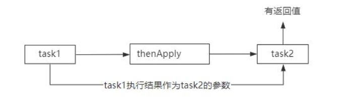
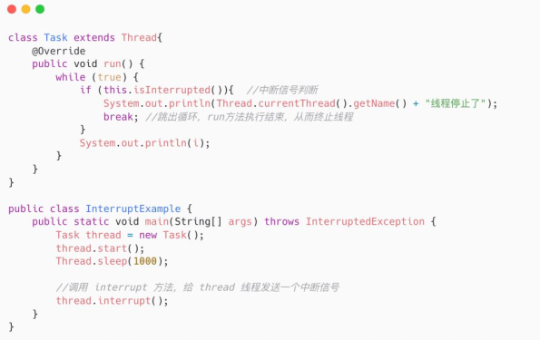
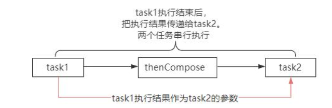
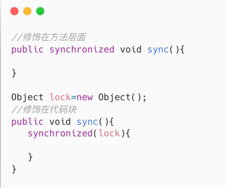

## 线程

### 解释一下Java的内存模型和happens-before规则？

资料来源：[解释一下Java的内存模型和happens-before规则？](https://www.toutiao.com/video/7316364363118739994/)

“请你说一下你对 Happens-Before 的理解” 
屏幕前的你，听到这个问题的时候，知道怎么回答吗？ 
Hi，大家好，我是 Mic，一个工作了 14 年的 Java 程序员。 
并发编程是面试过程中重点考察的方向，能够考察的方向有很多 
关于这个问题，我把高手回答整理到了 15W 字的面试文档里面 
大家可以在我的主页加 V 领取 
下面看看普通人和高手的回答。   

#### 高手

好的，这个问题我需要从几个方面来回答。 
首先，Happens-Before 是一种可见性模型，也就是说，在多线程环境下。原本因为指令重排序的存在会导致数据的可见性问题，也就是 A 线程修改某个共享变量对 B 线程不可见。因此，JMM 通过 Happens-Before 关系向开发人员提供跨越线程的内存可见性保证。 
如果一个操作的执行结果对另外一个操作可见，那么这两个操作之间必然存在Happens-Before 管理。 
其次，Happens-Before 关系只是描述结果的可见性，并不表示指令执行的先后顺序，也就是说只要不对结果产生影响，仍然允许指令的重排序。 
最后，在 JMM 中存在很多的 Happens-Before 规则。 

- 程序顺序规则，一个线程中的每个操作，happens-before 这个线程中的任意后续操作，可以简单认为是 as-if-serial
  也就是不管怎么重排序，单线程的程序的执行结果不能改变 
  
- 传递性规则（如图），也就是 A Happens-Before B，B Happens-Before C。就可以推导出 A Happens-Before C。   

- volatile 变量规则，对一个 volatile 修饰的变量的写一定 happens-before 于任意后续对这个 volatile 变量的读操作 

- 监视器锁规则（如图），一个线程对于一个锁的释放锁操作，一定 happens-before 与后续线程对这个锁的加锁操作。 
  在这个场景中，如果线程 A 获得了锁并且把 x 修改成了 12，那么后续的线程获得锁之后得到的 x 的值一定是 12   

- 线程启动规则（如图），如果线程 A 执行操作 ThreadB.start(),那么线程 A 的ThreadB.start()之前的操作 happens-before 线程 B 中的任意操作。 
  在这样一个场景中，t1 线程启动之前对于 x=10 的赋值操作，t1 线程启动以后读取 x的值一定是 10.   

- join 规则（如图），如果线程 A 执行操作 ThreadB.join()并成功返回， 
  那么线程 B 中的任意操作 happens-before 于线程 A 从 ThreadB.join()操作成功的返回。  

以上就是我对 Happens-Before 的理解。 

#### 面试点评

Happens-Before 模型，在多线程开发中是必须要理解和掌握的规则。它能够指引开发者在使用多线程开发的时候避免出现内存可见性问题 
因此这道面试题其实也是考察求职者的基础能力好的， 
今天的视频就到这里结束了 
大家记得点赞收藏加关注 
我是 Mic，咱们下期再见   

### 谈谈你对线程安全的理解

资料来源：[谈谈你对线程安全的理解](https://www.toutiao.com/video/7085655943110722062/?from_scene=all)

Hi， 大家好， 我是 Mic 
一个工作了 4 年的小伙伴， 遇到了一个非常抽象的面试题， 说说你对线程安全性的理解。 
这类问题， 对于临时刷面试题来面试的小伙伴， 往往是致命的。 
一个是不知道从何说起， 也就是语言组织比较困难。 
其次就是， 如果对于线程安全性没有一定程度的理解， 一般很难说出你的理解。 
ok， 我们来看看这个问题的回答。   

#### 高手

简单来说， 在多个线程访问某个方法或者对象的时候， 不管通过任何的方式调用以及线程如何去交替执行。 
在程序中不做任何同步干预操作的情况下， 这个方法或者对象的执行/修改都能按照预期的结果来反馈， 那么这个类就是线程安全的。
实际上， 线程安全问题的具体表现体现在三个方面， **原子性**、 **有序性**、 **可见性**。 
**原子性**呢， 是指当一个线程执行一系列程序指令操作的时候， 它应该是不可中断的， 因为一旦出现中断， 站在多线程的视角来看， 这一系列的程序指令会出现前后执行结果不一致的问题。 
这个和数据库里面的原子性是一样的， 简单来说就是一段程序只能由一个线程完整的执行完成， 而不能存在多个线程干扰。
CPU 的 上 下 文 切 换 ， 是 导 致 原 子 性 问 题 的 核 心 ， 而 JVM 里 面 提 供 了Synchronized 关键字来解决原子性问题  

**可见性**， 就是说在多线程环境下， 由于读和写是发生在不同的线程里面， 有可能出现某个线程对共享变量的修改， 对其他线程不是实时可见的。 
导致可见性问题的原因有很多， 比如 CPU 的高速缓存、 CPU 的指令重排序、 编译器的指令重排序。 
**有序性**， 指的是程序编写的指令顺序和最终 CPU 运行的指令顺序可能出现不一致的现象， 这种现象也可以称为指令重排序， 所以有序性也会导致可见性问题。 
可见性和有序性可以通过 JVM 里面提供了一个 Volatile 关键字来解决。 
在我看来， 导致有序性、 原子性、 可见性问题的本质， 是计算机工程师为了最大化提升 CPU 利用率导致的。 比如为了提升 CPU 利用率， 设计了三级缓存、 设计了 StoreBuffer、 设计了缓存行这种预读机制、 在操作系统里面， 设计了线程模型、 在编译器里面， 设计了编译器的深度优化机制。 
一上就是我对这个问题的理解。 

#### 面试点评

从高手的回答中， 可以很深刻的感受到， 他对于计算机底层原理和线程安全性相关的底层实现是理解得很透彻的。  
对我来说， 这个人去写程序代码， 不用担心他滥用线程导致一些不可预测的线程安全性问题了， 这就是这个面试题的价值。  
好的， 本期的普通人 VS 高手面试系列的视频就到这里结束了， 喜欢的朋友记得点赞和收藏。  
另外， 这些面试题我都整理成了笔记， 大家有需要的可以私信获取。  
我是 Mic， 一个工作了 14 年的 Java 程序员， 咱们下期再见  

### 什么是守护线程，它有什么特点？

资料来源：[什么是守护线程，它有什么特点？](https://www.toutiao.com/video/7101505375253299748/?from_scene=all)

守护线程， 它是一种专门为用户线程提供服务的线程， 它的生命周期依赖于用户线程。 
只有 JVM 中仍然还存在用户线程正在运行的情况下， 守护线程才会有存在的意义。 
否则， 一旦 JVM 进程结束， 那守护线程也会随之结束。 
也就是说， 守护线程不会阻止 JVM 的退出。 但是用户线程会！ 
守护线程和用户线程的创建方式是完全相同的， 我们只需要调用用户线程里面的setDaemon 方法并且设置成 true， 就表示这个线程是守护线程。 
因为守护线程拥有自己结束自己生命的特性， 所以它适合用在一些后台的通用服务场景里面。 
比如 JVM 里面的垃圾回收线程， 就是典型的使用场景。 
这个场景的特殊之处在于， 当 JVM 进程技术的时候， 内存回收线程存在的意义也就不存在了。 
所以不能因为正在进行垃圾回收导致 JVM 进程无法技术的问题。 
但是守护线程不能用在线程池或者一些 IO 任务的场景里面， 因为一旦 JVM 退出之后， 守护线程也会直接退出。 
就会可能导致任务没有执行完或者资源没有正确释放的问题。

### 如果一个线程两次调用start()，会出现什么问题？

资料来源：[如果一个线程两次调用start()，会出现什么问题？](https://www.toutiao.com/article/7129058773071299103/)

在 Java 里面， 一个线程只能调用一次 start() 方法， 第二次调用会抛出IllegalThreadStateException。
一个线程本身是具备一个生命周期的。
在 Java 里面， 线程的生命周期包括 6 种状态。
**NEW**， 线程被创建还没有调用 start 启动 
**RUNNABLE**， 在这个状态下的线程有可能是正在运行， 也可能是在就绪队列里
面等待操作系统进行调度分配 CPU 资源。 
**BLOCKED**， 线程处于锁等待状态。 
**WAITING**， 表示线程处于条件等待状态， 当触发条件后唤醒， 比如 wait/notify。 
**TIMED_WAIT**， 和 WAITING 状态相同， 只是它多了一个超时条件触发。 
**TERMINATED**， 表示线程执行结束。 
当我们第一次调用 start()方法的时候， 线程的状态可能处于终止或者非 NEW 状态下的其他状态。 
再调用一次 start()， 相当于让这个正在运行的线程重新运行， 不管从线程的安全性角度， 还是从线程本身的执行逻辑， 都是不合理的。 
因此为了避免这个问题， 在线程运行的时候会先判断当前线程的运行状态。 
以上就是我对这个问题的理解

### 答对轻松拿offer说一下你对CompletableFuture的理解

资料来源：[答对轻松拿offer说一下你对CompletableFuture的理解](https://www.toutiao.com/video/7104141316065329700/)

Hi，大家好，我是 Mic，一个工作了 14 年的程序员和创业者。 
一个工作了 4 年的粉丝，很兴奋的和我说，他拿到了字节跳动的 offer 
评级是 2-1 ，相当于阿里的 p6。 
他说多亏了面试之前每天刷我的面试短视频。 
这种正向反馈，让我觉得做这个事情很有价值。 
好的，今天给大家分享一道并发编程的面试题。 
“请你说一下你对 CompletableFuture 的理解”。 
关于这个问题的高手部分的回答，我整理成了文档，可以在我的主页加 V 领取。 
下面看看普通人和高手对这个问题的回答。 

#### 高手
好的，面试官。  CompletableFuture 是 JDK1.8 里面引入的一个基于事件驱动的异步回调类。 
简单来说，就是当使用异步线程去执行一个任务的时候，我们希望在任务结束以后触发一个后续的动作。 
而 CompletableFuture 就可以实现这个功能。 
（如图），举个简单的例子，比如在一个批量支付的业务逻辑里面， 
涉及到查询订单、支付、发送邮件通知这三个逻辑。 
这三个逻辑是按照顺序同步去实现的，也就是先查询到订单以后，再针对这个订单发起支付，支付成功以后再发送邮件通知。 
而这种设计方式导致这个方法的执行性能比较慢。   

所以，这里可以直接使用 CompletableFuture，（如图），也就是说把查询订单的逻辑放在一个异步线程池里面去处理。 
然后基于 CompletableFuture 的事件回调机制的特性，可以配置查询订单结束后自动触发支付，支付结束后自动触发邮件通知。 
从而极大的提升这个这个业务场景的处理性能！ 

CompletableFuture 提供了 5 种不同的方式，把多个异步任务组成一个具有先后关系的处理链，然后基于事件驱动任务链的执行   

-  第一种，thenCombine（如图），把两个任务组合在一起，当两个任务都执行结
  束以后触发事件回调。  

- 第二种，thenCompose（如图），把两个任务组合在一起，这两个任务串行执行，
  也就是第一个任务执行完以后自动触发执行第二个任务。  

- 第三种，thenAccept(如图)，第一个任务执行结束后触发第二个任务，并且第一个任务的执行结果作为第二个任务的参数，这个方法是纯粹接受上一个任务的结果，不返回新的计算值。  

- 第四种，thenApply（如图），和 thenAccept 一样，但是它有返回值  

- 第五种，thenRun（如图），就是第一个任务执行完成后触发执行一个实现了Runnable 接口的任务。  

最后，我认为，CompletableFuture 弥补了原本 Future 的不足，使得程序可以在非阻塞的状态下完成异步的回调机制。
以上就是我对这个问题的理解。
#### 面试点评
CompletableFuture 的使用场景还挺多的，特别是在一些 RPC 通信框架底层。 
所以作为一个能够提升程序性能的异步化组件，大家还是非常有必要去了解它的。 
好的，本期的普通人 VS 高手面试系列的视频就到这里结束了 
大家记得点赞收藏加关注 
我是 Mic，咱们下期再见！   

### wait和sleep是否会触发锁的释放以及CPU资源的释放？

资料来源：[【Java面试】wait和sleep是否会触发锁的释放以及CPU资源的释放？](https://www.toutiao.com/video/7112384560884613640/?from_scene=all)

通过最近这几个月的私信发现一个问题，很多工作了 5~6 年的程序员，去面试的时候但凡问到技术原理。 
基本上都是回答不出来的，有些同学侥幸靠背面试题通过面试，但是这种无法掌控自己选择权的感觉，
你不觉得很难受吗？ 
hi，大家好，我是 Mic，一个没有才华只能靠颜值混饭吃的 Java 程序员。 
一个工作 5 年的粉丝，去美团面试，遇到了这样一个问题。 
“wait 和 sleep 是否会触发锁的释放以及 CPU 资源的释放？” 
其实这个问题还比较简单，它的结论回答出来了，但是后面面试官又问了一个为什么，他就懵了。 
关于这个问题的回答，我整理到了一个 10W 字的面试文档里面，大家可以在我的主页 
加 V 领取。 
下面看看普通人和高手的回答   

#### 高手
好的，面试官。 
Object.wait()方法，会释放锁资源以及 CPU 资源。 
Thread.sleep()方法，不会释放锁资源，但是会释放 CPU 资源。 
首先，wait()方法是让一个线程进入到阻塞状态，而这个方法必须要写在一个Synchronized 同步代码块里面。 
因为 wait/notify 是基于共享内存来实现线程通信的工具，这个通信涉及到条件的竞争，所以在调用这两个方法之前必须要竞争锁资源。 
当线程调用 wait 方法的时候，表示当前线程的工作处理完了，意味着让其他竞争同一个共享资源的线程有机会去执行。 
但前提是其他线程需要竞争到锁资源，所以 wait 方法必须要释放锁，否则就会导致死锁的问题。 
然后，Thread.sleep()方法，只是让一个线程单纯进入睡眠状态，这个方法并没有强制要求加 synchronized 同步锁。 
而且从它的功能和语义来说，也没有这个必要。 
当然，如果是在一个 Synchronized 同步代码块里面调用这个 Thread.sleep，也并不会触发锁的释放。 
最后，凡是让线程进入阻塞状态的方法，操作系统都会重新调度实现 CPU 时间片切换，这样设计的目的是提升 CPU 的利用率。
以上就是我对这个问题的理解。 

#### 面试点评

之前我用这个问题去面试过一些工作 3~5 年的人，有大部分人回答不上来。 
这让我有点意外，正常来说，并发编程是一个非常重要且基础的领域， 
在程序开发中，也是比较常用的技术。还是建议大家去认真学一下。 
好的，本期的普通人 VS 高手面试系列的视频就到这里结束了 
大家记得点赞收藏+关注 
我是 Mic，咱们下期再见！   

### 你能说一下什么是受检异常和非受检异常吗？  

资料来源：[ 面试官：你能说一下什么是受检异常和非受检异常吗？  ](https://www.toutiao.com/video/7098229963794416159/?channel=&source=video)

受检异常好像是需要主动捕获的异常非受检异常应该是不需要捕获的异常
#### 高手的回答
我觉得可以从三个方面回答这个问题

**一、首先是异常的本质**
受检异常和非受检异常，都是继承自 Throwable 这个类中，分别是 Error 和 Exception，Error 是程序报错，系统收到无法处理的错误消息，它和程序本身无关。Excetpion 是指程序运行时抛出需要处理的异常信息如果不主动捕获，则会被 jvm 处理。

**二、然后是对受检异常和非受检异常的定义**
前面说过受检异常和非受检异常均派生自 Exception 这个类。

- 1. 受检异常的定义是程序在编译阶段必须要主动捕获的异常，遇到该异常有两种处理方法通过 try/catch 捕获该异常或者通过 throw 把异常抛出去
- 2. 非受检异常的定义是程序不需要主动捕获该异常，一般发生在程序运行期间，比如NullPointException

**三、最后我还可以说下他们优点和缺点**

受检异常优点有两个：
- 第一，它可以响应一个明确的错误机制，这些错误在写代码的时候可以随时捕获并且能很好的提高代码的健壮性。

- 第二，在一些连接操作中，它能很好的提醒我们关注异常信息，并做好预防工作。  
  不过受检异常的**缺点是**：抛出受检异常的时候需要上声明，而这个做法会直接破坏方法签名导致版本不兼容。这个恶心特性导致我会经常使用 RuntimeException 包装。非受检异常的好处是可以去掉一些不需要的异常处理代码，而不好之处是开发人员可能忽略某些应该处理的异常，导致带来一些隐藏很深的 Bug，比如流忘记关闭？连接忘记释放等。

这些就是我对这个问题的回答！  
各位观众姥爷，对受检异常和非受检异常还有更完整的答案吗？在评论区你写下你对两种异常处理的回答哟~本期的菜鸟 VS 高手系列就到这里就结束了，喜欢的朋友一键三连，加个关注，咱们下期见！    

### 如何中断一个正在运行中的线程？
资料来源：[ 面试被问到并发编程中，如何中断一个正在运行中的线程？  ](https://www.toutiao.com/video/7097845498283262494/)

一个去京东面试的工作了 5 年的粉丝来找我说： 
Mic 老师，你说并发编程很重要，果然我今天又挂在一道并发编程的面试题上了。 
我问他问题是什么，他说：”如何中断一个正在运行中的线程？“。 
我说这个问题很多工作 2 年的人都知道~ 
好吧，对于这个问题，来看看普通人和高手的回答。 

#### 高手
关于这个问题，我从几个方面来回答。 
（如图）首先，线程是系统级别的概念，在 Java 里面实现的线程，最终的执行和调度都是由操作系统来决定的，JVM 只是对操作系统层面的线程做了一层包装而已。 
所以我们在 Java 里面通过 start 方法启动一个线程的时候，只是告诉操作系统这个线程可以被执行，但是最终交给 CPU 来执行是操作系统的调度算法来决定的。   

因此，理论上来说，要在 Java 层面去中断一个正在运行的线程，只能像类似于 Linux里面的 kill 命令结束进程的方式一样，强制终止。 
所以，Java Thread 里面提供了一个 stop 方法可以强行终止，但是这种方式是不安全的，因为有可能线程的任务还没有，导致出现运行结果不正确的问题。 
要想安全的中断一个正在运行的线程，只能在线程内部埋下一个钩子，外部程序通过这个钩子来触发线程的中断命令。 
（如图）因此，在 Java Thread 里面提供了一个 interrupt()方法，这个方法配合isInterrupted()方法使用，就可以实现安全的中断机制。 
这种实现方法并不是强制中断，而是告诉正在运行的线程，你可以停止了，不过是否要中断，取决于正在运行的线程，所以它能够保证线程运行结果的安全性。 
以上就是我对这个问题的理解！   

#### 面试点评
这个问题，很多工作了 5 年以上的小伙伴都不一定清楚。 我想说的是，一味的专注在 CRUD 这种自动化的重复性工作中 除了前面 3 年时间会有很多的成长以外，后续的时间基本上就是在做重复的劳动。 和别人拉开差距恰恰是工作之外的 8 个小时。 
好的，本期的普通人 VS 高手面试系列的视频就到这里结束了 如果觉得作品不错，记得点赞和关注。 我是 Mic，一个工作了 14 年的 Java 程序员，咱们下期再见  

### 多线程篇:@Contended注解有什么用?

资料来源：[多线程篇:@Contended注解有什么用?](https://www.toutiao.com/video/7288592967483261492/?from_scene=all) 

在现代的CPU中，为了提高CPU的利用率，在CPU层面设计了L1、L2、L3三级缓存，缓存以缓存行为单位，进行数据的读取和写入。
缓存行的大小，通常是64个字节。由于多核处理器中的各个核心，在并行执行任务的时候。允许同时读取同一个数据缓存到缓存行中，
那这里就会存在一个潜在的问题，假设存在x/y/z三个变量。占用64个字节空间，当CPU0读取x变量、CPU1读取y变量,CPU0读取x变量的时候，它会一次性的读取64个字节，所以同时会把x/y/z这三个变量都缓存起来，CPU1在读取y变量的时候，也同样会缓存相邻的数据，也会把x/y/z这三个变量都缓存起来。这样在CPU0和CPU1中都缓存了同一份数据。为了保证缓存的一致性，当一个核心修改了一个缓存行中的数据，其他核心的缓存中相同缓存行数据会失效。需要重新从主存中加载最新的数据。那么这个时候问题就出现了。CPU0和Cpu1在不断的竞争同一个缓存行，不断进行失效和重加载。从而导致性能下降。 
这就是所谓的伪共享问题，而@Contented这个注解就可以解决伪共享问题 

#### 问题回答

Contented是java中一个特殊的注解，主要是为了解决伪共享问题 
伪共享是指：在多线程环境下，由于不同线程访问同一缓存行中的不同变量，导致缓存行无效，从而影响程序的性能。为了避免多个线程访问同一个缓存行中的不同变量的问题，可以通过@Contended这个注解来进行修饰，通过这个注解修饰后的变量，可以达到实现缓存行填充的效果。 
也就是如果一个属性，只占用48个字节，Contended注解会继续填充16个字节。从而凑齐64个字节。 
由于缓存行大小是64个字节，所以不同Cpu在加载不同变量的时候。就能够去避免同一个缓存行中出现不同变量的问题。从而去实现缓存行隔离的问题。 
但是在实际使用中我们要注意，这个注解的效果依赖于具体的JVM实现和硬件的构架，而且可能会导致内存占用的增加。在大部分的情况下，合理的内存对齐和数据结构设计是更可靠和高效的伪共享解决 

### volatile关键字有什么用？它的实现原理是什么？

资料来源：[被面试官问：volatile关键字有什么用？它的实现原理是什么？](https://www.toutiao.com/video/7081951851444503053/)

一个工作了 6 年的 Java 程序员，在阿里二面，被问到“volatile”关键字。 
然后，就没有然后了… 
同样，另外一个去美团面试的工作 4 年的小伙伴，也被“volatile 关键字“。 
然后，也没有然后了… 
这个问题说实话，是有点偏底层，但也的确是并发编程里面比较重要的一个关键字。 
下面，我们来看看普通人和高手对于这个问题的回答吧。   

#### 普通人

嗯… volatile 可以保证可见性。

#### 高手

volatile 关键字有两个作用。

- 1. 可以保证在多线程环境下共享变量的可见性。 
- 2. 通过增加内存屏障防止多个指令之间的重排序。 

我理解的可见性，是指当某一个线程对共享变量的修改，其他线程可以立刻看到修改之后的值。 
其实这个可见性问题，我认为本质上是由几个方面造成的。

### 说一下你对 CompletableFuture 的理解

资料来源：[说一下你对 CompletableFuture 的理解](https://www.toutiao.com/video/7104141316065329700/?channel=&source=video)

Hi，大家好，我是 Mic，一个工作了 14 年的程序员和创业者。 
一个工作了 4 年的粉丝，很兴奋的和我说，他拿到了字节跳动的 offer 
评级是 2-1 ，相当于阿里的 p6。 
他说多亏了面试之前每天刷我的面试短视频。 
这种正向反馈，让我觉得做这个事情很有价值。 
好的，今天给大家分享一道并发编程的面试题。 
“请你说一下你对 CompletableFuture 的理解”。 
关于这个问题的高手部分的回答，我整理成了文档，可以在我的主页加 V 领取。 
下面看看普通人和高手对这个问题的回答。 

#### 高手

好的，面试官。 
CompletableFuture 是 JDK1.8 里面引入的一个基于事件驱动的异步回调类。 
简单来说，就是当使用异步线程去执行一个任务的时候，我们希望在任务结束以后触发一个后续的动作。而 CompletableFuture 就可以实现这个功能。 
（如图），举个简单的例子，比如在一个批量支付的业务逻辑里面，涉及到查询订单、支付、发送邮件通知这三个逻辑。 
这三个逻辑是按照顺序同步去实现的，也就是先查询到订单以后，再针对这个订单发起支付，支付成功以后再发送邮件通知。而这种设计方式导致这个方法的执行性能比较慢。   

所以，这里可以直接使用 CompletableFuture，（如图），也就是说把查询订单的逻辑放在一个异步线程池里面去处理。
然后基于 CompletableFuture 的事件回调机制的特性，可以配置查询订单结束后自动触发支付，支付结束后自动触发邮件通知。
从而极大的提升这个这个业务场景的处理性能   

CompletableFuture 提供了 5 种不同的方式，把多个异步任务组成一个具有先后关系的处理链，然后基于事件驱动任务链的执行。 

- 第一种，thenCombine（如图），把两个任务组合在一起，当两个任务都执行结束以后触发事件回调。   

- 第二种，thenCompose（如图），把两个任务组合在一起，这两个任务串行执行，也就是第一个任务执行完以后自动触发执行第二个任务   

- 第三种，thenAccept(如图)，第一个任务执行结束后触发第二个任务，并且第一个任务的执行结果作为第二个任务的参数，这个方法是纯粹接受上一个任务的结果，不返回新的计算值。   

- 第五种，thenRun（如图），就是第一个任务执行完成后触发执行一个实现了Runnable 接口的任务   

最后，我认为，CompletableFuture 弥补了原本 Future 的不足，使得程序可以在非阻塞的状态下完成异步的回调机制。
以上就是我对这个问题的理解。 

#### 面试点评

CompletableFuture 的使用场景还挺多的，特别是在一些 RPC 通信框架底层。 
所以作为一个能够提升程序性能的异步化组件，大家还是非常有必要去了解它的。 
好的，本期的普通人 VS 高手面试系列的视频就到这里结束了 
大家记得点赞收藏加关注 
我是 Mic，咱们下期再见！   

## ThreadLocal

### 每天CRUD，日常也不用ThreadLocal啊，为什么面试会问ThreadLocal

资料来源：[每天CRUD，日常也不用ThreadLocal啊，为什么面试会问ThreadLocal](https://www.toutiao.com/video/7084186464350634509/?from_scene=all) 

好的， 这个问题我从三个方面来回答。 
ThreadLocal 是一种线程隔离机制， 它提供了多线程环境下对于共享变量访问的安全性。 
在多线程访问共享变量的场景中， 一般的解决办法是对共享变量加锁， 从而保证在同一时刻只有一个线程能够对共享变量进行更新， 并且基于 Happens-Before
规则里面的监视器锁规则， 又保证了数据修改后对其他线程的可见性。 

 
但是加锁会带来性能的下降， 所以 ThreadLocal 用了一种空间换时间的设计思想， 
也就是说在每个线程里面， 都有一个容器来存储共享变量的副本， 然后每个线程只对自己的变量副本来做更新操作， 这样既解决了线程安全问题， 又避免了多线
程竞争加锁的开销 

 
ThreadLocal 的 具 体 实 现 原 理 是 ， 在 Thread 类 里 面 有 一 个 成 员 变 量ThreadLocalMap， 它专门来存储当前线程的共享变量副本， 后续这个线程对于共享变量的操作， 都是从这个 ThreadLocalMap 里面进行变更， 不会影响全局共享变量的值。 
以上就是我对这个问题的理解。 

### 这么回答提升30%的面试通过率，ThreadLocal出现内存泄露吗？

文字教程 [「Java」这么回答提升30%的通过率，ThreadLocal出现内存泄露吗？](https://www.toutiao.com/article/7146028552499151393/)

视频教程 [「Java」这么回答提升30%的通过率，ThreadLocal出现内存泄露吗？](https://www.toutiao.com/video/7136849327271608840/)

ThreadLocal是一个用来解决线程安全性问题的工具。 
它相当于让每个线程都开辟一块内存空间，用来存储共享变量的副本。 
然后每个线程只需要访问和操作自己的共享变量副本即可，从而避免多线程竞争同一个共享资源。 
它的工作原理很简单每个线程里面有一个成员变量ThreadLocalMap。 
当线程访问用ThreadLocal修饰的共享数据的时候这个线程就会在自己成员变量ThreadLocalMap里面保存一份数据副本。 
key指向ThreadLocal这个引用，并且是弱引用关系，而value保存的是共享数据的副本。 
因为每个线程都持有一个副本，所以就解决了线程安全性问题。 

这个问题考察的是内存泄漏，所以必然和对象引用有关系。 ThreadLocal中的引用关系如图所示，Thread中的成员变量ThreadLocalMap，它里面的可以key指向ThreadLocal这个成员变量，并且它是一个弱引用所谓弱引用，就是说成员变量ThreadLocal允许在这种引用关系存在的情况下，被GC回收。 一旦被回收，key的引用就变成了null，就会导致这个内存永远无法被访问，造成内存泄漏。 

那到底ThreadLocal会不会存在内存泄漏呢？ 
从ThreadLocal本身的设计上来看，是一定存在的。 
可能有些小伙伴忍不住想怼我了，如果这个线程被回收了，那线程里面的成员变量都会被回收。 
就不会存在内存泄漏问题啊？ 
这样理解没问题，但是在实际应用中，我们一般都是使用线程池，而线程池本身是重复利用的所以还是会存在内存泄漏的问题。 
除此之外啊，ThreadLocal为了避免内存泄漏问题，当我们在进行数据的读写时，ThreadLocal默认会去尝试做一些清理动作，找到并清理Entry里面key为null的数据。 
但是，它仍然不能完全避免，有同学就问了，那怎么办啊！！！ 
有**两个方法可以避免**： 

- 每次使用完ThreadLocal以后，主动调用remove()方法移除数据
- 把ThreadLocal声明称全局变量，使得它无法被回收

ThreadLocal本身的设计并不复杂，要想深入了解，建议大家去看看源码！ 

#### 回答：

我认为，不恰当的使用ThreadLocal，会造成内存泄漏问题。 
主要原因是，线程的私有变量ThreadLocalMap里面的key是一个弱引用。 
弱引用的特性，就是不管是否存在直接引用关系，当成员ThreadLocal没用其他的强引用关系的时候，这个对象会被GC回收掉。 
从而导致key可能变成null，造成这块内存永远无法访问，出现内存泄漏的问题。 

**规避内存泄漏的方法有两个：**

通过扩大成员变量ThreadLoca的作用域，避免被GC回收 
每次使用完ThreadLocal以后，调用remove方法移除对应的数据 
第一种方法虽然不会造成key为null的现象，但是如果后续线程不再继续访问这个key。也会导致这个内存一直占用不释放，最后造成内存溢出的问题。 
所以我认为最好是在使用完以后调用remove方法移除。 

## AQS

### 谈谈你对AQS的理解

资料来源：[谈谈你对AQS的理解](https://www.toutiao.com/video/7071116552212316708/?from_scene=all) 

QS 是多线程同步器， 它是 J.U.C 包中多个组件的底层实现， 如 Lock、CountDownLatch、 Semaphore 等都用到了 AQS. 
从本质上来说， AQS 提供了两种锁机制， 分别是排它锁， 和共享锁。 
排它锁， 就是存在多线程竞争同一共享资源时， 同一时刻只允许一个线程访问该共享资源， 也就是多个线程中只能有一个线程获得锁资源， 比如 Lock 中的ReentrantLock 重入锁实现就是用到了 AQS 中的排它锁功能。 
共享锁也称为读锁， 就是在同一时刻允许多个线程同时获得锁资源， 比如CountDownLatch 和 Semaphore 都是用到了 AQS 中的共享锁功能。 

那么AQS作为互斥锁来说呢，他的整个设计体系中，需要解决是三个核心的问题 
- 第一个互斥变量的设计，以及如何保证多线程同时更新互斥变量的时候线程的安全性。 
- 第二个未竞争到锁资源的的线程的等待，以及竞争到锁资源释放锁之后的唤醒。 
- 第三个锁竞争的公平性和非公平性 

​       AQS采用了一个int类型的互斥变量state，用来记录锁竞争的一个状态。0表示当前没有任何线程竞争锁资源，而大于等于1表示已经有线程正在持有锁资源。 
​       一个线程来获取锁资源的时候，首先判断state是否等于0，也就是说他是无锁状态。如果是则把这个state更新成1，表示占用到锁。而这个过程中如果多个线程同时去做这样的操作，就会导致线程安全性问题，因此AQS采用了CAS机制。去保证state互斥变量，更新的一个原子性。未获得到锁的线程，通过unsafe类中的park方法，去进行阻塞。把阻塞的线程按照先进先出的原则，去加入到一个双向链表的一个结构中，当获得锁的线程释放锁以后，会从这样一个双向链表的头部，去唤醒下一个等待的线程。再去竞争锁。 
​       最后关于锁的竞争的公平性和非公平性的问题，AQS的处理方式是在竞争锁资源的时候，公平锁需要去判断双向链表中是否有阻塞的线程。如果有呢，则需要去排队等待 
​       而非公平锁的处理方式是，不管双向链表中是否存在等待竞争锁的线程。他都会直接去尝试更改互斥变量state去竞争锁
假设在一个临界点，获得锁的线程释放锁。此时state等于0，而当前的这个线程去抢占锁的时候，正好可以吧state修改成1
那么这个时候，就表示他可以拿到锁。而这个过程是非公平锁。 

### AQS 为什么要使用双向链表？  

一 个 工 作 4 年 的 程 序 员 ， 简 历 上 写 精 通 并 发 编 程 ， 并 且 阅 读 过 AQS（AbstractQueuedSynchronizer）的源码， 然后面试官只问了他一个问题， 然后就垮了！ 
hi， 大家好， 我是 Mic， 一个没有才华只能靠颜值混饭吃的 Java 程序员。 
AQS 大家都不陌生， 是 J.U.C 包里面一个非常重要的线程同步器。 
面试官提了这样一个问题： “AQS 为什么要采用双向链表结构”？ 
下面看看普通人和高手的回答。   

#### 高手

首先， 双向链表的特点是它有两个指针， 一个指针指向前置节点， 一个指针指向后继节点。 
所以， 双向链表可以支持 常量 O(1) 时间复杂度的情况下找到前驱结点， 基于这样的特点。 
双向链表在插入和删除操作的时候， 要比单向链表简单、 高效。 
因此， 从双向链表的特性来看， 我认为 AQS 使用双向链表有三个方面的考虑。 
第一个方面， 没有竞争到锁的线程加入到阻塞队列， 并且阻塞等待的前提是， 当前线程所在节点的前置节点是正常状态， 这样设计是为了避免链表中存在异常线程导致无法唤醒后续线程的问题。   
所以线程阻塞之前需要判断前置节点的状态， 如果没有指针指向前置节点， 就需要从 head 节点开始遍历， 性能非常低。   

第二个方面， 在 Lock 接口里面有一个， lockInterruptibly()方法， 这个方法表示处于锁阻塞的线程允许被中断。
也就是说， 没有竞争到锁的线程加入到同步队列等待以后， 是允许外部线程通过interrupt()方法触发唤醒并中断的。
这个时候， 被中断的线程的状态会修改成 CANCELLED。 
被标记为 CANCELLED 状态的线程， 是不需要去竞争锁的， 但是它仍然存在于双向链表里面。 
意味着在后续的锁竞争中， 需要把这个节点从链表里面移除， 否则会导致锁阻塞的线程无法被正常唤醒。
在这种情况下， 如果是单向链表， 就需要从 Head 节点开始往下逐个遍历， 找到并移除异常状态的节点。
同样效率也比较低， 还会导致锁唤醒的操作和遍历操作之间的竞争。   

第三个方面， 为了避免线程阻塞和唤醒的开销， 所以刚加入到链表的线程， 首先会通过自旋的方式尝试去竞争锁。 
但是实际上按照公平锁的设计， 只有头节点的下一个节点才有必要去竞争锁， 后续的节点竞争锁的意义不大。 
否则， 就会造成羊群效应， 也就是大量的线程在阻塞之前尝试去竞争锁带来比较大的性能开销。 
所以， 为了避免这个问题， 加入到链表中的节点在尝试竞争锁之前， 需要判断前置节点是不是头节点， 如果不是头节点， 就没必要再去触发锁竞争的动作。所以这里会涉及到前置节点的查找， 如果是单向链表， 那么这个功能的实现会非常复杂   

#### 面试点评

关于这个问题， 99%的人都回答不上来。 
而且我简单翻了一些技术博客， 基本上全都是错的。 
对 AQS 理解不深刻的情况下， 乱回答， 导致很多同学被误解。 
理解一个技术为什么这么设计， 关键在于它需要解决什么样的问题。 
大家记得点赞、 收藏加关注   

## CAS

### 并发编程面试请你谈一下CAS机制？

资料来源：[并发编程面试请你谈一下CAS机制？](https://www.toutiao.com/video/7077490308761682469/?from_scene=all)

一个小伙伴私信我， 他说遇到了一个关于 CAS 机制的问题， 他以为面试官问的是 CAS 实现单点登录。 
心想， 这个问题我熟啊， 然后就按照单点登录的思路去回答， 结果面试官一直摇头。 
他来和我说， 到了面试结束都没明想白自己回答这么好， 怎么就没有当场给我发offer 呢？ 
实际上， 面试官问的是并发编程中的 CAS 机制。 
下面我们来看看普通人和高手对于 CAS 机制的回答吧   

#### 普通人

CAS， 是并发编程中用来实现原子性功能的一种操作， 嗯， 它类似于一种乐观锁的机制， 可以保证并发情况下对共享变量的值的更改的原子性。嗯， 像 AtomicInteger 这个类中， 就用到了 CAS 机制。 嗯…   

#### 高手  

CAS 是 Java 中 Unsafe 类里面的方法， 它的全称是 CompareAndSwap， 比较并交换的意思。 它的主要功能是能够保证在多线程环境下， 对于共享变量的修改的原子性。 
我来举个例子， 比如说有这样一个场景， 有一个成员变量 state， 默认值是 0，定义了一个方法 doSomething()， 这个方法的逻辑是， 判断 state 是否为 0， 如果为 0， 就修改成 1。 
这个逻辑看起来没有任何问题， 但是在多线程环境下， 会存在原子性的问题， 因为这里是一个典型的， Read-Write 的操作。 
一般情况下， 我们会在 doSomething()这个方法上加同步锁来解决原子性问题。   

但是， 加同步锁， 会带来性能上的损耗， 所以， 对于这类场景， 我们就可以使用CAS 机制来进行优化这个是优化之后的代码
在 doSomething()方法中， 我们调用了 unsafe 类中的 compareAndSwapInt()方法来达到同样的目的， 这个方法有四个参数，
分别是： 当前对象实例、 成员变量 state 在内存地址中的偏移量、 预期值 0、 期望更改之后的值 1。 
CAS 机制会比较 state 内存地址偏移量对应的值和传入的预期值 0 是否相等， 如果相等， 就直接修改内存地址中 state 的值为 1.否则， 返回 false， 表示修改失败， 而这个过程是原子的， 不会存在线程安全问题。   

CompareAndSwap 是一个 native 方法， 实际上它最终还是会面临同样的问题，就是先从内存地址中读取 state 的值， 然后去比较， 最后再修改。这个过程不管是在什么层面上实现， 都会存在原子性问题。所以呢， CompareAndSwap 的底层实现中， 在多核 CPU 环境下， 会增加一个Lock 指令对缓存或者总线加锁， 从而保证比较并替换这两个指令的原子性。 
CAS 主要用在并发场景中， 比较典型的使用场景有两个。 
第一个是 J.U.C 里面 Atomic 的原子实现， 比如 AtomicInteger， AtomicLong。 
第 二 个 是 实 现 多 线 程 对 共 享 资 源 竞 争 的 互 斥 性 质 ， 比 如 在 AQS 、ConcurrentHashMap、 ConcurrentLinkedQueue 等都有用到。以上就是我对这个问题的理解。 

#### 结尾

最近大家也发现了我的视频内容在高手回答部分的变化。
有些小伙伴说， 你面试怎么还能带图来， 明显作弊啊  

## 锁

###  请说一下ReentrantLock的实现原理？

视频教程 [请说一下ReentrantLock的实现原理？](https://www.toutiao.com/video/7091925659584463373/?from_scene=all)

一个工作了 3 年的粉丝私信我，在面试的时候遇到了这样一个问题。 
”请说一下 ReentrantLock 的实现原理“，他当时根据自己的理解零零散散的说了一些。 
但是似乎没有说到关键点上，让我出一期视频说一下回答思路。 
好吧，关于这个问题，我们来看看普通人和高手的回答。 

#### 高手

好的，面试官，关于这个问题，我会从这几个方面来回答。（注意下面这几个点直接展示，不需要口播） 
-  什么是 ReentrantLock
-  ReentrantLock 的特性
-  ReentrantLock 的实现原理
首先，ReentrantLock 是一种可重入的排它锁，主要用来解决多线程对共享资源竞争的问题。

它的**核心特性**有几个：
- 1. 它支持可重入，也就是获得锁的线程在释放锁之前再次去竞争同一把锁的时候，不
需要加锁就可以直接访问。 
-  2. 它支持公平和非公平特性 
-  3. 它提供了阻塞竞争锁和非阻塞竞争锁的两种方法，分别是 lock()和 tryLock()。（如图）然后，ReentrantLock 的底层实现有几个非常关键的技术。 
-  4. 锁的竞争，ReentrantLock 是通过互斥变量，使用 CAS 机制来实现的。 
-  5. 没有竞争到锁的线程，使用了 AbstractQueuedSynchronizer 这样一个队列同步器来存储，底层是通过双向链表来实现的。当锁被释放之后，会从 AQS 队列里面的头部唤醒下一个等待锁的线程。 
- 6. 公平和非公平的特性，主要是体现在竞争锁的时候，是否需要判断 AQS 队列存在等待中的线程。 
- 7. 最后，关于锁的重入特性，在 AQS 里面有一个成员变量来保存当前获得锁的线程，当同一个线程下次再来竞争锁的时候，就不会去走锁竞争的逻辑，而是直接增加重入次数。

以上就是我对这个问题的理解。

####  面试点评
这道题很简单，但是要回答好，有两个关键点。 
- 1. 大家必须要理解 ReentrantLock 的整个设计思想 
- 2. 表达一定要清晰有条理 

还是那句话，虽然基础，但很重要。地基的深度决定了楼层的高度。 
好的，本期的普通人 VS 高手面试系列的视频就到这里结束了。 
如果有任何面试问题、职业发展问题、学习问题，都可以私信我。 
我是 Mic，一个工作了 14 年的 Java 程序员，咱们下期再见。 

### 面试被问lock和synchronized的区别，如何回答轻松搞定面试官
视频教程 [ 面试被问lock和synchronized的区别，如何回答轻松搞定面试官](https://www.toutiao.com/video/7074150041119621646/?from_scene=all)4

今天来分享一道阿里一面的面试题，“lock 和 synchronized 的区别”。 
对于这个问题，看看普通人和高手的回答！

#### 普通人

嗯，lock 是 J.U.C 包里面提供的锁，synchronized 是 Java 中的同步关键字。他们都可以实现多线程对共享资源访问的线程安全性。

#### 高手

下面我从 4 个方面来回答 
**1. 从功能角度来看**，Lock 和 Synchronized 都是 Java 中用来解决线程安全问题的工具。
**2. 从特性来看**

- a. Synchronized 是 Java 中的同步关键字，Lock 是 J.U.C 包中提供的接口，这个接口有很多实现类，其中就包括 ReentrantLock 重入锁
- b. Synchronized 可以通过两种方式来控制锁的粒度，（贴图）

一种是把 synchronized 关键字修饰在方法层面，   

另一种是修饰在代码块上，并且我们可以通过 Synchronized 加锁对象的声明周期来控制锁的作用范围，比如锁对象是静态对象或者类对象，那么这个锁就是全局锁。 
如果锁对象是普通实例对象，那这个锁的范围取决于这个实例的声明周期。Lock 锁的粒度是通过它里面提供的 lock()和 unlock()方法决定的（贴图），包裹在这两个方法之间的代码能够保证线程安全性。而锁的作用域取决于 Lock 实例的生命周期。   

- c. Lock 比 Synchronized 的灵活性更高，Lock 可以自主决定什么时候加锁，什
么时候释放锁，只需要调用 lock()和 unlock()这两个方法就行，同时 Lock 还
提供了非阻塞的竞争锁方法 tryLock()方法，这个方法通过返回 true/false 来
告诉当前线程是否已经有其他线程正在使用锁。
Synchronized 由于是关键字，所以它无法实现非阻塞竞争锁的方法，另外，
Synchronized 锁的释放是被动的，就是当 Synchronized 同步代码块执行完以后或者
代码出现异常时才会释放。
- d. Lock 提供了公平锁和非公平锁的机制，公平锁是指线程竞争锁资源时，如果
已经有其他线程正在排队等待锁释放，那么当前竞争锁资源的线程无法插队。
而非公平锁，就是不管是否有线程在排队等待锁，它都会尝试去竞争一次锁。
Synchronized 只提供了一种非公平锁的实现。

**3. 从性能方面来看**，

Synchronized 和 Lock 在性能方面相差不大，在实现上会有一些区别，Synchronized 引入了偏向锁、轻量级锁、重量级锁以及锁升级的方式来优化加锁的性能，而 Lock 中则用到了自旋锁的方式来实现性能优化。 
以上就是我对于这个问题的理解。 

#### 结尾
这个问题主要是考察求职责对并发基础能力的掌握。 
在实际应用中，线程以及线程安全性是非常重要和常见的功能，对于这部分内容如果理解不够深刻，很容易造成生产级别的故障。 
好的，本期的普通人 VS 高手面试系列的视频就到这里结束了，喜欢的朋友记得点赞收藏。 
如果在面试过程中遇到了比较刁钻和奇葩的问题，欢迎评论区给我留言！ 
我是 Mic，一个工作了 14 年的 Java 程序员，咱们下期再见。   

