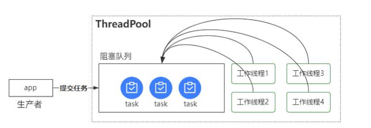
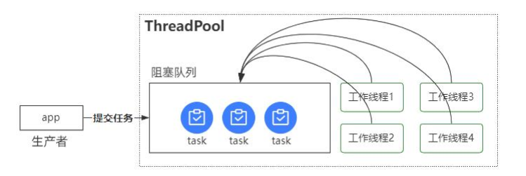
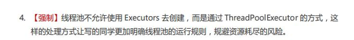

## 线程池

### 线程池是如何实现线程复用的？

资料来源：[【【Java面试】多线程面试必刷题，线程池是如何实现线程复用的？](https://www.toutiao.com/video/7124972737273168420/?channel=&source=video)

线程池是如何实现线程复用的？” 
一个工作 2 年的 Java 程序员，在面试互联网公司的时候被这个问题难住了。 
Hi，大家好，我是 Mic，一个工作了 14 年的 Java 程序员。 
多线程是非常重要的一个技术领域，在实际开发中使用比较多。 
而线程池是属于线程的复用技术，因此对于这个问题，我把高手的回答整理到了一个 15W 字的面试文档里面，大家可以在我的主页加 V 领取。下面看看普通人和高手的回答 

#### 高手

好的，面试官。 
线程池里面采用了生产者消费者的模式，来实现线程复用。 
生产者消费者模型，其实就是通过一个中间容器来解耦生产者和消费者的任务处理过程。 
生产者不断生产任务保存到容器，消费者不断从容器中消费任务。 
在线程池里面，因为需要保证工作线程的重复使用，并且这些线程应该是有任务的时候执行，没任务的时候等待并释放 CPU 资源。
因此（如图），它使用了阻塞队列来实现这样一个需求。 
提交任务到线程池里面的线程称为生产者线程，它不断往线程池里面传递任务。 
这些任务会保存到线程池的阻塞队列里面。 
然后线程池里面的工作线程不断从阻塞队列获取任务去执行。   

基于阻塞队列的特性，使得阻塞队列中如果没有任务的时候，这些工作线程就会阻塞等待。 
直到又有新的任务进来，这些工作线程再次被唤醒。 
从而达到线程复用的目的，以上就是我对这个问题的理解！ 

#### 面试点评

基于阻塞队列实现的生产者消费者模型，是一个非常经典的模型。 
它可以对两个不同业务进行解耦，还可以解决生产者和消费者的处理速度不匹配的问题。 
建议大家可以去了解一下生产者消费者模型的底层实现 
不管是基于 wait/notify，还是基于 condition.await/signal 
好的，本期的视频就到这里结束了 
大家记得点赞、收藏加关注 
我是 Mic，咱们下期再见。   

### 简述一下你对线程池的理解

资料来源：[简述一下你对线程池的理解](https://www.toutiao.com/video/7123817991153811975/?from_scene=all)

关于这个问题， 我会从几个方面来回答。

首先， 线程池本质上是一种池化技术， 而池化技术是一种资源复用的思想， 比较常见的有连接池、 内存池、 对象池。而线程池里面复用的是线程资源， 它的核心设计目标， 我认为有两个：
减少线程的频繁创建和销毁带来的性能开销， 因为线程创建会涉及到 CPU 上下文切换、 内存分配等工作。
线程池本身会有参数来控制线程创建的数量， 这样就可以避免无休止的创建线程带来的资源利用率过高的问题。

起到了资源保护的作用。
其次， 我简单说一下线程池里面的线程复用技术。 因为线程本身并不是一个受控的技术， 也就是说线程的生命周期时由任务运行的状态决定的， 无法人为控制。所以为了实现线程的复用， 线程池里面用到了阻塞队列， 简单来说就是线程池里面的工作线程处于一直运行状态， 它会从阻塞队列中去获取待执行的任务， 一旦队列空了， 那这个工作线程就会被阻塞， 直到下次有新的任务进来。
也就是说， 工作线程是根据任务的情况实现阻塞和唤醒， 从而达到线程复用的目的。
最后， 线程池里面的资源限制， 是通过几个关键参数来控制的， 分别是核心线程数、 最大线程数。
核心线程数表示默认长期存在的工作线程， 而最大线程数是根据任务的情况动态  

创建的线程， 主要是提高阻塞队列中任务的处理效率。

###  多线程面试必刷题，线程池是如何实现线程复用的？

资料来源：[【Java面试】多线程面试必刷题，线程池是如何实现线程复用的？](https://www.toutiao.com/video/7124972737273168420/?channel=&source=video)

线程池是如何实现线程复用的？” 
一个工作 2 年的 Java 程序员，在面试互联网公司的时候被这个问题难住了。 
Hi，大家好，我是 Mic，一个工作了 14 年的 Java 程序员。 
多线程是非常重要的一个技术领域，在实际开发中使用比较多。 
而线程池是属于线程的复用技术，因此对于这个问题，我把高手的回答整理到了一个 15W 字的面试文档里面，大家可以在我的主页加 V 领取。 
下面看看普通人和高手的回答 

#### 高手

好的，面试官。 
线程池里面采用了生产者消费者的模式，来实现线程复用。 
生产者消费者模型，其实就是通过一个中间容器来解耦生产者和消费者的任务处理过程。 
生产者不断生产任务保存到容器，消费者不断从容器中消费任务。 
在线程池里面，因为需要保证工作线程的重复使用，并且这些线程应该是有任务的时候执行，没任务的时候等待并释放 CPU 资源。 
因此（如图），它使用了阻塞队列来实现这样一个需求。 
提交任务到线程池里面的线程称为生产者线程，它不断往线程池里面传递任务。 
这些任务会保存到线程池的阻塞队列里面。 
然后线程池里面的工作线程不断从阻塞队列获取任务去执行   

基于阻塞队列的特性，使得阻塞队列中如果没有任务的时候，这些工作线程就会阻塞等待。 
直到又有新的任务进来，这些工作线程再次被唤醒。 
从而达到线程复用的目的，以上就是我对这个问题的理解！ 

#### 面试点评

基于阻塞队列实现的生产者消费者模型，是一个非常经典的模型。 
它可以对两个不同业务进行解耦，还可以解决生产者和消费者的处理速度不匹配的问题。 
建议大家可以去了解一下生产者消费者模型的底层实现 
不管是基于 wait/notify，还是基于 condition.await/signal 
好的，本期的视频就到这里结束了 
大家记得点赞、收藏加关注 
我是 Mic，咱们下期再见   

### Java官方提供了哪几种线程池，分别有什么特点？

资料来源：[Java官方提供了哪几种线程池，分别有什么特点？](https://www.toutiao.com/video/7123817991153811975/?from_scene=all)

#### 介绍：

> “Java 官方提供了哪几种线程池， 分别有什么特点？ ”
> 这是一道针对工作 3 年左右的面试题， 屏幕前的小伙伴， 你能回答上来吗？  

#### 回答

JDK 中幕刃提供了 5 中不同线程池的创建方式， 下面我分别说一下每一种线程池以及它的特点。 
**newCachedThreadPool**， 是一种可以缓存的线程池， 它可以用来处理大量短期的突发流量。它的特点有三个， 最大线程数是 Integer.MaxValue， 线程存活时间是 60 秒， 阻塞队列用的是 SynchronousQueue， 这是一种不存才任何元素的阻塞队列， 也就是每提交一个任务给到线程池， 都会分配一个工作线程来处理， 由于最大线程数没有限制。所以它可以处理大量的任务， 另外每个工作线程又可以存活 60s， 使得这些工作线程可以缓存起来应对更多任务的处理。 
**newFixedThreadPool**， 是一种固定线程数量的线程池。它的特点是核心线程和最大线程数量都是一个固定的值如果任务比较多工作线程处理不过来， 就会加入到阻塞队列里面等待。 
**newSingleThreadExecutor**， 只有一个工作线程的线程池。并且线程数量无法动态更改， 因此可以保证所有的任务都按照 FIFO 的方式顺序执行。 
**newScheduledThreadPool**， 具有延迟执行功能的线程池可以用它来实现定时调度 
**newWorkStealingPool**， Java8 里面新加入的一个线程池它内部会构建一个 ForkJoinPool， 利用工作窃取的算法并行处理请求。 
这些线程都是通过工具类 **Executors** 来构建的， 线程池的最终实现类是**ThreadPoolExecutor**。   

### 阿里巴巴的Java开发手册不建议使用Java自带的线程池  

Hi，大家好，我是 Mic  
之前我分享了一次线程池的工作原理，然后有一些小伙伴就跑过来问我。  
Mic，既然线程池这么好，为什么阿里巴巴的 Java 开发手册不建议使用呢？  
我从没有看过这个手册，但是我不相信手册上会这么说。  
于是我去手册上看到了原文内容。（如图）  

发现是 “线程池不允许使用 Executors 去创建”。  
看到这句话，我就理解原因了。  
**Executors** 里面默认提供的几个线程池是有一些弊端的，如果是不懂多线程、或者是新手直接盲目使用，就可能会造成比较严重的生产事故。  

- 1. 第一个，FixedThreadPool 和 SingleThreadPool 中，阻塞队列长度是Integer.Max_Value，一旦请求量增加，就会堆积大量请求阻塞在队列中，可能会造成内存溢出的问题。  
- 2. 第二个，CachedThreadPool 和 ScheduledThreadPool 中最大线程数量Integer.Max_value，一旦请求量增加，导致创建大量的线程，使得处理性能下降。甚至可能会出现宕机的问题。  

为了避免这类问题出现，我们可以直接实例化 ThreadPoolExecutor，然后自己设置参数的值，从而确保线程池的可控性。  
实际上，很多源码或者中间件里面，都是使用这类的方式。  
好了，今天的分享就到这里了  
另外，关于多线程并发方面的面试题，我整理过大概 10W 字的问题和解答，有需要的小伙伴可以在评论区置顶中领取。  
我是 Mic，我们下期见。    

### 线程池中的工作线程出现异常怎么办？

资料来源：[【Java面试】经典高频面试：线程池中的工作线程出现异常怎么办？](https://www.toutiao.com/video/7299349908161888777/)

在java中线程池的工作线程出现异常的时候默认会把异常往外抛，同时这个工作线程会因为异常而销毁，我们需要自己去处理对应的异常。

异常处理方法呢有几种

- 1、在传递任务中去处理异常，对于每个提交到线程池中,执行的任务，可以提前通过异常进行捕，这样即便出现了异常，也不会影响线程池的工作线程
- 2、使用Future来获取异常结果
在线程池中提供了一种`submit(Callable<T>)`方法这个方法会返回一个`Future`，我们可以通过调用`Future.get()`方法。来获取任务的执行结果。如果任务执行的过程中出现异常，也会抛出一个`ExecutionException`
其中包含了任务执行过程的的实际异常
- 3、我们可以自定义一个`ThreadFactory`，设置一个叫做`UncaughtExceptionHandler`
我们可以通过实现`ThreadFactory`的接口，来自定义创建线程的方式。然后为每个新创建的线程设置一个`UncaughtExceptionHandler`这个处理器会在线程由于未捕获异常而即将终止的时候被调用

以上就是我对这个问题的理解

### 线程池如何知道一个线程的任务已经执行完成

资料来源：[线程池如何知道一个线程的任务已经执行完成](https://www.toutiao.com/video/7074902532283335199/?channel=&source=video)

一个小伙伴私信了一个小米的面试题，问题是： “线程池如何知道一个线程的任务已经执行完成”？  

说实话，这个问题确实很刁钻，毕竟像很多工作 5 年多的小伙伴，连线程池都没用过，怎么可能回答出来这个问题呢？
下面我们来看看普通人和高手遇到这个问题的回答思路  

#### 普通人
嗯.. （临场发挥吧）

#### 高手

好的，我会从两个方面来回答。

>1. 在线程池内部，当我们把一个任务丢给线程池去执行，线程池会调度工作线程来执行这个任务的 run 方法，run 方法正常结束，也就意味着任务完成了。所以线程池中的工作线程是通过同步调用任务的 run()方法并且等待 run 方法返回后，再去统计任务的完成数量。
> 2. 如果想在线程池外部去获得线程池内部任务的执行状态，有几种方法可以实现。

- a. 线程池提供了一个 isTerminated()方法，可以判断线程池的运行状态，我们可以循环判断 isTerminated()方法的返回结果来了解线程池的运行状态，一旦线程池的运行状态是 Terminated，意味着线程池中的所有任务都已经执行完了。

想要通过这个方法获取状态的前提是，程序中主动调用了线程池的 shutdown()方法。在实际业务中，一般不会主动去关闭线程池，因此这个方法在实用性和灵活性方面都不是很好。

- b. 在线程池中，有一个 submit()方法，它提供了一个 Future 的返回值，我们通过 Future.get()方法来获得任务的执行结果，当线程池中的任务没执行完之前，future.get()方法会一直阻塞，直到任务执行结束。因此，只要 future.get()方法正常返回，也就意味着传入到线程池中的任务已经执行完成了！
- c. 可以引入一个 CountDownLatch 计数器，它可以通过初始化指定一个计数器进行倒计时，其中有两个方法分别是 await()阻塞线程，以及 countDown()进行倒计时，一旦倒计时归零，所以被阻塞在 await()方法的线程都会被释放。
基于这样的原理，我们可以定义一个 CountDownLatch 对象并且计数器为 1，接着在线程池代码块后面调用 await()方法阻塞主线程，然后，当传入到线程池中的任务执行完成后，调用 countDown()方法表示任务执行结束。最后，计数器归零 0，唤醒阻塞在 await()方法的线程。

###  线程池中execute和submit的区别
资料来源：[02_线程池](java/并发编程/02线程池.md) 

（1）可以接受的任务类型不同 execute只能接受Runnable类型的任务 submit不管是Runnable还是Callable类型的任务都可以接受，但是Runnable返回值均为void，所以使用Future的get()获得的还是null

（2）submit()有返回值，而execute()没有 例如，有个task，希望该task执行完后告诉我它的执行结果，是成功还是失败，然后继续下面的操作，这时需要用submit

（3）submit()可以进行Exception处理 例如，如果task里会抛出checked或者unchecked exception，而你又希望外面的调用者能够感知这些exception并做出及时的处理，那么就需要用到submit，通过对Future.get()进行抛出异常的捕获，然后对其进行处理。

### 讲下线程池的线程回收  

资料来源：[【Java面试】用高手的方式回答：线程池的线程回收。直接发offer](https://www.toutiao.com/video/7119375871256822303/?channel=&source=video)

Hi，大家好，我是 Mic，一个工作了 14 年的 Java 程序员。 
最近很多小伙伴私信我，让我说一些线程池相关的问题。 
线程池这个方向考察的点还挺多的，如果只是靠刷面试题 
面试官很容易就能识别出来，我随便举几个。 
-  线程池是如何实现线程的回收的
-  核心线程是否能够回收
-  当调用线程池的 shutdown 方法，会发生什么？

面试一定是连环问，从而确定求职者对这个领域的理解程度。 
关于线程池回收相关的问题，高手部分的回答我整理到了一个 20W 字的面试文档里面大家可以在我的主页加 V 领取。 
下面看看普通人和高手的回答  

#### 高手
好的，面试官，这个问题我需要从 3 个方面来回答。 
首先，线程池里面分为核心线程和非核心线程。 
核心线程是常驻在线程池里面的工作线程，它有两种方式初始化。 
- 向线程池里面添加任务的时候，被动初始化 
- 主动调用 prestartAllCoreThreads 方法 

当线程池里面的队列满了的情况下，为了增加线程池的任务处理能力。 
线程池会增加非核心线程。 
核心线程和非核心线程的数量，是在构造线程池的时候设置的，也可以动态进行更改。 
由于非核心线程是为了解决任务过多的时候临时增加的，所以当任务处理完成后，工作线程处于空闲状态的时候，就需要回收。 
因为所有工作线程都是从阻塞队列中去获取要执行的任务，所以只要在一定时间内，阻塞队列没有任何可以处理的任务，那这个线程就可以结束了。 
这个功能是通过阻塞队列里面的 poll 方法来完成的。这个方法提供了超时时间和超时时间单位这两个参数 
当超过指定时间没有获取到任务的时候，poll 方法返回 null，从而终止当前线程完成线程回收。 
默认情况下，线程池只会回收非核心线程，如果希望核心线程也要回收，可以设置` allowCoreThreadTimeOut `这个属性为` true`，一般情况下我们不会去回收核心线程。 
因为线程池本身就是实现线程的复用，而且这些核心线程在没有任务要处理的时候是处于阻塞状态并没有占用 CPU 资源。 
以上就是我对这个问题的理解。 

#### 面试点评
关于线程池，是每一个 Java 程序员必须要深度掌握的内容。 
它很重要，在我们的应用系统中，无处不在体现线程。 
包括在应用开发中，也难免会用到线程池。 
掌握好它能够写出更加健壮性和稳定性的程序。 
好的，本期的普通人 VS 高手面试系列的视频就到这里结束了 
大家记得点赞、收藏加关注 
我是 Mic，咱们下期再见   

### 线程池中 shutdown()和 shutdownNow()方法的区别

资料来源：[【Java面试】线程池中 shutdown()和 shutdownNow()方法的区别](https://www.toutiao.com/video/7293790133936095779/?from_scene=all&log_from=e6c2bb38d2fc7_1703576954378)

**shutdown()**和**shutdownNow()**这两个方法都是用来关闭线程池的 
**shutdown()**这个方法会使得线程池状态变为关闭状态意味着不再接受新的任务，但是已经提交的任务会继续完成。因此**shutdown()**并不会立即停止线程池中的工作线程，他只是停止了新任务的提交。一旦所有的任务都执行完成。那么线程池工作线程就会自动退出。 
简单来说他是一种优雅停止线程池的方法，在内部的实现中，线程池用到了AQS同步状态，来判断当前是否有正在运行的线程。
**shutdown()**这个方法在执行线程中断之前，回去竞争这个同步状态，从而去避免强制中端带来的任务执行不完成的风险。 
**shutdownNow()**这个方法他会尝试立即停止所有正在执行的任务，暂停等待的任务，并不会立即停止线程池中的工作线程 
返回正在等待执行的列表。在内部的实现中呢，他是通过调用线程的interrupt()方法来停止线程的，这个方法依赖于工作线程对于这个终端的相应特性。 
不保证能够立即停止正在执行的任务。但是会尽力去做。所以这个方法类似于一种暴力停机的实现。所以在实际开发的过程中
尽可能使用shutdow()这个方法，去保证线程池的优雅中断。来确保任务的完成性。 

以上就是我对这个问题的理解 

