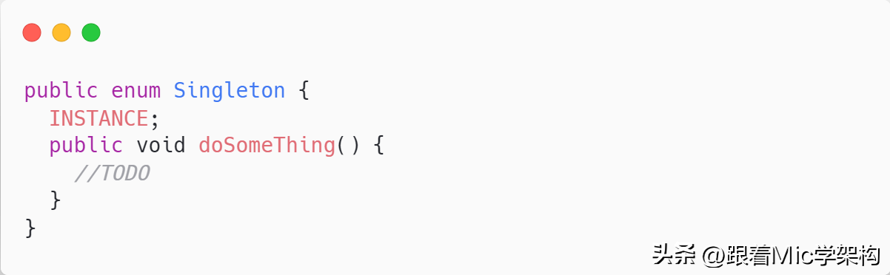

### 聊聊你知道的设计模式

资料来源：[聊聊你知道的设计模式](https://www.toutiao.com/video/7122744798959632904/?from_scene=all) 
大致按照模式的应用目标分类， 设计模式可以分为创建型模式、 结构型模式和行为型模式。 
**创建型模式**， 是对对象创建过程的各种问题和解决方案的总结， 
 包括各种工厂模式、 单例模式、 构建器模式、 原型模式。 
**结构型模式**， 是针对软件设计结构的总结， 关注于类、 对象继承、 组合方式的实践经验。 
常见的结构型模式， 包括桥接模式、 适配器模式、 装饰者模式、 代理模式、 组合模式、 外观模式、 享元模式等。 
**行为型模式**， 是从类或对象之间交互、 职责划分等角度总结的模式。 
比较常见的行为型模式有策略模式、 解释器模式、 命令模式、 观察者模式、 迭代器模式、 模板方法模式、 访问者模式。

### Java中的单例模式如何实现

单例模式，就是一个类在任何情况下绝对只有一个实例，并且提供一个全局访问点来获取该实例。

要实现单例，至少需要满足两个点：

- 私有化构造方法，防止被外部实例化造成多实例问题
- 提供一个静态方位作为全局访问点来获取唯一的实例对象

在Java里面，至少有6种方法来实现单例。

第一种，是最简单的实现，通过延迟加载的方式进行实例化，并且增加了同步锁机制避免多线程环境下的线程安全问题。

但是这种加锁会造成性能问题，而且同步锁只有在第一次实例化的时候才产生作用，后续不需要。

于是有了第二种改进方案，通过双重检查锁的方式，减少了锁的范围来提升性能

第三种，通过饿汉式实现单例。

这种方式在类加载的时候就触发了实例化，从而避免了多线程同步问题。

另外，我们还可以使用枚举类来实现。

这种写法既能避免多线程同步问题，又能防止反序列化重新创建新对象，也是一个比较好的方案。

回答：

> 我认为可以通过3种方式来实现单例，第一种是通过双重检查锁的方式，它是一种线程安全并且是延迟实例化的方式，但是因为加锁，所以会有性能上的影响。 
> 第二种是通过静态内部类的方式实现，它也是一种延迟实例化，由于它是静态内部类，所以只会使用的时候加载一次，不存在线程安全问题。  
>  第三种是通过枚举类的方式实现，它既是线程安全的，又能防止反序列化导致破坏单例问题。 
>  但是多线程、克隆、反序列化、反射，都有可能会造成单例的破坏。 
>  而我认为，通过枚举的方式实现单例，是能够解决所有可能被破坏的情况 

文字教程 [「Java面试」快手面试遭遇滑铁卢：Java中的单例模式如何实现](https://www.toutiao.com/article/7146397536012517896/)

视频教程[【Java面试】快手面试遭遇滑铁卢：Java中的单例模式如何实现](https://www.toutiao.com/video/7137181267015139876/)