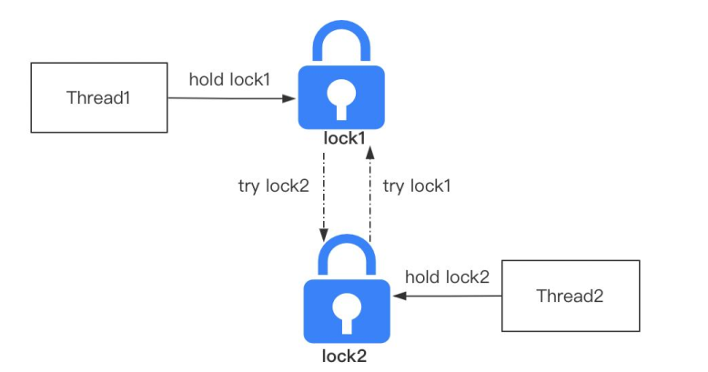

## 锁理论

### 什么是可重入锁，以及它的作用是什么？

资料来源：[什么是可重入锁，以及它的作用是什么？](https://www.toutiao.com/video/7091103367166067231/)

可重入是多线程并发编程里面一个比较重要的概念， 
简单来说， 就是在运行的某个函数或者代码， 因为抢占资源或者中断等原因导致函数或者代码的运行中断， 
等待中断程序执行结束后， 重新进入到这个函数或者代码中运行， 并且运行结果不会受到影响， 那么这个函数或者代码就是可重入的。 
而可重入锁， 简单来说就是一个线程如果抢占到了互斥锁资源， 在锁释放之前再去竞争同一把锁的时候， 不需要等待， 只需要记录重入次数。 
在多线程并发编程里面， 绝大部分锁都是可重入的， 比如 Synchronized、ReentrantLock 等， 但是也有不支持重入的锁， 比如 JDK8 里面提供的读写锁
StampedLock。  

 

锁的可重入性， 主要解决的问题是避免线程死锁的问题。 
因为一个已经获得同步锁 X 的线程， 在释放锁 X 之前再去竞争锁 X 的时候， 相当于会出现自己要等待自己释放锁， 这很显然是无法成立的。 
以上就是我对这个问题的理解。

### 为什么引入偏向锁、 轻量级锁， 介绍下升级流程

资料来源：[关于Synchronized锁升级的原理](https://www.toutiao.com/video/7098884844192694815/)

Synchronized 在 jdk1.6 版本之前， 是通过重量级锁的方式来实现线程之间锁的竞争。 
之所以称它为重量级锁， 是因为它的底层底层依赖操作系统的 Mutex Lock 来实现互斥功能。 
Mutex 是系统方法， 由于权限隔离的关系， 应用程序调用系统方法时需要切换到内核态来执行。 
这里涉及到用户态向内核态的切换， 这个切换会带来性能的损耗。 

 

在 jdk1.6 版本中， synchronized 增加了锁升级的机制， 来平衡数据安全性和性能。 简单来说， 就是线程去访问 synchronized 同步代码块的时候， synchronized根据线程竞争情况， 会先尝试在不加重量级锁的情况下去保证线程安全性。 所以引入了偏向锁和轻量级锁的机制。 
**偏向锁**， 就是直接把当前锁偏向于某个线程， 简单来说就是通过 CAS 修改偏向锁标记， 这种锁适合同一个线程多次去申请同一个锁资源并且没有其他线程竞争的场景。 
轻量级锁也可以称为自旋锁， 基于自适应自旋的机制， 通过多次自旋重试去竞争锁。 自旋锁优点在于它避免避免了用户态到内核态的切换带来的性能开销。 
Synchronized 引入了锁升级的机制之后， 如果有线程去竞争锁： 
首先， synchronized 会尝试使用偏向锁的方式去竞争锁资源， 如果能够竞争到偏向锁， 表示加锁成功直接返回。 如果竞争锁失败， 说明当前锁已经偏向了其他
线程。 
需要将锁升级到轻量级锁， 在轻量级锁状态下， 竞争锁的线程根据自适应自旋次数去尝试抢占锁资源， 如果在轻量级锁状态下还是没有竞争到锁，就只能升级到重量级锁， 在重量级锁状态下， 没有竞争到锁的线程就会被阻塞，线程状态是 Blocked。 
处于锁等待状态的线程需要等待获得锁的线程来触发唤醒。

总的来说， Synchronized 的锁升级的设计思想， 在我看来本质上是一种性能和安全性的平衡， 也就是如何在不加锁的情况下能够保证线程安全性。 
这种思想在编程领域比较常见， 比如 Mysql 里面的 MVCC 使用版本链的方式来解决多个并行事务的竞争问题。 
以上就是我对这个问题的理解。

### ReentrantLock是如何实现锁公平和非公平性的

资料来源：[ReentrantLock是如何实现锁公平和非公平性的](https://www.toutiao.com/video/7103772817413374500/?from_scene=all)

#### 回答：

我先解释一下个公平和非公平的概念。
公平， 指的是竞争锁资源的线程， 严格按照请求顺序来分配锁。
非公平， 表示竞争锁资源的线程， 允许插队来抢占锁资源。
ReentrantLock 默认采用了非公平锁的策略来实现锁的竞争逻辑。
其次， ReentrantLock 内部使用了 AQS 来实现锁资源的竞争，  

没有竞争到锁资源的线程， 会加入到 AQS 的同步队列里面， 这个队列是一个FIFO 的双向链表。  

在这样的一个背景下， 公平锁的实现方式就是， 线程在竞争锁资源的时候判断AQS 同步队列里面有没有等待的线程。
如果有， 就加入到队列的尾部等待。
而非公平锁的实现方式， 就是不管队列里面有没有线程等待， 它都会先去尝试抢占锁资源， 如果抢不到， 再加入到 AQS 同步队列等待。
ReentrantLock 和 Synchronized 默认都是非公平锁的策略， 之所以要这么设计，
我认为还是考虑到了性能这个方面的原因。
因为一个竞争锁的线程如果按照公平的策略去阻塞等待， 同时 AQS 再把等待队列里面的线程唤醒， 这里会涉及到内核态的切换， 对性能的影响比较大。
如果是非公平策略， 当前线程正好在上一个线程释放锁的临界点抢占到了锁， 就意味着这个线程不需要切换到内核态， 虽然对原本应该要被唤醒的线程不公平，
但是提升了锁竞争的性能。
以上就是我对这个问题的理解。  

### 如何在不加锁的情况下解决线程安全问题

资料来源：[如何在不加锁的情况下解决线程安全问题](https://www.toutiao.com/video/7037400683049386509/)  手动录入

第一个所谓的线程安全，其实是指多个线程同时对于某个共享资源的访问。导致的原子性、可见性、有序性的问题。

而且这些问题会导致共享数据存在一个不可预测性，使得程序在执行的过程中，出现操作超过预期的结果

第二个一般情况下，解决线程安全问题的方式是增加同步锁，常见的是像synchronize、lock等，由于导致线程安全的问题的根本原因是多线程并行访问共享资源，对共享资源加锁以后，多个线程在访问这个资源的时候。必须要先获得锁，也就是先获得访问资源资格，而同步锁的特征是在同一个时刻，只允许一个线程访问这样的资源，直到锁被释放。虽然这种方式可以解决线程安全性的一个问题，但是同时带来了加锁和释放锁，所带来的一个性能的开销。因为加锁会设计到用户空间，到内核空间的一个转换。以及上下文切换

第三个，如何在性能和安全性之间去取得一个平衡，这就引出了一个无锁并发的概念。一般来说会有集中方法。第一个是通过自旋锁（CAS）所谓自旋锁，是指线程在没有抢占的锁的情况下，先自旋指定的次数。第二是乐观锁，给每个数据增加一个版本号，一旦数据发生变化，则去修改这个版本号。在java里面，有一个叫CAS的一个机制。可以去完成乐观锁的一个功能。第三个在程序设计中，尽量去减少共享对象的使用，从业务上去实现隔离避免并发。

## 死锁

### 死锁的发生原因和怎么避免  

一个去阿里面试的小伙伴私信我说：今天被一个死锁的问题难到了。 
平常我都特意看了死锁这块的内容，但是回答的时候就想不起来。 
这里可能存在一个误区，认为技术是要靠记的。 
大家可以想想，平时写代码的时候，这些代码是背下来的吗？ 
遇到一个需求的时候，能够立刻提供解决思路，这个也是记下来的吗？ 
所有的技术问题，都可以用一个问题来解决： “如果让你遇到这个问题，你会怎么设计”？ 
当你大脑一篇空白时，说明你目前掌握的技术只能足够支撑你写 CURD 的能力。 
好了，下面来看看普通人和高手是如何回答这个问题的。 

#### 高手

(如图)，**死锁**，简单来说就是两个或者两个以上的线程在执行的过程中，争夺同一个共享资源造成的相互等待的现象。 
如果没有外部干预，线程会一直阻塞无法往下执行，这些一直处于相互等待资源的线程就称为**死锁线程**   

导致死锁的条件有四个，也就是这四个条件同时满足就会产生死锁。 
-  互斥条件，共享资源 X 和 Y 只能被一个线程占用； 
-  请求和保持条件，线程 T1 已经取得共享资源 X，在等待共享资源 Y 的时候，不释放共享资源 X； 
-  不可抢占条件，其他线程不能强行抢占线程 T1 占有的资源； 
-  循环等待条件，线程 T1 等待线程 T2 占有的资源，线程 T2 等待线程 T1 占有的资源，就是循环等待。 

导致死锁之后，只能通过人工干预来解决，比如重启服务，或者杀掉某个线程。所以，只能在写代码的时候，去规避可能出现的死锁问题。 

按照死锁发生的四个条件，只需要破坏其中的任何一个，就可以解决，但是，互斥条件是没办法破坏的，因为这是互斥锁的基本约束，其他三方条件都有办法来破坏： 
-  对于“请求和保持”这个条件，我们可以一次性申请所有的资源，这样就不存在等待了。 
-  对于“不可抢占”这个条件，占用部分资源的线程进一步申请其他资源时，如果申请不到，可以主动释放它占有的资源，这样不可抢占这个条件就破坏掉了。 
-  对于“循环等待”这个条件，可以靠按序申请资源来预防。所谓按序申请，是指资源是有线性顺的，申请的时候可以先申请资源序号小的，再申请资源序号大的，这样线性化后自然就不存在循环了。 

以上就是我对这个问题的理解。 
#### 结尾
发现了吗？ 当大家理解了死锁发生的条件，那么对于这些条件的破坏， 
是可以通过自己的技术积累，来设计解决方法的。 
所有的技术思想和技术架构，都是由人来设计的，为什么别人能够设计？ 
本质上，还是技术积累后的结果！越是底层的设计，对于知识面的要求就越多。 
好的，本期的普通人 VS 高手面试系列的视频就到这里结束了，喜欢的朋友记得点赞收藏。 
我是 Mic，一个工作了 14 年的 Java 程序员，咱们下期再见。   

