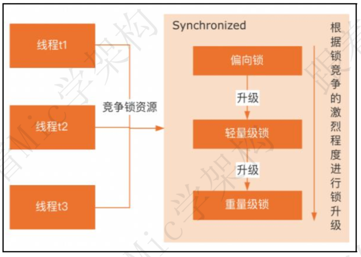

### 什么是可重入锁，以及它的作用是什么？

资料来源：[什么是可重入锁，以及它的作用是什么？](https://www.toutiao.com/video/7091103367166067231/)

可重入是多线程并发编程里面一个比较重要的概念， 
简单来说， 就是在运行的某个函数或者代码， 因为抢占资源或者中断等原因导致函数或者代码的运行中断， 
等待中断程序执行结束后， 重新进入到这个函数或者代码中运行， 并且运行结果不会受到影响， 那么这个函数或者代码就是可重入的。 
而可重入锁， 简单来说就是一个线程如果抢占到了互斥锁资源， 在锁释放之前再去竞争同一把锁的时候， 不需要等待， 只需要记录重入次数。 
在多线程并发编程里面， 绝大部分锁都是可重入的， 比如 Synchronized、ReentrantLock 等， 但是也有不支持重入的锁， 比如 JDK8 里面提供的读写锁
StampedLock。  

 

锁的可重入性， 主要解决的问题是避免线程死锁的问题。 
因为一个已经获得同步锁 X 的线程， 在释放锁 X 之前再去竞争锁 X 的时候， 相当于会出现自己要等待自己释放锁， 这很显然是无法成立的。 
以上就是我对这个问题的理解。

### 分布式锁的理解和实现

资料来源：[分布式锁的理解和实现](https://www.toutiao.com/video/7081573477920014878/?from_scene=all)

分布式锁， 是一种跨进程的跨机器节点的互斥锁， 它可以用来保证多机器节点对于共享资源访问的排他性

 

### 为什么引入偏向锁、 轻量级锁， 介绍下升级流程

资料来源：[关于Synchronized锁升级的原理](https://www.toutiao.com/video/7098884844192694815/)

Synchronized 在 jdk1.6 版本之前， 是通过重量级锁的方式来实现线程之间锁的竞争。 
之所以称它为重量级锁， 是因为它的底层底层依赖操作系统的 Mutex Lock 来实现互斥功能。 
Mutex 是系统方法， 由于权限隔离的关系， 应用程序调用系统方法时需要切换到内核态来执行。 
这里涉及到用户态向内核态的切换， 这个切换会带来性能的损耗。 

 

在 jdk1.6 版本中， synchronized 增加了锁升级的机制， 来平衡数据安全性和性能。 简单来说， 就是线程去访问 synchronized 同步代码块的时候， synchronized根据线程竞争情况， 会先尝试在不加重量级锁的情况下去保证线程安全性。 所以引入了偏向锁和轻量级锁的机制。 
**偏向锁**， 就是直接把当前锁偏向于某个线程， 简单来说就是通过 CAS 修改偏向锁标记， 这种锁适合同一个线程多次去申请同一个锁资源并且没有其他线程竞争的场景。 
轻量级锁也可以称为自旋锁， 基于自适应自旋的机制， 通过多次自旋重试去竞争锁。 自旋锁优点在于它避免避免了用户态到内核态的切换带来的性能开销。 
Synchronized 引入了锁升级的机制之后， 如果有线程去竞争锁： 
首先， synchronized 会尝试使用偏向锁的方式去竞争锁资源， 如果能够竞争到偏向锁， 表示加锁成功直接返回。 如果竞争锁失败， 说明当前锁已经偏向了其他
线程。 
需要将锁升级到轻量级锁， 在轻量级锁状态下， 竞争锁的线程根据自适应自旋次数去尝试抢占锁资源， 如果在轻量级锁状态下还是没有竞争到锁，就只能升级到重量级锁， 在重量级锁状态下， 没有竞争到锁的线程就会被阻塞，线程状态是 Blocked。 
处于锁等待状态的线程需要等待获得锁的线程来触发唤醒。

总的来说， Synchronized 的锁升级的设计思想， 在我看来本质上是一种性能和安全性的平衡， 也就是如何在不加锁的情况下能够保证线程安全性。 
这种思想在编程领域比较常见， 比如 Mysql 里面的 MVCC 使用版本链的方式来解决多个并行事务的竞争问题。 
以上就是我对这个问题的理解。

### ReentrantLock是如何实现锁公平和非公平性的

资料来源：[ReentrantLock是如何实现锁公平和非公平性的](https://www.toutiao.com/video/7103772817413374500/?from_scene=all)

#### 回答：

我先解释一下个公平和非公平的概念。
公平， 指的是竞争锁资源的线程， 严格按照请求顺序来分配锁。
非公平， 表示竞争锁资源的线程， 允许插队来抢占锁资源。
ReentrantLock 默认采用了非公平锁的策略来实现锁的竞争逻辑。
其次， ReentrantLock 内部使用了 AQS 来实现锁资源的竞争，  

没有竞争到锁资源的线程， 会加入到 AQS 的同步队列里面， 这个队列是一个FIFO 的双向链表。  

在这样的一个背景下， 公平锁的实现方式就是， 线程在竞争锁资源的时候判断AQS 同步队列里面有没有等待的线程。
如果有， 就加入到队列的尾部等待。
而非公平锁的实现方式， 就是不管队列里面有没有线程等待， 它都会先去尝试抢占锁资源， 如果抢不到， 再加入到 AQS 同步队列等待。
ReentrantLock 和 Synchronized 默认都是非公平锁的策略， 之所以要这么设计，
我认为还是考虑到了性能这个方面的原因。
因为一个竞争锁的线程如果按照公平的策略去阻塞等待， 同时 AQS 再把等待队列里面的线程唤醒， 这里会涉及到内核态的切换， 对性能的影响比较大。
如果是非公平策略， 当前线程正好在上一个线程释放锁的临界点抢占到了锁， 就意味着这个线程不需要切换到内核态， 虽然对原本应该要被唤醒的线程不公平，
但是提升了锁竞争的性能。
以上就是我对这个问题的理解。  

### 如何在不加锁的情况下解决线程安全问题

资料来源：[如何在不加锁的情况下解决线程安全问题](https://www.toutiao.com/video/7037400683049386509/)  手动录入

第一个所谓的线程安全，其实是指多个线程同时对于某个共享资源的访问。导致的原子性、可见性、有序性的问题。

而且这些问题会导致共享数据存在一个不可预测性，使得程序在执行的过程中，出现操作超过预期的结果

第二个一般情况下，解决线程安全问题的方式是增加同步锁，常见的是像synchronize、lock等，由于导致线程安全的问题的根本原因是多线程并行访问共享资源，对共享资源加锁以后，多个线程在访问这个资源的时候。必须要先获得锁，也就是先获得访问资源资格，而同步锁的特征是在同一个时刻，只允许一个线程访问这样的资源，直到锁被释放。虽然这种方式可以解决线程安全性的一个问题，但是同时带来了加锁和释放锁，所带来的一个性能的开销。因为加锁会设计到用户空间，到内核空间的一个转换。以及上下文切换

第三个，如何在性能和安全性之间去取得一个平衡，这就引出了一个无锁并发的概念。一般来说会有集中方法。第一个是通过自旋锁（CAS）所谓自旋锁，是指线程在没有抢占的锁的情况下，先自旋指定的次数。第二是乐观锁，给每个数据增加一个版本号，一旦数据发生变化，则去修改这个版本号。在java里面，有一个叫CAS的一个机制。可以去完成乐观锁的一个功能。第三个在程序设计中，尽量去减少共享对象的使用，从业务上去实现隔离避免并发。

### 实现分布式锁的解决方案中，你认为Zookeeper和Redis哪种更好？

资料来源：[实现分布式锁的解决方案中，你认为Zookeeper和Redis哪种更好？](https://www.toutiao.com/video/7032604058363888135/)

关于这个问题， 我想从 3 个方面来说： 
为什么使用分布式锁？ 
使用分布式锁的目的， 是为了保证同一时间只有一个 JVM 进程可以对共享资源进行操作。 
根据锁的用途可以细分为以下两类： 
允许多个客户端操作共享资源， 我们称为共享锁 
这种锁的一般是对共享资源具有幂等性操作的场景， 主要是为了避免重复操作共享资源频繁加锁带来的性能开销。 
只允许一个客户端操作共享资源， 我们成为排他锁 
这种锁一般是用在对共享资源操作具有非幂等性操作的场景， 也就是需要保证在 
同一时刻只有一个进程或者线程能够访问这个共享资源。 
目前实现分布式锁最常用的中间件是 Redis 和 Zookeeper 
第一种， `Redis` 可以通过两种方式来实现
1. 利用 `Redis` 提供的 `SET key value NX PX milliseconds` 指令， 这个指令是设置一个`key-value`， 如果 key 已经存在， 则返回 0， 否则返回 1， 我们基于这个返回值来判断锁的占用情况从而实现分布式锁。 
2. 基于 `Redission `客户端来实现分布式锁，` Redisson` 提供了分布式锁的封装方法， 我们只需要调用 `api `中的 `lock（）` 和 `unlock()`方法。 它帮我们封装锁实现的细节和复杂度 `redisson` 所有指令都通过 `lua `脚本执行并支持 `lua `脚本原子性执行学架
`redisson` 中有一个 `watchdog` 的概念， 翻译过来就是看门狗， 它会在你获取锁之后， 每隔 10 秒帮你把 `key` 的超时时间设为 30s， 就算一直持有锁也不会出现`key` 过期了。 “看门狗”的逻辑保证了没有死锁发生。 
第二种， 基于 ZK 实现分布式锁的落地方案`Zookeeper` 实现分布式锁的方法比较多， 我们可以使用有序节点来实现， 
1、 来看这个图， 每个线程或进程在 `Zookeeper` 上的/lock 目录下创建一个临时有序的节点表示去抢占锁， 所有创建的节点会按照先后顺序生成一个带有序编号的节点。 
2、 线程创建节点后， 获取`lock` 节点下的所有子节点， 判断当前线程创建的节点是否是所有的节点的序号最小的。 
3、 如果当前线程创建的节点是所有节点序号最小的节点， 则认为获取锁成功。 
4、 如果当前线程创建的节点不是所有节点序号最小的节点， 则对节点序号的前一个节点添加一个事件监听， 当前一个被监听的节点释放锁之后， 触发回调通知，从而再次去尝试抢占锁。 
两种方案都有各自的优缺点 
对于 `redis` 的分布式锁而言， 它有以下缺点： 
它获取锁的方式简单粗暴， 如果获取不到锁， 会不断尝试获取锁， 比较消耗性能。 
`Redis` 是 `AP` 模型， 在集群模式中由于数据的一致性会导致锁出现问题， 即便使用 Redlock 算法来实现， 在某些复杂场景下， 也无法保证其实现 100%的可靠性。 
不过在实际开发中使用 `Redis` 实现分布式锁还是比较常见， 而且大部分场情况下不会遇到”极端复杂的场景“， 更重要的是 `Redis` 性能很高， 在高并发场景中比较合适。 
对于 `zk` 分布式锁而言: 
`zookeeper` 天生设计定位就是分布式协调， 强一致性。 锁的模型健壮、 简单易用、 适合做分布式锁。 
如果获取不到锁， 只需要添加一个监听器就可以了， 不用一直轮询， 性能消耗较小。 
如果要在两者之间做选择， 就我个人而言的话， 比较推崇 `ZK` 实现的锁， 因为对于分布式锁而言， 它应该符合 `CP` 模型， 但是 `Redis` 是 `AP` 模型， 所以在这个点上， `Zookeeper` 会更加合适。 

### 什么是死锁？

资料来源：[什么是死锁？](https://www.toutiao.com/video/7024820470994174504/)

关于这个问题 
我会从三个方面来回答 
第一个是什么是死锁 
所谓死锁是一组互相竞 争资源的线程因互相等待,导致“永久”阻塞的现象 
第二个是发生死锁的原因
发生死锁的原因有四个 
第一个是互斥条件， 共享资源 X 和 Y 只能被一个线程占用 
第二个是指 占有且等待， 线程 T1 已经取得共享资源 X 
在等待共享资源 Y 的时候 
不释放共享资源 X 
第三个是不可抢占 
其他线程不能强行抢占 
线程 T1 占有的资源 
第四个循环等待 
线程 T1 等待线程 T2 占有的资源 
线程 T2 等待线程 T1 占有的资源 
这就是循环等待 
第三个点是如何避免死锁呢？ 
既然发生死锁的原因是 
需要同时满足这四个条件 
我们只需要打破其中任意一个条件 
即可避免死锁问题 
而在这四个条件中 
第一个互斥条件是无法被破坏的 
因为锁本身就是通过 
互斥来解决线程安全问题的 
所以对于剩下三个 
我们可以逐一进行分析 
第一个是对于“占用且等待”这个条件 
我们可以一次性申请所有的资源 
这样就不存在等待了 
第二个是对于“不可抢占”这个条件 
占用部分资源的线程 
进一步申请其他资源时 
如果申请不到 
可以主动释放它占有的资源 
这样不可抢占这个条件就破坏掉了 
第三个点 
对于“循环等待”这个条件 
可以靠按序申请资源来进行预防 
所谓按序申请 
是指资源是有线性顺序的 
申请的时候可以先申请资源序号小的 
再申请资源序号大的 
这样线性化后自然就不存在循环等待了 

### 实现分布式锁的解决方案中，你认为Zookeeper和Redis哪种更好？

资料来源：[实现分布式锁的解决方案中，你认为Zookeeper和Redis哪种更好？](https://www.toutiao.com/video/7032604058363888135/)