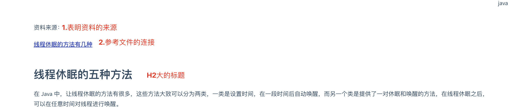

## 文档规范说明
在使用docsify后，发现这个文档服务器还是比较好用的，非常喜欢这个服务。

自己做开发也好多年了，一直有整理的文档的习惯，过去把自己的文档整理word文档，使用起来还是比较方便的。就这样一用就是五六年的时间。在使用开发中使用hutool工具类，对于hutool工具类的文档做的非常喜欢。自己也就有心捣鼓出一个同样的文档服务器，但是由于时间的原因搁置了一年多。直到后面有时间在自己的服务器上部署了docsify服务器

**最大标签二级目录**

`## 大标题`

>  最大标题是留给了文件名 

 

**新建文件**
> 包括参考资料、资料信息、标题、内容等

**所有的图片保存到本地**

> 网络上的图片，可能存在服务器的关机。删除等风险，保证安全使用保存到本地。对保存文件夹的路径不做限制

**文件**

> 过去使用word文档的时候，可以把相应的包放到本地，这样使用时候比较方便。
>
> 对于网络版的显然不适合这样做，我选择使用蓝奏云服务器（网速快，无容量限制），对于最大100M文件的限制，可以采用压缩成多个文件的方式，下载后解压合并。