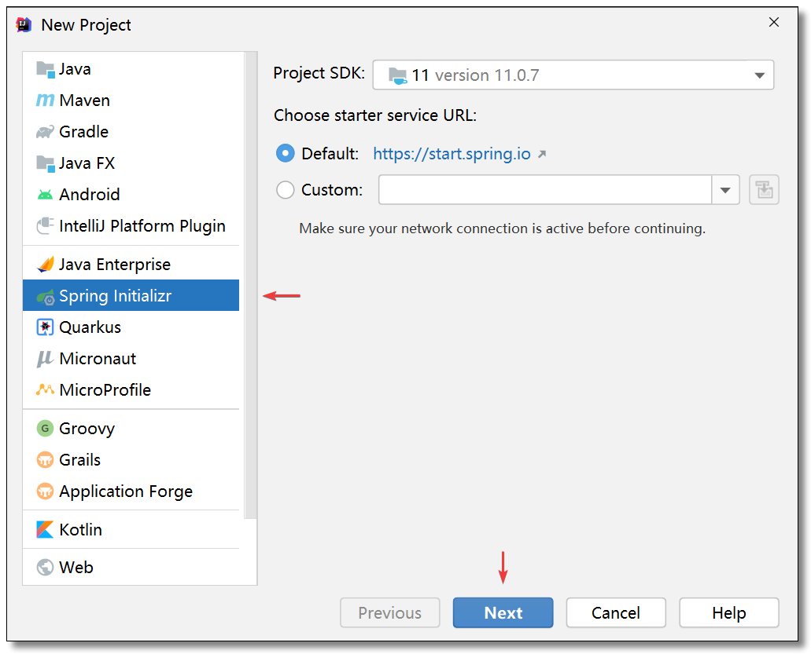

资料来源： 
[IDEA创建新的模块SPRINGBOOT](https://www.cnblogs.com/jthr/p/15504032.html) 
[Spring Cloud 系列之 Netflix Ribbon 负载均衡](https://mrhelloworld.com/ribbon/) 

[为什么我推荐你使用 Redis 实现用户签到系统](https://mrhelloworld.com/redis-sign)

## 创建maven模块

### 选择架构

### Spring Initializr初始化项目

使用 `Spring Initializr` 初始化 Spring Boot 项目，添加 `Spring Web`，`Spring Data Redis`，`Lombok`。

　顺便再添加 `hutool` 工具集，方便使用日期时间工具类。

~~~~xml
<dependency>
    <groupId>cn.hutool</groupId>
    <artifactId>hutool-all</artifactId>
    <version>5.5.9</version>
</dependency>
~~~~

### 创建简单项目

- 也可以不选择架构，直接使用简单方法

file— new moduel — maven — 选择jdk

