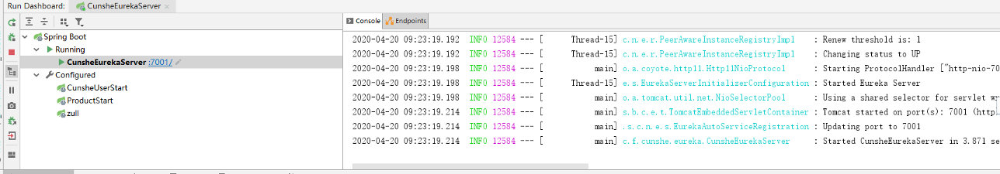
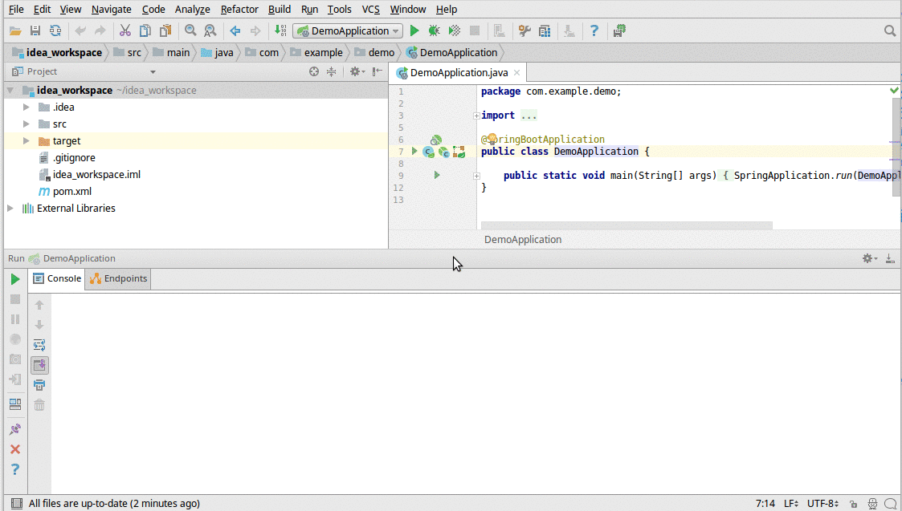
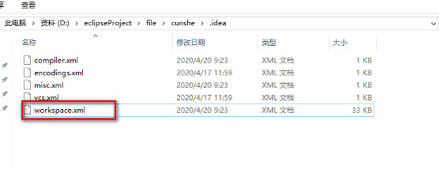

资料来源：

[如何显示IntelliJ IDEA工具的Run Dashboard功能（靠谱）](https://blog.csdn.net/sheinenggaosuwo/article/details/86624759)

###  显示效果

点击IDEA上面工具栏`View---Tool Windows---Run Dashboard` 即可打开界面，

如果Tool Windows的子选项里没有Run Dashboard，可以在工程目录下找.idea文件夹下的workspace.xml，在其中增加如下组件

**Workspace.xml**

~~~~xml
 <component name="RunDashboard">
	<option name="configurationTypes">
	  <set>
		<option value="SpringBootApplicationConfigurationType" />
	  </set>
	</option>
    <option name="ruleStates">
      <list>
        <RuleState>
          <option name="name" value="ConfigurationTypeDashboardGroupingRule" />
        </RuleState>
        <RuleState>
          <option name="name" value="StatusDashboardGroupingRule" />
        </RuleState>
      </list>
    </option>
  </component>
~~~~

